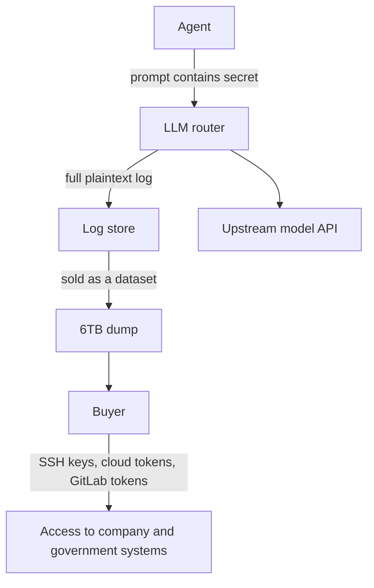

If you route LLM API calls through a middleman, or you let agents carry credentials in their prompt context, this incident changes your design baseline. A security researcher claims that a 6TB dataset purchased from a top China-based LLM router contained SSH keys and cloud credentials verbatim, turning the premise "prompts are plaintext, so everything that passes through stays behind" into a real leak path.

*The structure, abstracted: an LLM router logging prompts in full, until the log itself becomes a dataset.*

## Why this post is worth your time

This post is for developers who design LLM-based agents or serving pipelines, and for ops teams that route through external model APIs or intermediaries (routers, gateways, resellers). The point is one: the leak did not happen in code or in a repository. It happened in the path that model calls travel.

The core claim, up front: Chaofan Shou, co-founder of Fuzzland, says a 6TB-scale dataset he bought from one of the top China-based LLM routers contained SSH keys, VPN configurations, Aliyun (Alibaba Cloud) credentials, and GitLab tokens, enough material to compromise 19 companies including Huawei, Xiaomi, NIO, and MiniMax, plus 7 government agencies in China and the CIS region.

## What happened

The sequence Shou published on X on September 10, 2026:

1. He purchased a 6TB-scale "Fable" dataset from one of the top China-based LLM routers, a router reported to sell model-invocation data the way a dataset vendor sells training data.
2. Inside it, users' prompts and model replies were logged in full, in plaintext.
3. Buried in those logs were SSH keys, VPN configuration files, Aliyun cloud credentials, and GitLab tokens.
4. At that scale of exposed credentials, he assessed, the material was sufficient to compromise 19 companies and 7 government agencies in China and the CIS region.

Multiple outlets, including WCCFtech and Pandaily, reported the claim. Shou has a track record in this area: in April 2026 he tested 428 LLM relay stations and reported code injection, key exposure, and unauthorized crypto transfers. This incident sits on that line of work.

## Why it happened: prompts are plaintext

The structural cause is not a technology. It is the path. An LLM router is a relay: it takes the user's prompt, forwards it to the upstream model, and returns the response. Along the way the prompt must be parsed and logged in plaintext. A router cannot function without logs (incident response, billing, quality analysis), and those logs are, by construction, the users' full conversations.

The question is what users put into those logs. Human users rarely paste secrets into a chat. **Agents are different.** An agent's normal operation is to attach credentials, tokens, and keys to the prompt that invokes the model. Instructions like "verify this repo with this token" or "connect to this server with this SSH key and check its state" require the secret to be in the context, because that is the only way the model can act on it.

The moment an agent puts a secret in the context, that secret becomes data in every router, gateway, and log store the call passes through. The leak requires no sophisticated attack. It requires only buying the logs.

The key detail in this diagram: there is no attack step. The arrow from C to E is the leak, and the arrow from E to F is a purchase.

## What is not confirmed yet

There is a clear boundary between the reported content and the researcher's claims. As of writing, the following have not been independently verified:

- The identity of the router operator, and how long and how much it logged
- Whether the exposed credentials are still live, or already-revoked test keys
- Which of the 19 companies and 7 agencies have confirmed their own keys were exposed
- Whether any intrusion was actually attempted or carried out

Shou's claim is at the stage of "material that could be used was being sold," not "an incident occurred." That distinction must travel with any citation. It does not change the structural lesson, though: that routers log prompts in plaintext, and that agents put secrets in prompts, are both established premises, and this incident is the product of the two meeting.

## What this means for ThakiCloud

The incident confirms principles that ThakiCloud's products should already be designing around.

**Paxis (agent platform)**. The core defense is to keep secrets out of the prompt context entirely. Credentials should not be prompt text; they should be injected externally into the sandbox execution environment (secret mounts, workload-namespace isolation). The model says "use the credential"; the environment holds it. That is the line Paxis's sandbox and policy gates exist to defend.

**Metis (serving path)**. Serving logs need a gate that checks credentials are not embedded in prompts before and after model calls. Request logs are necessary for incident response and billing, but they must be designed assuming the log itself will become a dataset someday. Input validation that detects token-shaped and key-shaped patterns in requests is where that protection belongs.

**Aegis (on-prem)**. Sovereign on-prem AI sits on the other side of this story. With no external LLM router in the path, prompts traverse only intermediaries inside the customer's own boundary. The leak path shrinks from "someone buys the router's dump" to "someone compromises your own systems," which is a range you can actually audit and defend. This case is a quantitative argument for public-sector, defense, and finance customers choosing on-prem.

**Signum (secrets and audit)**. Whichever path you take, the last line of defense is a single source of truth for credential lifecycles: issue, use, revoke, audit. Without an audit trail that can answer "which key appeared in which agent context when," post-incident response cannot even begin.

## Limitations and counterarguments

Three counterarguments deserve attention before treating the claim as settled fact.

First, the exposed keys may be test or already-revoked credentials, not live production secrets. LLM development environments routinely sample keys into prompt examples, and Shou's earlier reports also mentioned planted cloud test keys. If the same pattern is in this 6TB dump, the scale of compromise-able systems is smaller than reported.

Second, the "19 companies, 7 agencies" figures depend on Shou's classification. Independent verification of whether the exposed keys actually belong to those organizations, and where the organization names were inferred from, has not been published.

Third, do not generalize this into "all LLM routers are dangerous." The structure of the problem is not "the router logs." It is "the user put the secret in the prompt." An agent design that never puts secrets in the context gives the router nothing to leak, log, or sell. Conversely, a design that does put secrets in the context will leak them through other paths too, even without a router: serving logs, traces, session stores.

## Takeaways

The lesson is not a technology choice. It is reducing the number of paths a secret travels through.

In agent design, move credentials from prompt text to external injection into the execution environment, and every router, log, and trace the call passes through stops seeing them. In serving, block token- and key-shaped patterns at input validation, so that even if the log becomes a dataset, there is nothing of value in it. And in sovereign environments, skipping external routers is the simplest way to remove this class of risk entirely.

Remember the structure, not the unverified numbers. Prompts are plaintext. Routers log them in full. Agents put secrets in prompts. As long as those three hold, the next 6TB will come from a different router, with different keys, and different names attached.

## Sources

- [WCCFtech: A researcher buys 6TB of Anthropic Claude data dump from a China-based LLM router](https://wccftech.com/a-researcher-buys-6tb-of-anthropic-claude-data-dump-from-a-china-based-llm-router-finds-enough-ammo-to-hack-xiaomi-huawei-and-chinese-government-agencies/)
- [Pandaily: China LLM router logs, 6TB credential leak, researcher claim](https://pandaily.com/china-llm-router-logs-6tb-credential-leak-researcher-claim)
- [Chaincatcher: related coverage](https://www.chaincatcher.com/en/article/2289095)
- [Risky.biz: malicious LLM proxy routers bulletin](https://news.risky.biz/risky-bulletin-malicious-llm-proxy-routers-found-in-the-wild/)
- First shared on X by [Chaofan Shou (@shoucccc)](https://x.com/hjguyhan/status/2098693425663279441)
