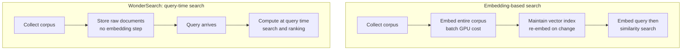

*Query-time compute instead of corpus-time embeddings. An abstraction of WonderSearch's core proposal.*

## Who this is for

Engineers building RAG pipelines, or platform engineers wondering why the maintenance cost of document search never goes away, should read this. On September 28, Polygres, a YC F26 startup, launched WonderSearch: "search millions of unstructured documents without pre-embedding the corpus." The headline to take away is this: the core of the launch is not the recall number but a statement to invert RAG's cost model from **once-per-corpus** to **per-query**. If you understand why embedding pipelines look cheap up front and come back as standing costs, you can price this choice more accurately.

## Overview

Dale, co-founder of Polygres ([@daleverett](https://x.com/daleverett/status/2104589410436354101)), posted the launch on X on September 28, 2026: "Today we are launching WonderSearch (YC F26). Search millions of unstructured documents without pre-embedding the corpus. With comparable/better retrieval recall than embedding-based search." The proposal, as the tweet lists it, has four parts. There is no corpus-wide embedding step. There is no vector index to maintain. Extra compute happens only when needed. And billing is per search.

Polygres describes itself on its [site](https://polygres.com/) as "an AI retrieval platform built on Postgres." Its base identity brings graph traversal, vector similarity, full-text search, and hybrid retrieval together on one platform, and WonderSearch adds an "embedding-free search" product on top of that identity. The launch drew notable attention in the retrieval space: Hubert Thieblot of Aleph Alpha replied to the tweet with "this is actually how ai search should work."

## The hidden cost sheet of embedding-based search

To understand what WonderSearch proposes, start from the cost structure of the way most people build search today. The cost of embedding-based RAG has three stages.

- **Stage 1: embed the whole corpus.** Every document must pass through an embedding model. For a corpus in the millions, that batch itself consumes GPU time, and the results pile up in a store.
- **Stage 2: index maintenance.** A vector index is a living structure. When documents change, re-embedding is required, and when the embedding model changes, the math asks you to re-run the entire corpus. Embedding models are a fast-moving variable. The larger the corpus, the more this "staleness cost" becomes a standing line item you cannot avoid.
- **Stage 3: retrieval.** When a query arrives, embed it and hit the vector index. This stage is relatively cheap, which is why "search with embeddings" became the industry default.

In this structure, cost scales with **corpus size**. Queries may be frequent or rare, but a corpus, once built, does not shrink. So the proposal to "search without embeddings" means the cost curve's slope moves from corpus size to query frequency.

*The two cost models compared. The internal mechanism of S2 (what computation happens at query time) is not documented in public sources as of this writing.*

## What is verified and what is not

Draw the line conservatively. **Verified**: Polygres is a YC F26 company operating a Postgres-based retrieval platform (graph, vector, full-text, hybrid), and it announced the launch of WonderSearch. Also, Polygres's technical base includes Evokoa's open-source extension [pgContext](https://github.com/Evokoa/pgContext) (Apache-2.0, targeting PostgreSQL 17/18).

**Not yet verified**: the measurement method and benchmark numbers behind "comparable or better recall," the internal mechanism of query-time search (how raw text and queries are matched without embeddings), and the actual per-search price sheet. The launch tweet points to an FAQ in the replies below it, but as of the reference date of this post (September 30), no quantitative data has been published that can be reproduced by code or verified against a third party. Which dataset, which baseline embedding model, and which scale the recall comparison used are questions that must be answered before this topic can be used for an infrastructure decision.

## Implications for ThakiCloud ai-platform

ThakiCloud's ai-platform sits on the side that actually runs RAG and retrieval workloads on Kubernetes. WonderSearch's proposal creates three questions from that vantage point.

First, **which part of our customers' RAG costs is "once per corpus" and which is "per query."** From ai-platform's perspective, the embedding batch pipeline is a job that occupies GPUs for a long time, and rebuilding the vector index is a standing cost tied to data change cadence. The query-time compute model is effective under clear conditions: workloads with large corpora and low or irregular query frequency. The reverse, high-frequency queries, may still favor the embedding-based path. Computing the "corpus-to-query ratio" first when designing a retrieval workload is the habit that turns this choice into a cost number.

Second, **does Postgres-native search lower the barrier to hybrid pipelines.** A direction like pgContext, which puts graph, full-text, and vector search inside the database, is an operating model that layers RAG on top of an existing Postgres schema without standing up a separate search cluster. In on-prem and sovereign environments, reducing added components matters for both cost and security. Because ai-platform runs this kind of mixed workload on top of multi-tenant serving, "put search inside the database, or stand up a search service" is a real design fork we face repeatedly.

Third, **the habit of asking for comparison conditions first.** A claim of "comparable or better recall than embedding-based search" changes depending on which dataset, which baseline embedding model, which document length distribution, and which query set it was measured on. In practice, the "measurement conditions" of a benchmark are what you read before the "result." The moment the WonderSearch team publishes measurement conditions, the first item on this post's "not yet verified" list is cleared.

## Limitations and counterarguments

Check whether this post has looked too favorably. First, the recall claim is unverified. "Comparable or better than embedding-based" only holds if it was measured head-to-head against vector search on the same dataset, and those numbers are not public. Second, query-time compute is not guaranteed to be "cheaper." Removing embeddings may increase computation per search, and total cost depends on query volume. "Pay per search" is a change of cost model, not a reduction of cost. Third, the scale limits of Postgres-based search are a separate issue. Holding what QPS and latency at "millions of documents" turns this from "the database replaces the search engine" into "the search workload the database can endure."

## Takeaways

WonderSearch is not the announcement of a new search algorithm. It is the announcement of rewriting RAG's cost sheet. The structure removes the "first-time cost" of embedding the whole corpus and moves computation and billing to the moment of the query. Whether the structure pays off is decided by the workload. If the corpus is large and queries are rare, the query-time model wins. If queries are high-frequency, the existing embedding pipeline may still be rational. From ThakiCloud's perspective, the practical takeaway is one checkpoint: in the next RAG design, compute the "corpus-to-query ratio" first and pick the cost model that fits it. The moment recall numbers are published, this post's "not yet verified" list needs updating.

## Sources

- [WonderSearch launch tweet by dale (@daleverett), 2026-09-28](https://x.com/daleverett/status/2104589410436354101)
- [Polygres official site](https://polygres.com/)
- [Polygres platform overview](https://polygres.com/platform)
- [Evokoa pgContext (GitHub, Apache-2.0)](https://github.com/Evokoa/pgContext)
- [Huub Thieblot's reaction tweet](https://x.com/hthieblot/status/2104676225113530681)
