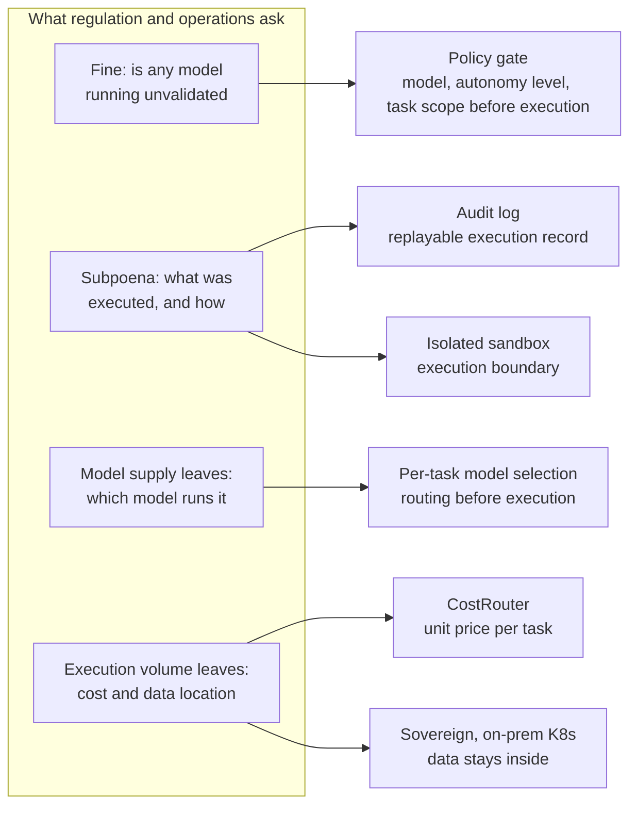

## One City, One Day

On October 5, New York City put a price on "using an unvalidated AI model." The price is $25,000. It is the first regulation of its kind, a fine for unvalidated AI models. The city did not stop at the fine; it went to court the same day. The New York City Council filed a lawsuit against SpaceXAI because the company failed to appear at the mandatory AI safety hearing scheduled for October 5. For a company that received a subpoena and still did not show up, the city advanced the process to the next step.

Another statement came from the council seat that same day. Jacob Coxon, a former Anthropic researcher, told the city council that it is highly likely humanity will fail to keep control of AI. He also raised a warning about full recursive self-improvement (RSI). It is symbolic that someone who left an AI lab and now stands on the regulator's side is delivering his remarks as testimony. It is a day on which "unvalidated" has become a headline in a public forum.

A fine, a lawsuit, and apocalyptic testimony. The three events of this day share one word: "unvalidated." Until now, safety was closer to a modifier that got attached to press releases and roadmaps. It was not yet the era in which regulators demanded validation as a duty. From this day, safety begins to move as a noun with a unit. The moment a price attaches to a noun, the way of responding changes. That is because a moment arrives that marketing sentences cannot handle, and that requires the language of accounting and legal.

Here, the scope that "validation" covers is broader than a single model. It is a question of knowing which model is used in which task. One model being validated does not mean every workflow that uses it is validated. The fine regime looks at precisely this latter point. It is knowing the state of the execution floor beyond the model catalog. This difference will become the standard that separates agent operations.

## The Money Side Is on a Different Gear

In the meantime, the flow of money is moving on a completely different scale. Anthropic's ARR (annual recurring revenue) is reported to have reached $65 billion. Even after some big tech customers cut back usage, the customer base grew thicker and heavier. Enterprise customers spending more than $100,000 a year expanded to 6,000. These are figures confirmed in a recent investor notice.

The "unit price" competition among subscriptions has also arrived. One analysis compared the usage limits of paid memberships and concluded that Anthropic delivers more API-equivalent compute than OpenAI at every tier. Alongside it comes the assessment that Anthropic offers 5x the value by subscription. If you are a buyer, it is the point at which you need to add one more number on top of the token unit price comparison table. a16z's analysis points the same way. Most major AI tools generate revenue from user fees rather than advertising, and a16z analyst Olivia Moore added commentary to this trend.

Imagine two checks written at the same time. One hand writes a check in the tens of billions of dollars; the other hand writes a $25,000 check. The first buys "how much more AI can we run." The second is, in effect, the price for "can we prove what we ran." The subject is the same. The larger the volume of AI execution, the heavier the burden of proving it. The higher the revenue graph climbs, the higher the records graph must climb by the same amount. Only then can you smile at the next invoice.

Between the numbers sits another signal. The 6,000 enterprise customers that support the $65 billion ARR have moved deep into workflows, to the point of spending more than $100,000 a year. That is evidence that AI spending has shifted from an experimental budget to an operating budget. Moving into an operating budget also means that audit and control items begin to attach to the budget.

## Why an Access-First Lab Delays Its Own Flagship

It is worth reading Sam Altman's recent interview slowly. His remarks: to keep AI broadly accessible, you have to accept certain errors and certain misuse. At the same time, he stated a clear position against the lab "gatekeeping" practice of trying to control release.

Yet the same lab has delayed the release of Astra 6.1 for safety reasons. The side that shouts loudest for access is also the side holding back its own product. Safety and access are not a question of picking one of two. Two-direction remarks come out of the same person at the same time precisely because a balance between the two must be struck every day.

From the buyer's side, there is one more practical implication. It has become hard to trust a flagship model's release schedule as a planning input. Which model goes into next quarter's workflow can change on a single line of a lab announcement. In this uncertainty, a design that assumes "one model" becomes fragile. The readiness to pull up an alternative model at any moment becomes release schedule management.

The gatekeeping debate is worth a second look here. The counterargument that if labs control release among themselves, access narrows has some validity. But without control, only the cost of the side running "unvalidated models" goes up. A lab delaying its own flagship is, in fact, a signal that it feels that cost first. The delay of Astra 6.1 is just one delayed act; it could be the first example of a pattern that will repeat across more models.

## The Debate Over Responsibility Has Moved Inside the Model

Even inside the company, the question has moved to a deeper place. It has been reported that Anthropic co-founder Chris Olah privately warned religious scholars that he has built a system in which "permanent suffering" is possible. This came out of the debate over AI consciousness and the possibility of suffering. Olah hinted at walking out of a Vatican event while presenting this debate, and the remark is lingering longer in quieter corners than in the public ones.

The moment the debate moves from "what can AI do" to "what can AI feel," the kind of answer required of operators changes. It is no longer a performance benchmark. It is the boundary of responsibility. The more an agent judges and acts on its own, the more eyes look in from outside at the basis and the boundary of that judgment. An internal philosophical debate becomes an external operational requirement before long. New York City's hearing is exactly that example.

The question this debate leaves for practitioners is simple. Can you later trace and explain the decision an agent made? The difference between a system that can be explained and one that cannot becomes, at the end of the debate, a price difference. The consciousness debate is not yet closed scientifically. But building an auditable structure is something you can do today without waiting for that closure.

## The Number of Models to Prove Is Growing

The rate at which models to validate is growing is even faster than that. Reflection entered the market with a 501B-parameter agentic model. It is a company founded by two former Google DeepMind researchers, and it is cited as DeepSeek's first US rival. The accompanying description is that it is a system that autonomously handles coding and reasoning tasks. With one more large US-made agentic model added, the options for "which models can be used" have changed from a month ago.

Regulated industries are knocking on the door too. Nolla Health started the first US AI prescription pilot with eight acne treatments. As a $5-a-month digital service, the system performs patient intake, skin scans, and medical history review. This is the moment when, in an industry as heavy on records and responsibility as healthcare, an agent's name goes onto the prescription process. As these pilots multiply, the compliance items each industry requires also begin to attach directly to the agent workflow.

Meanwhile, the daily active users of the consumer agent Meta Muse have stalled in the 2.5 to 3 million range as of early October. This is from an analysis note citing securities firm data. While the numbers for consumer agents are flat, the workflows inside enterprises are deepening in the opposite direction. The same technology appears to be growing at different speeds in different arenas. Public interest is still to come, while the need for work is already here. Supply is rising and the shape of demand is changing. It is the point at which which model is running, with what authority, in what industry becomes an operational question.

Placing the three events side by side, a direction becomes visible. Model supply is rising, consumer agent growth is flat, and regulated industry pilots are starting. This is the stretch where demand is moving from consumer curiosity to enterprise work. Model governance is the core.

## The Question the Fine Points To: "Can You Prove It?"

The fine is not the end; it is the beginning. What the regulator and the courts require is records. The records must contain which model did what, in which task, with what authority. If that answer is scattered across chat logs and terminal history, the cost of defending a subpoena can be higher than the fine. Just as SpaceXAI could not take its seat at the hearing, without records the appearance itself loses its meaning.

The flow of $65 billion in ARR points the same way. The total volume of execution is already large. If execution volume is large, the records left behind are many; the cost of proof rises in proportion to execution volume; and that cost soon gets folded into the workflow unit cost. Safety response has moved into an item in the operating budget. The moment it becomes a budget item, that item gets reviewed every quarter.

This is exactly where Paxis's design began. ThakiCloud's Agent-Native Cloud is a formal product at v1.1 GA, and it structures Skills, Tools, Policies, and Audit Logs as first-class resources. From autonomy-level (L0 to L3) governance, policy gates, and audit logs, to isolated sandboxes, MCP connectors and a skill market, and per-task model selection (CostRouter), it treats the whole of an agent's movement as an operational resource.

The pain that today's news reveals can be addressed one by one. To "unvalidated," which the fine points to, the policy gate answers. It defines, before execution, at which autonomy level which model may perform which task. To "what was executed how," which the subpoena asks, the audit log answers, and the isolated sandbox keeps the execution bound. To "which model to run it with," which the flagship delay and the expansion of model supply leave behind, per-task model selection answers with routing. To the token cost that grows heavier as execution volume rises, CostRouter manages the unit price; and if where the data stays is the issue, the answer is a sovereign or on-premises Kubernetes deployment (ai-platform).

That mapping, drawn as a single flow, looks like this.

On the day a price was put on the fine, governance is one line item on the cost sheet. Paxis has already turned that item into infrastructure.

## References

This post was written by synthesizing the news below.

- HuggingNews, [Reflection Debuts First US Rival to DeepSeek With 501B Parameter Model](https://huggingnews.com/ai/reflection-debuts-first-us-rival-to-deepseek-with-501b-parameter-model-7c434122)
- HuggingNews, [NYC Council Sues SpaceXAI for Defying AI Safety Subpoena](https://huggingnews.com/ai/update-nyc-council-sues-spacexai-for-defying-ai-safety-subpoena-5e658778)
- HuggingNews, [Anthropic Co-Founder Threatened Vatican Walkout Over AI Consciousness](https://huggingnews.com/ai/anthropic-co-founder-threatened-vatican-walkout-over-ai-consciousness-05a4a223)
- HuggingNews, [NYC Introduces First-of-Its-Kind $25K Fine for Unvalidated AI Models](https://huggingnews.com/ai/nyc-introduces-first-of-its-kind-25k-fine-for-unvalidated-ai-models-1d63553d)
- HuggingNews, [OpenAI Delays Astra 6.1 for Safety and Rejects Lab Gatekeeping](https://huggingnews.com/ai/openai-delays-astra-61-for-safety-and-rejects-lab-gatekeeping-56ac3ab1)
- HuggingNews, [Anthropic Subscriptions Offer 5x More Value Than OpenAI’s](https://huggingnews.com/ai/update-anthropic-subscriptions-offer-5x-more-value-than-openais-94a079d6)
- HuggingNews, [Anthropic's ARR Hits $65B Following Big Tech User Cuts](https://huggingnews.com/ai/anthropics-arr-hits-65b-following-big-tech-user-cuts-2012f8a6)
- HuggingNews, [Nolla Health Pilots First US AI Prescriptions for 8 Acne Drugs](https://huggingnews.com/ai/nolla-health-pilots-first-us-ai-prescriptions-for-8-acne-drugs-c83330c1)
- HuggingNews, [a16z Finds Consumer AI Relying on Subscriptions Over Ads](https://huggingnews.com/ai/a16z-finds-consumer-ai-relying-on-subscriptions-over-ads-d8960bf6)
- HuggingNews, [Meta Muse Daily User Growth Stalls Between 2.5M and 3M](https://huggingnews.com/ai/meta-muse-daily-user-growth-stalls-between-25m-and-3m-5c1fb32d)
