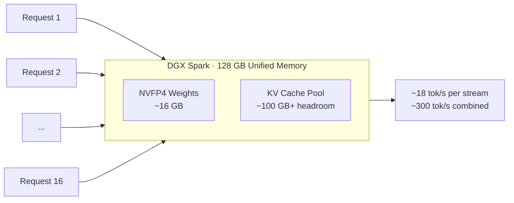

⏱️ **Estimated reading time**: 12 min

## Overview

A demo showing a small desktop box running 16 concurrent sessions of a large MoE model has been making waves. The demo uses `Gemma-4-26B-A4B-NVFP4` published by NVIDIA, running 16 parallel streams on a single DGX Spark (128 GB unified memory), reaching approximately 18 tokens/s per stream and about 300 tokens/s combined. The person who shared the demo noted that the concurrency was too high to display legibly on screen, so the demo was presented programmatically, that up to 32x parallelism is possible, and that flashinfer had not even been applied yet.

Two points are worth highlighting. First, this is not a lightweight E2B/E4B model that fits on a laptop. It is a full-scale Gemma MoE with 25.2 billion total parameters. Second, the reason this is possible is the combination of three factors: NVFP4 4-bit quantization, the small active-parameter footprint of MoE, and the large unified memory of the DGX Spark.

ThakiCloud operates a platform that serves LLMs in a multi-tenant configuration on Kubernetes. For us, "how many concurrent requests can a small on-premises box handle?" is not just an interesting demo; it is a question that feeds directly into the cost model. This post reviews the model facts, separates single-stream performance from concurrent throughput, honestly assesses whether the DGX Spark is cost-effective relative to other Blackwell GPUs, and considers how far this model fits into our skill ecosystem.

## What the Demo Actually Showed

Summarizing the claims from the original demo ([Google Gemma team tweet](https://x.com/googlegemma/status/2069452783523401804)):

- Hardware: **1x DGX Spark, 128 GB unified memory (GB10 Grace-Blackwell)**
- Model: [`nvidia/Gemma-4-26B-A4B-NVFP4`](https://huggingface.co/nvidia/Gemma-4-26B-A4B-NVFP4)
- Concurrency: **16x parallel**, approximately **18 tokens/s per stream**, **approximately 300 tokens/s combined**
- Headroom: **up to 32x** parallelism is possible, capped at 16x for screen readability
- Optimization headroom: **flashinfer not yet applied**, so further speedup is likely once support arrives

One potential misreading to address upfront: "18 tokens/s per stream" is the per-stream figure when 16 streams run simultaneously. A single stream alone is faster. The trade-off between concurrency and single-stream latency is covered below with measured numbers.

## Gemma-4-26B-A4B-NVFP4: Model Facts

The model NVIDIA published is Google DeepMind's `gemma-4-26B-A4B-it` quantized to NVFP4 using the NVIDIA Model Optimizer. Key specs from the model card:

| Field | Value |
|---|---|
| Base model | google/gemma-4-26B-A4B-it |
| Architecture | Mixture-of-Experts (Transformer) |
| Total parameters | 25.2B |
| Active parameters | 3.8B (per token) |
| Expert configuration | 8 active + 1 shared out of 128 experts |
| Layers | 30 |
| Context | 256K tokens |
| Sliding window | 1024 tokens |
| Input modalities | Text + image |
| Quantization | NVFP4 (Model Optimizer v0.43.0) |
| Target hardware | NVIDIA Blackwell |
| License | Apache 2.0 |

### What NVFP4 Is and Why It Requires Blackwell

NVFP4 is a 4-bit floating-point format accelerated in hardware on NVIDIA's Blackwell generation. Unlike INT4 quantization, which simply truncates weights to 4-bit integers, NVFP4 uses microscaling with FP8 scale factors at small block granularity. This allows memory savings comparable to INT4 while keeping accuracy loss small.

The memory impact is most direct. Storing 25.2B parameters in BF16 requires roughly 50 GB; NVFP4 compresses the weights to approximately **14 to 16 GB**. On the DGX Spark's 128 GB unified memory, with weights at 16 GB, more than 100 GB remains available for the KV cache. That headroom is what enables 16 to 32x concurrency and long 256K-token contexts.

The hardware acceleration for NVFP4 is Blackwell-exclusive. On older generations like Hopper (H100) or Ada (RTX 4090), there are no NVFP4 tensor core paths, so the format's benefits cannot be realized. In practice, this model is built to run on Blackwell.

### Benchmark: How Much Does NVFP4 Quantization Cost?

The model card presents NVFP4 and baseline (unquantized) scores side by side:

| Benchmark | NVFP4 | Baseline | Domain |
|---|---|---|---|
| AIME 2025 | 90.00% | 88.95% | Math competition |
| MMLU Pro | 84.80% | 85.00% | General knowledge and reasoning |
| IFBench | 78.1% | 77.77% | Instruction following |
| GPQA Diamond | 79.90% | 80.30% | Graduate-level science reasoning |

All four benchmarks are within 1 percentage point of baseline. AIME and IFBench are slightly higher for the quantized version, which is most safely interpreted as measurement variance. The key takeaway is that "4-bit compression preserves quality in practice," which is exactly the advantage NVFP4 claims over INT4. That said, none of the public benchmarks cover Korean-language tasks, so separate internal evaluation is recommended for Korean-domain use cases.

## Real Performance: Single Stream vs. Concurrency

The "18 tokens/s per stream" from the demo can seem slow in isolation. The numbers need to be read with single-stream and concurrent modes separated. Synthesizing community reports measuring this model on the DGX Spark:

- **Single stream, no MTP**: approximately 32 tokens/s (with 64k context setting)
- **Single stream + MTP (Multi-Token Prediction)**: approximately **55 to 61 tokens/s** (32k context setting, best on short-to-medium responses and structured JSON)
- **16x concurrency**: approximately 18 tokens/s per stream, **approximately 300 tokens/s combined**
- **Long-context prefill**: approximately 11.9 s for 25k-token input, approximately 28.6 s for 50k-token input (64k context setting)

Two observations stand out.

First, **MoE decoding is memory-bandwidth-bound**. With only 3.8B active parameters per token, compute (FLOPs) is light, but every token requires fetching the active expert weights from memory. The DGX Spark's LPDDR5X unified memory has lower bandwidth than datacenter HBM, which is why single-stream speed is "modest for a Blackwell." Even with FP4 compute capacity to spare, bandwidth is the ceiling.

Second, the DGX Spark's real strength is not single-stream latency but **aggregate concurrent throughput**. Getting approximately 300 tokens/s across 16 streams means multiple requests share bandwidth efficiently. The large unified memory that allows a generous KV cache pool makes this possible. In other words, the machine is better suited to "serving many agents or users concurrently at adequate speed" than "delivering the fastest single response."

## Honest Review 1: Is the DGX Spark Actually Cost-Effective?

The short answer is: **exceptional value per unit of memory, average value per unit of token latency**. Different Blackwell chips have different characteristics.

| Chip | Price (USD) | Memory | Bandwidth | NVFP4 MoE status (2026-06) | Character |
|---|---|---|---|---|---|
| **DGX Spark** (GB10, SM121) | ~$4,699 | 128 GB unified LPDDR5X | 273 GB/s | ✅ Working (vLLM Marlin backend) | Large memory, high concurrency, low bandwidth |
| **RTX 5090** (SM120) | ~$2,000 [estimate] | 32 GB GDDR7 | 1,792 GB/s | ⚠️ Currently broken (flashinfer #2577) | Best $/token potential, small VRAM |
| **RTX PRO 6000** Blackwell (SM120) | ~$8,500 | 96 GB GDDR7 | 1,792 GB/s | ⚠️ Same SM120 issue | Large VRAM, overkill for this model |
| **B200** (SM100, datacenter) | ~$3 to $10/hr cloud [estimate] | 192 GB HBM3e | 8,000 GB/s | ✅ Fully supported (TRT-LLM/flashinfer) | Maximum performance, order-of-magnitude cost difference |

The most important column in this table is not price but **NVFP4 MoE status**, because that is where theory and reality diverge.

- **On paper, the RTX 5090 wins on $/token.** Its bandwidth is 6.6x that of the DGX Spark (1,792 vs. 273 GB/s), and since MoE decoding is bandwidth-bound, theoretical throughput ceilings follow almost directly. Reading 16 GB of weights at 273 GB/s gives a theoretical ceiling of roughly 170 tokens/s; at 1,792 GB/s, roughly 1,100 tokens/s. The RTX 5090 costs about half as much, so in simple arithmetic it is 5 to 6x more efficient.
- **In reality, NVFP4 MoE kernels are currently broken on consumer and professional Blackwell (SM120).** The flashinfer NVFP4 GEMM issue on SM120 ([#2577](https://github.com/flashinfer-ai/flashinfer/issues/2577)) remains open, making it effectively impossible to run this 4-bit MoE correctly on the RTX 5090 or RTX PRO 6000. The on-paper leader is, for now, "can't run it."
- **That leaves the DGX Spark (SM121) as the only consumer-class box where NVFP4 MoE actually works today.** Bandwidth is lower, so throughput is conservative, but "the 4-bit MoE box that runs today" is the actual reason this demo came from a DGX Spark.
- **Datacenter Blackwell (B200, SM100)** ships with full TRT-LLM and flashinfer NVFP4 support, but the per-unit cost is an order of magnitude different. 24/7 self-hosted serving favors owned hardware; burst or multi-tenant workloads may favor cloud B200.

In summary, the DGX Spark is not a machine for buying frontier-level per-token speed. It is a machine for **buying large memory and high concurrency, in a form that works today, at a relatively accessible price for development, prototyping, and small-scale concurrent serving.** Once SM120 kernels are fixed, the RTX 5090's theoretical cost advantage becomes real. Until then, the DGX Spark's position is clear. The 16x parallel demo is impressive precisely because it builds on that strength.

## Honest Review 2: What Workloads Does This Fit?

Once the cost-efficiency profile is established, appropriate workloads follow naturally.

**Good fit**

- Multiple concurrent agents: 16 to 32 workers each running at moderate speed simultaneously. Aggregate throughput is the strength.
- Structured output workloads: the model card confirms function calling and JSON structured output support, and MTP is fastest on short-to-medium responses and control JSON. Well-suited to classification, tagging, and extraction tasks.
- Long-context processing: 256K context and a large KV headroom leave room for long-document summarization and RAG context injection.
- On-premises prototyping: experimenting with large MoE serving on a desk without datacenter GPUs.

**Poor fit**

- Single-user ultra-low-latency chat: per-stream speed is slower than GDDR7 cards. Not appropriate if "fastest single response" is the goal.
- Hardest single-shot reasoning: tasks requiring quality headroom should use a 31B dense model, something larger, or a closed-source flagship. At 26B this is a throughput-tier model.

## Serving Guide

The recommended path per the model card is vLLM. Current constraints to be aware of:

- **vLLM TP=1 only**: the current build supports tensor parallelism of 1 only (assumes a single GPU or single box).
- **Gemma 4-specific parsers required**: the flags `--tool-call-parser gemma4` and `--reasoning-parser gemma4` must be specified for function calling and reasoning output to parse correctly.
- **flashinfer not yet applied**: the demo author stated flashinfer was not used. There is headroom for additional acceleration once attention kernel optimization is added.

For production use, Linux OS and Blackwell hardware with NVFP4 tensor cores are prerequisites. Running this build on older-generation GPUs will not deliver the 4-bit acceleration benefits.

## Implications for the ThakiCloud K8s AI/ML SaaS Platform

ThakiCloud operates a multi-tenant platform that manages GPU quotas with Kueue and serves models with vLLM. This demo has three implications for our operational model.

**A self-hosting candidate for worker-tier models.** Our agent orchestration follows the cost discipline of "workers cheap, gates expensive." Worker tasks such as exploration, classification, summarization, and structured extraction do not need top-tier models. NVFP4 26B, with roughly 300 tokens/s combined throughput and function calling plus JSON output, is a strong candidate for running many workers concurrently on-premises. Keeping only high-risk steps such as verification, synthesis, and architectural judgment on upper-tier models creates structural cost reduction.

**Large unified memory simplifies multi-tenant KV budgeting.** With weights at 16 GB on a 128 GB unified memory, the KV cache headroom exceeds 100 GB. KV cache is the first resource to run out in high-concurrency multi-tenant environments. This headroom allows generous per-tenant concurrency limits.

**A reference configuration for on-premises and compliance proposals.** Apache 2.0 license plus single-box serving is a configuration that can be proposed directly to public-sector and financial clients who require self-hosting. The ability to run a large MoE on a small box without datacenter GPUs is a practical deployment path for environments with constraints such as National Intelligence Service requirements or data-residency restrictions.

## Honest Review 3: Where Does This Model Fit in Our Skill Ecosystem?

Most of ThakiCloud's skill and agent ecosystem uses upper-tier models such as Opus or Sonnet as the primary. Where does NVFP4 26B slot in? Honestly:

- **Drop-in replacement (worker tier)**: file reading and grep summarization, classification and enum normalization (format-determinism workers), first-draft generation, news and document extraction. Read-only and structured tasks currently handled by haiku/sonnet sub-agents can largely be moved to on-premises 26B.
- **Conditional (with verification reinforcement)**: agent tool-call workers. Function calling and JSON output are supported, so this model can serve as a terminal worker in tool-call loops. However, fan-out results must be closed with adversarial verification by an upper-tier model to prevent hallucination accumulation.
- **Not recommended (gate tier)**: multi-step architectural reasoning, synthesis and verification judgments, high-risk content generation. Stages requiring quality headroom stay with Opus.

The key is matching model tier to task tier. Viewing NVFP4 26B as an "Opus replacement" leads to disappointment. Viewing it as "an on-premises self-hosting candidate for the haiku/sonnet worker tier" opens a path to restructuring costs. This aligns exactly with our routing discipline: exploration cheap, gates expensive.

## Limitations and Counter-Arguments

For balance:

- **Single-stream speed is conservative.** Memory-bandwidth limitations make it slower than GDDR7 cards. Latency-sensitive workloads require a different hardware choice.
- **Demo figures are configuration-dependent.** The 18 tokens/s and 300 tokens/s figures apply to 16x concurrency with specific settings. Results vary with prompt length, output length, and MTP usage. Your own workload requires re-measurement.
- **vLLM TP=1 and no flashinfer are current-snapshot constraints.** These numbers will change as optimizations are added; treat this as a point-in-time reading.
- **MoE serving has operational complexity.** Even though active parameters are 3.8B, all weights must reside in memory, and expert routing affects batch efficiency. "It's small" is an oversimplification.
- **Korean-language real-world validation is needed.** Public benchmarks are English-centric. Korean RAG and tool-call accuracy require internal evaluation.

Even with these caveats, the combination of Apache 2.0, single-box large-MoE serving, and high concurrency backed by large memory is a genuinely attractive option for organizations considering on-premises or self-hosted deployment. Approached with the mindset of "buying cheap memory and concurrency" rather than "buying frontier speed," DGX Spark plus NVFP4 26B has a clear and legitimate use case.

## Reference Links

- [Gemma-4-26B-A4B-NVFP4 model card (Hugging Face)](https://huggingface.co/nvidia/Gemma-4-26B-A4B-NVFP4)
- [Original demo tweet (Google Gemma)](https://x.com/googlegemma/status/2069452783523401804)
- [Full Gemma 4 lineup overview (ThakiCloud blog)](https://thakicloud.github.io/owm/gemma-4-open-weight-lineup/)
- [NVIDIA TensorRT Model Optimizer](https://github.com/NVIDIA/TensorRT-Model-Optimizer)
- [Introducing NVFP4 (NVIDIA Developer)](https://developer.nvidia.com/blog/introducing-nvfp4-for-efficient-and-accurate-low-precision-inference/)
- [flashinfer NVFP4 GEMM SM120 issue #2577](https://github.com/flashinfer-ai/flashinfer/issues/2577)
- [DGX Spark Gemma 4 26B NVFP4 benchmark (ai-muninn)](https://ai-muninn.com/en/blog/dgx-spark-gemma4-26b-nvfp4-52-toks)
