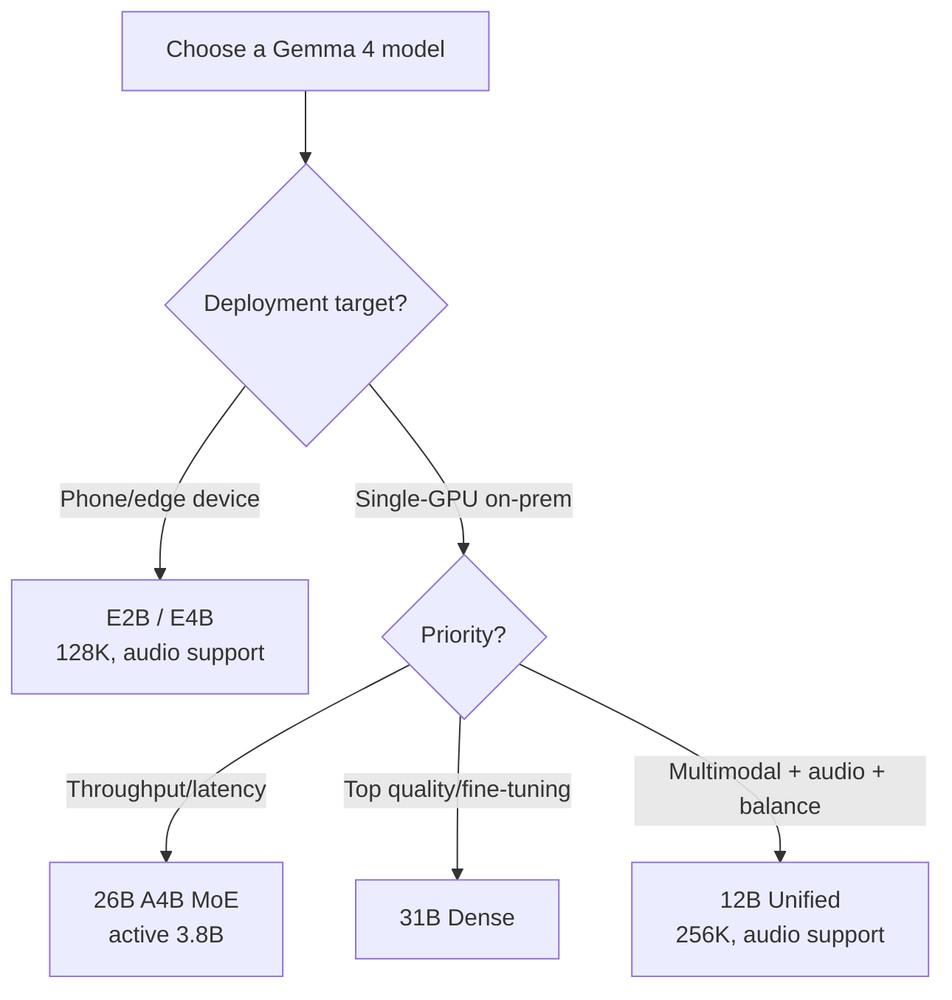

⏱️ **Estimated reading time**: 10 min

## Gemma 4 Overview

Released by Google DeepMind on April 2, 2026, Gemma 4 is the most intelligent open-weight model family Gemma has shipped to date. Google states that it was built on the same research and technology that underpins Gemini 3. In other words, think of it as the training recipe behind a closed flagship distilled down into an open-weight lineup.

From a ThakiCloud perspective, two changes stand out this generation. First, the license moved to **Apache 2.0**. Unlike earlier Gemma generations that carried a separate Gemma usage policy, Gemma 4 adopts a commercially permissive standard open-source license. Second, it ships not as a single size but as a five-model lineup that spans **everything from the edge (phones) to a single server GPU**. That means you can pick a deployment target by device tier within the same model family.

Rather than going deep on a single model, this post aims to **compare all five models at a glance and clarify which one to choose for which situation**.

## The Gemma 4 Lineup: All Five Models

Gemma 4 consists of the following five models. Organized by parameters, context, modality, and architecture per the model card:

| Model | Parameters | Context | Input Modalities | Architecture |
|---|---|---|---|---|
| **E2B** | 2.3B effective (5.1B with embeddings) | 128K | Text + Image + Audio | Dense |
| **E4B** | 4.5B effective (8B with embeddings) | 128K | Text + Image + Audio | Dense |
| **12B Unified** | 11.95B | 256K | Text + Image + Audio | Dense |
| **26B A4B** | 25.2B total / 3.8B active | 256K | Text + Image | MoE (8 of 128 experts active) |
| **31B Dense** | 30.7B | 256K | Text + Image | Dense |

All five output text. Audio input is supported only on the E2B, E4B, and 12B models; the 26B and 31B handle text and image.

The "E" in `E2B` and `E4B` stands for effective parameters. It is the size based on actual compute parameters excluding the embedding table, and effective values are the more realistic figure when gauging memory and compute budgets. Both models squarely target edge devices such as phones and laptops.

The heart of the lineup is the **division of labor between the two top models: the 26B A4B (MoE) and the 31B (Dense)**.

- **26B A4B** is a Mixture-of-Experts. It holds 25.2B total parameters but activates only about 3.8B per token. The full weights still have to sit in VRAM, but per-token compute (FLOPs) is based on the active parameters, which is **favorable for latency and throughput**. It suits serving where you need to push large volumes of requests quickly.
- **31B Dense** is a standard dense model where every parameter participates on every token. Oriented toward maximizing quality and fine-tuning suitability, Google positions the 31B as the quality ceiling of the lineup.

According to Google, the 31B ranked #3 among open models worldwide on the Arena AI text leaderboard and the 26B placed #6, and it described the lineup as "competing with models 20x its size." Such leaderboard rankings shift over time, so it is better to read them as a direction ("high intelligence density relative to its class") than as absolute figures.

### Model Selection Flow

## Architecture: Hybrid Attention and Multimodality

All five Gemma 4 models share a **hybrid attention** mechanism. It interleaves local sliding-window attention with full global attention. Short ranges are handled cheaply by the sliding window, while global attention is periodically inserted to capture full-context dependencies, with the goal of curbing memory and compute cost on long contexts. This design is the backdrop to the upper models (12B/26B/31B) handling a 256K context.

Multimodality is the default this generation. All five take text and image as input, and the edge/mid tiers (E2B/E4B/12B) also handle audio input. Features aimed at agentic workflows are built in too. Function calling, structured JSON output, and native system instructions are officially supported, and the lineup emphasizes improvements in multi-step planning and logical reasoning over the previous generation. The training data cutoff is January 2025.

Language support is broad: 35+ languages out of the box and 140+ languages at the pretraining level. Actual quality in Korean operation requires direct evaluation, but the multilingual coverage itself is wide.

## Benchmarks

The representative benchmarks Google published for the 31B instruction-tuned model are below, per the model card.

| Benchmark | 31B (IT) | Area Measured |
|---|---|---|
| MMLU-Pro | 85.2% | General knowledge & reasoning |
| GPQA Diamond | 84.3% | Graduate-level science reasoning |
| LiveCodeBench v6 | 80.0% | Code generation |
| MATH-Vision | 85.6% | Vision-grounded math |
| Codeforces (ELO) | 2150 | Competitive programming |

At the 31B single-node scale, GPQA Diamond at 84.3% and MMLU-Pro at 85.2% are top-tier among comparable open-weight models. That said, the benchmarks are for the instruction-tuned variant, and real domain-task performance must be validated separately. In particular, Korean reasoning and coding tasks are not directly reflected in public benchmarks, so measuring them with an internal eval set is recommended.

## Serving and Deployment

Gemma 4 secured broad serving-ecosystem support from launch. The official paths are:

- **Inference servers**: vLLM, SGLang, llama.cpp, Ollama, LM Studio, NVIDIA NIM
- **Frameworks**: Hugging Face Transformers / TRL / Transformers.js / Candle, Keras, MaxText, NeMo
- **Edge/on-device**: LiteRT-LM, Cactus
- **Fine-tuning/quantization**: Unsloth, Tunix
- **Deployment infra**: Docker, Baseten, Google Cloud (Vertex AI)

Weights can be downloaded from the [google/gemma-4 collection on Hugging Face](https://huggingface.co/collections/google/gemma-4), Kaggle, and Ollama.

### On-Prem GPU Requirements (Estimated)

A rough on-prem deployment guide based on each model's BF16 weight memory. These are weight estimates excluding KV cache and runtime overhead, so leave headroom for your context length and concurrent request count in an actual deployment.

| Model | BF16 weights (est.) | Realistic on-prem starting point |
|---|---|---|
| E2B / E4B | ~5–16GB [est.] | Consumer GPU, laptop, phone (LiteRT) |
| 12B Unified | ~24GB [est.] | Single 24GB GPU (RTX 4090/L4 class), headroom when quantized |
| 26B A4B (MoE) | ~50GB [est.] | A single H100/A100 80GB |
| 31B Dense | ~62GB [est.] | A single H100/A100 80GB |

The practical strength of the lineup is that both top models (26B, 31B) fit on **a single 80GB GPU** in BF16. That means you can run frontier-grade inference on a single server without multi-node tensor parallelism, which sharply lowers the bar to on-prem adoption. With a smaller GPU budget, step down to the 12B or to a quantized path (GGUF Q4/Q8). Thanks to its MoE nature computing only the active 3.8B, the 26B has a throughput edge per token over the 31B Dense at the same VRAM.

## Implications for the ThakiCloud K8s AI/ML SaaS Platform

The Gemma 4 lineup meshes well with ThakiCloud's multi-tenant serving strategy. It matters on three fronts.

**Apache 2.0 unlocks the adoption barrier.** A frontier-grade open-weight family released under standard Apache 2.0 is highly significant for enterprise and on-prem adoption. You can embed it in commercial services without the burden of reviewing a separate usage policy and freely distribute fine-tuned artifacts. It is a model family you can propose directly to environments with strict license compliance, such as domestic public-sector and finance, and to on-prem customers who require self-hosting.

**The lineup itself aligns with multi-tenant GPU routing.** ThakiCloud manages GPU quotas with Kueue and serves models with vLLM. Gemma 4's five-model lineup is a structure that lets you route model tiers within one family to match tenant needs (latency-sensitive, quality-first, edge inference). Route light chat/summarization to the 12B, throughput-critical batches to the 26B MoE, and high-difficulty reasoning/coding to the 31B, and you can optimize the GPU budget by task tier while keeping the same tokenizer and prompt format.

**Single-80GB-GPU serving simplifies the cost model.** That the 26B and 31B fit on a single H100/A100 simplifies Kueue GPU job cost estimation. The communication overhead and scheduling complexity of multi-node tensor parallelism disappear, so you can price cleanly with a per-tenant dedicated-single-GPU model. The 26B MoE's active-3.8B trait means it can take more concurrent requests on the same GPU, which is also favorable on a per-request unit-cost basis.

In short, Gemma 4 is a fit as a reference model family when ThakiCloud proposes a "single-GPU on-prem + multi-tenant model routing" operating pattern to customers.

## Limitations and Counterpoints

For balance, a few caveats deserve mention.

- **The gap between benchmarks and real use.** The published figures center on the instruction-tuned, English-language benchmarks. Korean domain tasks, especially RAG and agent tool-call accuracy, must be re-measured with your own eval set.
- **The operational difficulty of MoE serving.** The 26B A4B has low per-token compute but must keep the full weights resident in VRAM, and expert routing affects batch efficiency and memory patterns. The simplistic reading "it's small because active is 3.8B" is risky.
- **Asymmetric audio support.** Audio input exists only on E2B/E4B/12B. If you want top quality (26B/31B) and audio at the same time, a trade-off arises within the lineup.
- **January 2025 training cutoff.** Tasks needing the latest information must be supplemented with RAG and tool integration.

Even so, the Apache 2.0 license, the feasibility of single-GPU serving, and a lineup that bridges the edge to the server are reason enough to put Gemma 4 at the top of the evaluation list for any organization considering on-prem and self-hosting.

## References

- [Gemma 4 official announcement blog (Google)](https://blog.google/innovation-and-ai/technology/developers-tools/gemma-4/)
- [Gemma 4 model card (Google AI for Developers)](https://ai.google.dev/gemma/docs/core/model_card_4)
- [Gemma 4 model overview docs](https://ai.google.dev/gemma/docs/core)
- [google/gemma-4 collection on Hugging Face](https://huggingface.co/collections/google/gemma-4)
- [Google DeepMind Gemma GitHub library](https://github.com/google-deepmind/gemma)
- [Gemma 4 availability on Google Cloud](https://cloud.google.com/blog/products/ai-machine-learning/gemma-4-available-on-google-cloud)
