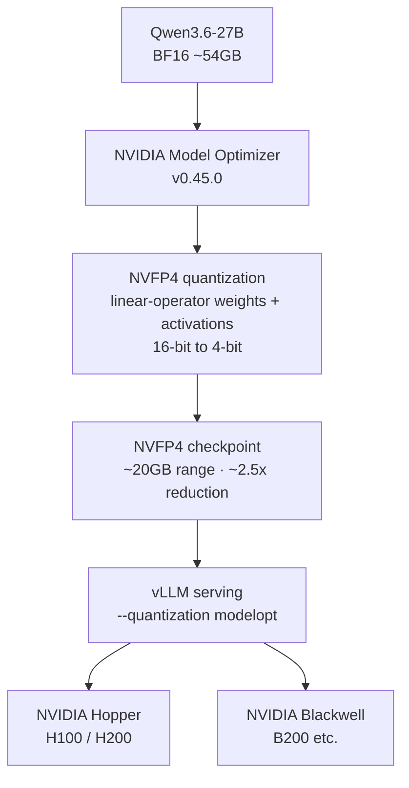

⏱️ **Estimated reading time**: 11 min


## Overview

NVIDIA has released `nvidia/Qwen3.6-27B-NVFP4`, a NVFP4 4-bit quantization of Alibaba's Qwen3.6-27B. It compresses a 27B-class hybrid-attention reasoning model to 4-bit, cutting weight memory by roughly 2.5x while keeping the gap to the FP8 baseline within 1 point across all nine benchmarks. The license is Apache 2.0.

Three points are worth highlighting. First, unlike the earlier `Gemma-4-26B-A4B-NVFP4` that effectively only got 4-bit acceleration on Blackwell, this build's model card lists **both Hopper and Blackwell as supported targets**. That means a team already running H100 or H200 can try it today without buying new hardware. Second, this is not a text-only LLM but a **multimodal reasoning model that accepts text, image, and video input**. Third, the context window opens up to **262K tokens**, taking long documents and extended conversations in a single pass.

ThakiCloud operates a platform that manages GPU quotas with Kueue and serves models multi-tenant with vLLM on Kubernetes. So "how much larger a model, and how many more tenants, can we fit on the GPUs we already own?" is not a novelty item; it feeds directly into the cost model. This post reviews the model facts, examines why NVFP4 came down to Hopper, then honestly assesses the serving path and its usefulness on our platform.

## What Is This Model

`nvidia/Qwen3.6-27B-NVFP4` is Alibaba's `Qwen3.6-27B` quantized to NVFP4 with NVIDIA Model Optimizer (nvidia-modelopt v0.45.0). The core spec from the model card is as follows.

| Item | Value |
|---|---|
| Base model | Alibaba Qwen3.6-27B |
| Architecture | Hybrid attention (Gated DeltaNet + Gated Attention) |
| Total parameters | 27B |
| Context | 262K tokens |
| Input modalities | Text + image + video |
| Output | Text |
| Quantization | NVFP4 (Model Optimizer v0.45.0) |
| Target hardware | NVIDIA Hopper, Blackwell |
| License | Apache 2.0 |

The notable part is the **hybrid attention** architecture. Gated DeltaNet is a linear-attention path, designed to process long sequences efficiently, unlike standard attention whose cost grows with sequence length. Blending it with Gated Attention, which carries expressiveness, gives a compromise that handles a 262K context while preserving quality. The fact that serving requires `--reasoning-parser qwen3` also confirms this is a **reasoning model** that generates a reasoning trace before the final answer.

One thing to state honestly: the model card names hybrid attention but does not disclose the exact layer count, expert configuration, or per-token active parameters. So this post covers only the facts in the card and does not estimate the undisclosed figures.

## NVFP4 Quantization: What Gets Compressed, and How

NVFP4 is the 4-bit floating-point format NVIDIA is pushing. Unlike INT4, which simply truncates weights to 4-bit integers, it is a micro-scaling scheme that places an FP8 scale per small block, enjoying 4-bit-level memory savings while keeping accuracy loss small.

In this build the quantization targets are the **weights and activations of the linear operators within the transformer blocks**. Non-linear layers are left untouched. The model card states that reducing bits per parameter from 16 to 4 cuts disk and GPU memory requirements by **about 2.5x**. Loading 27B parameters in BF16 needs roughly 54 GB; applying the ~2.5x reduction brings the checkpoint down to around 20 GB. That opens room to place more than twice the model on the same GPU, or to redirect the freed memory to the KV cache to raise concurrency.

This is where it diverges from the earlier Gemma NVFP4 review. The Gemma build had a broken NVFP4 MoE kernel on consumer and pro Blackwell (SM120), so the only consumer-grade path that actually ran was the DGX Spark. This Qwen3.6 build, by contrast, has a model card that **lists both Hopper and Blackwell as supported targets**, and serving uses vLLM's `--quantization modelopt` path. With activations quantized alongside weights and the modelopt serving path in place, this 4-bit model can run on the H100 and H200 already installed in data centers. The constraint of "you must buy new Blackwell to see 4-bit gains" has been substantially relaxed this time.



## Benchmarks: How Much Does 4-bit Cost

The model card presents the NVFP4 quantized model side by side with the FP8 baseline across nine benchmarks.

| Benchmark | FP8 | NVFP4 | Measures |
|---|---|---|---|
| MMLU Pro | 86.1 | 86.3 | General knowledge and reasoning |
| GPQA Diamond | 86.0 | 85.5 | Graduate-level science reasoning |
| HLE | 21.7 | 21.8 | Hard general reasoning |
| τ²-Bench Telecom | 95.2 | 95.4 | Agent tool use |
| MMMU Pro | 74.6 | 74.3 | Multimodal reasoning |
| SciCode | 44.8 | 44.5 | Scientific coding |
| AIME 2025 | 93.1 | 92.7 | Math competition |
| AA-LCR | 68.8 | 68.3 | Long-context reasoning |
| IFBench | 65.1 | 65.5 | Instruction following |

All nine are within 1 point of FP8. On MMLU Pro, HLE, τ²-Bench Telecom, and IFBench the NVFP4 build is even marginally higher, which is safer read as measurement variance. The direction is clear: **quality is essentially preserved under 4-bit**, and this is where NVFP4's advantage over INT4 shows.

The benchmark mix itself signals the model's character. τ²-Bench Telecom measures an agent calling tools to complete tasks, AA-LCR measures long-context reasoning, and MMMU Pro measures multimodal understanding. In other words, this model targets **agent tool use, long context, and multimodality**, not just plain knowledge QA. That said, Korean-domain tasks do not appear in the public benchmarks, so we recommend separate validation with an internal eval set before adoption.

## Serving Guide

The recommended path in the model card is vLLM. The run command is as follows.

```bash
vllm serve nvidia/Qwen3.6-27B-NVFP4 \
  --port 8000 \
  --quantization modelopt \
  --max-model-len 262144 \
  --reasoning-parser qwen3
```

Three operational points matter. First, `--quantization modelopt` is the key flag that loads the NVFP4 checkpoint. Next, `--reasoning-parser qwen3` is required for the reasoning trace and final answer to be parsed correctly. Finally, `--max-model-len 262144` opens the full 262K context; the KV cache budget grows accordingly, so it is more memory-efficient to lower it to the length you actually need.

The hardware assumption is Hopper or Blackwell, and the OS is Linux. Thanks to Hopper support, you can validate the serving path on H100 and H200 nodes already in the data center without additional equipment.

## ThakiCloud Serving Perspective

ThakiCloud runs a K8s-based AI/ML platform that manages GPU quotas with Kueue and serves models multi-tenant with vLLM. The implications for our operating model come in two directions, infrastructure and agents.

**Doubling density on existing Hopper assets.** This is the most tangible value of this build. NVFP4 supporting Hopper means you can capture the 4-bit gain on H100 and H200 you already own, without new Blackwell investment. When a 27B model's weights fall to around 20 GB, you can place more model instances on the same GPU, or redirect the freed memory to the KV cache to set generous per-tenant concurrency limits. From a Kueue quota view, the same card takes on more workload, so the unit cost simply comes down.

**An on-prem candidate for a multimodal reasoning worker.** Paxis, ThakiCloud's agent control plane, is an Agent-Native Cloud that runs skills in isolated sandboxes and passes every action through policy gates and audit logs. In that structure, many workers read documents, call tools, and complete tasks. Qwen3.6-27B-NVFP4 is strong on agent tool-use benchmarks like τ²-Bench Telecom, accepts image and video in addition to text, and handles a 262K context. It is a fit candidate to run on-prem as a multimodal worker handling documents, screens, and video, and as a terminal worker in tool-call loops. Per our cost discipline, run the worker cheaply but close the fan-out with a verification stage on a higher model so worker hallucinations do not accumulate.

**A reference for on-prem and compliance proposals.** An Apache 2.0 license with single-node serving is a configuration you can propose directly to public-sector and financial customers where data exfiltration is prohibited. In constrained environments such as national-security requirements or sovereign AI, running a large multimodal reasoning model on your own GPUs without a commercial API becomes a real adoption path.

## Limitations and Counterpoints

For balance, here are the caveats.

- **Architecture details are undisclosed.** Hybrid attention is stated, but the layer count, expert configuration, and active parameters are absent from the card. Precisely computing batch efficiency and resident memory requires more information.
- **No measured throughput numbers.** This post rests on card facts such as memory savings and benchmarks. Per-stream token speed and concurrency limits vary greatly with hardware and settings, so re-measure with your own workload before adoption.
- **Variance from activation quantization.** Pushing activations, not just weights, to 4-bit can introduce accuracy variance on workloads with skewed distributions. Even with public benchmarks within 1 point, verify domain-specific tasks separately.
- **Maturity of the multimodal serving path.** Stably taking image and video input in production requires validating both the preprocessing pipeline and the maturity of vLLM's multimodal path.
- **Korean real-world validation.** Public benchmarks are English-centric. Korean RAG and tool-call accuracy must be checked separately with an internal eval set.

Even so, the combination of Apache 2.0, 4-bit acceleration that now reaches Hopper, multimodal reasoning, and a 262K context is an attractive option for organizations weighing on-prem serving. The mere fact that the "buy new hardware to get 4-bit gains" wall has lowered makes it worth validating today for any team that already owns a Hopper fleet.

## References

- [Qwen3.6-27B-NVFP4 model card (Hugging Face)](https://huggingface.co/nvidia/Qwen3.6-27B-NVFP4)
- [NVIDIA TensorRT Model Optimizer](https://github.com/NVIDIA/TensorRT-Model-Optimizer)
- [Introducing NVFP4 (NVIDIA Developer)](https://developer.nvidia.com/blog/introducing-nvfp4-for-efficient-and-accurate-low-precision-inference/)
- [vLLM documentation](https://docs.vllm.ai/)
- [Gemma-4-26B-NVFP4 DGX Spark review (ThakiCloud blog)](https://thakicloud.github.io/en/owm/gemma-4-26b-nvfp4-dgx-spark/)
