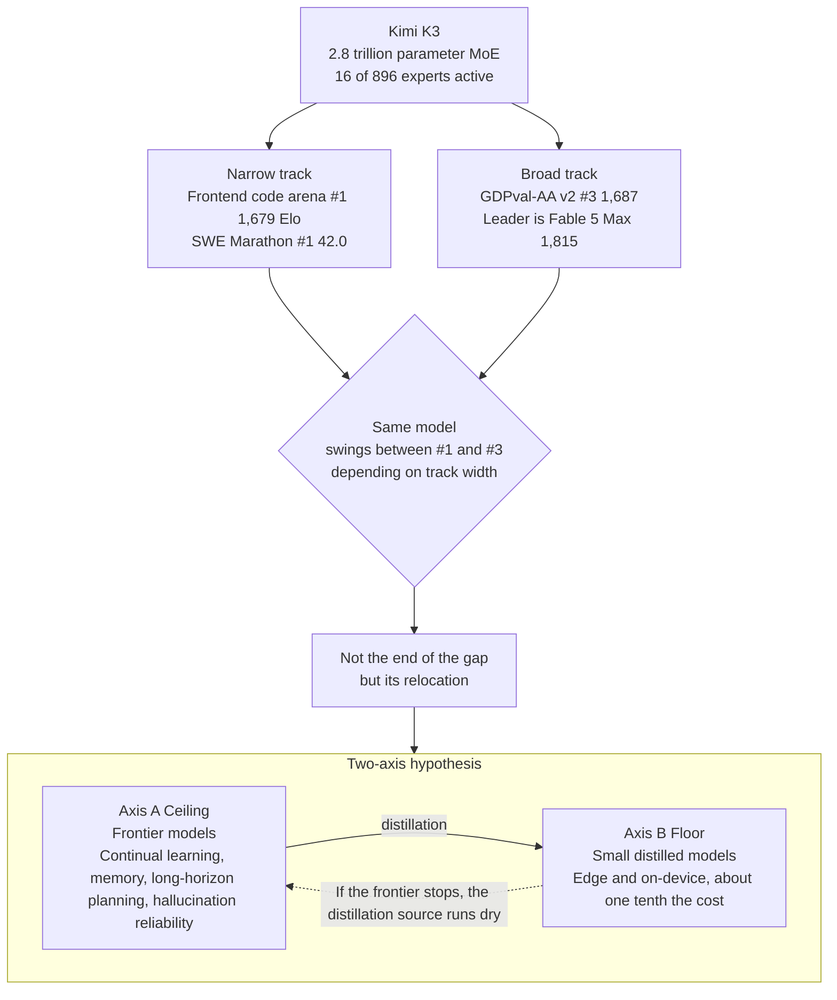

*A visual metaphor for the article's key idea.*

## Who Should Read This

This post is for platform engineers and technical decision-makers who need to decide which model to actually deploy and serve, rather than getting swept up in any single model's benchmark ranking. The narrative surrounding the Kimi K3 announcement on July 16, 2026, that the gap has disappeared, is only half right. The other half points precisely at what we need to build over the next two years.

## What Happened

Moonshot AI unveiled Kimi K3. It is a 2.8 trillion parameter MoE that activates 16 of its 896 experts and supports a 1 million token context. The full weight release is slated for July 27. The community has compared it to the shock DeepSeek delivered in the past, framing it as open weights catching up to closed models.

Half of that is true. K3 took first place in Arena.AI's frontend code arena with 1,679 Elo, surpassing Claude Fable 5 and GPT-5.6 Sol. It led in six of seven frontend domains, and it also topped every model on SWE Marathon (42.0) and Program Bench (77.8). GPQA Diamond at 93.5% was the best open-weight score at announcement time.

Read only this far and it looks like the end of an era of dominance. But shift your gaze one column over and the picture changes.

## Four Things the Hype Left Out

Viral summaries have uniformly dropped four facts. All four determine what this event actually means.

First, K3 is not first place across the board even in coding. On Terminal-Bench 2.1, K3 scored 88.3, placing second, 0.5 points behind GPT-5.6 Sol. An item widely reported as reaching the top was in fact runner-up.

Second, on broad real-work tasks it ranks third. This is the most important point. GDPval-AA v2 measures real-work tasks spanning 44 occupations and 9 major industries. Here K3 scored 1,687, good for third place only. Claude Fable 5 Max (1,815) and GPT-5.6 Sol Max (1,747.8) lead by 128 and 61 points respectively. It wins on a narrowly defined code generation track, but widen the frame to real-world value across industries and the top closed models still lead by a meaningful margin.

Third, it is open weight but not cheap. K3 is priced at $3 per million input tokens and $15 per million output tokens, on par with Anthropic's Sonnet tier. That is the highest price ever set by a Chinese lab. It runs directly counter to the narrative that you no longer need to depend on an expensive subscription.

Fourth, you cannot run it locally. Serving 2.8 trillion parameters requires a large-scale GPU cluster. Even with the weights open, running it on a personal workstation is effectively impossible. Open weight does not mean anyone can run it in their hands; it means it belongs only to organizations with their own serving infrastructure.

What K3 ultimately proves is not the end of the gap but its relocation. On narrow tracks, open has overtaken the frontier. On broad tracks and deployment economics, a wall still stands.

## The Benchmarks at a Glance

| Item | Nature | Kimi K3 | Top Score | Reading |
|---|---|---|---|---|
| Frontend code arena | Narrow | **#1 (1,679)** | K3 | Open overtakes the frontier |
| SWE Marathon | Narrow | **#1 (42.0)** | K3 | Leads agentic coding |
| Terminal-Bench 2.1 | Narrow | 2nd (88.3) | GPT-5.6 Sol | Runner-up by 0.5 points |
| GDPval-AA v2 | Broad | 3rd (1,687) | Fable 5 Max (1,815) | Closed still owns the real-work ceiling |

The same model swings between first and third depending on how wide the track is. That variance is itself the conclusion. We are not in the era of the single smartest model; we are in the era of the model that fits the task.

## So What Comes Next: A Two-Axis Hypothesis

The claim that US models have become irrelevant is wrong. Progress is instead happening simultaneously on two axes, each needing the other.

Two axes are not a competition; they are a pipeline. The prose below walks through each axis of this diagram in turn.

Axis A is the ceiling. On broad real-work tasks, long-horizon agentic workflows, and unsolved scientific problems, the top frontier models must keep pushing forward. As of 2026, where AI is genuinely stuck is not benchmark scores. It is continual learning, memory architecture, world models and long-horizon planning, and above all, hallucination reliability. That is exactly why closed models still lead on broad benchmarks like GDPval. Writing a good piece of code and reliably handling real work across 44 occupations are different problems. The work of raising the ceiling is not finished.

Axis B is the floor. At the same time, we urgently need small models we can actually deploy and run. The clear trend of 2026 is the shift from large, general models to small, task-specific ones. Distilled models retain 90% of the original's performance even at half the size, and models under a billion parameters now fill roles that once required a minimum of 7B for real work. Cost drops to roughly a tenth. While K3 demands a server room at 2.8 trillion parameters, the real spread is happening at the edge and on-device.

The two axes are not competitors. They are a pipeline. A frontier model that raises the ceiling becomes the teacher, distilling into a small model, which then spreads to the edge. If the frontier stops advancing, the source for distillation dries up. So K3's arrival did not render US models irrelevant, it multiplied the top of the distillation chain across more players. Multipolarity is not the end of progress. It is parallelization.

### Where This Frame Could Be Wrong

Let us push back on our own two-axis hypothesis. The strongest counterargument is that the two axes could converge into one. K3 used 2.8 trillion parameters and still did not take first place on GDPval. Read that not as a sign the ceiling is still far off, but as a sign that scale is no longer the bottleneck, and the conclusion flips. If the variable that decided the real-work ceiling turns out to be data quality and the reinforcement-learning recipe rather than parameter count, then a mid-size model in the 3 billion to 100 billion parameter range could absorb most of the top-end performance through good data and refined post-training alone, without needing a trillion-parameter teacher at all. In that case, the distillation chain from giant teacher to small student loosens on its own, and the industry converges not on two peaks but on a single mid-size peak where practicality and performance overlap. Under this scenario, the return on investment in ultra-large frontier models declines quickly, and the optimal target for a serving platform like ThakiCloud shifts from a 2.8 trillion parameter model to a cluster of mid-size models. That is why we should design for a two-axis stack while also preparing for the mid-size band. Which side is correct will be settled by watching whether broad benchmark curves keep climbing with scale over the next two or three generations, or flatten out.

## ThakiCloud Strategic Perspective

The real significance of open-weight frontier models such as K3, GLM-5.2, and DeepSeek V4 Pro is not their benchmark ranking. It is that frontier-class models we can self-host have become available for the first time. For regulated industries that need data sovereignty, and for public sector and financial organizations with strong on-premise requirements, this is a real shift.

And that is exactly where our platform's value comes in. Self-serving a 2.8 trillion parameter model immediately becomes a question of GPU economics and scheduling. If open weight is not free but instead belongs to organizations with infrastructure capability, then productizing that infrastructure capability is the point. That means serving frontier open weights at practical real-work economics, pairing them with small distilled models and routing, and unifying both axes into a single serving stack. That is precisely what our Kueue-based GPU scheduling and multi-tenant serving are built to target.

## Closing

Kimi K3 is a remarkable achievement. At the same time, the data does not support the conclusion that the gap has disappeared. The fact that the same model takes first on a narrow track and third on a broad one, the fact that this open weight was priced at an all-time high, and the fact that no individual can run it locally, all point to one thing together. Humanity's hardest problems were never going to be solved by benchmark rankings, and going forward we will need both smarter frontier models and smaller models we can actually run. The next leap will come from the serving stack where those two axes meet.

## References

- Moonshot AI, [Kimi-K3 Model Card](https://huggingface.co/moonshotai/Kimi-K3), 2.8 trillion parameters, 16 of 896 experts active, 1 million token context
- MarkTechPost, [Moonshot AI Releases Kimi K3: A 2.8 Trillion Parameter Open MoE Model With Kimi Delta Attention and 1M Context](https://www.marktechpost.com/2026/07/16/moonshot-ai-releases-kimi-k3-a-2-8-trillion-parameter-open-moe-model-with-kimi-delta-attention-and-1m-context/)
- Fortune, [Moonshot's Kimi K3 pushes Chinese AI into Fable-level territory](https://fortune.com/2026/07/16/moonshots-kimi-k3-pushes-chinese-ai-into-fable-level-territory/)
- officechai, [Kimi K3 Beats Fable 5, GPT 5.6 On Some Benchmarks In Frontier-Level Performance](https://officechai.com/ai/kimi-k3-benchmarks/)
- Simon Willison, [Kimi K3, and what we can still learn from the pelican benchmark](https://simonwillison.net/2026/Jul/16/kimi-k3/)
- Dell, [The Power of Small: Edge AI Predictions for 2026](https://www.dell.com/en-us/blog/the-power-of-small-edge-ai-predictions-for-2026/)
- NextBigFuture, [2026 is Breakthrough Year for Reliable AI World Models and Continual Learning Prototypes](https://www.nextbigfuture.com/2026/04/2026-is-breakthrough-year-for-reliable-ai-world-models-and-continual-learning-prototypes.html)
- VentureBeat, "China's Moonshot AI releases Kimi K3, the largest open-source model ever" (link could not be verified)
