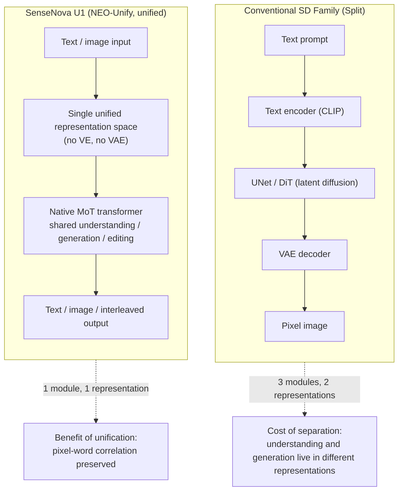

⏱️ **Estimated reading time**: 15 min


## Overview

Image generation models have long been split into two camps. On one side sits a language model that understands text; on the other, a diffusion model that paints pixels. The Stable Diffusion family is the archetype: a text encoder interprets the prompt, a UNet or DiT strips noise away in latent space, and a VAE (variational autoencoder) reconstructs that latent back into pixels. Understanding and generation happen in different modules, in different representations.

日日新 SenseNova U1, which SenseTime has been rolling out since April 2026, flatly rejects that split. It removes both the visual encoder and the VAE, and instead pushes a NEO-Unify architecture that carries language and visual information through a single representation space end to end. Understanding, generation, editing, and interleaved generation - alternating between text and images in one stream - are all handled inside a single model. The weights are released under Apache 2.0, and at roughly 8B parameters the model runs on a single RTX 5090, which means commercial self-hosting is fair game.

This post lays out what SenseNova U1 actually is, what we can realistically deploy on-premise, and - just as important - why you can't drop it straight into a familiar tool like Automatic1111. Since serving models across varied customer environments is ThakiCloud's core business, the gap between the headline "open weights are out" and the reality of "we can put this on our cluster" is exactly what matters here.

## What SenseNova U1 Is: What Dropping the VAE Actually Means

NEO-Unify starts from a simple observation: pixels and words are inherently deeply entangled, yet conventional pipelines force them apart. So U1 removes two intermediate converters entirely. There's no visual encoder (VE) compressing images into features, and no VAE converting latents back into pixels. Instead, language and visual information are woven into a single composite representation and modeled end to end. SenseTime describes this as running on a native Mixture-of-Transformers (MoT), enabling efficient cross-modal reasoning without conflicts between modalities.

For users, this difference shows up as "one model does it all." It understands images (VQA), generates images, edits images, and alternates between text and images within a single flow. A cooking tutorial or a travel diary - content that interleaves explanation and illustration - can be produced in one generation pass, which is the flagship example SenseTime highlights. On the spatial intelligence side, the model is said to understand complex layouts and object relationships, laying groundwork for embodied AI, where a robot completes perception, reasoning, and action within a single model down the line.

Below is a conceptual diagram placing the conventional SD-family pipeline side by side with U1's unified pipeline.



The key point is that U1 is not a diffusion checkpoint - it's a unified transformer that behaves like an LLM. That single fact determines everything that follows about how it's served and which tools it's compatible with.

## What's Open Is U1 Lite, Not U1 Pro

There's a distinction that has to be made clear here. **U1 Pro**, on SenseTime's platform page (`sensenova.cn`), is the hosted commercial flagship. Its dense infographic and poster-generation demos are impressive, but this "Pro"-tier weight is not published on HuggingFace. It's best treated as an API-only commercial tier.

What can actually be self-hosted is the **U1 Lite series**. The main open weights are:

| Model | Parameters | Nature |
|---|---|---|
| SenseNova-U1-8B-MoT | 8B (dense MoT) | Flagship open backbone. General-purpose multimodal |
| SenseNova-U1-A3B-MoT | A3B (MoE, ~3B active) | Lightweight MoE backbone |
| SenseNova-U1-8B-MoT-SFT / A3B-SFT | 8B / A3B | SFT-stage weights (32x downsampled) |
| SenseNova-U1-8B-MoT-Infographic (V1/V2/V3) | 8B | Infographic-specialized, V3 updated 7/15 |
| SenseNova-U1-8B-MoT-Interleaved | 8B | Interleaved-generation-specialized |
| SenseNova-U1-8B-MoT-LoRA-8step | 0.4B | 8-step fast-generation LoRA |

The SFT models go through an understanding warm-up, generation pretraining, joint mid-training, and joint SFT; the final model then adds a round of T2I reinforcement learning on top of that. SenseTime describes what's released today as "Lite" and has flagged a larger-scale version to come. In other words, the 8B/A3B currently in hand is the relatively compact version, and there's still headroom above it.

To put it plainly: if a blog or demo says "we spun up U1 Pro," that claim is inaccurate. What we're deploying on-premise is the open **U1-8B-MoT** (or A3B).

## Where It Sits on Benchmarks

SenseTime claims U1 is "SoTA within the open-source camp on both understanding and generation." Evaluation was run on OneIG (EN/ZH), LongText (EN/ZH), BizGenEval (Easy/Hard), CVTG, IGenBench, and infographic-specific benchmarks. The model card emphasizes a quality-versus-generation-latency tradeoff chart, with the emphasis on hitting the same quality faster.

The numbers matter less than the character of the results. U1 Lite is presented as delivering commercial-grade results specifically in complex infographic generation - an area where layout consistency and text-rendering accuracy matter most. Some outlets report that U1 Lite's output quality rivals Qwen-Image 2.0 Pro or Seedream 4.5, but since that's a vendor/secondary-source claim, it should be treated as [estimated] and verified empirically. Our standard is simple: we only trust numbers we've measured ourselves, on our data, our prompts, our GPUs.

## Installation and Serving: Two Paths

The fact that U1 is a unified transformer rather than a diffusion checkpoint shows up directly in how it's served. It's not something you bolt onto a diffusion UI - it's served like an LLM.

**Path 1: Native transformers.** The official repo installs dependencies via uv and ships task-specific example scripts - separate ones for text-to-image, image editing, and interleaved generation.

```bash
# Image editing example (pixel-level editing works even without a VAE)
python examples/editing/inference.py \
  --model_path sensenova/SenseNova-U1-8B-MoT \
  --prompt "Change the animal's fur color to a darker shade." \
  --image examples/editing/data/images/1.webp \
  --cfg_scale 4.0 --img_cfg_scale 1.0 --num_steps 50 \
  --output output_edited.png --profile --compare

# Interleaved generation (narration and illustrations in one flow)
python examples/interleave/inference.py \
  --model_path sensenova/SenseNova-U1-8B-MoT \
  --prompt "Create a beginner-friendly illustrated tutorial for tomato and egg stir-fry." \
  --resolution "16:9" --output_dir outputs/interleave/ --stem demo
```

**Path 2: vLLM-Omni serving.** For demos or production, you need an OpenAI-compatible endpoint. vLLM-Omni officially supports U1 and offers both offline inference and online serving examples. For environments tight on VRAM, there's also module-level CPU offload. The pipeline implements component discovery, moving the LLM to CPU during text/vision encoding steps and moving the vision encoder to CPU during the diffusion loop, minimizing the weights resident on GPU at any given moment.

```bash
# vLLM-Omni: text-to-image with CPU offload enabled
python end2end.py \
  --prompt "A cute cat sitting on a windowsill" \
  --width 2048 --height 2048 \
  --enable-cpu-offload --think
```

**Low-VRAM options.** The official repo also ships a single-GPU layer-offload mode (`--vram_mode full|low|balanced`) alongside GGUF quantized loading. Combining Q4 GGUF with `balanced` reportedly runs on consumer cards in the 10-12GB range. That puts deployment into three tiers: `full` on 24GB+ for maximum speed, GGUF + `balanced` when headroom is limited, and `low` when you need to squeeze the hardest.

## Which Tools Work: ComfyUI Yes, A1111 No

The most common expectation is "just drop it into Stable Diffusion WebUI (Automatic1111) as a checkpoint." The short answer is: that doesn't work. A1111 is built to load only SD-family checkpoints composed of a UNet/DiT + VAE + CLIP text encoder. U1 is a unified MoT transformer with no VAE, so even placing the `.safetensors` file in the checkpoint folder won't get you a successful load - it's an architectural incompatibility, not a configuration issue.

If you want an interactive, hands-on prompting workflow, the practical replacement for A1111 is **ComfyUI**. A community custom node (`smthemex/ComfyUI_SenseNova_U1`) supports U1 natively, covering 8B-MoT, A3B-MoT, the 8-step LoRA, and GGUF.

| Tool | Support | Notes |
|---|---|---|
| ComfyUI | Supported | `smthemex/ComfyUI_SenseNova_U1` custom node. The practical A1111 replacement |
| Automatic1111 | Incompatible | Loads only SD checkpoints. A VAE-less unified model is structurally impossible |
| vLLM-Omni | Supported | OpenAI-compatible serving. Fits demo/production backends |
| transformers | Supported | Native. Task-specific example scripts |
| diffusers + GGUF | Supported | Low-VRAM loading path |
| Replicate | Supported | Reference deployment (`lucataco/sensenova-u1-8b-mot`) |

The summary comes down to two axes: for hands-on interactive UI, use ComfyUI; for programmatic demo/production backends, use vLLM-Omni (OpenAI-compatible). If you were counting on A1111, you'll need to switch tools.

## The ThakiCloud Serving Angle

ThakiCloud's ai-platform exists to serve models across varied customer environments on K8s, and SenseNova U1 is a particularly well-suited candidate through that lens.

First, its size is on-premise-friendly. At roughly 8B parameters, it resides in about 16-20GB in fp16, so a single RTX 4090, 5090, or A6000 is enough to stand up a serving pod, and A3B is even lighter. That fits well with how we already queue GPUs through Kueue and share them across multi-tenant workloads. Unlike large frontier models that demand 8xH200, real production workloads become viable with just one or two customer-owned GPUs.

Second, vLLM-Omni's OpenAI-compatible endpoint lowers the cost of integration. Our Metis serving layer and demo pipelines are already built around an OpenAI-compatible interface, so U1 can be dropped in without standing up a separate diffusion stack. Unifying the image-generation API under the same observability and cost-metering framework as our text LLMs is a real operational win.

Third, Apache 2.0 plus fully self-hostable weights lines up precisely with sovereign and on-premise requirements. For public-sector and financial customers whose data must never leave their own infrastructure, an image-generation model that runs on domestic GPUs is a competitive advantage in its own right - and that advantage starts with lower serving cost.

There's an agentic angle too. Paxis, ThakiCloud's Agent-Native Cloud, runs skills in isolated sandboxes and routes every action through policy gates and audit logs. A self-hosted, unified image model like U1 is a natural fit to register as an "image generation tool" that agents can call. When infographic and poster generation is completed inside an in-house pod rather than an external API, low-cost serving (ai-platform) directly boosts the economics of the agent workflow (Paxis).

## Limitations and Counterpoints

Fairness requires looking at the other side too. First, what's currently open is Lite (8B/A3B), and the top-tier quality is likely reserved for the hosted U1 Pro. "Open SoTA" is a claim within the open-source camp, not a guarantee of parity with the best commercial models.

Second, the benefit of a unified architecture is also, in some sense, an ecosystem drawback. Because U1 isn't SD, it doesn't inherit years of accumulated A1111/SD workflow assets - ControlNet, the vast library of community LoRAs, inpainting extensions, and so on. Migrating an existing pipeline to U1 means rebuilding the tooling from scratch. ComfyUI nodes and a dedicated LoRA trainer exist, but the ecosystem is still early.

Third, most of the benchmark numbers are vendor self-reported, and Korean text rendering and prompt adherence in particular need independent verification. Whether the infographic strengths hold up in Korean typesetting is something we need to confirm ourselves, hands-on.

Fourth, low-VRAM modes aren't free. CPU offload and layer streaming save VRAM at the cost of added latency from CPU-GPU transfers. For services where real-time responsiveness matters, running `full` mode on 24GB+ without offload is the better choice - and that translates directly into GPU cost.

## Closing

SenseNova U1 is a concrete, open-weight demonstration of "unified multimodal without a VAE." How far the approach of folding understanding and generation into one representation can go remains to be seen once a larger version ships, but even the current 8B/A3B is compelling enough as an on-premise serving candidate. In the next post, we'll actually deploy this model on RunPod and our own demo pipeline, run vLLM-Omni serving and a ComfyUI workflow side by side, and share the numbers.

**References**

- Model card: [sensenova/SenseNova-U1-8B-MoT](https://huggingface.co/sensenova/SenseNova-U1-8B-MoT)
- Code/docs: [OpenSenseNova/SenseNova-U1 (GitHub)](https://github.com/OpenSenseNova/SenseNova-U1)
- Paper: [SenseNova-U1: Unifying Multimodal Understanding and Generation with NEO-unify (arXiv:2605.12500)](https://arxiv.org/abs/2605.12500)
- Serving: [vLLM-Omni SenseNova-U1 example](https://docs.vllm.ai/projects/vllm-omni/en/latest/user_guide/examples/offline_inference/sensenova_u1/)
- ComfyUI node: [smthemex/ComfyUI_SenseNova_U1](https://github.com/smthemex/ComfyUI_SenseNova_U1)
- Hosted U1 Pro: [SenseNova U1 Pro](https://www.sensenova.cn/en/u1-pro)
