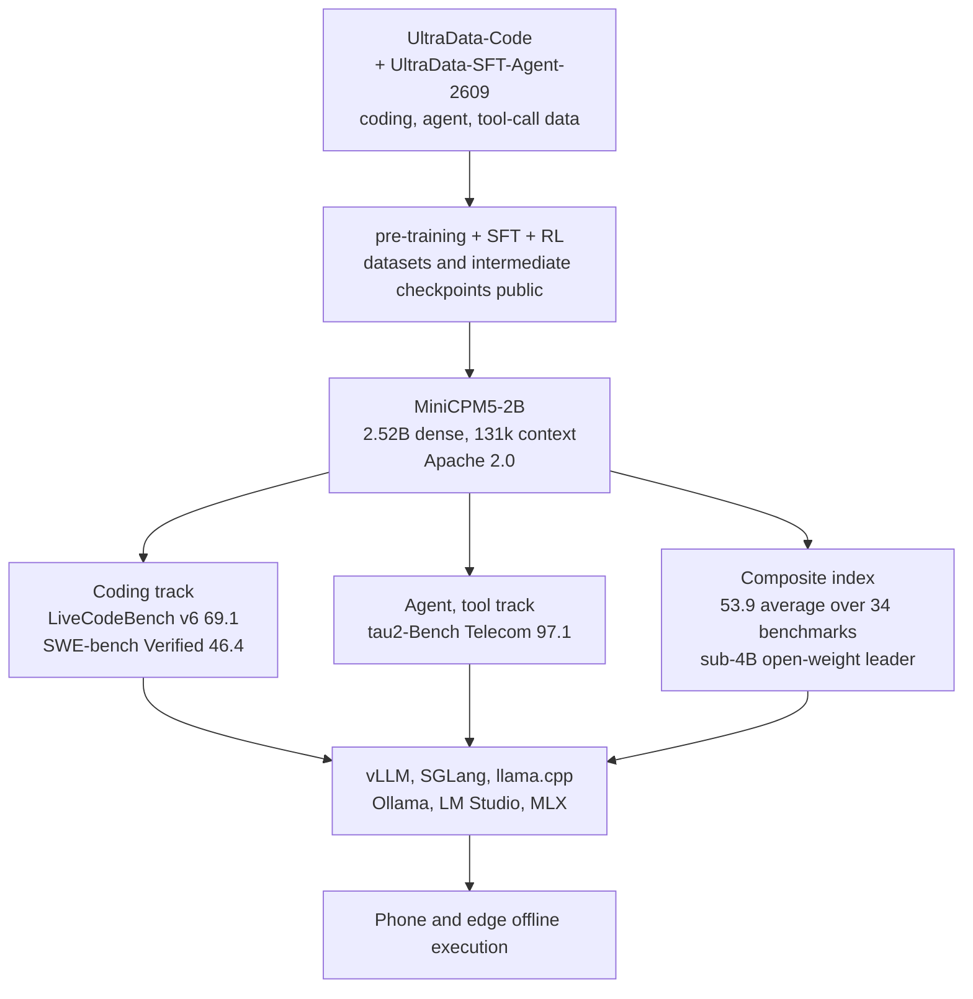

*An abstract rendering of the post's core concept: one small dense model at the edge, where the load flows in.*

## Why read this

This is for platform engineers and technical decision makers who actually have to place a model on an edge node or an on-premise environment. On September 7, 2026, OpenBMB released MiniCPM5-2B, and the event in one line is this: a 2B-class dense model beat the 4B class on a 34-benchmark average. The conclusion up front, this is not a full-spectrum first place. It is the result of a concentrated investment in three tracks, coding, agents, and tool calls, and those three tracks are exactly what an on-device agent spends its time doing.

## What happened

On release day, MiniCPM5-2B was the fastest-spreading open-weight story on X. Paul Couvert, an AI engineer with 220k followers, posted "how is a 2B open source model beating models six times its size?" and the thread passed 80k views within a day. Artificial Analysis scored the model 15 on its Intelligence Index v4.2, the highest of any open-weights model.

The numbers check out across the model card and several secondary reports. An average of 53.9 across 34 benchmarks puts it first on the sub-4B open-weight leaderboard, against 51.1 for Qwen3.5-4B. A 2.8-point gap reads small until you note the two models differ in size by roughly 40 percent.

## What MiniCPM5-2B is

The structure is unremarkable. A dense model on the LlamaForCausalLM base, 2.52B parameters total with 1.98B excluding embeddings. No MoE, so the active parameters are all of them. In bf16 the weights come to about 5GB[estimate], small enough for a single GPU, a workstation, or a phone with sufficient memory. Native context is 131,072 tokens and the license is Apache 2.0.

The real story starts in the training data. OpenBMB published its pre-training, SFT, and RL datasets along with intermediate checkpoints. The SFT stage used data named UltraData-Code and UltraData-SFT-Agent-2609, specialized in coding, agents, and phone-call style conversational tool use. The shape of the benchmark profile is the shape of the data.

## Reading the benchmarks in one table

| Item | Character | MiniCPM5-2B | Qwen3.5-4B | Read |
|---|---|---|---|---|
| 34-benchmark average | composite | **53.9** | 51.1 | sub-4B open-weight leader |
| LiveCodeBench v6 | coding | **69.1** | 56.4 | the widest gap, 12.7 points |
| SWE-bench Verified | coding agent | **46.4** | 33.6 | same pattern on real repo fixes |
| tau2-Bench Telecom | tool-call agent | **97.1** | - | policy-following dialog agent |

On the coding tracks it sits 12 to 13 points ahead of the 4B class. SWE-bench Verified matters more than it looks, because it is agent-style coding inside real repositories, not snippet generation. The tau2-Bench Telecom 97.1 measures simulated phone calls that require number lookups, API calls, and domain policy compliance, and what that number says is that a small model is already usable at "calling the right tool correctly", not just "talking well".

The other side of the table is missing by design. No report surfaces this 2.5B model ahead of 4B on broad real-work benchmarks, the kind that replay actual jobs across industries. Concentration has a shadow side, and that shadow is the counter-argument section below.

## Running and deploying it

The serving stack is wide. vLLM, SGLang, llama.cpp, Ollama, LM Studio, and MLX are all officially supported, and the model has an entry in the vLLM official recipes. A 2.52B dense model runs in fp16 or bf16 without quantization on entry GPUs, workstations, and capable mobile chips.

Three variables matter in production. First, the quality of the 131k native context. Long context does not mean long retention, so environments that actually push long documents through it should verify on their own. Second, the coding-specialized data pays compound interest on coding workloads but flattens out on general dialogue and other language tracks, depending on the data composition. Third, the dense structure burns all 2.5B parameters per token. Against an MoE of comparable size the active cost is higher, and that same simplicity is what keeps the edge stack compatibility broad.

The Apache 2.0 license and the published training data lower the commercial adoption threshold by a step. It becomes cheaper to take the public data and SFT on your own domain than to swap models.

## ThakiCloud product implications

The direction this model points is where three ThakiCloud products sit at once.

From Aegis, the calculation for the outermost edge of a closed-network or sovereign environment changes. Budgets previously assumed "at least 7B class" for on-premise edge agents. The model card and benchmarks say the 2B class can take that role on the coding and tool-call tracks. Designs that run an agent inside the memory and power limits of field equipment finally close effectively.

From Paxis, the local code-agent runtime inside a sandbox becomes the candidate. Paxis treats an agent's execution environment as a first-class set of resources, and the model sits inside that environment. A small model specialized in code writing, testing, and tool calls, kept local in the sandbox, removes the cloud round trip, and latency and token cost fall together. The higher the coding-track score, the more this combination pays.

From Metis, the hybrid routing boundary moves down. The slice a small model takes in serving routing is set by the floor of "what the model can do". The 2B class passing the 4B class on coding and agent tracks is that floor moving. Short missions and repetitive work end locally, the cloud share shrinks, and that is a direct variable for scale-to-zero and token unit price.

## Limits and counter-arguments

The strongest counter-argument is the nature of the benchmarks. The 53.9, 69.1, and 97.1 figures are confirmed by the model card and secondary reports, but they are the result of OpenBMB training its model on its own data against a benchmark composition it participated in shaping. Independent replication does not exist yet. Strong where it concentrated, unknown elsewhere. That is the entire counter-argument.

Second is the dense cost structure. An active 1.98B runs the whole model per token. The segments where this model wins on throughput math are edge and local, where model size is the bottleneck. Large-batch serving needs a different calculation.

Third is the range of "first place". It is first among sub-4B open weights, not against 4B-and-up models. A 15 on the Artificial Analysis index is the top of the open-weight tier, and the gap to frontier closed models remains.

## Summary

MiniCPM5-2B is evidence of gap redistribution, not gap closure. The two-billion model beat the four-billion model on exactly three tracks, coding, agents, and tool calls, and those three tracks overlap precisely with what an on-device agent actually does.

It is time to add one sentence to the model selection meeting: "can the 2B class own the slice below the boundary?" Apache 2.0, public training data, and a broad serving stack make that question testable. How 53.9, 69.1, and 97.1 reconfirm on our own stack is still unverified. That verification is the next step.

## Sources

- [Hugging Face model card: openbmb/MiniCPM5-2B](https://huggingface.co/openbmb/MiniCPM5-2B)
- [GitHub: openbmb/minicpm](https://github.com/openbmb/minicpm)
- [MarkTechPost: OpenBMB releases MiniCPM5-2B (2026-09-07)](https://www.marktechpost.com/2026/09/07/openbmb-releases-minicpm5-2b-a-2-52b-dense-model-averaging-53-9-across-34-benchmarks-and-built-to-run-on-device/)
- [vLLM Recipes: MiniCPM5-2B](https://recipes.vllm.ai/openbmb/MiniCPM5-2B)
- Source tweets: [@itsPaulAi](https://x.com/hjguyhan/status/2097082706744246751), [@ArtificialAnlys](https://x.com/hjguyhan/status/2097082776684204206), [@OpenBMB](https://x.com/hjguyhan/status/2097076471819059250)
