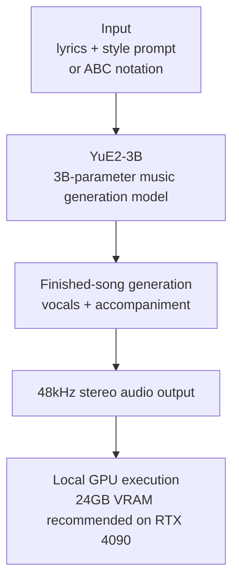

## Why Read This

If you are on an on-premise AI infrastructure team and have been asked "can we run generative audio on our cluster," this post is for you. It puts the open-weight option for music generation in one place: what spec it arrived at, and under which license. The conclusion up front: YuE2-3B runs finished-song generation on a single roughly-24GB-VRAM GPU, but the weights are CC BY-NC 4.0, so the moment you point it at a commercial service the conditions change. Check the license before anything else.

## Overview

YuE2 is an open-weight music generation model published by Multimodal Art Projection (M-A-P) on September 10, 2026. It is available on the [GitHub repository](https://github.com/multimodal-art-projection/YuE) and the [Hugging Face model card](https://huggingface.co/m-a-p/YuE2-3B), with the current release size at 3B parameters. On release day, community threads compared it against commercial models such as Mureka v9 and Minimax 3, and [outlets including Gigazine covered it](https://gigazine.net/gsc_news/en/20260911-yue2-music-generation-ai/).

To see what YuE2 moved, look at the terrain of open music generation first. Until now, the open side drew attention mainly for background and instrumental audio, while finished songs with vocals were the domain of closed API services such as Suno and Mureka. YuE2 pulls the "finished song with vocals" territory itself into open weights.

Three reasons it matters. First, it is open-weight. Second, it outputs finished songs with vocals and accompaniment, not stems. Third, it runs on a single consumer-grade GPU (roughly 24GB VRAM).

## What It Is

YuE2-3B takes lyrics plus a style prompt and generates a finished song with vocals. Output is 48kHz stereo audio. It supports multiple genres and languages, with Japanese vocal generation being the one most often mentioned. A text prompt is not the only input: the model also accepts ABC notation (music scores) as an input path. In other words, on top of the general "lyrics plus style" path, a second path opens where the melody is specified in score form.

The difference from prior open music models is that finished-song generation, including vocals, now runs on-premise. Until now, vocal-complete songs were mostly the territory of API services (Suno, Mureka, and others). YuE2 pulls that territory into local execution.

### Model Card Summary

| Item | Detail |
|---|---|
| Model | YuE2-3B (M-A-P) |
| Released | 2026-09-10 |
| Parameters | 3B |
| Output | 48kHz stereo, finished song with vocals + accompaniment |
| Input | Lyrics + style prompt, ABC notation |
| Weights license | CC BY-NC 4.0 (non-commercial) |
| Code license | Apache 2.0 |
| Recommended runtime | Linux, Python 3.10+/3.12, NVIDIA GPU (BF16), ~24GB VRAM unquantized |

## Installation and Integration

Per the model card, the recommended runtime is Linux, Python 3.10 or 3.12, an NVIDIA GPU with BF16 support, and roughly 24GB VRAM for the unquantized weights. The repository and model card provide official run scripts, and the [Hugging Face demo Space](https://huggingface.co/spaces/mrfakename/yue2-3b) lets you generate without touching a GPU.

From the serving side, plug the VRAM figure into the cluster. 24GB is comfortably inside H100 (80GB), H200 (140GB), and B200 (192GB), and it runs on a single RTX 4090-class card. It is a job that needs no multi-GPU configuration.

Quantization paths are in progress in the community. Attempts to run on roughly-8GB GPUs are mentioned (some via the audio.cpp DEV branch), but they are not officially supported. The 24GB figure is for the unquantized model, so FP8 or INT4 quantization has room to lower the memory requirement, with no confirmed numbers yet.

## Actual Experiment Results

Reproduction attempt failed: this publishing window did not have a GPU execution environment available, so we did not reproduce the generation directly. The numbers below are from the model card and community measurements.

- Roughly 71 seconds to generate a 3.6-minute song on an RTX 4090
- Peak memory of roughly 14.08 GiB in the same run

Those two figures back up the point that finished-song generation runs in near real time on a single consumer GPU. 71 seconds for about 216 seconds of 48kHz audio is an RTF of 0.33: generation moves faster than the output plays. The peak memory of 14.08 GiB landing below the recommended 24GB suggests that even the unquantized weights could run on a 16GB-class card. Caveat: this is a community-reported measurement, not an independent re-measurement in a ThakiCloud runtime (B200/H200/H100).

For serving, the number matters because it confirms music generation as a single-GPU-job workload. At 71 seconds per 3.6-minute song, a batch of 10 songs takes roughly 12 minutes on one GPU. A queue-on-one-GPU structure holds.

### An honest line on benchmarks

The claim that YuE2 beats Mureka v9 and Minimax 3 circulated on release day, but no independent benchmark table has been published to back it. The model card carries the softer framing of being comparable to Suno v5 in quality and text alignment. Until the compared models and measured dimensions (vocal naturalness, text alignment, genre variety) are published with numbers, this post reports the benchmark status only as "community assessment comparable to commercial models."

## ThakiCloud Product Implications

**ai-platform (serving infrastructure).** The 24GB VRAM figure matters for a GPUaaS. H100 (80GB), H200 (140GB), and B200 (192GB) all absorb it with room to spare, and a quantization path could eventually reach consumer cards. This is a concrete case of "finished-song music generation" running as a single-GPU job on our cluster. The serving path, though, is not off the shelf: YuE2 is not currently exposed through vLLM or SGLang and ships its own run scripts. Multi-tenant serving requires wrapping those scripts as GPU jobs first.

**License (important).** CC BY-NC 4.0 on the weights is a direct constraint for commercial platform operators. "Open-weight" and "non-commercial conditions" are different statements. Using YuE2 for (a) internal experimentation and PoC, or (b) demoing in a customer's on-premise environment, fits the conditions. Exposing it as a (c) paid feature of a ThakiCloud SaaS requires a commercial license discussion with M-A-P. This is exactly the point our TDD (technical due diligence) model-license audit exists for. The honest handling: register YuE2 in the open-weight catalog with the license field marked NC, and block the path from serving to commercial workloads.

**Paxis (agents).** A music generation workflow is a natural agent workflow. In the sequence lyrics (LLM) → style decision → YuE2 run → output verification → publish, the ObservationPack pattern covered in the SoL-Pi post applies directly: large audio artifacts are handled as references, not inlined. It is the same shape as Paxis' sandbox execution model triggering a GPU job and pushing artifacts to S3. The calculation for moving a music slot in a content-production pipeline from an external API call to an internal GPU job takes this post's serving numbers as its input.

## Limitations and Counterarguments

First, the license. CC BY-NC 4.0 presumes non-commercial use. The headline "an open-weight music model is here" hides that clause, so verify the weights and code licenses separately before adoption (the code is Apache 2.0).

Second, subjective quality. Music generation quality is not settled by one aggregate metric. Vocal naturalness, genre fit, and lyric-pitch alignment need listening. The model card's numbers do not say how far the intended style is restored from a text prompt.

Third, no measured Korean vocal. Japanese vocal generation is mentioned; there is no measured report on Korean vocals yet. How pronunciation and intonation render with Korean lyrics requires a direct run.

Fourth, ABC notation practicality. Scores are an accepted input, but the relationship between typical users' ABC notation skill and generation quality has not been published.

## Wrap-up

YuE2-3B is the model that shows "finished-song generation with vocals" has moved into open-weight, on-premise territory. The 24GB VRAM spec means a single consumer GPU, and the community-measured 71 seconds per 3.6-minute track means finished-song generation runs faster than real time.

Three takeaways from the ThakiCloud side. (1) Serving: it is a single-GPU-job workload, confirmed. (2) License: mark CC BY-NC 4.0 explicitly in the catalog and block the commercial serving path. (3) Experiment: queue a Korean vocal measurement on the next GPU experiment run.

The model is good. The remaining question is "where do we use it," and that answer only stands after the license check.

## Sources

- [M-A-P YuE GitHub](https://github.com/multimodal-art-projection/YuE)
- [YuE2-3B Hugging Face model card](https://huggingface.co/m-a-p/YuE2-3B)
- [YuE2-3B Hugging Face demo Space](https://huggingface.co/spaces/mrfakename/yue2-3b)
- [Gigazine YuE2 coverage (2026-09-11)](https://gigazine.net/gsc_news/en/20260911-yue2-music-generation-ai/)
- [YuE official site](https://yueai.ai/)
