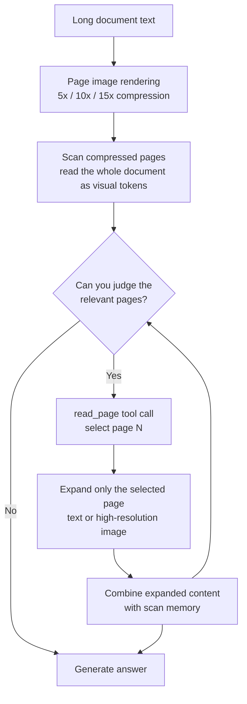

*A visualization of the article's core concept (scan-select-expand).*

## Who This Is For

If you run long-document workloads like RAG, document QA, or contract analysis and have hit input-token cost or context-window limits, or if you are comparing open-weight VLM options for document understanding, this article is for you. The conclusion first: Apple's LensVLM-9B proves, at 9B scale, the paradigm of "compress documents into images, read them, and expand only the relevant pages." Both the rendering-side results we reproduced locally and the paper's benchmark numbers are real. But the weights came under a research-only (non-commercial) license, so the essence of adoption is not "do we buy the model" but "do we port this paradigm to our own VLM."

## Overview

Apple put LensVLM-9B on [Hugging Face](https://huggingface.co/apple/LensVLM-9B) on September 21, 2026. It is a 9B-parameter vision-language model (VLM) based on Qwen3.5-9B-Base, released together with the [arXiv paper (2605.07019)](https://arxiv.org/abs/2605.07019), the [GitHub code repository](https://github.com/apple-aiml-research/ml-lensvlm), and a demo. The CEO of Hugging Face, Clem Delangue, [introduced the model on X](https://x.com/clementdelangue/status/2102856189084098897), and four days after release, as of September 25, it records 455 downloads and 169 likes.

The paper itself was submitted on May 7, and this release is the weights and code. The authors are 10 people from Apple's Machine Learning Research team: Roy Xie, Dan Friedman, Donghan Yu, Bowen Pan, Christopher Fifty, Jang-Hyun Kim, Xianzhi Du, Zhe Gan, Vivek Rathod, and Bhuwan Dhingra.

## What This Technology Is

The starting point is a simple observation. A VLM can process text as rendered images, without tokenizing the text. Because a VLM's image encoder maps fixed-size images to a fixed number of visual tokens, changing the rendering resolution is a natural compression knob. At 10x or 15x compression, the number of visual tokens a page image contributes stays the same.

For that observation to become a real "knob," it helps to see how it differs from existing approaches. Existing ways of handling long documents come in three branches. Plain tokenization makes context grow without bound and the KV cache with it. RAG retrieves only relevant chunks, but "what is relevant" is decided up front by a retriever, and multi-hop questions where the evidence is scattered lose their connections. Text compression (summarization, subword reduction) loses information by construction. Image rendering is a different axis: a page's visual-token count is fixed, and layout, formatting, and adjacency survive without tokenization.

The problem is accuracy. As compression increases, characters shrink below the encoder's effective resolution and become indistinguishable. Existing visual-compression approaches hit this wall and had to limit the compression rate. LensVLM approaches the failure mode not by "avoiding it completely" but by "detecting and recovering from it." The model scans the compressed page images, then calls the learned tool `read_page` to expand only the relevant pages back to their uncompressed form and read them.



There is one more key judgment: the expansion format. The paper's analysis finds that text expansion is better for rendered text, while high-resolution image expansion is better for native documents whose layout cues (table positions, figures, headers) carry task-relevant information. The same analysis confirms that as compression grows, the model increasingly relies on expanded content rather than unreliable visual reading.

## How It Was Trained

LensVLM is a "framework + post-training recipe." The weights starting from Qwen3.5-9B-Base mean that the two base capabilities (visual recognition, language reasoning) come from the base model, and what LensVLM newly learned is "identifying the relevant pages in a compressed image" and "when to call read_page, and in which format."

What the paper's analysis section validates is precisely the effect of that training. First, training makes visual compression robust to rendering choices (font, size, layout changes). An untrained VLM breaks its compressed reading when the rendering setup shifts slightly, while the trained model holds accuracy across rendering variation. Second, as compression grows, the model's behavior shifts from scanning to expanding. At 5x, a large share of the reading comes from the compressed images themselves; at 10x-15x, read_page calls become the dominant behavior. In other words, the model learned the strategy "if I cannot read it, I expand and check."

These two facts matter practically. Even when you do not use the exact rendering pipeline (same fonts, same layout), the learned robustness absorbs a range of variation. And because raising the compression rate automatically raises the expansion cost, the "optimal compression rate" must be measured per document type.

## Installation and Integration

The actual installation commands from the GitHub repository:

```bash
git clone https://github.com/apple-aiml-research/ml-lensvlm
cd ml-lensvlm
pip install -r requirements.txt
```

The contents of requirements.txt:

```
torch>=2.13.0
vllm>=0.27.0
transformers>=5.10.0
Pillow>=12.3.0
datasets>=2.14
```

The key inference dependency is vLLM. To run the bundled demo:

```bash
python scripts/run_demo.py --model apple/LensVLM-9B
```

On your own document:

```bash
python demo.py \
    --model apple/LensVLM-9B \
    --text_file document.txt \
    --question "What is the main finding?" \
    --compression 10x
```

The compression options are `5x`, `10x`, and `15x`. The rendered page images and the result are saved under `./demo_output/`.

## Hands-On Results

We pulled the repository onto a local Apple Silicon MacBook Pro and actually ran the rendering pipeline. Model inference was not possible: `demo.py` hard-depends on `from vllm import LLM`, and vLLM provides no macOS/Apple Silicon build. We record that limit honestly. Reproduction attempt failed: the inference path is vLLM-hard-dependent and cannot run on a local Mac. The rendering pipeline, by contrast (pure Python + Pillow, no model), works as-is, and those results are this post's measured numbers.

First, the HotpotQA demo sample bundled with the repository (context: 32,033 characters) rendered at three compression rates.

| Compression | Pages generated | Page size | Chars per page | Render time |
|---|---|---|---|---|
| 5x | 19 | 256x284 px | 1,685.9 | 0.87s |
| 10x | 15 | 192x252 px | 2,135.5 | 0.84s |
| 15x | 21 | 128x190 px | 1,525.4 | 0.79s |

Two things stand out. First, rendering takes under a second. The cost of converting a 30,000-character document into page images is effectively negligible; all the cost is on the inference side. Second, page count is not monotonic in compression. 15x produces more pages than 10x (21 vs 15). The compression knob actually adjusts page width and font size (5x: width 256, font 8; 10x: 192, 6; 15x: 128, 5), and as the layout recomputes, the page count can grow. The experiment directly shows that "effective compression" must be measured in visual tokens, not in page count.

We also cross-validated the expected output in the repository README. The README says the 10x demo generates "[15 page images]"; our measurement was exactly 15 pages.

The bundled demo question itself is worth a look. "What government position was held by the woman who portrayed Corliss Archer in the film Kiss and Tell?" It is a multi-hop question. To answer it, three things must be connected: find the actress who played Corliss Archer (Shirley Temple), then read the page covering her life to find the government position (Chief of Protocol of the United States). According to the README record, the model scanned the 15 compressed pages, picked Page 10 because it contained the clue "American actress, singer," called read_page, and produced the answer in two turns. Instead of reading the full context (32,000 characters), it pays only the scan cost plus the expansion cost of one page. That is one unit of "selective expansion."

We also ran the pipeline on one of our own whitepaper documents (20,092 characters).

| Compression | Pages generated | Page size | Render time |
|---|---|---|---|
| 5x | 12 | 256x284 px | 0.54s |
| 10x | 10 | 192x252 px | 0.52s |
| 15x | 13 | 128x190 px | 0.47s |

A Korean-language document passes through the same pipeline. One caveat: the rendering fonts are DejaVu-based (Latin-centric), so Korean glyphs may fall outside the default font configuration. Using this with Korean documents requires checking the font setup first.


*Local reproduction measurements (2026-09-25, Apple Silicon). Left to right: pages generated and chars per page for the HotpotQA sample (32,033 chars), and render time for our whitepaper document (20,092 chars).*

Here is the first page of the HotpotQA sample rendered at 10x compression in our experiment. A 32,033-character document becomes 15 small page images.


The accuracy numbers on the model side come from the paper. LensVLM maintains accuracy comparable to the full-text upper bound at 4.3x effective compression, and outperforms retrieval-based, text-compression, and visual-compression baselines up to 10.1x effective compression across seven text QA benchmarks. It also generalizes to multimodal document understanding and code understanding, with the accuracy gain over baselines growing as compression increases.

## ThakiCloud Product Implications

We look at this model through ThakiCloud's two product lenses.

**ai-platform (Metis/serving) lens.** Long-document workloads are input-token-heavy. RAG context filling, contract analysis, and technical-document QA all have the shape "input is more expensive than output." If 4.3x-10.1x effective compression holds, the input cost drops by that much. But two constraints come first. The weights are research-only, so they cannot be used in commercial serving. And the approach presumes a VLM + tool-calling infrastructure. The vLLM max_model_len setting is a representative case: a comment in the paper's code notes that because the model's max_position_embeddings is 262,144, sizing the KV cache for the full context needs about 34 GB of KV cache on top of about 19 GB of weights, so the demo runs with max_model_len=32,768. Serving configuration determines memory footprint, the same family of lesson as what we measured on Metis serverless, where serving configuration changed throughput 18x.

The paradigm itself can be ported without the license restriction. "Scan, select the relevant pages, expand only the selection" is an inference structure that works with any VLM and tool-calling framework. Reproducing the same pattern with a commercially licensed VLM is the legitimate path around research-only weights.

**Paxis (agents) lens.** LensVLM's read_page tool is an example of agent economics. Instead of paying the token cost of the entire document, you select only the pages you need and pay the expansion cost of those. If Paxis charges by skill and tool calls across an agent workflow, a workflow that uses "selective expansion" instead of "full context injection" costs less on the same task. For document-based skills (report summarization, contract review, knowledge-base QA) in Paxis, this pattern becomes a skill-design option.

**Serving economics.** Translating our measured rendering results into a cost structure: with plain tokenization, input cost is proportional to document length. A 32,033-character document is charged for as many tokens as its length. In the LensVLM approach, the scan cost is "page count x fixed visual tokens per page." Our measurement shows a 32,033-character document renders into 15 pages at 10x, and each page's visual-token count is constant regardless of compression. Expansion cost is proportional to the number of relevant pages. So the total cost takes the form "15-page scan + k-page expansion" (k = relevant pages). For multi-hop QA where the relevant pages are 2 or 3, input shrinks dramatically versus full text. For a comprehensive-analysis task where the relevant pages are 10, the scan + expansion sum can approach the full-text cost. The paper's "4.3x-10.1x effective compression" is best read as holding for document types with a small k distribution (QA, fact-checking).

## Limitations and Counterarguments

The model's limitations.

First, the license. The [Apple Machine Learning Research Model License (apple-amlr)](https://huggingface.co/apple/LensVLM-9B/blob/main/LICENSE) permits only "non-commercial scientific research and academic development activities." Model Derivatives are also bound to research-only. Commercial products, serving, and derivative models are all out. It is the same research license family as Apple's earlier open weights (CLIP, MobileCLIP, DiffuCoder, etc.).

Second, the limit structure of compression. "Comparable to full text" at 4.3x and "ahead of baselines" up to 10.1x, but that advantage comes from re-reading the relevant pages through the expansion tool. The actual token consumption is "compressed scan + expanded pages." If there are many relevant pages, the benefit shrinks. The precise statement is not "always 10x cheaper," but "the benefit is large for documents with few relevant pages."

Third, the benchmark category. The seven QA benchmarks are multi-hop question-answering in the HotpotQA, Musique, and Natural Questions family. Performance on enterprise documents (tables, figures, forms, multi-page layouts) is not directly reported beyond the paper's "multimodal generalization" claim.

Fourth, the execution environment. vLLM hard dependency, 9B scale. Effectively not runnable on consumer GPUs or a local Mac. Serving happens on a GPU server, with max_model_len tuning.

Fifth, rendering-quality dependence. The premise of this approach, "identifying the relevant page from the compressed image," depends on rendering conditions (font, layout, resolution). The paper's analysis says training makes visual compression robust to rendering choices, but robustness is not guaranteed outside the standard rendering setup (Korean/CJK documents, complex tables).

Events that would change our judgment about this model. First, a license change: if Apple opens the research-only restriction or announces a commercial-license derivative, the option set moves from "port the paradigm" to "serve it directly." Second, CJK and enterprise-document benchmarks: if the 4.3x-10.1x numbers hold on Korean documents and table-dense documents, the adoption calculus for domestic document workloads changes. Third, a follow-up model: if a larger LensVLM comes out and the benchmark advantage holds, the paradigm's standing rises. All three are still on the watch list.

## The Bottom Line

What Apple's LensVLM-9B released is not just a 9B weight file. It is an inference paradigm: "scan long documents as compressed images, and read only the relevant pages expanded via a learned tool." The paper's numbers show full-text-comparable accuracy at 4.3x effective compression and baseline superiority up to 10.1x; our local reproduction confirmed the rendering pipeline runs in under a second and exactly matches the README's expected page count.

The one-line conclusion for adoption. The weights are research-only, so they cannot be bought for commercial serving, but the paradigm can be reproduced on our own VLM. For teams that want to cut input cost on long-document workloads, the first experiment is whether to swap "full context injection" for "scan-select-expand." The rendering side can run locally today; the model side runs on a GPU server.

## Sources

- [Hugging Face: apple/LensVLM-9B model card](https://huggingface.co/apple/LensVLM-9B)
- [arXiv 2605.07019: LensVLM: Selective Context Expansion for Compressed Visual Representation of Text](https://arxiv.org/abs/2605.07019)
- [GitHub: apple-aiml-research/ml-lensvlm](https://github.com/apple-aiml-research/ml-lensvlm)
- [Clem Delangue X post](https://x.com/clementdelangue/status/2102856189084098897)
- Local reproduction results: `outputs/blog-impl/lensvlm9b/render_experiment.json` (rendering pipeline measurements)
