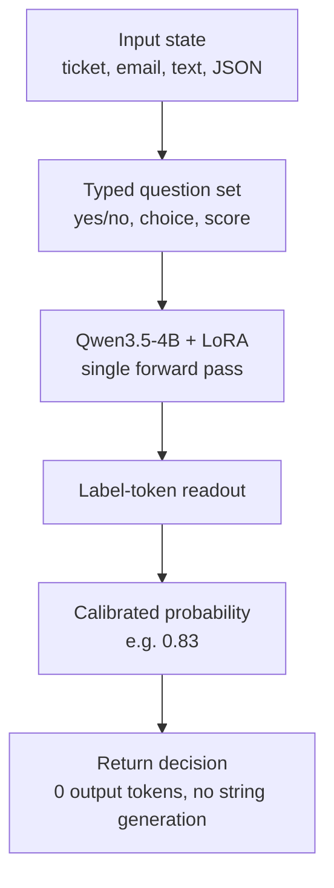

*An abstract rendering of System One's core idea: Lev returns a "calibrated probability" rather than a "sentence."*

## Why read this

If you are building points where software makes its own decisions and you ask an LLM questions like "should this ticket be escalated," "is this email spam," or "should this action be approved," this post is for you. Or if you want an open-weight model that returns an answer as a number rather than as text. The conclusion first: Lev is a 4B model that brings TypeSafe's System One decision model Jev to open weights. It takes typed questions and returns a single calibrated probability instead of generating free text. That means zero output tokens, and one or two orders of magnitude faster than a frontier LLM on the same question, which is the essence of the architecture. But the accuracy itself is slightly below Jev, and the "top" claim only holds within S1Bench, a specific board, and within the 4B-or-smaller class.

## Overview

Interfaze (YC P26) open-sourced TypeSafe's Jev in September 2026. The released model is called Lev: the weights are on [Hugging Face](https://huggingface.co/interfaze-ai/lev), the model plus measurement harness are on [GitHub](https://github.com/InterfazeAI/lev), and the announcement is on the [official blog](https://interfaze.ai/blog/jev-now-open-source-lev).

Jev is TypeSafe's flagship and the first model in what they call the "System One" family. Per [TypeSafe's System One docs](https://docs.typesafe.ai/concepts/system-one), System One models make fast, structured decisions for software, and Jev was the original. Lev is the open-weights version of that Jev, and the headline of the release is that it "speaks the same API and runs locally."

The build is simple. The base is Qwen3.5-4B, with a LoRA adapter on top, for 4B total parameters. The [GitHub repository](https://github.com/InterfazeAI/lev) describes it as "Qwen3.5-4B + LoRA, trained on one H100." The license is Apache-2.0 per the [Hugging Face model card](https://huggingface.co/interfaze-ai/lev), applied to both the model weights and the LoRA adapter. At 4B, the release notes that it "runs comfortably on a MacBook or a small GPU."

## What is a System One model

Start with what "System One" actually means. As the name suggests, it is the modeling of Kahneman's "fast, automatic System 1" of thinking. The important part is how this family represents a decision.

A conventional LLM, which I will call System Two here, generates text when asked a question. Even if you ask for "yes," it actually strings together several tokens into a sentence like "yes, this ticket should be escalated." That output is natural for a human but awkward for a machine: you must parse it, the format varies each time, and it is a generated sentence rather than a value you can trust directly. To use it as a decision, you have to extract meaning from the sentence.

A System One model drops that generation entirely. Instead you give it two things. First, the state: the input itself, whether text, a ticket, an email, or JSON. Second, a set of typed questions: yes/no, one-of-N choices, or a numeric score, so the shape of the answer is fixed. The model then answers each question not in natural language but with a probability. For a yes/no question like "should this ticket be escalated," it returns 0.83.

The word "calibrated" is the core of System One. A value of 0.83 does not merely mean the model is strongly confident; it means that across 100 similar questions, roughly 83 would actually be "yes." Because the number tracks real frequency, you can gate on it: auto-approve above 0.8, send to a human below that. A sentence would have made such a gate hard.

The output mechanism is label-token readout. The "zero output tokens" highlighted by the [GitHub hf directory](https://github.com/InterfazeAI/lev/tree/main/hf) is exactly this. The model does not generate its answer by appending tokens; it reads the probability from the logit of a label token it already knows (yes, no, each choice, each score). Because nothing is generated, the output length is zero, and that is the basis for the claim that it is 40-200x faster than frontier LLMs. [DataCamp's explainer of Jev](https://www.datacamp.com/blog/system-one-models-jev) introduces System One models' speed advantage as this range.

As a diagram, the architecture is:

Answering an entire question set with probabilities in one forward pass is structurally different from a conventional LLM that takes many decode steps to produce one sentence.

## The Lev model card

Lev's model card is a design that satisfies three constraints at once: "System One, at 4B, open weights, local."

The Qwen3.5-4B base matters. The base already has the vision and generation abilities, and what Lev newly learns is "to assign a calibrated probability to a typed question via a label token." LoRA handles that transfer. So the weight files are a Qwen base plus a small LoRA adapter, and the record of "trained on one H100" follows from this.

The GitHub repository releases the measurement harness alongside the model. The repository description, "Lev is a System One decision model and the harness that measures it," is this. The harness is the apparatus that scores a model's accuracy and calibration on a board called S1Bench, and it runs both Lev and Jev through the same harness to pin the numbers.

The repository's [TRAINING doc](https://github.com/InterfazeAI/lev/blob/main/docs/TRAINING.md) gives an insight that shows the essence of the System One design. On S1Bench, an untuned 27B model, with a label-token readout attached, reaches 0.7582, one point behind Jev on accuracy. But the doc says the gap that really matters is not accuracy but calibration. Accuracy is something a large model catches up on easily, while how well the probabilities match real frequency is an axis on which a 4B can still compete with 26-35B models. That is Lev's core design claim: for a decision model, "being more accurate" matters less than "what probability it emits," so calibration, not size, is the design axis.

## Benchmarks: where on S1Bench

We did not reproduce this model locally. Because we could not download and run the 4B weights in this environment, every number below is the official value Interfaze published from its own S1Bench harness run. We state plainly that we make no reproduction claim.

Per the official [blog](https://interfaze.ai/blog/jev-now-open-source-lev) and the [GitHub hf directory](https://github.com/InterfazeAI/lev/tree/main/hf), Lev scores 71.9% on the six subsets of the public S1Bench board that every model completed. On that slice it ties reflex-4b, and no model at 4B or smaller scores higher. Jev and three open models in the 26-35B range sit above it. Across all 13 S1Bench subsets it is 68.9%.

The figures and comparisons, summarized:

| Model | Parameters | S1Bench (public board, 6 subsets) | Notes |
|---|---|---|---|
| Lev (Interfaze) | 4B (Qwen3.5-4B + LoRA) | 71.9% | ties reflex-4b, top of the 4B-or-smaller class |
| reflex-4b | 4B | 71.9% | tied with Lev |
| Jev (TypeSafe) | undisclosed | slightly above Lev | the System One original, top of the public board |
| Three open 26-35B models | 26-35B | above Lev | advantaged by size |

Two verification apparatuses are attached. First, Lev and TypeSafe's Jev were run through the same harness on all 3,880 items, with S1Bench scores pinned by Nimble's manifests. Second, Interfaze's Jev run lands within 0.8 points of TypeSafe's published figure. So Lev's numbers come after Lev and Jev were re-measured together, confirming the board's reproducibility, not from an isolated run.

## ThakiCloud product implications

Read the model through ThakiCloud's two products.

**ai-platform (Metis / serving) lens.** Lev shows a serving profile on a different axis from a conventional generative LLM. Because there is no token stream to decode, the generative-serving cost structure, which scales as "output length times decode steps," does not apply here. The cost of answering the same question converges to "one forward pass plus reading label logits." As a result, the range where the same decision workload can run on a cheap GPU, or even client-side (a MacBook), widens. The 4B Apache-2.0 combination also holds up as a choice for a decision endpoint in a closed network (on-prem, sovereign) with no external API. From the Metis serverless view, this model is an experiment target for how the serving stack handles a "small decision-type workload," that is, whether it can pull sub-vision-scale models into the serving family.

**Paxis (agent) lens.** The System One output contract is close to what an agent harness wants. When an agent calls a tool or a policy, a "calibrated probability on a yes/no" needs no parsing, can be gated on a threshold, and survives as a number in the audit log. "The probability of approving this action is 0.92" is easier to handle in a policy gate and in audit than "I judge that approving is fine." If Paxis treats skills, tools, policies, and audit logs as first-class resources, a model that returns typed decisions as first-class output fits that contract naturally.

**Serving economics.** The 40-200x speed claim is about TypeSafe's System One family; the precise throughput figure for Lev itself is in the [repository's Speed receipt](https://github.com/InterfazeAI/lev) and is not cited here. But one structural fact is clear. With zero output tokens, the "output token price" that drives generative LLM cost does not exist for this model. Decisions whose cost does not scale with output length can, on the same hardware, process a much larger number of decisions than a generative LLM. That is why System One can be used at "the points where software decides by itself."

## Limits and counterarguments

The limits, plainly.

First, the class. Lev is a decision model, not a general reasoner. You must pre-define the answer shape as typed questions, and it returns probabilities within that frame. It is not for opening a conversation or producing new information. "Is this ticket spam" works, but "think about what to do with this ticket" does not. The cost of framing the question properly remains a separate axis from the model's own accuracy.

Second, the range of the "top" claim. Top of 4B-or-smaller is a result within S1Bench, a specific board, a specific class. On the independent board [JevBench](https://jev-ai.pro/jevbench), a different open 4B model (decider-4b v2) reportedly beat Jev by 0.8 composite points. Rankings shift by board, so Lev has not taken the throne of the entire "4B decision model" category.

Third, the reproduction scope. The numbers in this post are Interfaze's own harness runs, and the S1Bench scores are pinned by Nimble manifests. Reproduction depends on the harness and the manifests. The fact that we could not re-confirm them locally is recorded as a limit in its own right.

Fourth, the calibration premise. If System One's value comes from "calibrated probabilities," that calibration holds when training and evaluation share a distribution. If the deployed question distribution differs from S1Bench, 0.83 does not guarantee "83 out of 83." Re-checking calibration on your own workload distribution is a precondition before building a threshold gate.

Fifth, the residual license risk. The weights and LoRA are Apache-2.0, but the Hugging Face model card warns that some training datasets may carry non-commercial licenses. A dataset license review is needed before commercial serving.

Events that would change this judgment are also noted. First, if top-of-4B-or-smaller is re-confirmed on an independent board rather than S1Bench. Second, if calibration on your own decision workload distribution is re-measured to be consistent with S1Bench. Third, if the conflict between the Apache-2.0 weights and the dataset licenses is resolved. All three remain under observation.

## In short

Interfaze's Lev is more than 4B weights. It is the System One output contract, "return a decision as a calibrated probability rather than a sentence," brought to open weights. A Qwen3.5-4B base with a LoRA adapter, label-token readout for zero output tokens, and Apache-2.0 release. The official S1Bench figure is 71.9% on the six public-board subsets, top of the 4B-or-smaller class, with three 26-35B models and Jev above it.

A one-line conclusion for adoption. If you are building points where software decides by itself and you want that decision as a "number" rather than a "sentence," start by looking at how this model implements that contract. Calibration, not size, is the axis, and the number of decisions, not output tokens, is the unit of cost. At 4B Apache-2.0 it is a sufficient candidate for a closed-network or client-side decision endpoint; before actually using it, re-confirm calibration on your own distribution and check the dataset licenses.

## Sources

- [Interfaze: Jev, now open source: Lev (official release)](https://interfaze.ai/blog/jev-now-open-source-lev)
- [Hugging Face: interfaze-ai/lev model card](https://huggingface.co/interfaze-ai/lev)
- [GitHub: InterfazeAI/lev (model + measurement harness)](https://github.com/InterfazeAI/lev)
- [GitHub: InterfazeAI/lev, hf directory (S1Bench figures)](https://github.com/InterfazeAI/lev/tree/main/hf)
- [GitHub: InterfazeAI/lev, TRAINING doc (calibration insight)](https://github.com/InterfazeAI/lev/blob/main/docs/TRAINING.md)
- [TypeSafe: System One concept docs](https://docs.typesafe.ai/concepts/system-one)
- [DataCamp: Jev, TypeSafe's System One model explainer](https://www.datacamp.com/blog/system-one-models-jev)
- [JevBench (independent decision-model board)](https://jev-ai.pro/jevbench)
- AGI Hunt: Interfaze open-sources Jev as Lev (secondary coverage)
