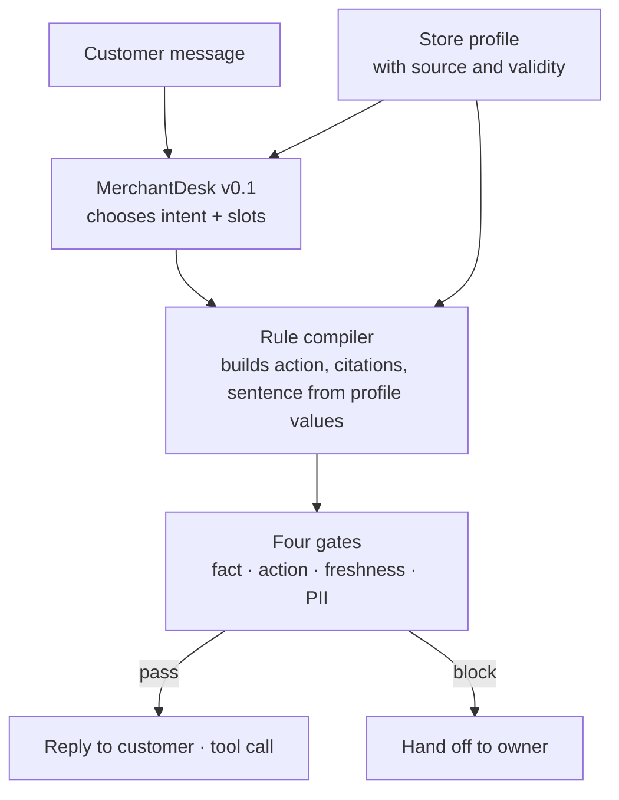

If you are building an AI that answers customer questions for small shops, the takeaway fits in one line: teach the model to decide, not to memorize the shop, and let code pull the facts straight from the store's own data. ThakiCloud has released a 27B model trained this way, `Qwen3.8-27B-Human-KO-MerchantDesk-v0.1`, on Hugging Face. We built it for Korea's small-business owners. Its purpose is to give back some of the time owners spend running between the stove, the register and the phone.

## Why this matters

Small-business chatbots rarely fail on tone. They fail by inventing opening hours, by saying they sell a dish that is not on the menu, and by answering a perfectly bookable request with "let me check with the owner." The first two break trust. The last one does not take any work off the owner's plate. This model was trained to reduce all three at once, and we compared it side by side with the strongest control we could build without any training.

## What the model does

Each request gives MerchantDesk two things. One is a store profile: opening hours by weekday, menu and prices, reservation rules, delivery areas, parking and facilities, each field carrying its source and validity status. The other is what the customer said. The model reads both and returns a single JSON object.

```json
{"intent": "reservation.create",
 "slots": {"date": "2026-10-03", "time": "19:00", "party_size": 4},
 "action": "tool_call",
 "tool": {"name": "reservation.check_availability", "args": {}},
 "answer": "...", "cites": ["reservation.policy"]}
```

There are 25 intents, covering opening hours, location and parking, menu and prices, sold-out status, recommendations, creating, changing and cancelling reservations, pickup and delivery, payment, refund rules, wait times, group bookings, facilities, coupons, complaints and off-topic questions. There are only four actions: answer directly, ask back for one missing detail, look something up with a tool, or hand off to the owner. For "Can I book a table for four at 7 pm on Saturday?", the right move is the reservation-create intent with date, time and party size filled in, and a call to the reservation lookup tool rather than a guess about whether a table is free.

The model memorizes nothing about the shop. Every price and every time comes from the profile sent with the request. What training taught it is judgment: what is this question asking, and can I answer it with what I have. That is why one trained model can serve hundreds of shops as is, and why nothing needs retraining when a shop changes its menu.

## The model decides, code writes

In production, the model's JSON never goes to the customer directly. We take only the intent and slots the model chose, and a rule compiler fills in the action, citations and sentence from the profile. Four gates then look once more right before anything goes out: a fact gate that checks prices and times in the sentence against the profile, an action gate that checks the model only called tools it is allowed to, a freshness gate that stops stale information from being stated as fact, and a PII gate that stops personal data from leaking.



*The model only decides. Every value the customer sees is pulled from the profile by code.*

The results show clearly why we split it this way. As we cover below, the model with dedicated training makes better decisions, yet the sentences it writes on its own mention facts that are not in the profile more often. Give one model both jobs and you get both traits together. Separate them and you keep only the good one.

## What we compared

There are three contenders. A is the untrained base model `Qwen3.8-27B-Human-KO` with the same compiler, gates and prompt attached, the strongest product we can build without training. C is `Qwen3.8-27B-Human-KO-Enterprise-v0.2`, a general policy model trained on enterprise support policies. B is MerchantDesk, released today. Every comparison was paired on the same profile serialization, the same compiler and gates, and the same decoding settings. A and B were compared on the final prompt v1.2; A and C on the version just before it, v1.1.

Why include C at all? Even if B beats A, A and B alone cannot tell us whether the gain comes from small-business data or from a general ability to read policy and pick an action. If C, which already learned that general ability, does as well as B, there is no reason to build a dedicated model for every industry.

There are two evaluation sets. The IID set has 300 synthetic stores with 20 customer questions each, 6,000 in total. The Hard set collects 600 tricky conversations where two labelers disagreed on the correct action; answering in line with either label counts as correct. Every difference carries a 95% interval from a bootstrap that resamples whole stores. Questions to the same store resemble each other, so intervals computed per question would come out narrower than they should.

## Results

| Metric | A base model | B MerchantDesk | B − A (95% interval) |
|---|---|---|---|
| Resolution rate, IID | 0.609 | **0.708** | +10.0 pts (9.0 to 11.0) |
| Resolution rate, Hard | 0.473 | **0.557** | +8.3 pts (4.1 to 12.7) |
| Intent accuracy, IID | 0.736 | **0.866** | +13.0 pts (12.0 to 14.0) |
| Action accuracy, IID | 0.817 | **0.881** | +6.4 pts (5.5 to 7.4) |
| Unnecessary hand-offs to the owner, IID | 0.104 | **0.042** | −6.2 pts |
| Unsupported facts | 0 / 6,000 | 0 / 6,000 | 0 |


*Resolution rate is the share of conversations where intent, action, citations and tool call are all correct. Prompt v1.2; B is higher than A on both benchmarks.*

Intent accuracy moved the most. The base model tended to file questions about dishes not on the menu, or about things missing from the profile, as off-topic, and then handed perfectly answerable questions to the owner. After dedicated training, this over-escalation fell from 10.4% to 4.2%. For an owner who gets a hundred messages a day, that is six fewer they have to handle personally.

Zero unsupported facts for every model matters too. That number does not mean the models never make things up. It comes from a compiler that never uses the model's own sentence, plus gates that filter once more. Zero out of 6,000 puts the 95% upper bound below 0.1% even after accounting for correlation within stores. Both models clear the bar we set for release, but against the 60% resolution line A has 0.9 points of headroom and B has 10.8.

C missed expectations. An outside review suggested a general policy model would do as well as a dedicated one. In practice, on the same v1.1 prompt, its resolution rate was 5.9 points lower than the base model on IID (interval 5.2 to 6.7) and 2.8 points lower on Hard (0.7 to 4.9). The "check and hand off" habit it learned from enterprise support showed up as over-escalation on neighborhood-shop questions: unnecessary hand-offs rose from 16.9% to 21.6%. At least for this task, policy judgment did not carry over across industries unchanged.

## Why you should not use raw model output

Score the same model without the compiler and the picture changes. On the Hard set, 7.5% of the sentences B wrote itself contained facts not in the profile, against 4.0% for the base model, a gap of 3.5 points (interval 1.1 to 5.8). Dedicated training made the model more confident. That confidence shows up as accuracy in its decisions and as boldness in its sentences.

So we release this model on the assumption that it runs with the compiler and gates, and the model card carries the same warning. Use only the intent and slots, build customer-facing sentences with templates or a rule engine that fill in profile values, and keep a step that checks prices, times and amounts against the profile.

## What it means for ThakiCloud products

The design this model demonstrates is the same way Paxis treats agents. Paxis makes skills, tools, policies and audit logs first-class resources, and an agent's action runs only after it passes a policy gate. In MerchantDesk the model chooses, the compiler builds and the gates block. That is the same principle shrunk down to a single shop. Keep judgment in the model and facts and permissions in deterministic code, and the safety boundary stays put when you swap models or add industries.

On the cost side, Metis and Maxis fit together. This model is a LoRA r8 adapter trained for one epoch on a 27B base and then merged, so no new base model was needed for one industry. The same recipe leads naturally to training adapters for hair salons or retail shops in Maxis and serving them on one base in Metis. One caveat: attaching a LoRA to this hybrid architecture in vLLM silently does not apply the adapter (vllm-project/vllm#38085), so for now we serve the merged weights.

## Limits

We trained two more models on the same data and settings, changing only the seed. All three seeds beat the base model: the resolution gain was 10.0 to 14.2 points on IID (mean 11.6) and 8.3 to 15.7 points on Hard (mean 11.3). The released weights are the lowest-scoring of the three, so the numbers above are on the conservative side. What did swing was the model's own sentences: scored without the compiler, the share of unsupported facts ranged from 3.5% to 16.7% across seeds. Training reliably improves judgment, but how bold the sentences get is closer to luck, which is one more reason to always run the compiler and gates. It covers restaurants only; other industries need their own intent scheme first. We also released a 4-bit (NVFP4) serving build. Its resolution rate is 0.700 on IID and 0.550 on Hard, 0.9 points below the BF16 original on IID (interval −1.4 to −0.4), but the two were measured on different GPUs (H200 and B200), so hardware differences are mixed in. Measured side by side on the same B200 over 400 items, NVFP4 was actually 1.5 points higher. It still beats the base model by 9.1 points on IID and 7.7 on Hard, with zero unsupported facts. We also measured general abilities side by side with the base model. English knowledge (MMLU) went from 92.6 to 94.7, Korean knowledge (KMMLU) from 62.0 to 63.0 and coding (HumanEval) from 95.5 to 96.6, and both models refused all 25 harmful requests. Instruction following came in lower, 82.0 to 74.0; with 100 items, differences under about 15 points cannot be distinguished, but if your use depends on strict formatting instructions, check it yourself.

Gold labels were computed by rule code. When an independent outside judge labeled 200 items separately, action agreement was 95.5%, and none of the 9 disagreements was a code error. Still, if the rules themselves were wrong, all three models could have been graded wrong in the same direction.

## Summary

MerchantDesk v0.1 is a 27B model built for Korea's small-business owners that has learned the judgment needed to answer questions for a neighborhood restaurant. Its resolution rate beats the strongest untrained control by 10.0 points on IID and 8.3 points on hard conversations. Its own sentences get bolder in exchange, so run it with the rule compiler and fact gates. The shortest way to describe how to use it: the model decides, code supplies the facts.

## Links

- Merged model: [ThakiCloud/Qwen3.8-27B-Human-KO-MerchantDesk-v0.1](https://huggingface.co/ThakiCloud/Qwen3.8-27B-Human-KO-MerchantDesk-v0.1)
- 4-bit serving build: [ThakiCloud/Qwen3.8-27B-Human-KO-MerchantDesk-v0.1-NVFP4](https://huggingface.co/ThakiCloud/Qwen3.8-27B-Human-KO-MerchantDesk-v0.1-NVFP4)
- LoRA adapter: [ThakiCloud/Qwen3.8-27B-Human-KO-MerchantDesk-v0.1-LoRA](https://huggingface.co/ThakiCloud/Qwen3.8-27B-Human-KO-MerchantDesk-v0.1-LoRA)
- Collection: [Merchant Desk collection](https://huggingface.co/collections/ThakiCloud/merchant-desk-korean-small-business-customer-desk-6aba5da20fbd297da8cdc3c7)
- Base model: [ThakiCloud/Qwen3.8-27B-Human-KO](https://huggingface.co/ThakiCloud/Qwen3.8-27B-Human-KO)
- Comparison model: [ThakiCloud/Qwen3.8-27B-Human-KO-Enterprise-v0.2](https://huggingface.co/ThakiCloud/Qwen3.8-27B-Human-KO-Enterprise-v0.2)

## Attribution

This model was trained using the AI Hub (https://aihub.or.kr) dataset "Small Business Customer Order Q&A Text" (소상공인 고객 주문 질의-응답 텍스트), built with support from the National Information Society Agency (NIA) and funded by the Ministry of Science and ICT. The public repositories contain no original data or processed copies of it.
