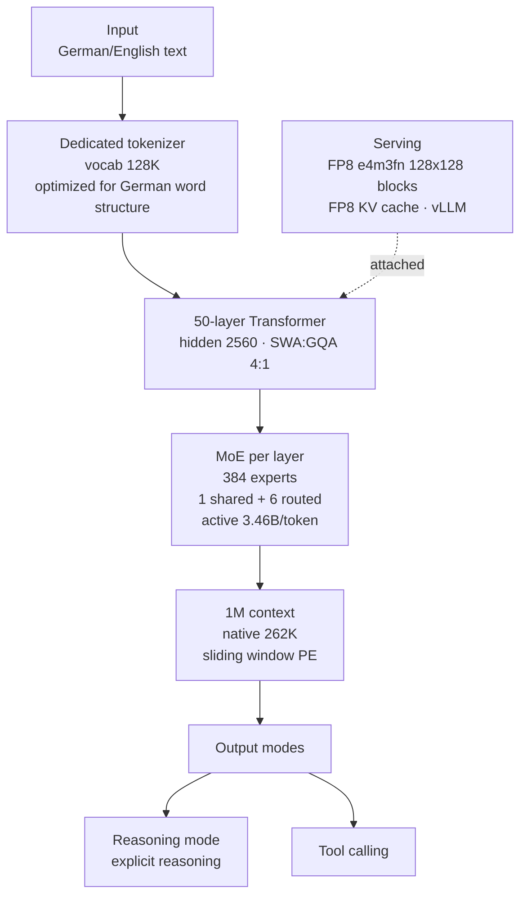

## Why Read This

Platform owners evaluating sovereign AI or on-prem LLM adoption, and product teams that need German performance for EU customers, should read this model card. The conclusion is one line. **Kolibri 1, released by Aleph Alpha under Apache 2.0 on 2026-10-03, is a "78B MoE with 3.46B active per token that is strong in German and English", a sovereign open-weight option with a minimum hardware requirement of one H200 and a validated 1M context.** The "entry into the frontier race" label the tweet attached, however, inflates the model card's actual comparison set.

## Overview

On 2026-10-05, a tweet reading "GERMANY JUST ENTERED THE FRONTIER LLM RACE. Meet Kolibri, a new sovereign open source model" circulated. The original source is Aleph Alpha, a Berlin, Germany AI company, which put out a blog post alongside the technical report (PDF) on release day, 10-03. The Hugging Face model repository was created on 10-02, and within two days of the release, 15 or more community quantizations (GGUF, MLX, NVFP4, etc.) had accumulated.

The model's biggest feature is the explicit choice of "depth over breadth". The model card skips multilingual coverage and concentrates on two languages, German and English, going so far as to build a dedicated tokenizer tuned to German word structure. Its status as a signatory of the EU GPAI Code of Practice, the Apache 2.0 license, and the fact that it disclosed its own training and serving stack (trained on 768 B200s for 21 days) show that "sovereign" was a design goal, not marketing.

## What Is This Model

The architecture is a mixture of experts. 50 layers, 384 experts per layer (1 shared + 6 routed), with total parameters of 78,103,074,560 (about 78B) and active parameters of 3,457,573,120 (about 3.46B) per token. The configuration is hidden size 2560, 48 attention heads, 4 KV heads, a 4:1 SWA:GQA setup, and a 128K vocab. Positional encoding is applied only to sliding-window layers, which the card describes as allowing the context to be extended without scaling. It was trained natively up to 262,144 tokens and explicitly states that quality and serving efficiency were validated up to 1,048,576 (1M) tokens. That said, it recommends staying at 262,144 or below for latency- or throughput-sensitive deployments.

FP8 is the default precision. Weights are float8_e4m3fn with dynamically quantized activations in 128x128 blocks, and it was evaluated with an FP8 KV cache. Only the embeddings, LM head, norms, and MoE router are bfloat16. It supports reasoning mode and tool calling, and is documented on the assumption that it is served through an OpenAI-compatible API.

Training data and compute are also disclosed. Pre-training ran on a 20T token bilingual corpus (about 62.5% English, 23.9% German, 13.6% code), with 3.44T of mid-training and 201B of long-context extension added on top. Post-training is SFT mixing open-source and synthetic data, plus RL covering reasoning, agentic, and instruction-following environments. Compute was 768 NVIDIA B200s (96 HGX 8x nodes), pre-training took 21 days (511 hours, 392k GPUh), and FLOPS reached 6.4e23. The energy line lists 9.5e2 MWh (estimated, including node power). The knowledge cutoff is 2026-06-18 for both English and German.

## Benchmarks

The model card carries its own eval table. The comparison set is the same active-parameter class (3-4B MoE), 12B MoE, and dense 7B/27B/32B/70B, measured at reasoning effort high. The post-training Overall (unweighted mean of category averages) reads as follows.

| Model | EN | DE |
|---|---|---|
| **Kolibri** | **75.5** | **70.8** |
| Kolibri Origin | 54.1 | 46.4 |
| Qwen3.5 35B-A3B | 74.7 | 69.8 |
| Qwen3.6 35B-A3B | 71.4 | 67.3 |
| Nemotron 3 Super 120B-A12B | 73.0 | 67.9 |
| GPT-OSS 120B | 72.3 | 70.2 |
| Gemma 4 26B-A4B IT | 71.9 | 66.3 |
| Qwen3-Next 80B-A3B Thinking | 62.4 | 58.0 |
| Nemotron 3 Nano 30B-A3B | 65.6 | 59.3 |
| GLM-4.7 Flash 30B-A3B | 64.7 | 50.4 |
| Mistral Small 4 119B-A6B | 63.1 | 61.4 |
| GLM-4.5 Air 106B-A12B | 64.4 | 64.8 |
| Qwen3.8 27B (dense) | 80.2 | 79.9 |
| Apertus 70B Instruct | - | - |

There are two places to read. First, Kolibri (75.5/70.8) sits at the top of both EN and DE within the MoE comparison group, ahead of Qwen3.5 35B-A3B, Qwen3.6 35B-A3B, and Nemotron 3 Super 120B-A12B. Second, the dense Qwen3.8 27B (80.2/79.9) scores higher than Kolibri. It is the "top of the MoE class at the same active size", not the "top of the whole table".

The base-model table shows the same picture. Kolibri Base (81.1/81.5) ranks second, behind Nemotron 3 Super 120B-A12B Base (83.1/85.0). In other words, the base model pushes ahead and post-training closes the gap.

Phrasing like the tweet's "Beats Qwen2 635B" has no corresponding row in this table. The Qwen family the card actually compares against is Qwen3.5/3.6 35B-A3B, Qwen3-Next 80B-A3B, and Qwen3.8 27B. Separating the viral label from the model card's actual claim is one of the purposes of this post.

## Serving & On-Prem

The serving stack assumes vLLM. The repository metadata lists vllm as the library, and fp8 and safetensors tags are attached. The model memory footprint is about 78GB (FP8 weights), and the card's hardware requirements are as follows.

- Minimum: 2x A100 80GB, 2x H100 SXM5, 1x H200, 1x B200 or 1x B300
- Recommended: 2x H100 SXM5, 2x H200, 1x B200 or 1x B300

One H200 being one end of the minimum requirement is practically important. The MoE downside, that is, the trade-off of loading the entire weights into memory even though the active portion is small, shows up in the 78GB footprint, and the FP8 default precision lowers that burden. The fact that community quantizations (GGUF 3-8bit, MLX mixed, NVFP4, GPTQ) appeared in large numbers within two days of the release also reads as the 78B MoE being a target for local and small-cluster serving.

## Implications for ThakiCloud Products

ThakiCloud's ai-platform is K8s-based AI/ML infrastructure that serves models across diverse customer environments, and responding to sovereign and on-prem requirements is its core position. There are three reasons Kolibri fits that position.

First, the provenance of an Apache 2.0 model from an EU GPAI Code of Practice signatory. There is no license risk for on-prem deployment, and the vendor's (a German company's) regulatory compliance record is documented in the model card. As sovereign requirements deepen from "not a US model" to "regulation documented", this provenance is a direct differentiator.

Second, the one-H200 minimum requirement and native FP8. ThakiCloud's serving stack (vLLM, FP8 KV cache, tuned maxModelLen) matches this model's card specification. The model card's guideline of recommending 262K or below even though 1M context was validated is information we can use as-is for practical judgments, such as where to set max-model-len when we create a serving endpoint.

Third, the German-focused tokenizer and the DE bench score of 70.8. In document processing, RAG, and agent workflows for EU customers, the German weakness of English models is a recurring theme, and Kolibri made that weakness a design goal. From the Paxis perspective, deploying this model with tool calling and reasoning mode to EU customer on-prem adds one more sovereign option for agent workflows.

## Limitations & Counterarguments

Caution is needed starting with the word "frontier". 78B total is not frontier scale; it is a mid-size 3-4B active MoE. Even the card's own table has the dense Qwen3.8 27B ahead of it. The viral frame sits one level above the actual claim.

The two-language choice is a strength and a limitation at the same time. In the model card's own phrasing, "depth over breadth": in other languages such as Korean, French, and Spanish, a full stride should not be expected. For platforms that assume multilingual environments, like ours, it positions well as a "German and English dedicated niche".

The benchmarks are all self-measured by the model provider. The aggregation method, an unweighted mean of category averages, is stated, but there is no independent re-measurement. Before adoption, re-verification with our own eval set (German business documents, tool calling, coding) is mandatory.

The knowledge cutoff of 2026-06-18, the memory burden of full MoE weights (about 78GB), and the fact that the 1M context is "validated", not "recommended", are all items to consider in on-prem design.

## Takeaways

Assuming EU sovereign workloads that need German, Kolibri is one of the most validated Apache 2.0 open-weight options at this point. Top of the MoE comparison group (EN 75.5/DE 70.8), one-H200 minimum requirement, native FP8, vLLM-based, and EU GPAI signatory provenance. On the other hand, the "frontier" label, the gap against the dense Qwen3.8 27B, and the two-language-only limitation should be read together.

Two things are recommended as next steps: independent re-measurement with our own eval set, and building a Metis serving endpoint at max-model-len 262K, FP8 KV cache, and one H200 to measure throughput and latency.

## Sources

- Model card (Hugging Face): https://huggingface.co/Aleph-Alpha/Kolibri-1
- Aleph Alpha technical report (PDF): https://aleph-alpha.com/downloads/tech-report.pdf
- Aleph Alpha blog: https://aleph-alpha.com/en/blog/kolibri-has-landed-a-sovereign-open-weight-model/
- Related tweet (2026-10-05): https://x.com/hjguyhan/status/2107065145038082423
