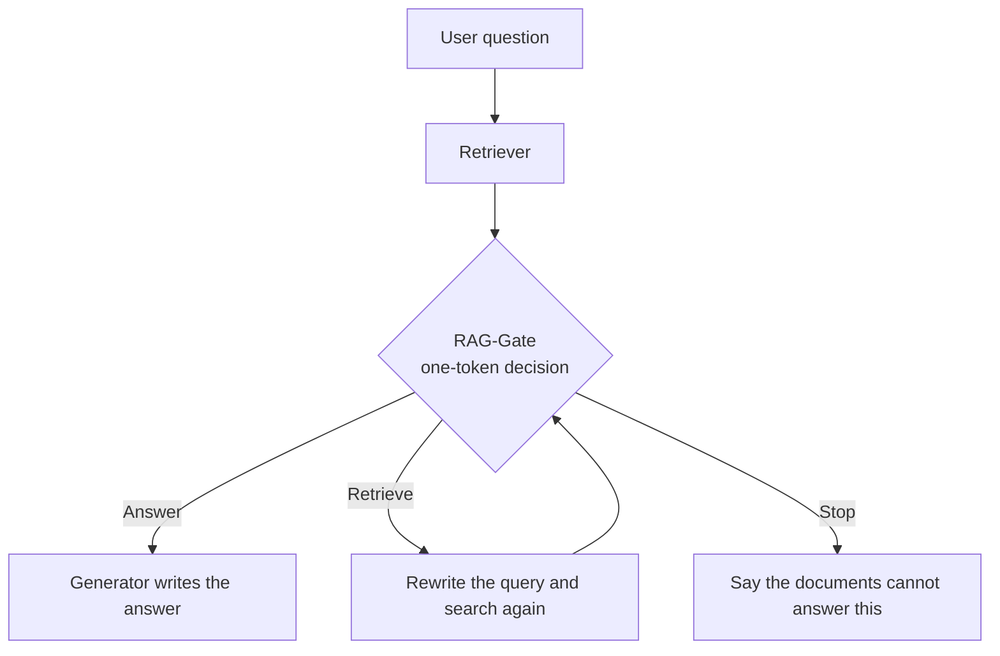

If you run a RAG service over internal documents, here is the short version. Put a small model in front of your generator whose only job is to ask "can we answer from these documents?", and you can cut unsupported answers and needless refusals at the same time.

ThakiCloud has released a model that does exactly that, RAG-Gate, in three sizes (4B, 8B, 9B). The decision is a single token. **Answer** if the evidence is complete, **Retrieve** if it is not but more retrieval is possible, **Stop** if it is not and retrieval is not possible.

*The checkpoint between finishing retrieval and starting to write.*

## Why read this

A RAG chatbot fails in two broad ways. It makes up content that is not in the documents, or it backs off with "I can't confirm that" when the answer is right there. The first costs trust; the second costs usefulness.

The usual fix is one line in the generator prompt: "do not answer without evidence." We gave the same-size base models exactly that instruction and measured them. Each had a very different habit. The 4B model refused more than eight in ten questions even when the evidence was sufficient. The 9B model went the other way and answered roughly one in three questions whose evidence was insufficient. One prompt line fixed neither habit.

This post covers what changed once the decision was trained separately, and how far you should trust it. It is most useful if you own RAG quality metrics, or plan to put agents on top of internal search.

<!-- nlm-visual -->

*Infographic generated by NotebookLM from the sources.*

## Plain terms

Picture a cook who takes an order and opens the fridge. If every ingredient is there, cooking starts. If a few are missing and the store is still open, someone goes shopping. If something is missing and the store is closed, the customer hears that the dish is not available today.

RAG-Gate is the kitchen assistant who only checks the fridge. It does not cook, that is, it does not write the answer. It checks whether every ingredient is really there, and whether a look-alike has been mistaken for the real thing. Only then does the head chef, your generator, avoid serving the wrong dish.

## What the model does

There are three inputs: the user's question, the passages the retriever returned, and whether more retrieval is possible right now (`Retrieval available: YES/NO`). The output is one token after `Final action:`; you read the probabilities of the three label tokens directly. No text is generated, so a decision costs about as much as reading the prompt once.

The criterion is built into the training data. It is Answer only when the facts the answer needs connect without a gap inside the passages. The model must not fill gaps with what it already knows. The same criterion is spelled out in the prompt you send, so what the model judges against is visible.

## Three models, three habits fixed

We evaluated on 14,818 held-out test items (2,256 distinct multi-hop questions). The comparison is the same-size base model given the identical prompt.

*Grey hatched bars are the base models, blue bars are RAG-Gate. Lower is better in the middle and right panels.*

| Size | Decision accuracy (before → after) | Unsupported answers | Over-refusal |
|---|---|---|---|
| 4B | 46.7% → **95.0%** | 2.4% → 3.7% | 84.9% → **7.0%** |
| 8B | 52.9% → **94.9%** | 10.3% → **4.7%** | 60.6% → **5.7%** |
| 9B | 68.6% → **95.5%** | 31.6% → **3.3%** | 15.5% → **6.2%** |

The three started in different places. The 4B and 8B models backed off almost everywhere; the 9B model answered even without evidence. After training all three landed close together: about 95% accuracy, 3-5% unsupported answers, 6-7% over-refusal. Put simply, regardless of size they learned the same habit of answering when they should and stepping back when they should not.

One thing we will not hide. For 4B, unsupported answers rose slightly, from 2.4% to 3.7%. The base model barely answered at all, so it rarely answered without support either; once it started answering, that rate went up a little. For 8B and 9B it went down.

## It does not fall for edit marks

A decision model has an easy shortcut available: refuse whenever the documents look tampered with. A model that learns this can score well on a benchmark and still be useless on real documents, because internal documents are edited all the time.

So the test set contains a deliberate trap. One distractor passage is edited, but the evidence the answer needs is intact. The right action is Answer. The 4B base model got 19.4% of these right; RAG-Gate-4B got 94.1%. 8B went from 46.9% to 96.2%, and 9B from 91.4% to 94.9%.

The opposite trap exists too: documents that look fine, but one link in the chain has been contradicted. The 9B base model caught 17.2% of these; RAG-Gate-9B caught 94.1%. That is a sign the decision now follows whether the support chain holds, not how the documents look.

We checked this on a test built entirely separately from training. [ChainCheck](https://huggingface.co/datasets/ThakiCloud/ChainCheck) builds each question three ways (untouched, chain kept but a name swapped, chain broken) and measures whether a model reacts to the chain more than to the edit. Its score Σ is positive when the chain matters more. All three models had Σ above zero on both real-entity and fictional-entity items, with the lower end of the confidence interval above zero as well. The 9B base model was negative on both.

## Five gates, fixed before training

Whether to release was decided by five conditions set before training began. Missing any one meant no release, only a written record of the result.

| Gate | Condition | All three models |
|---|---|---|
| G1 | Accuracy gain over the base model, CI lower bound above zero | Pass |
| G2′ | Unsupported answers at most 10%, and over-refusal reduced | Pass |
| G3 | At least 80% accuracy on edited-but-sufficient items | Pass |
| G4 | ChainCheck Σ above zero on both item sets | Pass |
| G5 | Released files re-downloaded, 200 items re-scored, at least 98% decision agreement | Pass (100% agreement) |

G2 was originally "fewer unsupported answers than the base model." In the smoke test before full training, the 4B base model refused nearly everything. Under that criterion a model that always refuses would win. So before seeing any full result we changed G2 to its current form and recorded why and when. The G5 pass mark was also fixed before G5 ran.

G5 checks the files users actually download. Merging the training result into a single set of weights rounds the numbers very slightly, so we pulled the merged files back from storage and re-scored the same items. Across 200 items, not one decision changed for any of the three models.

## How to use it in an enterprise stack

The simplest place is between retrieval and generation in an existing RAG pipeline. Call the generator only on Answer, and unsupported answers are filtered before they reach a user. Generator calls drop too: with a 4B gate in front of a large generator, questions that cannot be answered never reach the large model.

The second place is the retrieval loop of an agent. On Retrieve, rewrite the query and search again; if several rounds never reach Answer, end with Stop. How many times to search becomes the gate's call instead of a fixed number. It fits environments like Paxis, the work-automation platform ThakiCloud builds, where agents dig through internal documents to get work done.

The third is operations data. Keep the decision probabilities and you accumulate a record of which questions lacked documentation. Topics where Stop and Retrieve cluster are where your documents need filling in.

Choose the threshold to fit the service. Where an unsupported answer is costly, as with finance or legal documents, answer only when `p(Answer)` is high instead of taking the argmax. Refusals will rise accordingly, so set the line on your own validation data.

For serving, a one-token decision helps. With output length fixed at 1, latency and cost are set almost entirely by input length. On an inference platform such as ThakiCloud's Metis, cap output at one token. Note that what we measured is the transformers bf16 path. If you move to an engine such as vLLM, re-score a few items with the same prompt first and confirm the decisions match.

## What not to trust

Training and test data both come from English Wikipedia multi-hop questions (MuSiQue). Korean documents, internal policies, tables and code have not been measured. Test questions do not overlap with training questions but were built the same way; ChainCheck is the only fully out-of-distribution check.

The model judges whether evidence is sufficient, not whether it is true. A passage that is wrong but internally consistent is judged sufficient. Inputs over 2,048 tokens were not evaluated. The 4B and 9B base models also read images, but RAG-Gate handles text only.

Finally, 95% accuracy means one wrong call in twenty. Each model card deliberately includes an example of an error. We recommend using the gate alongside a check on the generator's answer and citations, not as the last line of defence.

## What we released

All three models are released under Apache-2.0. Usage code, full per-size metrics with confidence intervals, and the results of all five gates are on each model card.

- [ThakiCloud/RAG-Gate-4B](https://huggingface.co/ThakiCloud/RAG-Gate-4B)
- [ThakiCloud/RAG-Gate-8B](https://huggingface.co/ThakiCloud/RAG-Gate-8B)
- [ThakiCloud/RAG-Gate-9B](https://huggingface.co/ThakiCloud/RAG-Gate-9B)

We trained a 27B model the same way and did not release it. Accuracy rose from 78.9% to 94.8%, but ChainCheck Σ on real-entity items fell from 0.24 to -0.04, so it failed G4. The base 27B model already tracked the support chain well, and training erased that. We do not change gates after seeing results, so this stays a recorded result. We then pre-registered a separate capability-preserving retrain and ran three recipes. The recipe that reduced the update and added a loss anchoring the base model's judgment kept chain sensitivity throughout, but decision accuracy stayed near 82%; the recipe that only reduced the update reached 88% accuracy while losing chain sensitivity again. No checkpoint met both conditions, so 27B is not released and that line is closed. On the larger model, the change that teaches the gate and the change that erases chain sensitivity moved together. The training data is not distributed.

*Measurement note: all numbers were measured by us with bf16 weights on ThakiCloud GPUs (H200, H100) and copied from measurement records written before release.*
