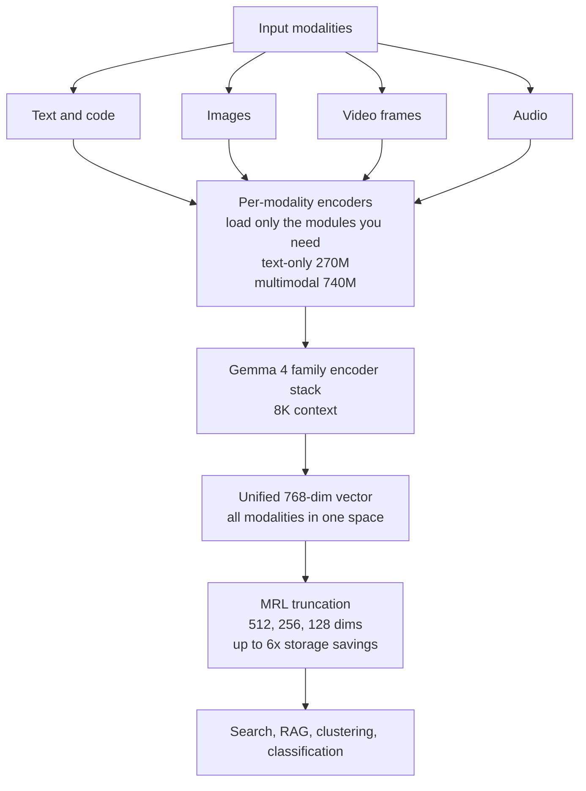

## Why Read This

If you design the search or RAG layer of a multimodal product, or your team has to push an embedding model down to on-device or edge environments, read this model card. The conclusion is one line. **EmbeddingGemma 2, released by Google DeepMind on 2026-10-06 under Apache 2.0, is a 740M multimodal open-weight model that maps text, code, images, video frames, and audio into a single 768-dimensional embedding space, replacing the "caption first, then embed the text" two-stage pipeline with one model call.** The caveats: every published benchmark is Google's own measurement, and the 8K context still leaves chunking as a hard requirement for long documents.

## Overview

On 2026-10-06, a "Google launched EmbeddingGemma 2" tweet set off the usual wave. The primary sources are the official Google announcements, published the same day: the [Google blog post](https://blog.google/innovation-and-ai/technology/developers-tools/embeddinggemma-2/), the [developer guide](https://developers.googleblog.com/embeddinggemma-2-the-developer-guide/), and the [model card docs](https://ai.google.dev/gemma/docs/embeddinggemma/model_card_2), plus the [google/embeddinggemma-2](https://huggingface.co/google/embeddinggemma-2) repository on Hugging Face.

The facts that matter for positioning:

- A 740M-parameter multimodal version and a text/code-only 270M module belong to the same family.
- Every modality maps into one shared 768-dimensional vector space. Cross-modal retrieval, a text query finding an image and an image finding text, is the design premise.
- Apache 2.0 license, no commercial use restrictions.
- Gemma 4 family architecture with an 8K token context.

Community uptake was immediate. The [Ollama library](https://ollama.com/library/embeddinggemma-2) picked it up on release day, and another tweet summarized it as "runs locally with just 0.5GB". In one year, Google moved its on-device embedding line from a text-only first generation to a multimodal second one.

## What Is This Model

The core is the "shared embedding space" design. Conventional multimodal RAG preprocesses each media type into text (image captioning, audio transcription) and hands it to a text embedding model, a two-stage structure that needs both a captioning model and an embedding model, and where anything lost in preprocessing never comes back in retrieval. EmbeddingGemma 2 puts per-modality encoders inside one model so that the output is already a vector in the same space.

Structurally, it is a Gemma 4 family encoder stack with per-modality input paths on top. The full multimodal version is 740M, and environments that only need text and code can load the 270M module. Because the family shares the 768-dimensional space, you can embed your text corpus with the 270M module and later embed images with the 740M, and the two vectors remain comparable in the same space.

Output vectors use Matryoshka Representation Learning (MRL): they can be truncated from 768 down to 512, 256, or 128 dimensions. The structure preserves the similarity ranking of the full vector after truncation, so Google's claim is that storage drops by up to six times while retrieval quality is largely retained.



The license is Apache 2.0. Unlike Gemma models that ship under the separate Gemma Terms of Use consent license, EmbeddingGemma 2 sits on a standard license with low restrictions for commercial use, internal deployment, and derivation, which makes the on-prem adoption decision one step easier.

## Benchmarks

The published numbers are Google's own measurements. The announcement says it leads the sub-1B multimodal embedder class on MTEB-family text benchmarks and MAEB for audio; the confirmed details:

| Benchmark | Score | Notes |
|---|---|---|
| MTEB Code | 78.68 | +9.92 over the previous generation (68.76) |
| MTEB Multilingual v2 | 61.36 | Multilingual text embedding |
| MAEB (audio) | sub-1B class leader | Google's claim; detailed score not published |

The row to read is MTEB Code. A 9.92-point gain over the previous generation means that for developer workloads like code snippet search and similar-implementation lookup, the second generation is materially faster at finding the right chunk. The 8K context limit makes embedding a whole long function or file in one vector difficult, but chunk-level code search is the primary use case.

MTEB Multilingual v2 at 61.36, on the other hand, sits at or below the middle when compared with frontier cloud API text embedders. Do not read "all your embeddings in this one model". The precise positioning is "strongest under the conditions of small, on-device, multimodal-unified".

## Serving and On-Device

Ollama is the fastest path. It was registered in the library on release day, and pulling the 740M version under the 740m-bf16 tag is enough.

```bash
ollama pull embeddinggemma-2
curl http://localhost:11434/api/embed \
  -d '{
    "model": "embeddinggemma-2",
    "input": ["how to search with pgvector in Python"]
  }'
```

The response is an array of 768-dimensional vectors, with batch input and dimension truncation options supported. The Python SDK is a single line: `client.embed(model="embeddinggemma-2", input=[...])`.

The memory numbers are the body of this model. Per Google's release, active RAM when quantized is about 191MB for the text-only module and about 567MB for the full multimodal version, and a demo running the multimodal version on a Pixel 11 Pro was published. "Active RAM" means the total requirement including OS and runtime is higher, but it is a line that puts an embedding service on sub-1GB-class edge devices or low-spec nodes.

In server environments, vLLM-family serving is discussed, but note that the official first-class paths are Ollama and the Google AI developer guide (single process, no torchrun). The 740M model does not occupy even a fraction of a GPU, so co-residing it with an inference endpoint on the same GPU is the realistic placement.

## ThakiCloud Product Implications

ThakiCloud's ai-platform is K8s-based AI/ML infrastructure, and on-prem and sovereign requirement coverage is its core position. Three reasons EmbeddingGemma 2 fits that position.

First, the Apache 2.0 plus 567MB combination meets the minimum bar for on-prem multimodal search. In environments where customer documents (text, tables, screenshots, recordings) must not leave to an external API, lifting multimodal embedding onto a local machine removes the data exfiltration problem. It is the model that makes "sovereign multimodal RAG" a standing offer on the Aegis (on-prem deployment) line.

Second, operating cost savings on the two-stage pipeline. Previously this required two inferences and two model operations: a captioning or transcription model (large LLM calls) plus a text embedding model. Cutting to one model reduces call counts, the model catalog, and pipeline code alike. Metis then serves a single embedding endpoint, and the search layer's total cost of ownership drops directly.

Third, agent memory extension from the Paxis perspective. Paxis is a structure where knowledge and retrieval attach to agent workflows. Once the embedding space opens beyond text into images and audio, cross-modal search like "find the related screen capture from a meeting recording" or "find the spec document from a product photo" becomes a first-class agent tool. An agent that can search all media with one vector is what this unified space design enables.

## Limitations and Counterarguments

Benchmark credibility is the first thing to pin down before an adoption decision. Both MTEB Code 78.68 and Multilingual v2 61.36 are Google's own measurements, with no independent re-measurement. Multilingual v2 61.36, even if it is "the strongest in the sub-1B class", is not on par with cloud frontier embedders. Real-use quality for East Asian languages such as Korean and Japanese needs direct re-validation on our own corpus.

The 8K context is a limit too. It is not enough to express a long contract or a paper in one vector, and chunking strategy remains mandatory. The benefit of multimodal unification is largest in cross-modal search, but for text-only uses the 270M module is often sufficient, so there is no reason to reach for the 740M full version unconditionally. For text-only workloads, starting with the 270M module is the sensible placement.

Video input being frame-level also needs noting. "Embedding a video" does not mean summarizing the whole video into one vector; it means vectorizing selected frames. Temporal grounding, knowing which moment it was, is still the responsibility of metadata or preprocessing.

Finally, the "on-device" numbers are quantized active RAM. 567MB does not mean the device's total memory requirement is 567MB; after subtracting runtime and OS, real deployments need more headroom than that.

## Wrap-Up

The first official option to cut multimodal search down from a two-stage pipeline to a single model has arrived. With the number combination of 740M, a unified 768-dimensional space, Apache 2.0, and roughly 567MB of active RAM when quantized, EmbeddingGemma 2 can touch both the cost and data sovereignty problems of on-prem and sovereign multimodal RAG at once.

Three next steps are worth doing. Run a local smoke with Ollama and confirm cross-modal retrieval (text query retrieving images) actually holds. Measure latency and call cost against the existing caption-plus-embed two-stage pipeline. And run a Metis endpoint smoke to check serving-layer fit. Until the numbers are re-validated on our own corpus, treat this model as a "pilot", not an "adoption".

## Sources

- Google official blog: https://blog.google/innovation-and-ai/technology/developers-tools/embeddinggemma-2/
- Developer guide: https://developers.googleblog.com/embeddinggemma-2-the-developer-guide/
- Model card docs: https://ai.google.dev/gemma/docs/embeddinggemma/model_card_2
- Hugging Face model: https://huggingface.co/google/embeddinggemma-2
- Ollama library: https://ollama.com/library/embeddinggemma-2
- MarkTechPost coverage (2026-10-06): https://www.marktechpost.com/2026-10-06/google-deepmind-releases-embeddinggemma-2-a-740m-open-multimodal-embedding-model-built-on-gemma-4/
- Related tweet (2026-10-06): https://x.com/hjguyhan/status/2107691031076782210
