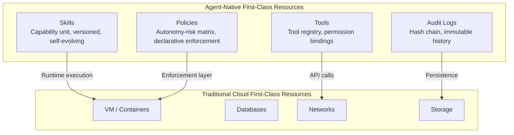

## Overview

Cloud computing has, until now, focused on a single question: "How do we abstract the environment in which applications run?" The progression from physical servers to virtual machines (VMs), from VMs to containers, and from containers to serverless has been a process of ever-finer refinement of that answer.

Yet we now face a different kind of question: "How do we abstract the environment in which AI agents -- agents that reason and act autonomously -- run?" This question demands something that existing cloud abstraction frameworks were never designed to provide.

This article examines that gap and explores the principles of infrastructure abstraction required for the agent era. This is a story about a paradigm, not a product pitch.

## The Evolution of Cloud Abstraction

The history of cloud infrastructure is a history of building up abstraction layers.

**Generation 1: Physical server rental.** The colocation datacenter model, where operators rented rack space. Operators were responsible for everything from OS installation to network configuration. The cost of change was very high, and responding flexibly to shifts in demand was difficult.

**Generation 2: Virtual machines (VMs).** The model exemplified by AWS EC2 and GCP Compute Engine. Physical servers were partitioned into logical units, and operators could provision compute resources -- CPU, memory, storage -- through an API. Abstraction dramatically improved infrastructure elasticity.

**Generation 3: Containers and orchestration.** The world defined by Docker and Kubernetes. Packaging the execution environment itself as an image and deploying workloads via declarative specifications became the norm. Concepts like immutable infrastructure, GitOps, and service meshes flourished in this generation.

**Generation 4 (current transition): Serverless and functions.** The model represented by AWS Lambda and Google Cloud Functions. Operators no longer need to manage servers at all. They pay only for execution costs, in function-sized units that respond to events.

All of these generations share one thing in common: the managed entity has always been the **execution environment**. Whether VMs, containers, or functions, cloud has focused on providing "a space in which something runs."

Autonomous AI agents break out of this frame.

## The Four Hard Problems of Agent Operations

Teams that have deployed autonomous AI agents in production environments consistently encounter a shared set of challenges.

### Hard Problem 1: Model Selection and Cost Control

An agent does not complete its work with a single LLM call. To solve complex goals, it goes through multiple stages: Planning, Execution, and Synthesis.

The problem is that each stage demands different model capabilities. Planning requires broad context and complex reasoning; a simple retrieval step does not. Yet with existing approaches, it is difficult to control this granularly. Developers must either specify a model for each stage manually, or process everything with a single powerful (and expensive) model.

The former increases code complexity; the latter leads to cost explosion. [estimate] It is not uncommon for model costs to account for more than 60% of total infrastructure costs in large-scale agent operations organizations.

### Hard Problem 2: Skill Management and Proliferation

Let us call the set of tools and capabilities an agent uses "skills" for convenience. As the agent ecosystem grows, skills proliferate rapidly. Multiple skills with similar functionality emerge, some of which go unmaintained. It becomes difficult to determine which skill is best suited to which situation.

Just as AMI image sprawl occurs when VM images are not managed systematically, skill sprawl occurs in agent ecosystems. Yet existing cloud infrastructure provides no abstraction to address this.

### Hard Problem 3: Balancing Governance and Autonomy

Autonomous AI agents confront a fundamental question: "How much should they judge and act on their own?" Too much restriction eliminates the agent's value; too little causes unexpected behavior.

Controlling this at the operations layer requires a policy engine. It must declaratively define and enforce which tools are permitted, which data can be accessed, and which actions require human approval.

Traditional cloud IAM and security groups handle "who can call which API." But agent governance must address the context-dependent question: "Can this agent make this judgment in this situation?" This demands a qualitatively different abstraction.

Practically, consider this scenario: when an agent with access to a customer database attempts a large-scale query at an unusual hour, should it be allowed simply because it has API permission? Contextual authorization was an area that traditional IAM models placed deliberately out of scope.

### Hard Problem 4: Continuous Learning and Skill Evolution

Agents are not static software. As they operate, data accumulates about which strategies are effective and which skills frequently fail. A feedback loop is needed to improve agents and skills based on this data.

Just as container images are updated through deployment pipelines, an agent's capabilities must be updated systematically. Yet existing cloud infrastructure does not treat this "evolution of capability" as a first-class citizen.

This challenge is particularly pronounced in enterprise environments. In an agent system used by hundreds of team members, understanding which skill has degraded since last month, and in which scenarios new skills are needed, requires enormous operational overhead. Without automation, agent systems tend to degrade gradually in quality after initial deployment.

## Skills, Tools, Policies, and Audit Logs as First-Class Resources

All four of these hard problems point to the same root cause: the things that existing cloud treats as first-class resources -- VMs, containers, functions, storage, networks -- are not the things that matter most for agent operations.

An agent-native cloud must treat the following four as first-class resources.

**Skills are the unit of capability.** They must be more than simple prompt bundles -- they must be manageable objects with versions, evaluation metrics, and the ability to be compared and merged. Decisions about which skills to retain and which to deprecate must be made based on metrics such as usage frequency, success rate, and cost efficiency.

**Tools are a tool registry.** They represent the list of external interfaces an agent can invoke, with access permissions bound to each tool. It must be possible to centrally manage which agent can invoke which tool.

**Policies are the language of governance.** Policies are expressed as a matrix crossing an agent's level of autonomy against the scope of acceptable risk. Declarative policies must be enforced at runtime, and workflows must be automatically triggered when human approval is required.

**Audit Logs are the foundation of trust.** The history of judgments made and actions taken by an agent must be recorded in a tamper-proof manner. This is, before being a matter of regulatory compliance, a design principle that makes agent systems trustworthy.

Treating these four resources as first-class citizens means more than simply being able to store and retrieve them. It means full lifecycle management: provisioning them like compute resources, versioning, controlling access through policies, tracking costs, and rolling back on failure. Just as Kubernetes handles containers through "Deployment" and "ReplicaSet" abstractions, an agent-native platform must handle skills through "SkillRelease" and "SkillPolicy" abstractions.

## ThakiCloud's Implementation: Paxis and AI Platform Integration

ThakiCloud is developing **Paxis** as the platform that concretizes these design principles. Under the concept of "AWS for Agents," the goal is to treat Skills, Tools, Policies, and Audit Logs as first-class resources -- in the same way that traditional cloud treats VMs, DBs, and Networks.

**The LLM and skill router** automatically selects the right model for each stage of agent execution (Planning, Execution, Synthesis). It supports more than 10 providers including Claude, GPT, Gemini, Kimi, Ollama, and ThakiCloud's own model Metis, and reduces unnecessary high-cost model calls through cost-aware routing. Skill selection is a two-stage process: it first narrows down the domain candidate set, then selects the optimal skill based on 7 criteria including suitability, cost, and reliability.

**The Curator self-evolving daemon** continuously manages the skill ecosystem. It detects and merges similar skills, automatically patches skills with degraded performance, and discovers new skills based on operational data. Through memory distillation, insights from repeated execution are accumulated into a knowledge base.

**The security and governance layer** provides a policy matrix crossing 4 levels of autonomy with 7 levels of risk. Prompt protection for 11 input types and 2 output types is applied, along with masking for 16 categories of personal information. Sandbox execution environments based on Docker and Kata containers isolate agents, and hash-chain audit logs covering more than 20 event types are retained for 90 days.

**The multi-channel inbound layer** enables interaction with agents through a Web React SPA, Slack (supporting 48 commands), and a CLI. A dynamic scheduler that defines custom tasks in natural language is also included. Instructions like "collect and summarize competitor news every morning" are registered directly by the agent as its own schedule.

**The Hybrid Knowledge Engine (HKE)** combines team-specific wiki-based RAG with a knowledge graph. Each agent references a knowledge base specialized to its domain, continuously enriching it through execution experience.

Paxis operates in conjunction with the **AI Platform (ai-suite)**. It is a three-layer architecture where the AI Platform handles central LLM policy and cost control, Paxis provides the agent runtime, and Metis handles the inference layer. The way each layer has clear responsibilities and combines is similar to the separation of control plane and data plane in traditional cloud.

The stack is built with Go 1.26 (backend) and React 19 (frontend), using PostgreSQL, Redis, and MinIO as the storage layer in production environments.

## Limitations and Outlook

The concept of agent-native cloud itself is not yet mature. Several fundamental difficulties deserve honest examination.

**The problem of measuring skill quality.** The reliability of container images can be assessed through relatively established methods such as vulnerability scanning and signature verification. In contrast, the quality of a skill depends deeply on the execution context. "Is this skill appropriate for this situation?" is difficult to fully evaluate in advance through automated means. Current evaluation metrics (success rate, cost efficiency) are proxy metrics only -- they do not measure true effectiveness.

**The illusion of policy completeness.** Declarative policies are enforced for stated situations, but the variety of situations an agent encounters exceeds the imagination of policy designers. Care is needed to ensure that policies do not create the false impression that "governance has been solved." Policies are a safety net, not a guarantee.

**The complexity of multi-agent coordination.** Handling a single agent and handling a system in which multiple agents collaborate are qualitatively different problems. Trust models between agents, conflict resolution mechanisms, and accountability attribution are areas that have not yet been sufficiently resolved at the infrastructure layer.

**The absence of industry standards.** For VMs, image standards like OVF/OCI and compatible API patterns between cloud providers exist. Standards for describing agent skills and policies are still being formed. There are movements trying to standardize tool interfaces, like MCP (Model Context Protocol), but broader ecosystem consensus will take time.

The direction, nonetheless, is clear. As agents establish themselves as part of software systems, the level of abstraction in the infrastructure that operates them must rise as well. Just as we moved from an era of directly managing physical servers to an era of calling VM APIs, an era is approaching where "an agent's capabilities and scope of action are defined via API, and the platform enforces them."

Paxis's journey, with a skill marketplace [estimate] on the roadmap for Q4 2026 and SOC2 certification and air-gap deployment [estimate] for Q2 2027 and beyond, is part of that flow. As the platform matures, developers will be able to focus on designing agent capabilities, while the infrastructure handles execution safety and cost optimization.

Agent-native cloud is not yet a complete concept. But what problems in the next generation of software operations need to be solved at the infrastructure layer is, at this moment, taking shape as design principles.
