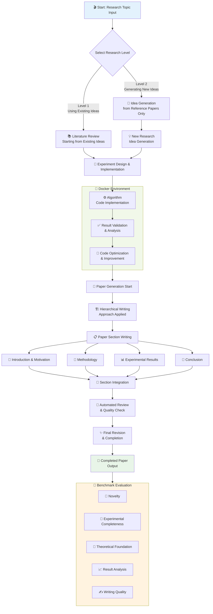

⏱️ **Estimated reading time**: 12 min

## Introduction

The paradigm of scientific research is undergoing a fundamental shift. **AI-Researcher**, developed by the Hong Kong University Data Science (HKUDS) research team, goes beyond a simple research tool to realize a **fully autonomous scientific research system**. Published as [arXiv:2505.18705](https://arxiv.org/abs/2505.18705), this system allows AI to independently carry out the entire process from literature review to paper publication.

This analysis provides a comprehensive look at the technical architecture, core innovations, and applicability of AI-Researcher across diverse research environments.

## AI-Researcher Project Overview

### 📄 Paper and Core Value

**"AI-Researcher: Autonomous Scientific Innovation"** combines the reasoning capabilities of large language models (LLMs) with a complex task-automation agent framework to accelerate scientific discovery.

**🔬 Core Innovation Points:**

1. **Full autonomy**: AI independently handles the entire process, from research idea generation to paper publication.
2. **Overcoming human cognitive limits**: Systematic exploration of solution spaces that are difficult for human researchers to navigate.
3. **Multi-agent collaboration**: Specialized AI agents work together to handle complex research tasks.
4. **Objective evaluation system**: Expert-level quality assessment across four major domains.

### 🏗️ GitHub Repository Status

The [GitHub repository](https://github.com/HKUDS/AI-Researcher) has earned **over 2,000 stars** and established itself as an active open-source project:

- **Multi-LLM support**: Integration with Claude, OpenAI, DeepSeek, and other language models.
- **Minimal domain expertise required**: Effective research can be conducted even without deep domain knowledge.
- **Ready to use**: Designed for immediate use without complex configuration.
- **Fully open-source**: Everything from benchmark construction methodology to the full system is publicly available.

## System Architecture Analysis

### 🎨 Overall System Structure


<!--
  animated-architecture-diagram — self-contained D3 embed template.
  HuggingFace research-article style: declarative NODES/EDGES/SEQ model,
  data(solid)/event(dashed) edges, hover-trace + tooltip, flow-dot animation
  along edge paths, replay button, scroll-into-view autoplay, reduced-motion +
  light/dark aware. The renderer injects window.__ARCH_SPEC__ at the marker.
  Format (D3 machinery + CSS) is owned by this committed template; the model
  only authors the JSON spec (content). See references/spec-schema.md.
-->



AI-Researcher consists of three core components:

1. **Research Agent**: Handles every stage of the research process.
2. **Paper Agent**: Converts research findings into academic papers.
3. **Benchmark Suite**: A multidimensional quality evaluation system.

### 🔄 Detailed Execution Flow

```mermaid
flowchart TD
    START["🎬 Start: Research Topic Input"] --> LEVEL{"Select Research Level"}
    
    LEVEL -->|Level 1<br/>Using Existing Ideas| L1_SURVEY["📚 Literature Review<br/>Starting from Existing Ideas"]
    LEVEL -->|Level 2<br/>Generating New Ideas| L2_PAPERS["📄 Idea Generation<br/>from Reference Papers Only"]
    
    L1_SURVEY --> EXPERIMENT["🧪 Experiment Design & Implementation"]
    L2_PAPERS --> IDEA_GEN["💡 New Research<br/>Idea Generation"]
    IDEA_GEN --> EXPERIMENT
    
    EXPERIMENT --> CODE_IMPL["⚙️ Algorithm<br/>Code Implementation"]
    CODE_IMPL --> VALIDATION["✅ Result Validation<br/>& Analysis"]
    VALIDATION --> REFINEMENT["🔧 Code Optimization<br/>& Improvement"]
    
    REFINEMENT --> PAPER_GEN["📝 Paper Generation Start"]
    PAPER_GEN --> HIERARCHICAL["🏗️ Hierarchical Writing<br/>Approach Applied"]
    
    HIERARCHICAL --> SECTIONS["📋 Paper Section Writing"]
    SECTIONS --> INTRO["🎯 Introduction & Motivation"]
    SECTIONS --> METHODS["🔬 Methodology"]
    SECTIONS --> RESULTS["📊 Experimental Results"]
    SECTIONS --> CONCLUSION["🎉 Conclusion"]
    
    INTRO --> INTEGRATE["🔗 Section Integration"]
    METHODS --> INTEGRATE
    RESULTS --> INTEGRATE
    CONCLUSION --> INTEGRATE
    
    INTEGRATE --> REVIEW["👀 Automated Review<br/>& Quality Check"]
    REVIEW --> POLISH["✨ Final Revision<br/>& Completion"]
    
    POLISH --> FINAL["🎊 Completed Paper<br/>Output"]
    
    subgraph DOCKER["🐳 Docker Environment"]
        CODE_IMPL
        VALIDATION
        REFINEMENT
    end
    
    subgraph BENCHMARK["📏 Benchmark Evaluation"]
        NOVELTY["🌟 Novelty"]
        EXPERIMENTAL["🔬 Experimental Completeness"]
        THEORETICAL["📖 Theoretical Foundation"]
        ANALYSIS["📈 Result Analysis"]
        WRITING["✍️ Writing Quality"]
    end
    
    FINAL --> BENCHMARK
    
    style START fill:#e3f2fd
    style DOCKER fill:#f1f8e9
    style BENCHMARK fill:#fff3e0
    style FINAL fill:#e8f5e8
```

The system supports two research levels:

- **Level 1**: In-depth research and experimentation building on existing research ideas.
- **Level 2**: Full cycle from new idea generation to experimentation, using reference papers only.

## Technology Stack and Tool Ecosystem

### 🛠️ Integrated Technology Architecture

```mermaid
graph LR
    subgraph AI_MODELS["🤖 AI Model Layer"]
        CLAUDE["🎭 Claude 3.5<br/>Sonnet/Haiku"]
        OPENAI["🧠 OpenAI<br/>GPT Models"]
        DEEPSEEK["🔍 DeepSeek<br/>Models"]
        OTHERS["⚡ Other LLM<br/>Providers"]
    end
    
    subgraph CORE_SYSTEM["🎯 Core System"]
        MAIN["🚀 main_ai_researcher.py<br/>(Main Orchestrator)"]
        GLOBAL["🌐 global_state.py<br/>(Global State Management)"]
        WEB["🌍 web_ai_researcher.py<br/>(Web Interface)"]
    end
    
    subgraph AGENTS["🤝 Agent System"]
        RA["📚 Research Agent<br/>(Research Execution)"]
        PA["✍️ Paper Agent<br/>(Paper Writing)"]
        EA["📊 Evaluator Agent<br/>(Evaluation)"]
    end
    
    subgraph EXECUTION["⚙️ Execution Environment"]
        DOCKER["🐳 Docker<br/>Container"]
        SCRIPTS["📜 Shell Scripts<br/>(run_infer_*.sh)"]
        PYTHON["🐍 Python<br/>Environment"]
        GPU["💾 GPU Support<br/>(CUDA)"]
    end
    
    subgraph BENCHMARK["📏 Benchmark System"]
        EVAL_DATA["📊 Evaluation<br/>Datasets"]
        METRICS["📈 Performance<br/>Metrics"]
        DOMAINS["🎯 Multi-Domain<br/>Testing"]
        GROUND_TRUTH["✅ Expert<br/>Ground Truth"]
    end
    
    subgraph OUTPUT["📤 Outputs"]
        PAPERS["📄 Academic<br/>Papers"]
        CODE["💻 Research<br/>Code"]
        RESULTS["📊 Experimental<br/>Results"]
        REPORTS["📝 Analysis<br/>Reports"]
    end
    
    AI_MODELS --> CORE_SYSTEM
    CORE_SYSTEM --> AGENTS
    AGENTS --> EXECUTION
    EXECUTION --> BENCHMARK
    BENCHMARK --> OUTPUT
    
    RA --> |"Literature Review<br/>Experiment Design"| EXECUTION
    PA --> |"Paper Writing<br/>Structuring"| EXECUTION
    EA --> |"Quality Evaluation<br/>Validation"| BENCHMARK
    
    style AI_MODELS fill:#e3f2fd
    style CORE_SYSTEM fill:#f3e5f5
    style AGENTS fill:#e8f5e8
    style EXECUTION fill:#fff3e0
    style BENCHMARK fill:#ffebee
    style OUTPUT fill:#f1f8e9
```

## Core Innovations

### 1. 🎯 Fully Automated Research Pipeline

**Overcoming the limits of traditional research processes:**

- **Removing human cognitive bias**: AI determines research direction based on objective data.
- **24/7 research execution**: Continuous research without time constraints.
- **Large-scale literature processing**: Simultaneous analysis of vast bodies of literature that would be impractical for a human researcher.

### 2. 🤝 Intelligent Agent Collaboration

**Role division among specialized agents:**

- **Research Agent**: Handles literature review, gap analysis, and hypothesis validation.
- **Paper Agent**: Produces publication-quality papers using a hierarchical writing approach.
- **Evaluator Agent**: Performs multidimensional quality assessment (novelty, experimental completeness, theoretical grounding, and more).

### 3. 🌍 Versatility and Accessibility

**Democratizing research:**

- **Minimal expertise required**: High-quality research is achievable without deep domain specialization.
- **Multi-LLM support**: Different AI models can be selected to suit the task at hand.
- **Docker-based execution**: Consistent runtime environment ensures reproducible research.

### 4. 📊 Objective Evaluation System

**Standardized quality assessment framework:**

- **4 major domains**: Computer Vision, NLP, Data Mining, Information Retrieval.
- **Expert-level standards**: Evaluation benchmarked against papers written by human experts.
- **Multidimensional metrics**: Novelty, experimental design, theoretical background, result analysis, and writing quality.

## Benchmark and Evaluation Framework

### 📏 Comprehensive Evaluation Framework

AI-Researcher has built the following broad evaluation structure:

**Evaluation Dimensions:**

1. **🌟 Novelty**: Originality and innovation of research ideas.
2. **🔬 Experimental Comprehensiveness**: Rigor of experimental design and execution.
3. **📖 Theoretical Foundation**: Soundness of theoretical grounding.
4. **📈 Result Analysis**: Depth and accuracy of result interpretation.
5. **✍️ Writing Quality**: Clarity and structure of the paper.

**Domain Coverage:**

- **Computer Vision (CV)**: Image recognition, object detection, segmentation.
- **Natural Language Processing (NLP)**: Language models, text classification, machine translation.
- **Data Mining (DM)**: Pattern discovery, clustering, recommendation systems.
- **Information Retrieval (IR)**: Search algorithms, ranking, query optimization.

## Applicability in Research Environments

### 🔬 How Research Institutions Can Apply This

**1. Academic Research Labs**

- **Accelerating graduate research**: Automating literature review reduces time spent on foundational tasks.
- **Cross-disciplinary research**: Bridges gaps when domain expertise is limited.
- **Standardizing research quality**: Objective evaluation criteria help maintain consistent quality.

**2. Corporate R&D**

- **Technology scouting**: Analyzing large volumes of patents and papers to track technology trends.
- **Faster product development**: Automating algorithm prototyping.
- **Reducing R&D costs**: Minimizing manual effort in early-stage research.

**3. Policy and Public Research Support**

- **National R&D efficiency**: Supporting evaluation and direction-setting for research programs.
- **Researcher development**: A tool for building research skills among early-career scientists.
- **Global competitiveness**: Real-time analysis of global research trends to inform strategy.

### 🚀 Considerations for Adoption

**Technical requirements:**

- **Computing resources**: GPU clusters or cloud environments are needed.
- **Data infrastructure**: Large-scale paper databases must be available.
- **Security framework**: Research data protection and intellectual property management.

**Organizational changes:**

- **Research culture shift**: Building awareness of AI-collaborative research methods.
- **Training programs**: Educating researchers on how to use AI-Researcher effectively.
- **Revised evaluation criteria**: Establishing new standards for AI-assisted research.

## Future Outlook and Development Directions

### 🔮 Technical Evolution

**1. Multimodal Research Expansion**

- **Image-text integration**: Combined analysis of visual data and text.
- **Speech and language linkage**: Expanding research into speech-based data.
- **Sensor data utilization**: Analyzing diverse data collected from IoT environments.

**2. Real-Time Research Adaptation**

- **Dynamic literature updates**: Real-time adjustment of research direction as new papers are published.
- **Trend prediction**: Forecasting future research topics through trend analysis.
- **Collaborative networks**: Real-time collaboration platforms for researchers worldwide.

### 🌏 Societal Impact

**1. Improved Research Accessibility**

- **Bridging regional gaps**: Strengthening research capacity in areas with limited infrastructure.
- **Removing language barriers**: Expanding global research participation through multilingual support.
- **Reducing cost barriers**: Open-source foundations dramatically lower research costs.

**2. Acceleration of Scientific Progress**

- **Democratizing discovery**: Creating conditions where anyone can contribute to scientific findings.
- **Cross-disciplinary synthesis**: Automatically connecting and integrating knowledge across different fields.
- **Improved reproducibility**: Standardized experimental environments ensure research reproducibility.

## Conclusion

AI-Researcher is more than a research tool. It represents a system that **changes the paradigm of scientific research itself**. Through fully autonomous research execution, intelligent agent collaboration, and an objective evaluation framework, it raises both the efficiency and quality of research simultaneously.

Across research environments more broadly, the following positive changes are worth noting:

1. **Research productivity**: Automation of the full pipeline, from literature review to paper writing.
2. **Quality standardization**: Consistent quality through objective evaluation criteria.
3. **Improved accessibility**: Removing domain expertise barriers so more researchers can participate.
4. **Faster response to global trends**: Quicker adaptation to developments in the global research landscape.

The future that AI-Researcher points toward is a new era where humans and AI collaborate to achieve **more creative and original scientific discoveries**. Adoption and further development of this technology could bring meaningful change to research communities around the world.

## References

- [AI-Researcher GitHub Repository](https://github.com/HKUDS/AI-Researcher)
- [Paper: "AI-Researcher: Autonomous Scientific Innovation"](https://arxiv.org/abs/2505.18705)
- [Project Official Website](https://hkuds.github.io/AI-Researcher/)
- [Community Slack Channel](https://join.slack.com/t/ai-researcher/shared_invite/)
- [Discord Server](https://discord.gg/ai-researcher)
