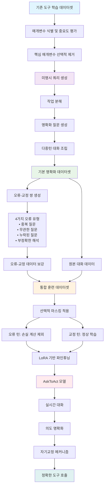

⏱️ **Estimated reading time**: 12 min

## Introduction: The Core Challenge of LLM Tool Use in Real Environments

The ability of large language models (LLMs) to interact with external tools and APIs has substantially expanded the practical applications of artificial intelligence. Frameworks for tool-augmented LLMs such as Toolformer, ToolLLaMA, and Gorilla have allowed models to move beyond plain text generation and handle complex tasks. However, current tool-learning frameworks operate under the idealized assumption that user queries are always explicit and unambiguous.

In real-world environments, users frequently submit incomplete, ambiguous, or imprecise queries. These underspecified queries pose a distinct challenge in tool-use scenarios, because API calls demand exact parameters and cannot tolerate ambiguity. When confronted with underspecified input, LLMs tend to either fabricate missing parameter values or leave them undefined, introducing potential hazards into tool calls.

## The Fundamental Limitations of Existing Approaches

Recent work has introduced conversational clarification approaches, but two fundamental limitations remain. First, these methods rely heavily on manually constructed datasets for training. Producing such datasets requires human annotators to create queries and clarifications, a process that inherently constrains scale and diversity. The resulting datasets capture only a limited range of ambiguity patterns, reducing their effectiveness across the variety of real-world queries.

Second, existing models lack robust error handling during multi-turn clarification. They are trained on datasets that include only perfect clarification sequences. In practice, models frequently re-ask for information the user has already provided, follow irrelevant threads, or overlook underspecified details. Without training for error recovery, these failures accumulate across the conversation, degrading both efficiency and tool-call quality.

## Core Innovations of the AskToAct Framework

AskToAct is a self-correcting clarification framework that addresses these limitations systematically. Its central insight is that tool parameters are natural explicit representations of user intent, and this creates an opportunity for automated data generation. The research team developed an automated pipeline that strategically removes key parameters from fully specified queries in existing datasets to produce diverse underspecified queries. Because these generated queries carry embedded ground-truth answers, they enable the construction of rich clarification dialogues that demonstrate effective intent elicitation.

To enable robust error handling during interaction, the team augmented the training data with carefully designed error-correction pairs that simulate realistic mistakes and their resolutions. The training process also employs selective masking to prevent the model from learning negative patterns while still building error-detection capability.

## Intent Clarification Dataset Construction Methodology

### Underspecified Query Generation

Dataset construction for AskToAct begins with obtaining realistic pairs of ambiguous queries and their complete intended meanings. The approach uses an innovative reverse-engineering strategy applied to existing tool-learning datasets. Each instance in those datasets includes a user query and a corresponding tool-call solution. Drawing on the key insight that tool parameters are explicit representations of user intent, the team systematically removes key parameters from fully specified queries to produce underspecified versions.

This process consists of three stages: (1) parameter identification, extracting all parameters from the tool-call solution; (2) importance evaluation, assessing each parameter's significance based on its impact on tool functionality; and (3) selective removal, strategically choosing the most important parameters to omit. This approach makes it possible to generate large volumes of high-quality training data automatically.

### Dialogue Construction Pipeline

Once underspecified queries are generated, the next step is assembling effective clarification dialogues. This involves three core components: task decomposition, clarification generation, and dialogue assembly. In the task decomposition stage, complex queries are broken into subtasks, each requiring a separate API call. In the clarification generation stage, natural and contextually appropriate clarifying questions are produced for each underspecified parameter. In the dialogue assembly stage, these components are combined into coherent multi-turn conversations.

## Core Mechanisms of the Self-Correcting Training Paradigm

### Error-Correction Data Augmentation

To simulate errors that can occur in real conversations, AskToAct uses a systematic error-correction data augmentation strategy. This covers four error types: (1) redundant questions, re-requesting information the user has already provided; (2) irrelevant questions, requesting information unrelated to the task; (3) missing questions, overlooking an important underspecified parameter; and (4) inaccurate parameter interpretation, misunderstanding the user's response.

For each error type, the team generates dialogue pairs showing how these mistakes occur in real conversations and how they can be corrected. These error-correction pairs allow the model to learn to recognize and correct its own mistakes in real time.

### Selective Masking Strategy

To prevent the model from learning negative patterns during training, AskToAct adopts a selective masking strategy. Under this approach, loss is not computed for dialogue turns containing errors; learning proceeds only on correction turns. This allows the model to learn correct behavior while retaining the ability to recognize error patterns. Crucially, masking is applied only to error tokens, while context tokens are preserved, so the model can understand the full flow of the conversation.

## Dataset Format and Example Analysis

### Basic Data Structure

The AskToAct dataset follows this structure:

**Original query example:**
```
User: "What regions are supported for a specific language? And can you check whether a given email address is valid?"
```

**After underspecified query generation:**
```
User: "What regions are supported for a language? And can you check whether an email address is valid?"
[Removed parameters: 'en' (language code), 'user@example.com' (email address)]
```

**Clarification dialogue example:**
```
AI: [Task Decomposition] This task can be decomposed into 2 steps.
Step 1: Use the regions API to check which regions are supported for the specified language.
Step 2: Use the check_email API to validate the email address.

[Parameter Evaluation] Current information:
Step 1: The "language" parameter for the regions API lacks a clear value.
Step 2: The "email" parameter for the check_email API lacks a clear value.

[Question] What is the language code for which you want to check supported regions?

User: The language code is 'en'.

AI: [Parameter Evaluation] Confirmed that the "language" parameter for the regions API is "en".
[Question] What is the email address you want to validate?

User: I want to check whether 'user@example.com' is a valid email address.

AI: [Summary] All required information has been obtained and the relevant APIs can be called.
Solution: [{'task': 'regions', 'arguments': [{'name': 'language', 'value': 'en'}]}, {'task': 'check_email', 'arguments': [{'name': 'email', 'value': 'user@example.com'}]}]
```

### Error-Correction Pair Examples

**Redundant question error and correction:**
```
[Error] AI: Could you confirm the language code once more?
User: I already told you it's 'en'.
[Correction] AI: I apologize. The language code 'en' is confirmed. Please provide the email address now.
```

**Irrelevant question error and correction:**
```
[Error] AI: What operating system are you using?
User: Why is that relevant? All I need is email validation.
[Correction] AI: You are right. The operating system was not needed. Please provide the email address you want to validate.
```

## Training Process Flow Diagram



## Comprehensive Experimental Results and Performance Analysis

### Key Performance Metrics

Performance evaluation of AskToAct proceeded along two core dimensions: intent clarification quality and tool-call accuracy. For intent clarification quality, the research team introduced the Clarification Precision Score (CPS) and the Clarification Efficiency Score (CES). CPS measures how accurately the model identifies and recovers underspecified but critical intent, while CES evaluates the efficiency of the clarification process.

For tool-call accuracy, the evaluation used Overall Solution Accuracy (OSA), Tool Selection Score (TSS), and Parameter Resolution Score (PRS). OSA measures the proportion of queries for which a fully correct tool-call solution is produced. TSS evaluates how accurately the correct API is selected for each query. PRS measures the model's ability to correctly populate the parameters required for a valid tool call.

### Substantial Performance Gains

Experimental results show that AskToAct surpasses existing methods by a large margin on all key metrics. The most notable finding is that the model can correctly recover more than 57% of critical underspecified intent, compared to the 30 to 40% range typical of prior methods. AskToAct also achieves an average 10.46% improvement in clarification efficiency over the base model, meaning it collects the necessary information in fewer conversation turns while maintaining the same level of accuracy.

In end-to-end tool-call performance, the model reaches over 81% tool selection accuracy and over 68% parameter resolution accuracy. Particularly noteworthy is that strong performance is maintained even in complex multi-tool scenarios, which is highly important in practice because users often request multiple tasks simultaneously.

### Consistent Gains Across Model Architectures

AskToAct's robustness is further confirmed by consistent performance improvements across diverse model architectures. Applying the framework to three representative base models, namely Mistral-7B-Instruct-v0.3, LLaMA3-8B-Instruct, and Qwen2.5-7B-Instruct, produced meaningful improvements in every case. One particularly interesting observation is that models with lower initial performance tend to show larger relative gains.

LLaMA3-8B-Instruct improved by 27.83% in CPS and 25.46% in PRS, while the stronger Qwen2.5-7B-Instruct still achieved meaningful gains of 5.01% in CPS and 11.18% in PRS. This indicates that AskToAct substantially elevates the capabilities of weaker models while also delivering consistent improvements in already capable ones.

### Strong Generalization to Unseen APIs

One of the most notable characteristics of AskToAct is its ability to generalize to entirely new APIs. Without any additional training, the model achieves performance comparable to GPT-4o on tasks involving APIs it has never encountered before. This has significant practical implications, since new tools and APIs appear continuously in real-world environments.

This generalization capability suggests that AskToAct has learned the fundamental patterns of intent clarification and tool use rather than simply memorizing the details of specific APIs. Given only a description and parameter information for a new tool, the model can formulate an effective clarification strategy and perform accurate tool calls.

### Computational Efficiency and Cost Effectiveness

AskToAct achieves high performance while also demonstrating computational efficiency. It delivers results comparable to GPT-4o while requiring substantially fewer computational resources, thanks to an efficient LoRA-based fine-tuning strategy and training optimization through selective masking. In real deployment environments, this efficiency translates directly into lower operational costs and reduced response times.

Experiments varying the ratio of error-correction augmentation found that a 30% augmentation rate yields the best results. At this ratio, the model achieved peak scores of 60.41% CPS and 68.71% PRS. Increasing the ratio to 40 to 50% actually degraded performance, suggesting that excessive exposure to error-correction data can either overfit the model to error patterns or cause it to over-focus on error detection.

## Robustness in Real Conversation Scenarios

### Adaptability to Diverse User Response Patterns

The practical value of AskToAct is evident in its ability to adapt effectively to diverse user response patterns. In case studies presented by the research team, the model consistently performed accurate intent identification and effective multi-turn clarification even when faced with user responses that were terse or verbose, cooperative or evasive, and even repetitive or off-topic.

For example, when a user responded with something humorous and evasive such as "Oh, are you trying to trick me into answering? Clever! But let's focus on your question," the model was still able to extract the key piece of information (the 'en' language code) and proceed to the next step. This robustness is critical given the unpredictability of real user interactions.

### Functional Reliability and Interaction Consistency

AskToAct demonstrates the ability to maintain both functional reliability and interaction consistency across diverse conversational scenarios. Regardless of the style or tone of the user's responses, the model maintains a consistent structured approach ([Task Decomposition], [Parameter Evaluation], [Question], [Summary]) while producing natural and appropriate responses suited to each situation.

This consistency is important from a user experience perspective. Users expect systems to behave in predictable and dependable ways, while also wanting interactions that feel natural. AskToAct successfully balances both requirements.

## Limitations and Future Research Directions

### Constraints of the Current Approach

Despite the gains AskToAct achieves, several limitations remain. First, the current framework relies primarily on explicitly defined APIs and structured parameters. Performance in more dynamic and complex tool environments requires further investigation. Second, because the error-correction mechanism is grounded in error patterns predefined during training, its adaptability to entirely new types of errors may be limited.

Third, evaluation has been conducted primarily on English-language datasets, and performance considerations for multilingual environments and cross-cultural context differences are not yet addressed. Finally, additional research is needed on maintaining long-term memory and consistency in very long conversations or complex multi-step tasks.

### Promising Directions for Future Work

Future research can extend the framework in several directions. One direction is developing dynamic tool discovery and adaptation capabilities, building systems that can learn and integrate new tools at runtime. Another is expanding to handle multimodal input, developing the ability to clarify intent from images, audio, video, and other modalities in addition to text.

A third direction is introducing collaborative clarification mechanisms, building systems in which multiple AI agents work together to clarify and resolve complex user intent. A fourth is developing personalized clarification strategies, improving the ability to learn and adapt to individual user preferences and communication patterns.

## Conclusion: A Meaningful Step Toward Practical AI Systems

AskToAct represents a meaningful advance that brings LLM tool-use capability closer to real-world applicability. The core value of this research lies not only in technical performance improvements but in the systematic resolution of fundamental problems that arise in actual user interactions.

The automated data generation pipeline addresses the scalability challenge of producing high-quality training data, and the self-correcting mechanism substantially improves practical reliability through real-time error detection and recovery. A more than 57% intent recovery rate and a 10.46% efficiency improvement are meaningful outcomes that can directly contribute to better user experiences.

The framework's generalization to unseen APIs and consistent performance gains across diverse model architectures significantly strengthen its practical value. This suggests that AskToAct is not a solution confined to a specific domain or model, but a broadly applicable general approach.

As AI systems are deployed in increasingly complex and varied real-world environments, the importance of clarification-based approaches like AskToAct will continue to grow. This research provides an important foundation for natural and effective communication between humans and AI systems, and points toward a new direction for developing more intelligent and user-friendly AI.
