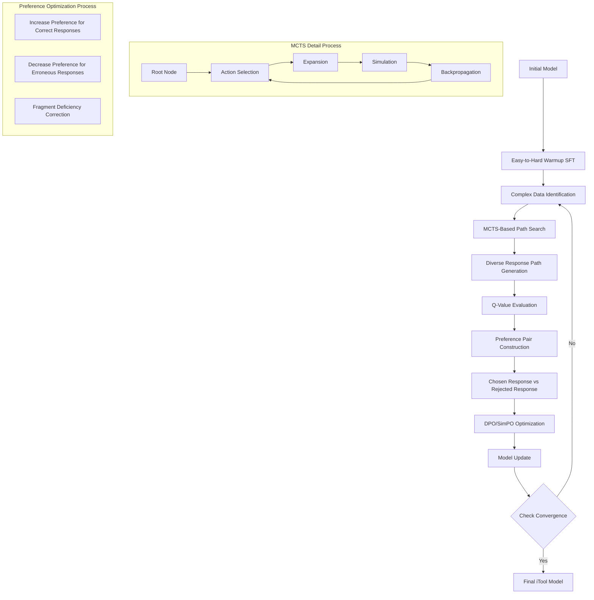

⏱️ **Estimated reading time**: 12 min

## Introduction

The ability of large language models (LLMs) to use external tools has emerged as a critical capability for building practical AI systems. By calling APIs, querying databases, and interacting with external services, models can overcome their inherent knowledge cutoff and solve real-world tasks that pure text generation cannot address.

The dominant approach to teaching tool use has been supervised fine-tuning (SFT) on synthetically generated datasets. Research teams collect or construct examples of correct tool-calling behavior, then train models to imitate those examples. While this approach has shown early promise, it runs into a fundamental ceiling: as the training data grows larger, the marginal improvement in model capability diminishes. The model learns to reproduce surface patterns in the synthetic data rather than developing a robust, generalizable understanding of when and how to invoke tools correctly.

This is the problem that the iTool research addresses. Developed jointly by the Harbin Institute of Technology SCIR Lab, Huawei Technologies, and Huawei Noah's Ark Lab, iTool proposes a reinforced fine-tuning framework that goes beyond imitation learning. The paper is available on arXiv as arXiv:2501.09766.

## Existing Problems

### Diminishing Training Effectiveness

Standard SFT on synthetic tool-use data faces a saturation effect. As the dataset size increases from tens of thousands to hundreds of thousands of samples, the performance gains on held-out benchmarks become progressively smaller. The model is essentially memorizing the training distribution rather than learning to reason about tool use.

This phenomenon becomes especially pronounced in complex, multi-step scenarios. When a task requires chaining multiple tool calls, handling ambiguous parameters, or recovering from intermediate errors, SFT-trained models frequently fail. They can produce plausible-looking but incorrect tool calls because they have learned to pattern-match rather than to reason about the underlying task structure.

### The Fragment Deficiency Concept

A central insight of the iTool paper is the concept of Fragment Deficiency. In standard SFT, the model is trained to reproduce complete, correct tool-calling sequences. However, a model that makes a partially correct call, one that gets the function name right but specifies the wrong parameter values, receives no credit and no targeted feedback. The gradient signal treats the entire response as incorrect, even though the model demonstrated partial competence.

Fragment Deficiency refers to this gap: the model has localized weaknesses in specific components of tool-calling behavior (parameter value generation, type inference, semantic grounding), but the training signal is too coarse to address them individually. Over many training iterations, these localized deficiencies persist and limit the model's overall capability ceiling.

### Complex Scenario Limitations

Beyond the Fragment Deficiency problem, SFT-trained models struggle with scenarios that require composing multiple tool calls in a coherent sequence. Real-world tool use often involves conditional logic: call tool A, observe the result, then decide whether to call tool B or tool C. Static imitation learning cannot equip models for this kind of dynamic reasoning.

## iTool Methodology

iTool addresses these problems through three interlocking components: an easy-to-hard warmup SFT stage, an MCTS-based path search mechanism, and an iterative reinforced fine-tuning loop with preference optimization.

### Easy-to-Hard Warmup SFT

Before entering the reinforced fine-tuning loop, the model undergoes a warmup phase using conventional SFT. Crucially, this warmup is structured as an easy-to-hard curriculum. The training data is sorted by task complexity, and the model is exposed first to simpler single-tool scenarios before progressing to complex multi-tool chains.

This curriculum design serves two purposes. First, it establishes a competent baseline that is strong enough to benefit from subsequent reinforced fine-tuning. Second, it ensures that the model has a solid foundation in tool-calling syntax and semantics before it is asked to explore harder scenarios through MCTS.

### MCTS-Based Path Search

The core of iTool's approach is using Monte Carlo Tree Search (MCTS) to generate diverse tool-calling trajectories for complex tasks. Given a complex prompt, the model uses MCTS to explore multiple possible response paths. Each node in the search tree corresponds to a partial tool-calling sequence, and the tree is expanded by sampling possible next steps from the model's current distribution.

Each terminal node (a complete tool-calling sequence) is assigned a Q-value based on a reward function that evaluates the correctness of the tool call. This reward function is multi-dimensional, capturing function name accuracy, parameter count correctness, parameter name accuracy, and parameter value and type correctness. Semantic similarity is also factored in to handle cases where the model produces semantically equivalent but syntactically different responses.

The MCTS search produces a collection of diverse trajectories for each complex prompt, ranging from high-quality correct calls to various types of errors. This diversity is precisely what makes the subsequent preference optimization effective.

### Iterative Reinforced Fine-Tuning

From the MCTS-generated trajectories, iTool constructs preference pairs: a chosen response (higher Q-value trajectory) and a rejected response (lower Q-value trajectory). These pairs are used to train the model with preference optimization methods, specifically DPO (Direct Preference Optimization) and SimPO (Simple Preference Optimization).

This process is iterative. After each round of preference optimization, the updated model is used to generate new MCTS trajectories on the complex data subset that has not yet been mastered. The loop continues until convergence, at which point the model has been systematically calibrated on its specific deficiency areas rather than trained uniformly on the entire dataset.

This iterative calibration is the mechanism that addresses Fragment Deficiency. Because the MCTS trajectories explicitly surface the partial errors that the model makes (wrong parameter values, wrong types, missing parameters), the preference pairs provide fine-grained gradient signal that targets those specific weaknesses. The model receives credit for what it gets right and corrective signal for what it gets wrong at the component level.

## Experiment Design

### ToolACE Dataset

The experiments use the ToolACE dataset, which contains up to 100,000 synthetic tool-use samples covering a wide range of API categories. The dataset includes examples that span simple single-function calls through complex multi-step tool chains.

Two representative dataset examples illustrate the range of difficulty:

**Get Trending Result**: A simpler task asking the model to retrieve trending content from a specified platform. The correct call requires specifying the function name and a small number of parameters with clear semantics.

**Complex Analysis Task**: A harder task requiring the model to combine multiple tool calls, handle intermediate results, and apply conditional logic based on observed outputs. These tasks exercise the model's ability to reason about tool composition and error recovery.

### BFCL Benchmark

The primary evaluation benchmark is the Berkeley Function Calling Leaderboard (BFCL), which provides a standardized suite of tool-use tasks across multiple difficulty levels and API categories. BFCL is widely used in the research community for evaluating LLM tool-calling capability.

### Evaluation Criteria

The evaluation framework uses five dimensions to assess tool-calling quality:

1. **Function name accuracy**: Whether the model selects the correct function to call.
2. **Parameter count**: Whether the number of parameters in the call matches the expected count.
3. **Parameter names**: Whether the parameter keys are correctly named.
4. **Parameter values and types**: Whether the parameter values are correct and of the expected type.
5. **Semantic similarity**: A softer measure that evaluates whether the model's response is semantically equivalent to the reference answer even if syntactically different.

### Quality Grades

Based on these five dimensions, responses are classified into four quality grades:

- **Excellent**: All five dimensions are correct.
- **Acceptable**: Minor discrepancies in one or two dimensions that do not affect the functional outcome.
- **Fair**: Errors in parameter values or types that would cause the tool call to fail or produce incorrect results.
- **Poor**: Fundamental errors in function name or parameter structure that render the call unusable.

## Experimental Results

### Overall Performance Improvement

Across the full BFCL benchmark, iTool achieves a 13.11% overall improvement compared to baseline SFT models. This is a substantial gain, particularly given the already competitive baselines that use high-quality synthetic training data.

The improvement is consistent across different difficulty levels in the benchmark, but it is most pronounced on the complex multi-step scenarios that previous SFT approaches struggled with.

### Complex Scenario Gains

On the complex task subset specifically, iTool achieves an additional 6.5% improvement over the overall average gain. This confirms that the MCTS-based exploration and iterative deficiency calibration are most effective precisely in the scenarios where standard SFT falls shortest.

The gap between simple and complex task performance narrows significantly with iTool compared to SFT baselines, indicating that the model has developed more robust compositional reasoning about tool use.

### 8B Model Competing with Larger Models

One of the most significant findings is that an 8B parameter model trained with iTool can match or exceed the performance of substantially larger models trained with conventional SFT. This result suggests that the quality of the training signal, not the quantity of parameters, is the primary constraint on tool-use capability.

This has practical implications: organizations that cannot afford to deploy large models can achieve comparable tool-use performance by investing in better training methodology rather than larger model capacity.

### SimPO Combination Performance

Among the preference optimization methods evaluated, SimPO in combination with iTool's MCTS-based trajectory generation produces the best results. SimPO's simplicity and stability during training make it a good match for the iterative reinforced fine-tuning loop, where the preference data distribution shifts with each round of model updates.

### Ablation Study

The ablation study confirms the contribution of each component:

- Removing the easy-to-hard warmup SFT and starting directly with MCTS-based reinforced fine-tuning degrades performance, showing that a strong baseline is necessary for effective exploration.
- Removing MCTS and using only random sampling for trajectory generation reduces the diversity and quality of preference pairs, leading to smaller performance gains.
- Using a single round of preference optimization rather than iterating to convergence also reduces performance, confirming the value of the iterative calibration loop.

## Learning Process Flow

The following diagram illustrates the complete iTool training pipeline:

The pipeline begins with the initial model entering the easy-to-hard warmup SFT phase. After this warmup, the system identifies complex data points and applies MCTS-based path search to generate diverse response trajectories. These trajectories are evaluated using Q-values, and preference pairs are constructed from chosen and rejected responses. DPO or SimPO optimization then updates the model, and the process iterates until convergence.

The MCTS subprocess (lower left) shows the standard four operations: action selection, expansion, simulation, and backpropagation. The preference optimization subprocess (lower right) shows the three calibration targets: increasing preference for correct responses, decreasing preference for erroneous responses, and correcting localized fragment deficiencies.

## Technical Innovations

### Fragment Deficiency Concept

The introduction of the Fragment Deficiency concept is a meaningful conceptual contribution. Prior work on LLM tool use did not have precise vocabulary for describing the localized, component-level errors that limit model performance. By naming and formalizing this phenomenon, the iTool paper provides a clearer framework for diagnosing why SFT plateaus and what kind of training signal is needed to move past that plateau.

### MCTS + Reinforcement Learning Combination

Applying MCTS to generate training data for preference optimization is a technique borrowed from the game-playing and planning literature but adapted here for the tool-use domain. The key adaptation is the design of the reward function: rather than a binary win/loss signal, iTool uses a multi-dimensional quality score that maps directly onto the Fragment Deficiency taxonomy.

This reward function design is what makes the MCTS trajectories useful for targeted calibration. A binary reward would produce preference pairs that tell the model "this response is better than that one" without specifying why. The multi-dimensional reward creates preference pairs that encode which specific components of the tool call were correct or incorrect, enabling more precise gradient updates.

### Systematic Iterative Improvement

The iterative structure of the training loop, where each round focuses on the data that the current model still fails to handle, is a form of curriculum adaptation. As the model improves, the effective training distribution shifts toward harder cases. This avoids the problem of wasting training compute on examples the model has already mastered, and it ensures that the model is always working at the edge of its current capability.

## Limitations

### High MCTS Computation Cost

MCTS is computationally expensive. Each invocation requires running many forward passes through the model to expand the search tree and evaluate trajectories. At the scale required for training on 100,000 samples, the total compute cost is substantially higher than standard SFT. The paper acknowledges this but does not propose a concrete solution, positioning it as future work.

For practitioners, this means that iTool as described is most suitable for offline training pipelines where compute budget is not the primary constraint. Online or continual learning settings would require more efficient tree search approximations.

### Evaluation Focused on Function Call Accuracy

The BFCL benchmark evaluates tool use primarily at the level of function call correctness: does the model produce the right function name with the right parameters? This is a well-defined and measurable criterion, but it does not capture everything that matters in practical tool-use scenarios.

In real deployments, tool use involves latency, error handling, partial success recovery, and multi-turn interaction. A model that produces syntactically correct tool calls may still fail in practice if it cannot handle unexpected API responses or if it cannot reason about when to retry a failed call. The iTool evaluation framework does not address these practical dimensions.

### Practical Aspects Lacking

Related to the evaluation point, the paper focuses on the offline training methodology and benchmark evaluation rather than practical deployment considerations. Questions about how iTool performs in production environments, how it handles distribution shift between training APIs and deployment APIs, and how it integrates with real-world tool execution frameworks are left open.

## Future Directions

Several directions for future work follow naturally from the iTool methodology and its current limitations:

**Computation efficiency**: The most immediate need is making the MCTS-based trajectory generation more computationally tractable. Techniques such as beam search approximations, draft-model acceleration, or learned value functions that reduce the number of simulation rollouts could significantly lower the training cost.

**Diverse domain expansion**: The ToolACE dataset covers a representative but not exhaustive range of API types. Extending the iTool framework to additional domains, including domain-specific scientific APIs, data processing pipelines, and code execution environments, would test the generality of the approach and potentially reveal domain-specific calibration challenges.

**Safety and reliability mechanisms**: As LLMs are deployed with real tool access, the consequences of incorrect tool calls become more serious. Future work could integrate safety constraints into the reward function, penalizing tool calls that could have harmful side effects even if they are otherwise technically correct. Reliability mechanisms, such as confidence estimation for generated tool calls and principled abstention when confidence is low, are also important for practical deployment.

## Conclusion

iTool presents a principled solution to the diminishing returns problem that affects SFT-based approaches to LLM tool use. By introducing the Fragment Deficiency concept, applying MCTS to generate diverse and informative training trajectories, and using preference optimization in an iterative calibration loop, the framework achieves a 13.11% overall improvement and a 6.5% additional gain on complex scenarios.

The finding that an 8B parameter model trained with iTool can match larger SFT-trained models is particularly noteworthy. It suggests that the field's current emphasis on scaling model size may be partly misplaced: for tool-use capability specifically, the quality and structure of the training signal matters at least as much as the number of parameters.

The main practical limitation is the computational cost of MCTS, which restricts iTool to offline training pipelines for now. Addressing this cost is the most important near-term research priority if the methodology is to see broad practical adoption.

For teams building LLM systems that rely on external tool use, the iTool framework offers a clear and well-validated path for improving model capability beyond what standard SFT can achieve. The methodology is model-agnostic and dataset-agnostic, making it applicable across a wide range of deployment contexts.

## References

- iTool paper: arXiv:2501.09766
- Harbin Institute of Technology SCIR Lab, Huawei Technologies, Huawei Noah's Ark Lab
- BFCL benchmark: Berkeley Function Calling Leaderboard
- ToolACE dataset: up to 100,000 synthetic tool-use samples
- DPO: Direct Preference Optimization
- SimPO: Simple Preference Optimization
- MCTS: Monte Carlo Tree Search
