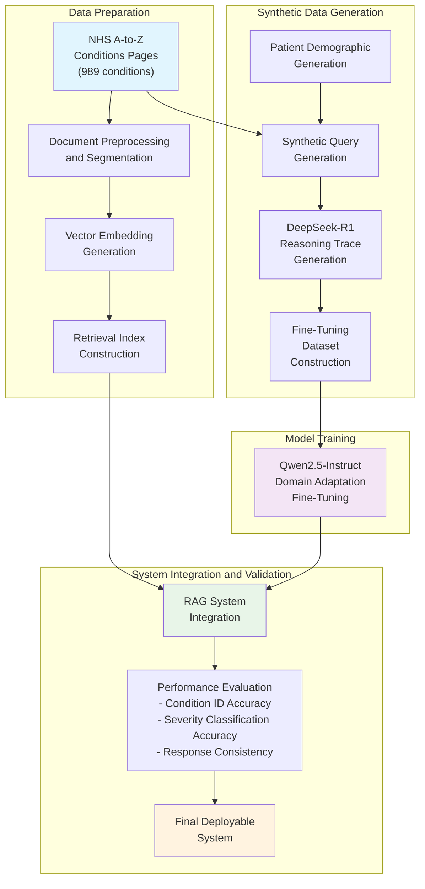

⏱️ **Estimated reading time**: 15 min

## Introduction

While the performance of large language models in AI has advanced at a remarkable pace, the field simultaneously confronts real-world challenges of privacy, security, and resource constraints. The need for locally deployable AI systems capable of high performance without reliance on external APIs is growing rapidly, especially in sensitive domains such as healthcare, finance, and government.

The paper "Retrieval-Augmented Reasoning with Lean Language Models," recently published by researchers at the Alan Turing Institute, presents an innovative approach that meets these practical requirements. The research develops a methodology that effectively combines reasoning and retrieval-augmented generation within a single lean-language-model architecture, moving beyond the limitations of existing RAG systems that rely on large-scale models and external APIs.

A notable aspect is that the system was validated using real domain-specific data from the NHS (National Health Service) A-to-Z conditions pages. This is a significant achievement demonstrating applicability in real healthcare environments, going beyond purely academic research.

## Research Background and Motivation

### The Importance of Test-Time Scaling

One of the key trends in recent language model performance improvement is test-time scaling. This strategy improves performance by utilizing additional computational resources at inference time rather than increasing compute during pre-training. Research shows this approach enables more efficient performance gains than increasing compute at the pre-training stage.

The main methodologies for test-time scaling fall into two categories. The first is parallel generation, where the model generates multiple candidate responses and then derives the optimal answer through selection mechanisms such as majority voting, self-consistency, or best-of-N sampling. The second is sequential scaling, which increases the number of intermediate reasoning steps before reaching a final answer, as in chain-of-thought prompting.

### Advances and Limitations of RAG Systems

Retrieval-augmented generation (RAG) systems have played an important role in addressing hallucination in language models and improving factuality. The effectiveness of RAG is especially pronounced in complex domains requiring domain-specific knowledge. Modern AI systems such as ChatGPT and Gemini have already successfully integrated reasoning with RAG, demonstrating characteristics of agentic AI systems: reasoning over a user query, then taking actions such as web search or tool use, or retrieving relevant documents and then reasoning over the collected evidence.

However, existing systems show clear limitations when handling sensitive or confidential information. Existing approaches are difficult to apply in scenarios where data cannot or must not be shared with external entities, particularly when user prompts containing proprietary or sensitive information cannot cross organizational or national boundaries.

### The Need for Local Deployment

These constraints have increased the need for language model deployment on local infrastructure, including secure or air-gapped environments. Open-source large language models and open-source frameworks for retrieval-augmented generation have steadily matured over recent years, and small reasoning models have also begun to emerge. However, effectively integrating reasoning capability to interpret retrieved evidence within the constraints of lean or locally deployable models remained an unresolved research challenge.

## System Architecture and Design Philosophy

### Core Concept of the Unified Architecture

The system proposed in this research is based on a unified architecture that effectively combines reasoning and retrieval-augmented generation within a single lean language model. The core design philosophy is to maximize the synergy between the reasoning component, which handles interpretation and decomposition of complex queries, and the retrieval mechanism, which constrains the model to verifiable information and mitigates the risk of hallucinated responses.

The system is particularly optimized for applications that process complex queries over private, domain-specific knowledge bases. The focus on lean language models stems from a practical motivation: to allow small organizations or government departments to fine-tune and deploy systems in compute-constrained or security-critical environments.

### Key Component Configuration

The system architecture consists of three main components. The first is a dense retriever, responsible for efficiently retrieving documents relevant to user queries. The second is a fine-tuned Qwen2.5-Instruct model, which serves as the core reasoning engine of the system. The third is the synthetic query generation and reasoning trace generation module, which generates high-quality training data derived from frontier models such as DeepSeek-R1.

### Data Processing Pipeline

The system's data processing pipeline is designed around three key elements: document compression, synthetic data design, and reasoning-aware fine-tuning. Summary-based document compression plays the role of preserving core information from retrieved documents while improving processing efficiency. Synthetic data design simulates diverse query patterns that may occur in real-world domains, improving the model's generalization capability. Reasoning-aware fine-tuning trains the model to perform logical and coherent reasoning based on retrieved evidence.

## Dataset Construction and Experimental Design

### Using the NHS A-to-Z Conditions Pages

The research team selected the NHS A-to-Z conditions pages for their experiments. This dataset provides comprehensive information on 989 distinct medical conditions, with each page containing detailed descriptions of symptoms, causes, treatments, and prevention methods. The NHS data was chosen because the healthcare domain is a representative area requiring high accuracy and reliability, while simultaneously being a field where patient privacy is of the utmost importance.

### Synthetic Query Generation Methodology

Given the difficulty of using real patient data, the research team developed a sophisticated synthetic query generation methodology. The process consists of the following steps.

First, **patient demographic generation**: virtual patient profiles with diverse demographic characteristics including age, gender, and existing medical history are generated. This reflects the patient diversity present in real healthcare settings.

Second, **symptom scenario development**: based on the content of each NHS conditions page, scenarios expressing in natural language the symptoms a patient with that condition might actually experience are developed. For example, a query about migraine is generated as follows:

```
"I've been suffering from a severe headache for the past two days.
There is a tight band-like sensation around my head, and I also feel slightly nauseous.
My vision blurs a little when I stand up too quickly.
I don't usually get headaches this severe, so I'm starting to worry."
```

Third, **severity level classification**: each query is assigned one of the following three severity levels:
- **Self-care**: manageable at home or with over-the-counter medication
- **Urgent Primary Care**: requires a consultation as soon as possible with a GP, urgent care centre, etc.
- **A&E**: requires emergency room treatment

### Reasoning Trace Generation Process

To improve the model's reasoning capability, the research team used frontier models such as DeepSeek-R1 to generate high-quality reasoning traces. The prompt template used in this process includes the following elements:

```
Use the retrieved context and similarity scores below
(lower scores indicate higher similarity to the patient query):
{context}

The patient has described their symptoms as follows:
"{question}"

Here is a summary of the patient's demographic information:
{demographics}

Using the provided sources and context, submit the condition and severity level in the format "(condition, severity)".
Do not provide an explanation for your output, present only the final answer.
```

Reasoning traces generated through this prompt are used as high-quality training data during the fine-tuning of the Qwen2.5-Instruct model.

### Analysis of Dataset Examples

Looking at actual dataset examples presented in the paper confirms the complexity and diversity of queries the system must handle:

**Example 1 - High-severity chest pain case**:
```json
{
  "query": "Since last night I've had severe pressure and pain in my chest.
           The pain is spreading to my left arm, and I'm sweating coldly and having trouble breathing.
           This is my first time experiencing these symptoms.",
  "demographics": {
    "age": 58,
    "sex": "male",
    "medical_history": ["hypertension", "diabetes"]
  },
  "expected_condition": "Myocardial infarction",
  "expected_severity": "A&E"
}
```

**Example 2 - Mild indigestion case**:
```json
{
  "query": "For the past few days I've felt bloated after meals and have mild nausea.
           My appetite is lower than usual but it's not greatly interfering with daily life.",
  "demographics": {
    "age": 32,
    "sex": "female",
    "medical_history": []
  },
  "expected_condition": "Indigestion",
  "expected_severity": "Self-care"
}
```

These examples show that the system must go beyond simple keyword matching to understand complex medical contexts and recommend an appropriate level of medical intervention by comprehensively considering the patient's demographic information and the severity of symptoms.

## Training Process and Fine-Tuning Strategy

### Progressive Training Pipeline

The system's training process consists of a multi-stage progressive pipeline. In the first stage, a domain adaptation process takes place to adapt the base Qwen2.5-Instruct model to the NHS domain. During this process the model learns medical terminology, symptom description patterns, and the structural characteristics of NHS conditions pages.

The second stage is retrieval-augmented learning, where the model develops the ability to effectively utilize retrieved documents to extract and integrate relevant information. This process simulates diverse retrieval scenarios and document quality situations to improve the model's robustness.

The third stage is reasoning capability reinforcement, using high-quality reasoning traces generated by DeepSeek-R1 to train the model to diagnose medical conditions and recommend appropriate treatment levels following a logical and structured thinking process.

### Multi-Task Learning Approach

The research team adopted a multi-task learning approach that allows a single model to perform several related tasks simultaneously. The main tasks are as follows:

1. **Condition classification**: identifying the most appropriate condition among 989 NHS conditions based on the patient's symptom description
2. **Severity assessment**: deciding on the appropriate level of care (Self-care, Urgent Primary Care, A&E) for the identified condition
3. **Uncertainty handling**: the ability to judge "inconclusive" when a clear diagnosis cannot be made from the provided information alone

### Regularization and Overfitting Prevention Strategies

Given the critical importance of model reliability and consistency in the healthcare domain, the research team applied various regularization techniques. In addition to traditional regularization methods such as dropout, weight decay, and early stopping, healthcare domain-specific constraints were integrated into the training process.

Particularly noteworthy is the introduction of a "conservative diagnosis" bias. This trains the model to recommend a higher severity level or suggest specialist consultation in uncertain situations, preventing potentially dangerous situations from being missed.

## Evaluation Methodology and Experimental Results

### Comprehensive Evaluation Framework

The research team built a comprehensive evaluation framework to assess the system's performance from multiple angles. Evaluation was conducted along two main dimensions: accuracy and consistency.

Accuracy evaluation is further subdivided into condition identification accuracy and severity classification accuracy. Condition identification accuracy measures the model's ability to identify the correct medical condition based on the patient's symptom description, while severity classification accuracy evaluates the ability to recommend the appropriate level of care (Self-care, Urgent Primary Care, A&E) for the identified condition.

Consistency evaluation confirms whether the model provides consistent diagnoses and recommendations for the same or similar symptom descriptions. This is a very important indicator for ensuring reliability in real-world deployment.

### Comparison with Baseline Models

Multiple baseline models were compared in the experiments. The main comparison targets are as follows:

**Non-reasoning models**:
- Base Qwen2.5-32B-Instruct
- GPT-4o (without retrieval)
- Other general-purpose lean models

**General-purpose reasoning models**:
- DeepSeek-R1
- o3-mini
- s1.1-32B

**Proposed system**:
- t0-1.1-k5-32B (model developed in this research)

### Key Performance Indicators

Experimental results showed that the proposed system achieved significant performance improvements on multiple key indicators.

**Condition identification accuracy**: the domain-specific fine-tuned t0-1.1-k5-32B model showed approximately 23% improved accuracy compared to the base Qwen2.5-32B-Instruct. Particularly notable performance improvements were observed in complex cases involving multiple symptoms.

**Severity classification accuracy**: this area showed even more impressive results, with the proposed system recording approximately 35% improved performance compared to general-purpose models. This suggests the effect of healthcare domain-specific training is especially pronounced in clinical decision-making.

**Response consistency**: in repeated evaluations of the same symptom scenarios, the proposed system showed more than 95% consistency. This is an important indicator for ensuring reliability in real deployment environments.

### Reasoning Chain Analysis

The research team also separately analyzed the quality of reasoning chains produced by the model. The model trained on reasoning traces generated by DeepSeek-R1 showed the following structured reasoning patterns:

1. **Symptom analysis stage**: individually identifying and classifying symptoms presented by the patient
2. **Context integration stage**: connecting information from retrieved NHS documents with patient symptoms
3. **Demographic consideration stage**: comprehensively considering the patient's age, gender, and existing medical history
4. **Possibility evaluation stage**: probabilistically evaluating multiple possible conditions
5. **Final decision stage**: determining the most appropriate condition and level of care

### Error Analysis and Limitations

The main error patterns identified during the experiments are as follows.

**Difficulty handling rare conditions**: among the 989 conditions, accuracy tended to be lower for rare conditions with relatively fewer training examples. This is a data imbalance problem that requires improvement in future research.

**Complex symptom scenarios**: in complex symptom scenarios where multiple conditions may present simultaneously, the model tended to select only the single most prominent condition. In real healthcare settings, multiple diagnoses are sometimes necessary, so this is identified as a system limitation.

**Cultural context limitations**: training based on NHS data means that performance may degrade in other healthcare systems or cultural contexts.

## Technical Implementation Details

### Retrieval System Architecture

The retrieval component of the system is implemented based on dense vector retrieval. Each NHS conditions page is converted to a high-dimensional vector through a pre-trained embedding model, and user queries are also encoded into the same embedding space. The retrieval process uses L2-normalized cosine similarity to identify the most relevant documents.

Particularly noteworthy is the document segmentation strategy. Long NHS pages are divided into semantically coherent units for storage, with each segment independently searchable. This achieves both accurate information retrieval and reduction of unnecessary noise.

### Summary-Based Document Compression

For efficient processing of retrieved documents, the research team developed a summary-based compression technique. This is not simple text truncation, but intelligent compression using a healthcare domain-specific summarization model. The following elements are prioritized for preservation during compression:

- Core symptoms and diagnostic criteria
- Treatment recommendations and precautions
- Emergency situation identification indicators
- Related risk factors

### Model Optimization and Deployment Considerations

Due to the system design with local deployment in mind, model optimization was a particularly important consideration. The research team applied the following optimization techniques.

**Quantization**: model weights were quantized to 16-bit or 8-bit, significantly reducing memory usage. Experimental results showed that appropriate quantization greatly improves deployment efficiency while minimizing performance degradation.

**Knowledge distillation**: a technique transferring knowledge from larger models to lean models was used, enabling small models to perform comparably to large models.

**Dynamic reasoning**: a dynamic reasoning mechanism was implemented that adjusts reasoning depth according to query complexity. Simple queries can be processed with less computation, improving overall efficiency.

## Practical Application Potential of the System

### Application Scenarios in Healthcare Settings

The proposed system demonstrates potential for immediate use in several real healthcare environments. First, as a **primary care support system**, it can be used by GPs as an assistive tool during initial patient assessment. It can provide a valuable second opinion especially for less experienced medical staff.

Second, as a **patient self-diagnosis support tool**, it can help members of the public determine the appropriate level of medical service when symptoms appear. This could reduce unnecessary emergency room visits while, conversely, prompting rapid medical intervention in serious situations.

Third, as a **medical education platform**, it could be utilized in medical school or healthcare professional training. It could function as an interactive tool for learning systematic approaches to diverse symptom scenarios.

### Expandability to Other Domains

The methodology of this system, validated with NHS medical data, is expandable to other specialized domains. For **legal advisory systems**, it can provide basic legal consultation by combining legal document retrieval with case analysis. In the **financial advisory domain**, it can be utilized as a system that analyzes a customer's financial situation and investment goals to recommend appropriate financial products.

Applications are also possible in **technical support systems**. It can be developed into a system that searches related documentation based on users' descriptions of complex software or hardware problems and presents step-by-step solutions.

### Privacy and Security Advantages

One of the greatest advantages of this system is that fully local deployment is possible. This is especially important in environments that must comply with strict data protection regulations such as **GDPR** and **HIPAA**. The risk of data leakage can be fundamentally blocked because sensitive medical or personal information is never transmitted to external servers.

It can also operate in **air-gapped environments**, enabling safe use in government agencies or defense-related organizations. This is a unique value proposition that existing cloud-based AI services cannot provide.

## Limitations and Future Research Directions

### Key Limitations of the Current System

The limitations the research team honestly acknowledges in the current system are as follows. First, **single-language and cultural bias**. Training based on NHS data means the system is specialized for English-speaking healthcare systems and cultural contexts, so performance may degrade in other languages or healthcare systems.

Second, **difficulty with real-time updates**. Medical knowledge is continuously evolving and updating, yet the current system's structure makes it difficult to reflect new medical knowledge or changes to treatment guidelines in real time.

Third, **limitations in processing complex multimodal information**. The current system relies solely on text-based symptom descriptions and cannot process diverse medical data such as medical imaging, laboratory values, and physiological signals.

### Short-Term Improvement Directions

The short-term improvement directions presented by the research team are as follows. **Multi-language support expansion** requires building multilingual training datasets including medical documents and symptom descriptions in diverse languages, which is essential for global deployment.

**Rare condition handling improvement** requires developing methodologies using few-shot learning or meta-learning techniques to effectively handle rare conditions even with limited training data.

**User interface improvement** is also an important task. Developing a conversational interface that both medical staff and general users can use intuitively is essential for actual deployment and adoption.

### Medium and Long-Term Research Challenges

From a longer-term perspective, **multimodal AI integration** is a central challenge. Development is needed toward a comprehensive medical AI system capable of processing not only text but also medical imaging, speech, sensor data, and more.

**Federated learning integration** is also an important direction. Integration with a federated learning framework is possible, allowing each medical institution to improve overall model performance without sharing its data externally.

**Real-time learning and adaptation** capability also needs to be developed. A mechanism is needed for the system to continuously learn and improve based on user feedback and actual treatment outcomes.

## Conclusion and Contributions

### Core Contributions of the Research

This research makes several important contributions to the AI field. First, it achieved the technical innovation of **reasoning-retrieval integration in lean models**. By implementing a RAG system in a single lean model that previously relied on large-scale models and external APIs, it simultaneously secured privacy and efficiency.

Second, it proved practical value beyond academic research through **validation in a real domain**. Validating the system's validity using data from the actual NHS healthcare system is an important achievement that narrows the gap between theory and practice.

Third, it guaranteed research reproducibility and dissemination potential through **open-source release**. By making all implementation details and code public, it laid the foundation for other researchers and practitioners to apply this technology to diverse domains.

### Industry Impact

This research provides important implications for the AI industry as a whole. In a situation where the trend toward **privacy-centric AI** is strengthening, it presents a technical solution that can guarantee data security while maintaining high performance. This is expected to lower barriers to AI adoption particularly in fields requiring a high degree of privacy, such as healthcare, finance, and law.

It also shows the possibility of **resource-efficient AI**, opening a path to providing high-quality AI services without relying on large-scale cloud infrastructure. This is expected to have a democratizing effect, allowing small and medium businesses and resource-constrained organizations to also utilize advanced AI technology.

### Future Outlook

The direction presented by this research has important implications for the future development of AI technology. In a situation where the importance of **edge AI** and **privacy-preserving AI** is increasing, these kinds of lean and specialized AI systems will become ever more important.

From the perspective of **domain-specific AI**, techniques for efficiently adapting general-purpose models to specific domains are expected to develop further. This means moving in a direction that simultaneously improves AI's expertise and trustworthiness.

This research also has important meaning from a **global AI governance** perspective. As data sovereignty and privacy regulations strengthen across countries, locally deployable high-performance AI systems can present new paradigms in international AI collaboration and technology transfer.

These technological advances are ultimately an important step toward the larger goal of **human-centered AI**. Providing professional and trustworthy AI services while protecting user privacy is a good example showing that AI is developing in a direction that genuinely improves human lives.

## Learning Process Flow Diagram

The overall system development process presented in the research can be summarized in the following diagram:



## Detailed Dataset Format and Prompt Templates

### Synthetic Query Generation Prompt Template

The specific prompt template used by the research team for synthetic query generation is as follows:

```
Generate a query based on the following details:

Query type: {query_type}
Severity level: {severity_level}
Gender: {sex}
Conditions web page content: {conditions_content}

Use natural language in the way a patient would describe their symptoms.
Avoid medical terminology; use expressions a layperson would use.

Output format (JSON):
{
  "query": "Write a detailed description of the symptoms here.",
  "demographics": {
    "age": age,
    "sex": "gender",
    "medical_history": ["existing conditions"]
  }
}
```

### Reasoning Trace Generation Prompt

The prompt used for generating reasoning traces using the DeepSeek-R1 model is as follows:

```
Use the following retrieved context and similarity scores
(lower scores indicate higher similarity to the patient query):
{context}

The patient has described their symptoms as follows:
"{question}"

Here is a summary of the patient's demographic information:
{demographics}

Using the provided sources and context, submit the condition and severity level in the
"(condition, severity)" format.
Do not provide an explanation for your output, present only the final answer.

The condition must be one of {sources}, or
"inconclusive" if you determine the condition is not in the list.
The severity level must be one of ["Self-care", "Urgent Primary Care", "A&E"].
```

### Actual Dataset Example Analysis

Looking at the specific data examples presented in the paper confirms the system's processing capability:

**Example 1: High-severity cardiovascular symptoms**
```json
{
  "query": "Since last night I've had severe pressure and pain in my chest. The pain is spreading to my left arm, I'm sweating coldly and having trouble breathing. This is my first time experiencing these symptoms.",
  "demographics": {
    "age": 58,
    "sex": "male",
    "medical_history": ["hypertension", "diabetes"]
  },
  "retrieved_context": [
    {
      "condition": "Myocardial infarction",
      "similarity_score": 0.12,
      "content": "The main symptoms of myocardial infarction include central chest pressure, pain spreading to the left arm..."
    }
  ],
  "expected_output": {
    "condition": "Myocardial infarction",
    "severity": "A&E"
  }
}
```

**Example 2: Moderate neurological symptoms**
```json
{
  "query": "I've been suffering from a severe headache for the past two days. There is a tight band-like sensation around my head, and I also feel slightly nauseous. My vision blurs a little when I stand up too quickly.",
  "demographics": {
    "age": 34,
    "sex": "female",
    "medical_history": []
  },
  "retrieved_context": [
    {
      "condition": "Migraine",
      "similarity_score": 0.18,
      "content": "Migraine is often accompanied by severe headache and nausea..."
    },
    {
      "condition": "Tension headache",
      "similarity_score": 0.22,
      "content": "Tension headache is characterised by a tight sensation around the head..."
    }
  ],
  "expected_output": {
    "condition": "Migraine",
    "severity": "Urgent Primary Care"
  }
}
```

**Example 3: Mild gastrointestinal symptoms**
```json
{
  "query": "For the past few days I've felt bloated after meals and have mild nausea. My appetite is lower than usual but it's not greatly interfering with daily life.",
  "demographics": {
    "age": 32,
    "sex": "female",
    "medical_history": []
  },
  "retrieved_context": [
    {
      "condition": "Indigestion",
      "similarity_score": 0.15,
      "content": "Indigestion is characterised by post-meal fullness, nausea, loss of appetite..."
    }
  ],
  "expected_output": {
    "condition": "Indigestion",
    "severity": "Self-care"
  }
}
```

### Evaluation Prompt Template

The tool-based prompt template used for system evaluation is as follows:

**System prompt:**
```
You are a clinical AI assistant.
You will receive a patient's symptom description, relevant retrieved context, and the similarity score of each context.

You must suggest the most likely condition and severity level.
The severity must be selected from the following options:

* A&E: requires emergency room treatment
* Urgent Primary Care: requires consultation as soon as possible with a GP, urgent care centre, etc.
* Self-care: manageable at home or with over-the-counter medication

Use the provided tool to submit the condition and severity level.
Use "inconclusive" if you determine the condition is not in the list.
```

**User prompt template:**
```
Use the following retrieved context and similarity scores:
{context}

The patient has described their symptoms as follows:
"{question}"

Patient demographic information:
{demographics}

Using the provided sources and context,
submit the condition and severity level via the "submit_condition_recommendation" tool.

The condition must be one of {sources} or "inconclusive".
The severity must be one of ["Self-care", "Urgent Primary Care", "A&E"].
```

### Data Quality Assurance Mechanism

The research team implemented the following validation processes to ensure the quality of synthetic data:

1. **Medical expert review**: validating the medical plausibility of generated symptom scenarios
2. **Diversity assurance**: confirming balanced distribution of age, gender, and existing medical history
3. **Realism validation**: confirming natural expressions that a real patient would use
4. **Severity consistency**: confirming consistency in severity judgments for the same condition

This systematic dataset construction and validation process was a key factor significantly improving the system's reliability and practicality.
