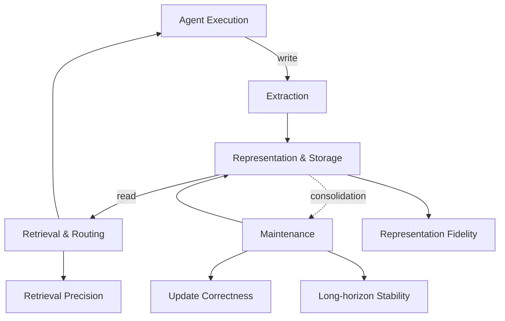

## Overview

Anyone who has run LLM agents for any length of time will have hit the same wall. Agents handle one-shot question-answering well, but the moment you span tasks across days or context across multiple sessions, the agent forgets what it has done. That is where "agent memory" entered the picture, and at first it was little more than a RAG variant: store conversations in a vector store, retrieve on demand.

The arXiv paper [Are We Ready For An Agent-Native Memory System?](https://arxiv.org/abs/2606.24775), published on June 23, 2026, reframes this entire trajectory in a single observation. Agent memory is no longer a retrieval-augmentation device; it has evolved into a **full data-management system responsible for persistent storage, retrieval, updating, consolidation, and dynamic lifecycle management**. This is the paper dair_ai summarized as "Agent memory is a data system now."

The reframing matters because for a platform like ThakiCloud, which actually runs multi-tenant agents on Kubernetes, the moment memory becomes a "system to operate" rather than a "feature to enable," cost, robustness, and architectural choices all follow. This post summarizes the core claims from the official abstract and the [public code](https://github.com/OpenDataBox/MemoryData), and draws out what is actionable from the perspective of our platform.

> 📄 **Full deep review (DOCX)**: [Download the detailed peer review on Google Drive](https://drive.google.com/file/d/1wLivKobOMtAKQ1zwCmG-O8wdebyZRbcz/view).

## What This Research Does

The problem the paper identifies is simple but pointed. Most existing methods for evaluating agent memory stop at **end-to-end task success metrics**. Scores like F1 or BLEU answer the question "did it answer the question well?" while treating the memory system that produced the answer as a complete black box.

That framing hides exactly what an operator needs to know: how much **operational cost** does maintaining memory incur, what are the **architectural trade-offs** across different module combinations, and how robust is the system when knowledge keeps changing? A single aggregate score answers none of these.

The authors (Wei Zhou, Xuanhe Zhou, Guoliang Li, Zhiyu Li, Feiyu Xiong, and others, notably including database-systems researchers, which explains the paper's character) therefore study memory systematically from a **data-management perspective**. The core of that study is an analytical framework that decomposes agent memory into four modules.

*The four-module architecture of an agent-native memory system and its data flows. Click the diagram to enlarge.*

The four modules are as follows.

1. **Representation & Storage**: How memory is encoded and where it is kept. The choice among vectors, graphs, trees, plain text, and other representations directly determines **representation fidelity**.
2. **Extraction**: The step of selecting what to commit to memory from the agent's execution trace. Not every token can be stored, so this stage separates signal from noise.
3. **Retrieval & Routing**: Finding the right memory at the right moment and returning it through the appropriate path. The metric here is **retrieval precision**.
4. **Maintenance**: Consolidating, updating, and pruning stale memories. **Update correctness** and **long-horizon stability** are determined here.

Anyone familiar with databases will recognize the correspondence: Representation & Storage maps to the storage engine, Extraction to the ingest pipeline, Retrieval & Routing to the query planner, and Maintenance to compaction and garbage collection. That mapping is precisely why the authors call their lens a "data-management perspective."

## Core Findings

On this framework, the paper evaluates **12 representative memory systems and 2 reference baselines** across **5 benchmark workloads and 11 datasets**. The weight of the contribution lies in measuring multiple systems against a common yardstick rather than optimizing a single model on a single dataset. Three conclusions can be drawn directly from the abstract.

**First, there is no single architecture that dominates all settings.** The answer to "which memory structure is best?" is "it depends." More precisely, effectiveness is determined by how well a memory structure aligns with the **workload bottleneck**. The structure that is optimal for a retrieval-bottlenecked workload differs from the one that suits an update-bottlenecked workload. This is a direct rebuttal of simple prescriptions like "graph memory is always best" or "a vector store is sufficient."

**Second, decomposing at the module level separates accountability.** The authors use granular ablation experiments to quantify each module's individual contribution to representation fidelity, retrieval precision, update correctness, and long-horizon stability. This reveals what end-to-end scores collapse together: "which module breaks what." From an operational standpoint, that is the real value. You can only fix a wrong answer if you can tell whether the failure was in the Extraction stage or the Retrieval stage.

**Third, cost-performance trade-offs in Maintenance are clear.** On realistic workloads, the paper finds that **localized maintenance is more cost-efficient than global reorganization**. Touching only what has changed costs less than periodically rebuilding the entire memory. This is the same intuition as incremental database compaction being cheaper than a full rebuild, and for cost-sensitive production deployments, this single finding can change architectural decisions.

In summary, the paper is less a prescription for "how to build better agent memory" and more a framework for **"how to measure and compare agent memory as a system."** On that framework it shows there is no single right answer, but that workload alignment and maintenance cost are the real levers.

## Implications for the ThakiCloud K8s AI/ML SaaS Platform

ThakiCloud's AI platform runs multi-tenant agents across diverse customer environments on Kubernetes. Several points from this paper land directly on our platform.

**Treating memory as a per-tenant data system.** If agent memory is a data-management system, it follows that every tenant incurs distinct storage costs, retrieval latency, and update load as separate operational concerns. In a multi-tenant setting, ensuring that one tenant's memory maintenance does not consume another tenant's GPU or I/O is a problem of the same kind as isolating GPU workloads with Kueue. Memory must be treated not as a "feature" but as a "workload with a resource budget."

**Designing for pluggable rather than fixed memory architectures.** The conclusion that no single architecture dominates implies that a platform should provide **abstractions that allow memory structures to be swapped or composed by workload**, rather than hard-coding a single memory backend. Depending on whether a customer's agent is long-session conversational or rapid-knowledge-update oriented, the platform should support switching between retrieval-centric and maintenance-centric structures. The four-module decomposition provides natural boundaries for exactly that kind of pluggable abstraction.

**An asset for on-premise and cost-sensitive deployments.** The finding that localized maintenance is cheaper than global reorganization is especially relevant for customers who self-host on-premise. It provides a design principle for controlling memory-maintenance costs within a finite in-house GPU and storage budget, without depending on an externally managed memory service. For customer environments where regulations or data-sovereignty requirements preclude external API calls, the ability to say "memory maintenance costs are predictable and contained inside your own cluster" is a direct sales point.

Two concrete actions are available to us now. One is to use the 4-module decomposition and workload taxonomy from the public [MemoryData code](https://github.com/OpenDataBox/MemoryData) as a starting point for instrumenting tenant memory, observing it via per-module metrics (representation fidelity, retrieval precision, update correctness, long-horizon stability) rather than end-to-end scores. The other is to set the default maintenance policy to localized updates rather than global reorganization, baking a cost ceiling into the design from the start.

## Limitations and Counterarguments

For balance, there are points to note before accepting the findings wholesale.

First, this paper is a **measurement study, not a proposal for a new memory system.** Readers expecting a blueprint for building better memory will be disappointed. What is offered is a comparative framework and diagnosis; "promising directions toward agent-native memory" are indicated, but implementation is left as future work.

Second, **generalization limits of the benchmark.** 5 workloads and 11 datasets is not trivial, but the domain space actual agents encounter is far broader. The conclusion that "optimal architecture varies by workload bottleneck" is also, somewhat paradoxically, a warning that if our customers' real workloads differ from the benchmark distribution, the paper's rankings may not transfer directly. Measurement in each deployment environment will still be necessary.

Third, **potential perspective bias from the author composition.** The database-systems research background makes the framing of "memory as data management" strong, but cognitive-science and reinforcement-learning perspectives on memory (episodic memory, policy-learned memory management, etc.) may receive comparatively less attention. Data management is a powerful lens, but not the only one.

Even so, the core message, "measure agent memory as a system," is a hard-to-refute starting point for a platform that actually has to operate memory. The moment you start looking at memory through modules and costs rather than scores, what can be fixed becomes visible.

## Sources

- Paper: [Are We Ready For An Agent-Native Memory System? (arXiv 2606.24775)](https://arxiv.org/abs/2606.24775)
- HF Papers: [hf.co/papers/2606.24775](https://hf.co/papers/2606.24775)
- Public code: [github.com/OpenDataBox/MemoryData](https://github.com/OpenDataBox/MemoryData)
- Original tweet context: dair_ai, "Agent memory is a data system now"

> 📄 **Full deep review (DOCX)**: [Download the detailed peer review on Google Drive](https://drive.google.com/file/d/1wLivKobOMtAKQ1zwCmG-O8wdebyZRbcz/view).
