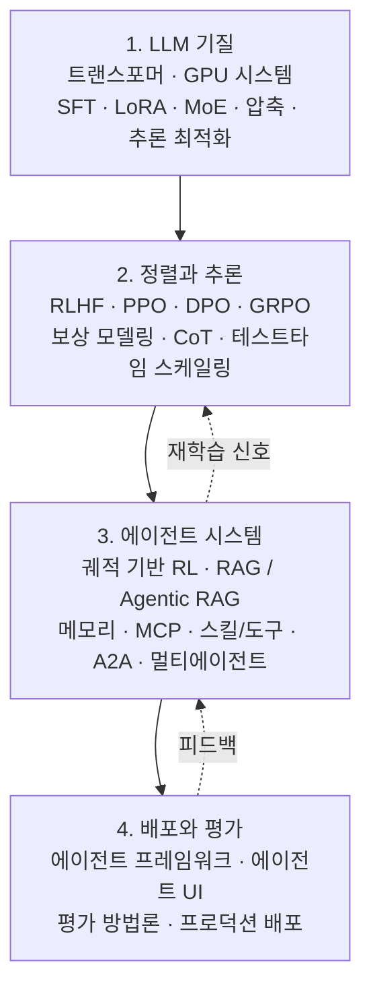

## Overview

Anyone studying agentic AI quickly notices that the material is scattered. Transformer architecture lives in one place, reinforcement learning alignment in another, MCP and multi-agent collaboration in yet another blog post. Each piece is solid on its own, but resources that show how they connect into a single system are rare.

[The Hitchhiker's Guide to Agentic AI: From Foundations to Systems](https://arxiv.org/abs/2606.24937), published on arXiv in June 2026, targets exactly that gap. This is not a short survey. It is a practitioner reference that follows the full path from the LLM substrate, through alignment and reasoning, to building agent systems and deploying them in production. Each chapter pairs theoretical foundations with implementation guidance, code examples, and primary literature citations.

For a platform like ThakiCloud that treats agents as first-class resources, this guide hits close to home. Skills, tools, memory, and multi-agent orchestration -- the topics that fill the second half of the document -- are the same things we work with daily inside Paxis (Agent-Native Cloud). This post maps the guide across four layers and draws out what we can take from it for our own products.

## What This Guide Is

The guide assumes its reader is a practitioner who wants to build agents. It does not stop at listing concepts; it follows the full stack from first principles to production deployment. The emphasis is on dependencies between layers. Good agents do not emerge from nowhere. A well-trained model must come first, then alignment and reasoning capabilities are added on top, and only then do tool use, memory, and collaboration accumulate into a system.

The guide's scope, compressed into four layers:

We walk through each layer below.

## Foundation: The LLM Substrate

The guide starts with transformer architecture and GPU systems, then moves to training and fine-tuning: supervised fine-tuning (SFT), parameter-efficient techniques like LoRA, and mixture-of-experts (MoE) architectures. It closes with model compression and inference optimization.

The ordering is intentional. An agent's behavioral quality is ultimately bounded by its base model's capabilities, and the cost of running that model in practice hinges on compression and inference optimization. If inference costs cannot be brought down, the economics collapse the moment an agent starts calling tools multiple times and traversing long trajectories. Efficiency at the lowest layer determines feasibility at the highest.

## Alignment and Reasoning Layer

The second layer covers alignment and reasoning. It starts with reinforcement learning from human feedback (RLHF), works through PPO, DPO and its variants, and GRPO with reward modeling. It then moves to reinforcement learning for large reasoning models, covering chain-of-thought and test-time scaling.

An important shift happens here. The center of gravity moves from simply producing answers that people prefer, toward reasoning capability -- the ability to think longer and arrive at better answers independently. For an agent that plans across multiple steps and verifies intermediate results, this reasoning layer has to be solid. If alignment handles safety, reasoning handles autonomy.

## Agent Systems: MCP, Skills, Memory, Multi-Agent

The second half of the guide is devoted entirely to this layer, which signals where the weight of agentic AI actually sits. The topics covered are names we work with every day.

- **Trajectory-based reinforcement learning**: The learning signal is the full action trajectory -- a sequence of tool calls and observations -- not a single response.
- **RAG and Agentic RAG**: Retrieval-augmented generation is lifted from a static pipeline into a form where the agent actively decides its retrieval strategy.
- **Memory systems**: Structures for accumulating and retrieving knowledge across sessions.
- **MCP (Model Context Protocol)**: The standardized channel through which an agent connects to external tools and data.
- **Agent skills and tool use**: Capabilities packaged as reusable units that can be selected and executed.
- **A2A (Agent-to-Agent) protocols and multi-agent architectures**: Agents delegating and coordinating work with each other.

This list is effectively a parts specification for an Agent-Native platform. How do you select skills? How do you call tools safely? How do you route memory? How do you compose multiple agents' work into a DAG? The guide treats these questions as a unified system design problem, not a collection of isolated techniques.

## Deployment and Evaluation

The final layer covers actual operations: agent development frameworks, agent UI design, evaluation methodology suited to agentic tasks, and production deployment.

The fact that evaluation gets its own dedicated layer is striking. Metrics built for measuring single-response accuracy cannot capture an agent that calls tools repeatedly and traverses multiple steps. You need to look at trajectory success rate, safety at intermediate steps, and cost-effectiveness together. Placing evaluation as an independent topic rather than an appendix to implementation reflects how genuinely difficult it is to answer "how do we know this is working?" for agent systems.

## Implications for ThakiCloud Products

The second half of this guide overlaps closely with the design of ThakiCloud's **Paxis**. Paxis is an Agent-Native Cloud control plane that runs on top of ai-platform, treating skills, tools, policies, and audit logs as first-class resources. Mapping the guide's components onto our layers:

- **Agent skills and tool use -- Skill Harness**: Paxis selects from over 960 skills using BM25 and executes them in isolated sandboxes. This is the guide's "package capabilities as reusable units" principle operating at production scale.
- **MCP -- MCP Connector**: Paxis connects to external tools and data through MCP connectors with automatic OAuth reconnection. The guide's standardized connection channel becomes infrastructure that recovers from failures on its own.
- **Memory systems -- HKE Knowledge Engine**: Knowledge accumulated and retrieved across sessions is handled through a wiki-based knowledge engine.
- **Multi-agent and A2A -- DAG Multi-Agent**: Tasks are composed into DAGs for delegation and coordination, with NL Cron for time-based scheduling.
- **Deployment, evaluation, safety -- Policy Gate + Audit Log + Self-Evolving Skills**: Every agent action passes through a policy gate and audit log. Recurring patterns are absorbed into self-evolving skills. This directly addresses the same concern that led the guide to treat evaluation as a separate layer.

The substrate layer carries implications too. The inference optimization and compression covered in the guide's first layer map directly to the work of **ai-platform**. ThakiCloud's ai-platform provides the inference infrastructure -- Kubernetes with Kueue-based GPU scheduling, vLLM serving, and multi-tenant isolation -- that keeps economics viable even when an agent makes many tool calls. Low serving cost (ai-platform) creates agent economic viability (Paxis). The guide's lowest layer and highest layer connect in a single line within our product.

## Limitations and Counterpoints

Taking this document as the final word on the subject would be a mistake. First, the field moves fast. Agentic AI standards shift on a monthly basis. MCP and A2A implementation details that are accurate today may look different in six months, and the guide's code examples are tied to specific versions. As a conceptual map it has lasting value; implementation specifics always need to be verified against primary sources.

Second, covering everything necessarily means nothing gets covered to its full depth. Bundling every layer into one document gains breadth but loses depth. Bringing any specific technique to production quality still requires dedicated literature and hands-on experimentation. The guide's real value is not the answers it gives but the map it draws -- showing where each scattered piece sits inside a unified system. Reading a map and actually driving are different things.

## Sources

- [The Hitchhiker's Guide to Agentic AI: From Foundations to Systems (arXiv:2606.24937)](https://arxiv.org/abs/2606.24937)
- [alphaXiv page](https://www.alphaxiv.org/abs/2606.24937)
