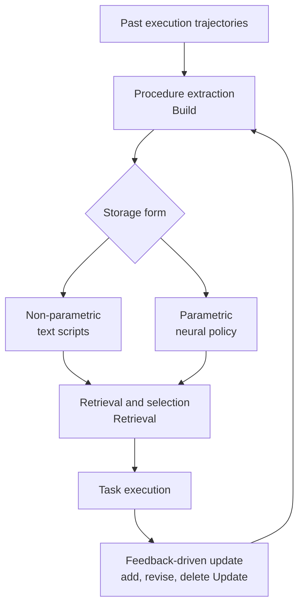

## Overview

Anyone who has run LLM agents for a while hits the same wall. The agent reasons from scratch every time, fumbling its way back through a procedure it already solved last week. A common fix is to cram frequently used skills straight into the prompt. But this approach is fragile for two reasons. First, as skills accumulate they eat up the context window, leaving less room for the actual task. Second, prompt templates break easily the moment the situation shifts even slightly.

Recent research on agent memory reframes this problem through the lens of **procedural memory**. Just as human procedural memory holds skilled actions that execute without conscious thought, like riding a bike, an agent's procedural memory compresses the execution steps of recurring tasks into a reusable form. The core shift is moving procedural knowledge **beyond prompt retrieval**, into a separate storage, retrieval, and update architecture, and ultimately into a neural policy embedded in the model's own parameters.

This post maps that shift through peer-reviewed papers. Since ThakiCloud's Agent-Native Cloud, Paxis, treats skills as first-class resources in exactly the way this research line points toward, we close by drawing that connection.

## What Is Procedural Memory

From a cognitive-science standpoint, memory is commonly split into three kinds: semantic memory for facts, episodic memory for events, and procedural memory for methods. In the agent literature, procedural memory covers the "how": it abstracts complex action sequences into reusable patterns, so the agent doesn't have to plan from the ground up every single time.

The trouble is that in most agents today, this procedural knowledge exists in one of three forms: hand-crafted by a person, embedded in a brittle prompt template, or implicitly entangled in the model's parameters where it is expensive to update. What this research targets is lifting that knowledge into a **learnable, updatable, first-class object**.

## Beyond Prompt Retrieval: Separating Build, Retrieval, and Update

The paper that takes this shift on directly is **Memp: Exploring Agent Procedural Memory** (arXiv 2508.06433). Memp treats procedural memory as a first-class optimization target and distills past trajectories into two layers: fine-grained, step-by-step instructions, and higher-level, script-like procedures. It then splits the memory loop into three distinct phases: **build, retrieval, and update**. In the update phase, entries are added, revised, or deleted based on execution feedback.

This separation matters because it is fundamentally different from stuffing skills into a prompt. In the prompt-based approach, storage and retrieval are collapsed into one, and the very concept of "update" barely exists. Once you separate the three phases, when and how a procedure enters or leaves the pool, and what gets fixed after a failure, become explicit design decisions. According to the literature, the broader direction of this shift is summarized as a move **from explicit non-parametric templates toward implicit parametric neural policies** (the Foundation Agents memory survey, arXiv 2602.06052). In other words, the field is moving past storing and retrieving procedures as text, toward folding experience directly into the model's own policy.

## Why This Matters Now: The Evaluation Problem

Whether procedural memory actually produces usable skills is still not well understood. The paper aimed at this gap is **Managing Procedural Memory in LLM Agents** (arXiv 2606.23127). It proposes a benchmark called **AFTER**: 382 realistic enterprise tasks spanning 6 job roles, paired with 22 procedural skills, built to measure how well a skill transfers across tasks, roles, and model backbones.

The question this benchmark raises is the crux of the matter. Does a procedure learned in one context hold up in another? Does a skill still work once the underlying model changes? The moment you introduce procedural memory, you need a way to measure whether a given skill is actually reusable. Even with a solid build-retrieve-update architecture in place, a skill that fails to transfer ends up no better than an expensive prompt template.

## Implications for ThakiCloud's Products

This line of research already has a concrete production shape in ThakiCloud's **Paxis**. Paxis is an Agent-Native Cloud that treats **skills, tools, policies, and audit logs as first-class resources**. Its skill harness is, in effect, procedural memory running in production.

- **A practical counterpart to build, retrieval, and update**: Paxis's skill harness selects (retrieves) from more than 960 skills via BM25, executes them in isolated sandboxes, and improves (updates) them through a self-evolution loop. The three-phase separation that Memp proposed shows up here as an operating system.
- **An architecture that moves past prompt retrieval**: Instead of stuffing skills into every prompt, Paxis selectively pulls in verified skills, which preserves the context budget while keeping the procedure consistent. This lines up exactly with the "beyond prompt retrieval" direction covered in this post.
- **Evaluation and audit**: Paxis manages the "transferability" that the AFTER benchmark emphasizes through policy gates and audit logs. Because which skill was selected, when, and what it did is all tracked, there is a data-backed basis for telling reusable procedures apart from ones that are not.

From an infrastructure standpoint, ai-platform underpins this skill execution. Because agents run skills on top of Kueue GPU scheduling and multi-tenant serving, the execution cost of procedural memory feeds directly into serving efficiency. Low-cost serving (ai-platform) is what makes agent economics (Paxis) sustainable.

## Limitations and Counterarguments

Moving procedural memory toward a parametric neural policy comes with a clear cost. A text script can be read and edited by a human, but a procedure folded into parameters is hard to audit and hard to update. It is difficult to inspect what has actually been stored, and just as difficult to pick out and delete a bad procedure. In regulated or sovereign environments where explainability matters, that opacity becomes a risk in its own right.

Non-parametric retrieval is not a silver bullet either. Retrieval can still surface the wrong procedure, and selection quality can degrade as the storage pool grows. As benchmarks like AFTER show, skill transferability is still at an early stage of validation, and there is no guarantee that a procedure that works in one domain will work in another. Procedural memory is a promising direction for keeping agents from starting over from a blank slate every time, but it will only become a trustworthy production asset once storage form, retrieval quality, update safety, and evaluation methodology mature together.

## Sources

- [Memp: Exploring Agent Procedural Memory (arXiv 2508.06433)](https://arxiv.org/abs/2508.06433)
- [Managing Procedural Memory in LLM Agents: Control, Adaptation, and Evaluation (arXiv 2606.23127)](https://arxiv.org/abs/2606.23127)
- [Rethinking Memory Mechanisms of Foundation Agents in the Second Half: A Survey (arXiv 2602.06052)](https://arxiv.org/abs/2602.06052)
