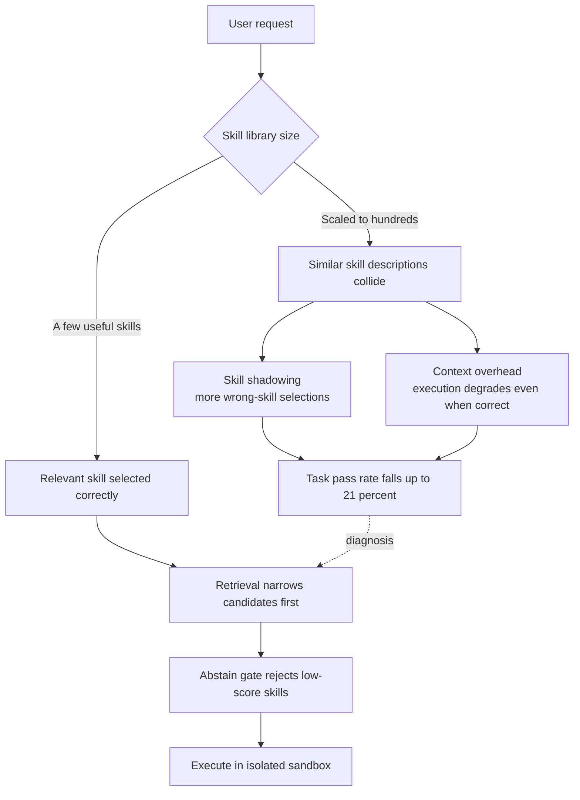

## Overview

Handing an agent more skills feels like it should make it more capable, but recent research reports the opposite. As a skill library grows, an agent's success rate on the same tasks can actually fall. arXiv 2605.24050, "More Skills, Worse Agents? Skill Shadowing Degrades Performance When Expanding Skill Libraries," confronts this paradox head-on and reports that task pass rate drops by up to 21% when scaling from a small set of helpful skills to a 202-skill library.

This is an operational reality, not an academic curiosity. ThakiCloud's Agent-Native Cloud, Paxis, already manages over 960 skills and must decide, on every request, which of them to load. Adding skills is easy; picking the right one from a swollen library gets steadily harder. This post uses skill shadowing as a lens to name that bottleneck, then shows how the Paxis skill harness blocks it in practice with retrieval and an abstain gate, backed by real measurements.

## What Is Skill Shadowing

A skill library lets an LLM agent load task-specific instructions on demand. The goal is to let a non-expert user solve domain tasks in natural language without knowing which skills exist or how they work internally. The trouble begins as the library grows.

The core contribution of arXiv 2605.24050 is to decompose the performance drop into two effects. The first is **skill shadowing**: as the library grows, similarly described skills collide and the agent picks the wrong skill more often. The second is **context overhead**: skill descriptions fill the context and degrade execution quality even when the selection was correct.

The paper's conclusion cuts against intuition. The primary culprit is not the bloated context but **the wrong skill selection itself**. In other words, the bottleneck is not "the model has to read too much text" but "the model cannot pick the right skill among lookalike descriptions." That diagnosis changes the response. Compressing context is not enough; you need a retrieval step that narrows candidates and selects precisely in the first place.

This flow overlaps precisely with a problem we already faced. Stuffing the full skill list into the prompt breaks the moment the count passes a few hundred. Instead of endlessly growing the library, you must switch to retrieving only the top candidates per request.

## Why This Matters Now

The scale problem is not confined to one paper. The SkillRet benchmark (arXiv 2605.05726), released around the same time, assembles 17,810 public agent skills into a large-scale retrieval benchmark organized under a two-level taxonomy of 6 major and 18 sub-categories. Skills are now accumulating at the scale of tens of thousands, and retrieving the right one from that pool has become a research problem in its own right.

In short, a gap is opening between the pace at which communities add skills and the ability to select them accurately. The shadowing work shows quantitatively that this gap turns into real performance loss, while benchmarks like SkillRet supply a common yardstick to measure it. Both point to a single practical prescription: **treat retrieval and selection as first-class problems, separate from growing the library.**

## Implications for ThakiCloud Products

This research direction maps exactly onto a design the Paxis skill harness already implements. Paxis is ThakiCloud's Agent-Native Cloud and treats skills as first-class resources. Rather than pushing the entire skill list on every request, it narrows candidates to the top matches with BM25 lexical retrieval and loads only those. That is the first line of defense against skill shadowing. When the candidate set shrinks from hundreds to a few, the room for lookalike descriptions to collide shrinks with it.

The second line of defense is the **abstain gate**. When the top retrieval score falls below a threshold, no skill is forced; the request falls through to native handling. If the essence of skill shadowing is "picking a plausible wrong skill when unsure," the abstain gate is the mechanism that deterministically blocks that unsure match in code. Rather than trusting the model to judge "this is ambiguous," a score threshold owns the decision.

Our skill-retrieval harness's actual measurements show the design works. On our internal SRA bench (63 cases), Recall@5 was 82.2%, the gated accuracy with the abstain gate applied was 66.7%, Top-1 was 40.0%, and hallucination (inventing a nonexistent skill to match) was 0%. The 0% hallucination in particular is a direct effect of the abstain gate: no matter how large the library grows, it neither fabricates a missing skill nor forces a below-threshold match.

On top of this sit Paxis's isolated sandbox execution, policy gates, and audit logs. Even if a wrong skill is occasionally selected, its execution happens in an isolated environment and every action is recorded in the audit log. Even when skill shadowing does not vanish entirely, its blast radius is contained at the execution boundary. The bottleneck the research diagnoses (selection failure) and its downstream risk (wrong execution) are blocked in three layers: retrieval, gate, and isolation.

## Limitations and Counterpoints

Both the research and our design have clear limits. First, the 21% drop in arXiv 2605.24050 is a value under a specific setup (a 202-skill library) and varies greatly with the quality and overlap of skill descriptions and the task domain. Describe skills well and keep them from overlapping, and the drop shrinks at the same scale. The precise lesson is not "do not add skills" but "manage description quality and retrieval together."

Second, BM25 lexical retrieval is not a panacea. For queries in pure Korean terminology that lack English expansion vocabulary, it can fail to surface the right skill, and our bench's Top-1 of 40.0% leaves plenty of room to improve. Reinforcements like embedding ensembles are on the table, but whether they justify giving up the determinism and low cost of a single signal is a separate call. Before making retrieval heavier, improving the skill descriptions themselves usually yields the larger gain.

Third, the abstain gate reduces to a threshold-tuning problem. Too high, and it excludes useful skills, hurting coverage; too low, and it fails to block shadowing. The 0% hallucination result is a product of a conservatively set threshold, and it comes at the cost of missing some legitimate matches. Ultimately, running a skill library is not a question of "how much to grow it" but of "how to balance retrieval, gate, and description quality," and the shadowing work is a quantitative warning that this balance starts to wobble at a smaller scale than you would expect.

## Sources

- More Skills, Worse Agents? Skill Shadowing Degrades Performance When Expanding Skill Libraries, arXiv 2605.24050 (<https://arxiv.org/abs/2605.24050>)
- SkillRet: A Large-Scale Benchmark for Skill Retrieval in LLM Agents, arXiv 2605.05726 (<https://arxiv.org/abs/2605.05726>)
