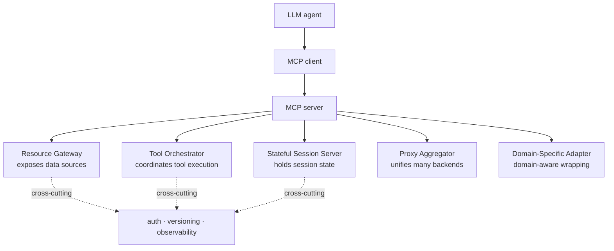

## Overview

The Model Context Protocol (MCP) is a standard interface Anthropic released in November 2024. It provides a common way to connect large language models to external tools, data sources, and services. Within months, hundreds of community-built MCP servers appeared on GitHub. Yet no software-maintenance literature had described how those servers were actually being structured in production.

The paper [MCP Server Architecture Patterns for LLM-Integrated Applications](https://arxiv.org/abs/2606.30317) by Carson Rodrigues et al., posted to arXiv on June 29, 2026, fills that gap. Using a corpus of 15 independently developed MCP servers, it catalogs five recurring architecture patterns and four anti-patterns, along with cross-cutting concerns around authentication, versioning, and observability.

For anyone running agent infrastructure, one part stands out. The paper actually measured how many tools you can attach, and the answer is much lower than most teams assume. Because this maps directly onto how ThakiCloud handles more than 960 skills in Paxis, our Agent-Native Cloud, this post walks through the measured results alongside our own design choices.

## What the Study Is

The approach is empirical. Instead of prescribing what servers should look like, the authors dissected 15 running servers and inductively extracted their shared structure. The five resulting patterns split along two axes: what the server exposes to the LLM, and how it handles state.

The value of this taxonomy is that it forces you to decide "what kind of server is this" before you build. Cram a Tool Orchestrator's complex execution logic into a Resource Gateway and you combine the downsides of both. Choosing a pattern explicitly is itself a design discipline.

## The Five Architecture Patterns

**Resource Gateway** exposes data sources such as databases, file systems, or APIs in a read-centric way. The tools themselves are simple; the real question is which resources you open, and under what permissions.

**Tool Orchestrator** bundles several tools and coordinates an execution flow. A single call often runs multiple internal steps, so failure handling and partial rollback are the core difficulty.

**Stateful Session Server** maintains state across a conversation or work session. LLM calls are essentially stateless, so the server holds the state on the model's behalf and must define session lifetime and cleanup clearly.

**Proxy Aggregator** merges several backends or other MCP servers behind a single surface. Convenient, but as the tools behind it multiply, it soon leads to the tool-overload problem discussed below.

**Domain-Specific Adapter** wraps concepts of a specific domain (finance, healthcare, internal systems) into a shape the LLM handles well. It bakes domain terms and constraints into the tool schema so the model does not attempt nonsensical combinations.

## Tool Overload: Why More Tools Make Models Wobble

The most operationally important part of the paper measures the relationship between tool count and tool-selection accuracy. The result is clear: once the number of tools in context passes a threshold, the model's accuracy at picking the right tool drops below 90%.

Specifically, the paper reports that for Claude Haiku 4.5 accuracy falls below 90% somewhere between 10 and 15 tools, and for Sonnet 4 between 20 and 30 tools. Larger models tolerate more tools, but there is no point at which "attach as many as you like" holds. As tools multiply and descriptions grow vague, the model gets confused.

This measurement overturns a common instinct. Teams adding MCP for the first time often start by "exposing every API we have as a tool." Merge several backends with a Proxy Aggregator and the tool count reaches dozens fast, dropping you off the accuracy cliff. Tool count is not free; it spends the model's judgment budget.

## Anti-Patterns and Cross-Cutting Concerns

The paper also catalogs four anti-patterns. The exact names are not confirmed at the abstract level, but the direction connects to the measurement above. Growing tools indiscriminately, leaving tool descriptions vague so the model has to infer intent, letting sessions drift without state management, and handling authentication and versioning inconsistently per server are the typical failure modes.

For cross-cutting concerns, it emphasizes authentication, versioning, and observability. All three are needed regardless of which pattern you choose. Observability in particular often gets pushed to the back in agent systems, yet when a tool call fails and you cannot trace why, debugging becomes practically impossible.

## Implications for ThakiCloud Products

The paper's tool-overload conclusion overlaps precisely with why ThakiCloud built **Paxis**. Paxis is an Agent-Native Cloud control plane running on top of ai-platform, treating Skills, Tools, Policies, and Audit Logs as first-class resources. The key piece is the **Skill Harness**.

Paxis holds more than 960 skills, but it never dumps all of them into the model's context as tools. Instead, for each user request it selects only a small set of relevant skills via BM25 search and exposes those. Mapped onto the paper's measurement, this is a design that sidesteps the accuracy cliff. The model always faces a manageable handful of tools, while the remaining hundreds of capabilities are pulled in on demand. "Many capabilities, few exposed" is our answer to the tool-overload problem.

We manage the Proxy Aggregator risk through the same lens. Paxis MCP connectors link many external services, but rather than exposing every connected tool, a policy gate filters them so only what is actually needed reaches the isolated sandbox execution path. Every tool call leaves an audit log, satisfying the observability requirement. The authentication, versioning, and observability the paper flags as cross-cutting concerns are wired in by default in Paxis, not optional.

The infrastructure layer, **ai-platform**, is worth noting too. As MCP servers multiply, each one eventually runs as a process somewhere. ai-platform serves these servers reliably on K8s and Kueue-based GPU scheduling with multi-tenant isolation, extending to on-prem and sovereign environments. For state-holding servers like a Stateful Session Server, placement and lifecycle management matter, and K8s operational maturity becomes a direct advantage.

## Limitations and Counterpoints

The paper rests on a relatively small corpus of 15 servers. The MCP ecosystem is growing so fast that whether these five patterns remain representative is something to watch. New patterns may emerge, or today's anti-patterns may be eased by better tooling.

The tool-selection accuracy measurement also depends on model and prompt design. Well-written tool descriptions and clear naming raise accuracy at the same tool count. In other words, there is no absolute line of "N tools is safe"; tool count is one variable among several. Even so, the direction is unambiguous. Tools are not free, and the discipline of exposing only what is needed is the foundation of agent reliability.

## Sources

- Carson Rodrigues et al., [MCP Server Architecture Patterns for LLM-Integrated Applications](https://arxiv.org/abs/2606.30317), arXiv:2606.30317 (2026-06-29)
- [Model Context Protocol official introduction](https://modelcontextprotocol.io/)
