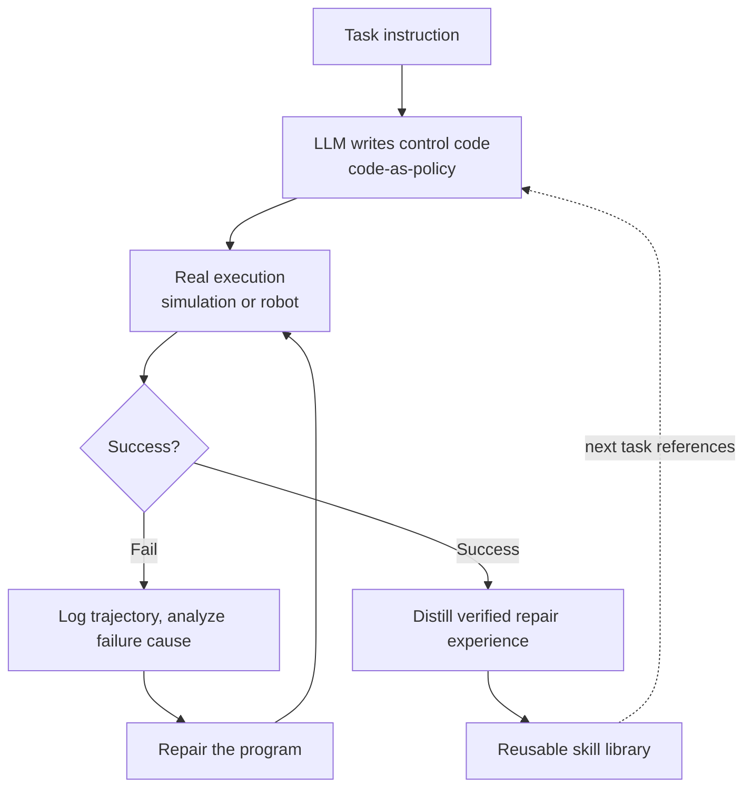

## Overview

Anyone who has run robots for a while sees a familiar waste. Even when a robot painstakingly succeeds at a task, most of the trial and error it went through is thrown away. On the next task it fumbles from scratch again. The fine-grained know-how earned through failure, such as how to recover when a gripper slips or the right approach angle for a particular object, is left nowhere in the system. A person reuses a knack once learned; a robot does not.

NVIDIA's GEAR team addressed exactly this with **ASPIRE** (Agentic /Skills Discovery for Robotics, arXiv 2607.00272), released on June 30, 2026. The idea is simple but powerful. Instead of injecting a fixed policy into the robot, a large language model (LLM) **writes the robot control code itself**, runs that code in the real execution environment, observes the failures, repairs it iteratively, and then distills the verified repair experience into **reusable Skills**. Experience is not discarded; it compounds.

This post lays out ASPIRE's architecture and measured results based on the verified paper and project page. It then argues that this is not a robotics-only story: the same pattern applies to software agents, and we close by connecting it to how ThakiCloud's Agent-Native Cloud, Paxis, treats skills as first-class resources.

## What ASPIRE Is

ASPIRE lays a continual-learning loop on top of the **code-as-policy** paradigm. Traditional robot learning often trains a neural policy on large volumes of demonstration data, then recollects data and retrains whenever a new situation appears. That carries two burdens: data collection is expensive, and knowledge learned once breaks easily in the face of new variations.

ASPIRE represents the policy not as neural-network weights but as **executable code**. When the LLM receives a task and writes a control program, that program runs in simulation or on a real robot. If execution fails, ASPIRE records the execution trajectory, analyzes the cause of failure, fixes the program, and tries again. Once this loop reaches success, the verified repair knowledge is stored in the skill library. The next task starts not empty-handed but by referencing that library.

The key is that last arrow. As the skill library feeds back into writing the next task, the system writes better code faster over time. The paper describes how this accumulated knowledge **transfers** across tasks in the form of grasp-recovery heuristics, navigation strategies, prompting recipes, and procedural fixes. It is not about solving one particular task well; the capacity to solve tasks itself accumulates.

## Distilling Failure Into Skills

What sets ASPIRE apart from other robot learning is how it treats failure. In most pipelines, failure is something to discard, or at best a negative signal that trims a reward. ASPIRE treats failure as **learning material**. A failed execution's trajectory contains the information of "what went wrong and why," and the LLM reads it to reason about where and how to fix the code.

If that repair ended as a one-off improvisation, its value would be limited. ASPIRE's contribution is **distilling the verified repair into a generalizable skill**. For example, if a slip while picking up a particular object is fixed into a success, the recovery procedure is abstracted into a form that is not tied to that object alone but can be reapplied to similar grasping situations. Because a skill is a code fragment expressed as text, a person can read and audit it, and it can be managed and versioned as a library. This is a major advantage over black-box neural policies.

Thanks to this structure, ASPIRE lifts performance **with no additional training data**. Instead of collecting new demonstrations to retrain the model, simply repeating the execute-fail-repair-distill loop raises the success rate. In robotics, where data collection is the bottleneck, this is a practically important property.

## Real Experimental Results

The numbers reported in the paper and project page show this loop is more than a concept. The most striking result is Robosuite's bimanual object handover task. Starting from a baseline success rate of **20%**, it climbed to **92%** through iterative debugging alone, a figure reached with zero additional demonstration data, using only the execute-repair loop.

The advantage holds as task types broaden. The paper reports that ASPIRE outperforms prior methods by up to **77%** on LIBERO-Pro (a manipulation task under perturbation), by **72%** on Robosuite bimanual handover, and by up to **32%** on BEHAVIOR-1K (a long-horizon household task). In particular, in the long-horizon generalization experiments, the success rate rose steadily as the skill library grew. The fact that library growth and performance rise together supports this system's central claim that experience genuinely compounds.

The research team spans NVIDIA's GEAR lab together with researchers from the University of Michigan (UMich), the University of Illinois (UIUC), UC Berkeley, and Carnegie Mellon (CMU). NVIDIA stated that ASPIRE's skill library would be open-sourced at release, with details on the project page (research.nvidia.com/labs/gear/aspire). That said, the specific license of the code repository was not confirmed as clearly stated at release time, so it is safer to check the actual repository's license terms directly before adopting it.

## Implications for ThakiCloud Products

ASPIRE targets a robot arm, but the message its architecture sends carries straight over to software agents. Take the sentence "an agent writes code, learns from failure, and distills verified experience into reusable skills stacked in a library," swap "robot" for "cloud agent," and you get exactly the structure ThakiCloud's Agent-Native Cloud, **Paxis**, is built toward.

Paxis treats Skills, Tools, Policies, and Audit Logs as first-class resources. ASPIRE's skill library corresponds in Paxis to a skill harness of some 960 skills selected via BM25, and ASPIRE's code-as-policy execution corresponds to Paxis's isolated sandbox execution. Just as ASPIRE records and analyzes failure trajectories, Paxis passes every agent action through a policy gate and audit log so that what failed and why can be traced retroactively. And the self-improvement that ASPIRE's distillation loop aims for is realized in Paxis as self-evolving skills: the lessons drawn from execution feed back into new skills or skill revisions, so the next run does not start empty-handed.

From an infrastructure standpoint, ThakiCloud's **ai-platform** provides the foundation for this loop. An ASPIRE-style repeated execute-repair loop has to run simulation and inference in bulk, which presupposes elastic scheduling of GPU resources. ai-platform is designed to absorb such repetitive workloads cost-effectively on top of Kueue-based GPU scheduling and multi-tenant isolation. Low-cost serving makes the agent's execute-repair repetition economical, and the skills accumulated that way in turn raise the agent's autonomy, a virtuous cycle. For customers who require on-premises and sovereign environments, being able to run this entire loop inside their own infrastructure is especially meaningful.

## Limitations and Counterarguments

Impressive as ASPIRE's results are, a few reservations are in order. First, the reported numbers come mostly from simulation benchmarks (Robosuite, LIBERO-Pro, BEHAVIOR-1K). Iterative debugging in simulation is cheap and safe, but on real hardware every attempt carries time, wear, and safety risk. Whether the economics of the execute-fail-repair loop hold on physical robots needs separate validation.

Second, code-as-policy is strong on tasks where the LLM can write valid control code, but for precise continuous control or actions needing high-frequency feedback, there remains a region hard to express as code. ASPIRE appears to delegate such low-level control to existing skills or primitives, and the quality of those primitives may cap overall performance.

Third, as the skill library grows, the burden of retrieval and selection increases. The result that library growth tracks with performance gains is encouraging, but whether picking a wrong skill or a stale skill triggering wrong answers becomes a problem at larger scale bears continued watching. This is a challenge Paxis's skill harness has already faced, and BM25 selection, the policy gate, and audit logs are precisely the mechanisms for managing that risk.

Even so, the direction ASPIRE points to, not discarding failure but compounding it as verified skills, is likely to become a standard on both the robotics and software-agent sides. The real contribution of this work is the shift in perspective: growing capability through accumulated skills rather than through data.

## Sources

- ASPIRE: Agentic /Skills Discovery for Robotics, arXiv 2607.00272: <https://arxiv.org/abs/2607.00272>
- Project page (NVIDIA GEAR): <https://research.nvidia.com/labs/gear/aspire/>
- Paper page (Hugging Face): <https://huggingface.co/papers/2607.00272>
