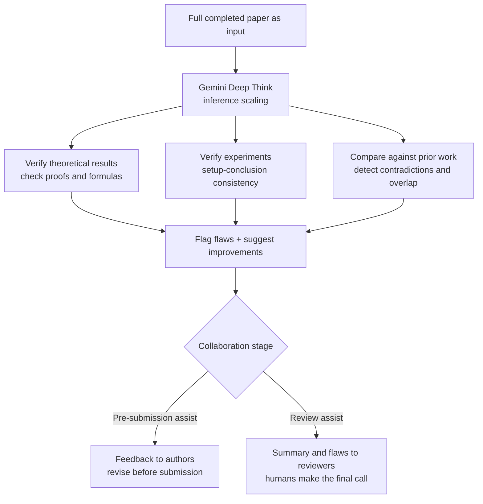

## Overview

Peer review has been a bottleneck for a long time. Submissions keep growing every year, but the hours reviewers have to spend on them do not. The result is a familiar pattern: significant errors slip through review, get published, and only later get corrected or retracted. Google's recently released Paper Assistant Tool (PAT) targets this problem head on. PAT is an agentic review framework that takes a complete scientific paper as input, checks its theoretical results, verifies its experiments, suggests improvements, and flags potential flaws.

What makes this research interesting is that it goes well beyond "summarizing a paper with an LLM." PAT is built around the idea that single-shot prompting and simple sampling have real limits, and it is designed instead to scale reasoning itself. ThakiCloud already runs an internal pipeline that automates paper review on top of a Kubernetes-based AI/ML SaaS platform, so this work is not an abstract case study for us. It speaks directly to how we design our own verification loops. This post covers what PAT does and how, what it actually caught in real deployments, and what its design implies for ThakiCloud's products.

## What This Research Is

PAT's core design choice is inference scaling. Concretely, it uses Gemini Deep Think so that instead of producing an answer from a single prompt, the model reasons deeply across multiple stages. Reviewing a paper is inherently a long, complex analytical task. Checking whether a theorem's proof actually holds, whether the experimental setup supports the stated conclusions, and whether the paper contradicts prior cited work all take more than one response to work out. PAT breaks this judgment down into multiple reasoning stages.

PAT is also not designed as a simple pass/fail judge. It is built as an assistant that reads a paper, points to specific flaws, and proposes improvements. For authors, it acts as a pre-submission helper that improves clarity and catches bugs before a paper goes out. For reviewers, it acts as an assistant that drafts summaries and points out potential flaws, while leaving the final judgment to a human. In other words, it is clearly positioned to support human judgment rather than replace it.

## Key Results

PAT's performance was measured on the SPOT benchmark, a dataset built from scientific papers that were retracted or found to contain confirmed errors. On this benchmark, PAT achieved 89.7% detection accuracy for mathematical and logical errors, about a 34% improvement over the zero-shot baseline. That means inference scaling caught a substantial share of the errors that single-shot prompting had been missing.

What is even more striking is the result from real deployment. PAT was used in pilots for STOC 2026 and ICML 2026, reviewing more than 4,700 submissions. In this process, it found significant theoretical errors in more than a third of ICML papers, and it is reported to have prompted 31% of authors to run new experiments [estimate: as stated in the paper]. If these numbers hold up, it means automated review has already moved past the lab-demo stage and started to influence real conference processes.

Of course, these figures come from the paper's authors, so they should be read with some caution until they are independently reproduced. Still, the fact that the paper presents both a benchmark (SPOT) and a real-world deployment (STOC/ICML) together, and that it measures not just error detection but a downstream behavioral change in authors (running new experiments), reflects a methodologically serious approach.

## A Four-Stage Taxonomy of AI-Human Collaboration

Another contribution of this research is a taxonomy that breaks down AI-human collaboration in scientific evaluation into four progressive stages. Each stage differs in how much judgment is delegated to the AI, and the authors discuss the trade-offs of each stage.

The current pilot sits at a relatively conservative stage. The AI acts as a pre-submission assistant that improves clarity and catches bugs before a paper is submitted, and as a reviewer's assistant that drafts summaries and flags potential issues while leaving the final decision to a human. This taxonomy is useful because it frames automated review not as an all-or-nothing binary but as a spectrum of delegation levels that can be tuned. High-stakes final judgments can stay with humans while repetitive, mechanical checks are handed off to the AI.

## Implications for ThakiCloud's Products

The design philosophy behind this research connects directly to ThakiCloud's Paxis. Paxis is an Agent-Native Cloud control plane running on top of ai-platform, and its core principle is closing fan-out with verification. PAT's rejection of single-shot prompting in favor of inference scaling to raise error-detection rates comes from the same underlying concern as the way Paxis filters the output of parallel subagents through an adversarial verification stage instead of merging results directly. The structure of spinning up multiple skeptical verifiers from different angles and using a vote to weed out flaws maps almost exactly onto PAT's approach of cross-checking proofs and experiments across multiple reasoning stages.

In practice, ThakiCloud already runs an automated paper review pipeline. It takes an arXiv paper as input, produces an in-depth peer review, turns the results into a document the team can read, and routes action items from the review into system improvement tasks. PAT's results point our pipeline in two directions. First, to raise detection quality, it may be more effective to add reasoning stages before reaching for a bigger model. Second, the output of automated review has to be concrete flaws and suggested improvements, not a pass/fail verdict, if it is going to be genuinely useful.

On the infrastructure side, the ai-platform lens completes the picture. Inference scaling means higher inference cost. Reviewing a single paper in depth, across multiple stages, consumes a proportionally larger amount of tokens and compute. ai-platform absorbs this repeated inference load cost-effectively through Kubernetes and Kueue-based GPU scheduling, vLLM serving, and multi-tenant isolation. Running a workload that continuously reviews a large volume of papers economically requires this kind of serving infrastructure underneath it. For research institutions with on-premises or sovereignty requirements, being able to review sensitive, unpublished papers on their own infrastructure without sending them outside is also a meaningful differentiator.

## Limitations and Counterarguments

Reading this research purely optimistically would be risky. First, most of the reported figures come from the authors' own presentation. Numbers like the 89.7% detection rate or catching errors in a third of ICML papers should be treated as an upper bound until independently reproduced. In particular, the fact that the SPOT benchmark is built from retracted or erroneous papers means it may not match the actual distribution of submissions, so generalizing from it needs care.

Second, there is the risk of false positives in automated review. If the AI flags something as an error when it is actually a legitimate method, it can place an unnecessary burden on authors or discourage legitimate research. This is exactly why keeping the final judgment with a human is essential; if that boundary erodes, automation could end up lowering the quality of review rather than raising it.

Third, as review automation deepens, reviewers may start accepting the AI's judgments uncritically, a kind of cognitive complacency. The attitude of "the AI already checked it, so it must be fine" is one of the most quietly dangerous failure modes. Automated review is a tool to support human judgment, not to replace it, and the core judgment calls still need to be owned by humans. The fact that PAT deliberately keeps its collaboration stage conservative and leaves the final decision with humans reads as a design choice made with this risk in mind.

To summarize, PAT is an important case showing that automated scientific review has started moving past the demo stage into real conference processes. But its strength does not come from a flashy single model. It comes from a careful design that scales reasoning across multiple stages and keeps the final judgment with humans. That is the same direction ThakiCloud has learned from its own paper review pipeline and Paxis verification loop. Good verification comes from good structure.

## Sources

- Towards Automating Scientific Review with Google's Paper Assistant Tool, arXiv:2606.28277: [arxiv.org/abs/2606.28277](https://arxiv.org/abs/2606.28277)
- Hugging Face Papers: [huggingface.co/papers/2606.28277](https://huggingface.co/papers/2606.28277)
