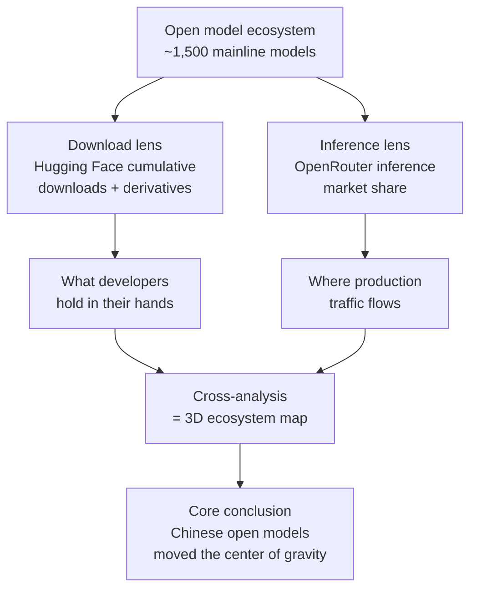

## Who Should Read This

This post is for engineers and technical leaders who have to decide which open model to run on their own infrastructure. It is aimed at people who want to move past impressions like "I hear Llama is good these days" and instead confirm with data what people actually download and what they actually run inference on. The ATOM Report is a rare piece of work that measures both of those axes in one place, and its conclusion is that the center of gravity of open models has visibly moved over the past year.

## Overview: Why a Map of the Open Model Landscape Now

When we talk about open language models, we usually look at benchmark tables. But a scoreboard tells us what performs well, not what actually gets used. It is common for a top-ranked model to be one that almost nobody deploys, and equally common for a model with unremarkable scores to be overwhelmingly adopted in the field. For anyone operating infrastructure, the latter is the real signal. What the community actually holds in its hands and puts into production determines which ecosystem we should bet on.

The ATOM Report (arXiv 2604.07190, published April 8, 2026) answers exactly this question head-on. Produced by Interconnects, the report covers roughly 1,500 mainline open models and cross-references Hugging Face downloads, derivative model counts, inference market share, and performance metrics to draw a snapshot of the entire open model ecosystem. Its value lies in being a top-down map of the ecosystem rather than one organization boasting about the success of its own model.

## What the ATOM Report Measured

The methodology begins by trying to avoid the trap of a single metric. Attempts to reduce the success of an open model to one number almost always distort. Look only at Hugging Face downloads and models with active fine-tuning communities get overrated; look only at inference API calls and models that landed well on commercial hosting get overrated. The ATOM Report separates these two and places them side by side. One is a download lens that shows what developers pull down and tinker with themselves; the other is an inference lens that shows where real production traffic flows.

The key point is that these two lenses show different pictures. On download metrics, model families with large derivative ecosystems lead; on inference metrics, usage is spread more evenly across organizations. Only by overlaying the two photographs taken from different angles does the ecosystem become three-dimensional. That methodological stance is something the report repeatedly emphasizes.

## Key Finding: Chinese Open Models Reshaped the Landscape

The report's heaviest finding is a reversal in the regional balance. Chinese open models overtook the U.S. camp in the summer of 2025 and have since widened the gap rather than closing it. This is not a single flashy release pulling ahead briefly; it is a structural shift observed on both the download and inference axes together.

On the download axis, the name that symbolizes this shift is Qwen. Alibaba's Qwen family is the single most-used open model family, reaching roughly one billion cumulative downloads as of March 2026. Its derivative count exceeds 100,000. Other families such as Llama, DeepSeek, and Kimi follow, but the gap to Qwen is substantial. A single family carrying a derivative ecosystem of that scale means the layer of developers who fine-tune and redistribute on top of it is that much thicker. Ecosystems run on this kind of momentum. Heavy use accumulates tooling and recipes, and abundant tooling drives more use.

The inference axis looks a little different. On OpenRouter measurements, usage is split more across organizations rather than concentrated in one family, and within that split DeepSeek leads. Qwen is ahead on downloads while DeepSeek carries a strong presence in actual traffic, and this asymmetry is exactly why the two lenses deserve to be read separately. The models people download to experiment with are not necessarily the models they actually put into service and pay to run.

The report does not cover only the models at the center of attention. It also traces the rise of GPT-OSS, OpenAI's open-weight family; the growing influence of mid-tier Chinese organizations such as Moonshot, Z.ai, and MiniMax; and signs of the U.S. camp making renewed progress on open models. The observation that the landscape is made by this thick middle layer rather than by a few names at the top quietly warns why a strategy that leans on a single star model is risky.

## Downloads and Inference, Two Different Lenses

This point deserves a closer look, because for someone designing infrastructure the difference between these two lenses is not a matter of statistics but a practical decision.

Download metrics are useful for reading the vitality and future direction of an ecosystem. If a family's derivatives are exploding in number, that means quantized builds, serving optimizations, fine-tuning scripts, and adapters for that family are pouring out alongside. The tooling and community support we can lean on when we adopt that family grow accordingly. Inference metrics, by contrast, are useful for reading the economics of the present moment. Where real traffic flows is social proof that a model's price-performance works in the field, and a signal that hosting infrastructure is likely already tuned for it.

Which lens to trust when the two diverge depends on the goal. If you are choosing a base model to carry an in-house fine-tuning pipeline for a long time, the thickness of the download and derivative ecosystem matters more. If you are choosing a serving target that is cost-effective right now, the actual share in the inference market is the more accurate compass. That is precisely why the ATOM Report keeps the two axes separate all the way through.

## Implications for ThakiCloud

This shift in the landscape overlaps exactly with the problem ThakiCloud's ai-platform targets. The ai-platform schedules GPU resources with Kueue on top of Kubernetes and serves a variety of open models in a multi-tenant environment using vLLM. A widening open model ecosystem with a shifting center of gravity means the list of models our customers want to serve keeps changing.

First, the value of a serving abstraction that is not locked into any one model family grows. If today's asymmetry, with Qwen leading downloads and DeepSeek leading inference, can shift again in six months, infrastructure must be able to deploy and scale whatever family rises in the same way. This variability is exactly why ai-platform treats models as first-class resources and standardizes the serving pipeline.

Second, the rise of open weights strengthens the economic case for on-prem and sovereign deployment. As open models that approach the top tier become runnable on your own cluster without depending on commercial APIs, public sector, financial, and defense customers who cannot send data outside gain a real option. ThakiCloud targets the point where low serving cost and data sovereignty are satisfied at the same time in such environments. The wider the open model landscape grows, the more persuasive this position becomes.

Third, the ATOM Report's very methodology of reading downloads and inference separately offers an operational lesson. When a customer requests a model because "this one is trending," we should be able to distinguish whether that is download buzz or real inference economics. An infrastructure provider has a responsibility to recommend serving targets based on actual usage data rather than fashion.

## Limits and Counterpoints

There are caveats to keep in mind while reading this report. Both downloads and inference usage are proxy metrics. Downloads can be inflated by automated pipelines or mirroring, and crawlers and redistribution distort the numbers. OpenRouter inference share reflects only the traffic that passes through that router, so the vast usage that large operators run directly on their own infrastructure is outside the measurement range from the start. Blind spots remain even after overlaying the two lenses.

Equating the reversal of the regional balance directly with a reversal of capability is also hasty. Adoption is the result of price, license, accessibility, and ecosystem momentum together, not performance alone. Chinese open models being widely used owes as much to aggressive openness strategies and low barriers to entry as to strong performance. "Widely used" is a different proposition from "best," and what the report measured is the former.

Finally, this snapshot ages quickly. In a field that lurches on the scale of months, the April 2026 map may already differ a little from today's terrain. Even so, the report's worth lies not in individual rankings but in the methodology of reading downloads and inference separately and in the broad current that the center of gravity has moved. That current is likely to hold for a while, and those of us preparing infrastructure need only keep our serving stack open in that direction.

## Sources

- ATOM Report: Measuring the Open Language Model Ecosystem, arXiv:2604.07190 (2026-04-08). <https://arxiv.org/abs/2604.07190>
- Interconnects, "What I've been building: ATOM Report". <https://www.interconnects.ai/p/what-ive-been-building-atom-report>
