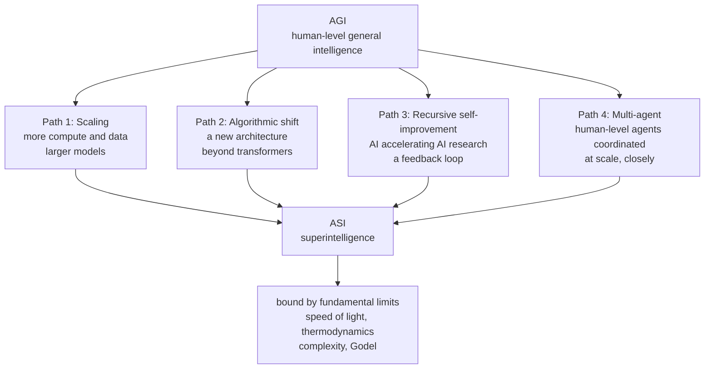

## Who Should Read This

This post is for engineers and technical leaders who want a well-organized map instead of vague anxiety or inflated optimism about where AI is heading. The word superintelligence is usually consumed as science fiction vocabulary, but it is a different story when a world-leading lab begins to treat it seriously as a planning problem. We read together what DeepMind expects and on what basis, and what that expectation means for those of us building real infrastructure and agent platforms.

## Overview: Superintelligence as a Planning Problem, Not a Thought Experiment

Google DeepMind's report From AGI to ASI (arXiv 2606.12683), roughly 57 pages long, maps the road from human-level general intelligence to superintelligence, exactly as its title says. It was written by DeepMind researchers including Tim Genewein, and according to coverage it is the third installment in a deliberate sequence from the lab. In other words, this lab has begun treating superintelligence not as a topic to discuss someday but as something to plan for starting now.

This shift in stance is the first reason to read the document. The report does not assert that superintelligence will definitely arrive. Instead it soberly classifies which pathways it could arrive through if it does, and what blocks each pathway. This classification, neither excited nor fearful, is the most useful part for a practitioner. Vague forecasts do not produce preparation, but when pathways and bottlenecks are clear, it becomes sharp where we should watch and what we should prepare.

## The Four Pathways

The report organizes the road from AGI to superintelligence into four pathways. They are not mutually exclusive, and in reality several may operate at once, overlapping.

The first is scaling. The familiar path of pushing capability higher with more compute and data and larger models. The second is an algorithmic paradigm shift. A new architecture that moves beyond today's transformers appears and extracts far higher capability from the same resources. The third is recursive self-improvement. A sufficiently intelligent AI begins to improve its own architecture, training methods, and reasoning, and each improvement makes the next one easier, entering a feedback loop. The fourth is multi-agent group formation. Without building a single superhuman model, coordinating human-level agents at sufficient number, speed, and closeness could reach capability equivalent to superintelligence.

This fourth path is especially interesting because it redefines superintelligence not as a problem of a single giant model but as a problem of coordination and orchestration. Even if each member does not exceed human level, the intellectual output of the group they form can far exceed the sum of individuals. It is the same logic by which human society has built a civilization not explained by individual intelligence alone.

## Recursive Self-Improvement: The Hottest Path

Of the four paths, the one under the fiercest debate is recursive self-improvement. The core idea is that the moment AI comes to assist AI research and development itself, an improved system assists the next round of research better, and the further improved system accelerates the round after that, opening a cycle. If this cycle is fast enough, the transition from AGI to superintelligence could happen not gradually but explosively, which is the scenario of this path.

What is impressive about how the report handles this path is that it declares it neither inevitable nor impossible. For a self-improvement loop to actually cause an explosive transition, several conditions must align at once, and each condition has its own bottleneck. Does each step really make the next improvement easier, or do returns diminish? Does the speed of improvement outrun the speed of verification and safety checks? Such questions govern the actual slope of the explosion. By enumerating these bottlenecks, the report pulls recursive self-improvement down from myth into an examinable engineering scenario.

## Even Superintelligence Is Bound by Physical Law

The most balanced passage in this report is the claim that even superintelligence is not unlimited. No intelligence can escape fundamental physical and computational limits. Signals cannot travel faster than light, computation carries a minimum energy cost imposed by thermodynamics, some problems cannot be solved efficiently no matter how smart the solver by complexity theory, and as Godel's incompleteness shows, some true statements cannot be proven within a given formal system.

This limit argument brings the superintelligence discussion down to earth. Superintelligence is not magic but still a computing system running in the physical world, and that system must operate within the real budgets of energy, latency, and computational complexity. This passage is especially welcome for someone building infrastructure, because it makes clear that the ceiling of capability ultimately reduces to a question of physical resources. No matter how clever the algorithm, it runs on the physical reality of power, cooling, and interconnect bandwidth.

## Implications for ThakiCloud

The four paths of this report look like abstract futurism, but they overlap surprisingly concretely with the design axes of the products we build. ThakiCloud's Paxis is an Agent-Native Cloud control plane running on top of ai-platform, treating skills, tools, policies, and audit logs as first-class resources. Two of the report's paths map directly here.

First, recursive self-improvement. Paxis's skill harness selects among more than 960 skills with BM25, executes them in an isolated sandbox, and reflects on the results to improve the skills themselves in a self-evolving loop. This is not a miniature of the explosive self-improvement the report describes, but rather a practice that carries the opposite lesson. We design self-improvement not as an uncontrollable runaway but as a verifiable iteration that passes policy gates and audit logs. By binding each step of improvement to pass a deterministic gate before moving to the next, we can structurally block the bottleneck the report points to, where the speed of improvement outruns the speed of verification.

Second, multi-agent group formation. Paxis processes complex work not with a single giant agent but with DAG-shaped multi-agent orchestration that decomposes it. Individual agents focus on specific roles, and the graph they form produces output beyond the sum of individual capabilities. The power of coordination that the report's fourth path speaks of is something we already treat as an execution model of the product. The point is that we handle multi-agent coordination not as a grand story toward superintelligence but as a way to solve today's practical problems better.

The limit argument is not unrelated either. The thermodynamic, latency, and interconnect limits the report emphasizes are exactly the GPU scheduling, power, cooling, and network bandwidth problems ai-platform faces every day. The insight that the ceiling of capability reduces to physical resources means that who organizes those resources more efficiently becomes the competitive edge. Kueue-based GPU scheduling, vLLM serving optimization, and multi-tenant resource isolation are precisely the mechanisms for spending that physical budget as frugally as possible.

## Limits and Counterpoints

A few things should be noted so as not to overrate this report. First, this is a conceptual map, not experimental results. It does not contain verified predictions about which of the four paths will actually produce superintelligence, or when. The report's value lies in its classification framework rather than answers, and a framework is useful but does not itself reveal the future.

Skepticism about the premise of superintelligence itself is also legitimate. How far the current capability curve extends remains an open question, and even reaching the destination called AGI is not a settled future. Before discussing the four paths, whether AGI, their starting point, will actually arrive in the form we imagine is itself contested. The report drew a conditional map, not a guarantee of arrival.

Finally, the real utility of such discourse for practice lies not in predicting superintelligence but in sharpening today's design principles. Imagining the risk of explosive self-improvement in advance makes it clear why the self-evolving loops we build today need verification gates. Taking the power of multi-agent coordination seriously gives us reason to build today's orchestration more robustly. Drawing grounds for near-term practice from a document about the distant future is the most practical way to read this report.

## Sources

- From AGI to ASI, arXiv:2606.12683 (2026). <https://arxiv.org/abs/2606.12683>
- Google DeepMind, "From AGI to ASI" publication page. <https://deepmind.google/research/publications/239142/>
