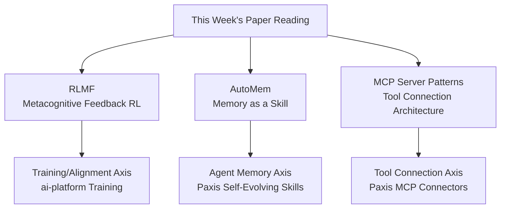

## Overview

It is hard to keep up with the flood of AI papers published every week, which is why curated lists like dair.ai's weekly "Top AI Papers of the Week" are so useful. This week's list (June 28 to July 5) includes several notable entries, among them RLMF, AutoMem, and a paper on MCP server patterns.

Rather than just listing them, this post takes a deep dive into three papers that are especially relevant from the perspective of ThakiCloud's AI infrastructure (ai-platform) and Agent-Native Cloud (Paxis). The three papers each address a different axis: training (RL), agent memory, and tool connectivity (MCP), but they share a common thread: making agents more trustworthy. Below, we summarize the core idea of each paper along with what it implies for our products.

The three axes these papers cover can be visualized as follows.

## RLMF: Reinforcement Learning with Metacognitive Feedback

The first paper introduces RLMF, which brings metacognition into reinforcement learning. Standard reinforcement learning rewards outcomes based on whether they are correct or not. RLMF adds metacognitive feedback, the model's own ability to assess and express the limits of its competence, and uses it to refine the ranking of completions during preference optimization.

The paper reports that this approach outperforms standard reinforcement learning by up to 63% across a range of tasks while preserving accuracy. The key point is not simply boosting the correctness rate, but getting the model to more faithfully express "I'm not sure about this." The ability to honestly surface uncertainty is directly tied to alignment, and it becomes the basis for deciding when an automated pipeline should hand a decision off to a human.

This connects directly with ThakiCloud's ai-platform lens. ai-platform runs post-training methods such as SFT, DPO, and GRPO on top of K8s and Kueue-based GPU scheduling. An approach like RLMF, which combines metacognition with the reward signal, suggests that when customers align models on their own data, the training recipe could be extended toward producing a model that "knows its own limits" instead of one that is "accurate but overconfident."

## AutoMem: Treating Memory as a Learnable Skill

The second paper, AutoMem, produced the most striking result on this week's list. A Stanford research team treats an agent's memory management not as a fixed rule set but as a **learnable skill**. The premise is that knowing what to encode, when to retrieve it, and how to organize knowledge is itself a form of expertise that can be trained.

The numbers are compelling. AutoMem boosted the performance of a Qwen2.5-32B-Instruct agent by roughly 2x to 4x depending on the task. The agent benchmark scores reported in the paper are as follows (all figures are as reported by the paper).

| Benchmark | AutoMem (Qwen2.5-32B) | Claude Opus 4.5 |
|---|---|---|
| Crafter | 51.36 | 49.5 |
| MiniHack | 30.00 | 27.5 |
| NetHack | 1.85 | 2.0 |

The key finding is that training a single skill, memory management, allows a 32B open model to match or exceed a much larger commercial model. This suggests that the bottleneck on agent performance may not be "a bigger model" but rather "better memory management."

AutoMem overlaps exactly with the Paxis lens. Paxis is an Agent-Native Cloud that treats skills as first-class resources, and its self-evolving skills and Knowledge Engine (HKE) manage what an agent remembers and how it organizes that knowledge. AutoMem's thesis that "memory is a skill" aligns with Paxis's design of treating memory not as a separate data store but as a capability that is learned and routed. For customers self-hosting open models, this has a practical implication: agent quality can be improved by refining the memory skill alone, without scaling up the model itself.

## MCP Server Patterns: Five Architectures for Tool Connectivity

The third paper is an industry-experience survey that catalogs MCP (Model Context Protocol) server architecture patterns for LLM-integrated applications. MCP is a standard interface for connecting LLMs to external tools, data, and services, released by Anthropic in November 2024. This paper catalogs five patterns that recur repeatedly in practice.

- **Resource Gateway**: A gateway that exposes external data sources in a read-oriented manner.
- **Tool Orchestrator**: An orchestrator that coordinates multiple tool calls.
- **Stateful Session Server**: A server that maintains session state.
- **Proxy Aggregator**: A proxy that aggregates multiple MCP servers into one.
- **Domain-Specific Adapter**: An adapter specialized for a particular domain.

These five patterns give teams a shared vocabulary for the practical question of "how should we structure a server" when bringing MCP into production. As tool connections multiply, the role of each server becomes blurry and observability and security get harder, and a pattern language helps organize that complexity.

Paxis treats MCP connectors as first-class resources and manages external service connections, including automatic OAuth reconnection. Among the five patterns above, Proxy Aggregator and Tool Orchestrator map directly to Paxis's structure, which aggregates multiple MCP servers behind policy gates and audit logs for multi-tenant delivery. In other words, the pattern of an individual developer wiring up a single local MCP server scales up into a control plane that safely aggregates a large number of connectors across many tenants.

## Synthesis: The ThakiCloud View

Tying the three papers together in one sentence: there are three separate paths toward making agents more trustworthy. RLMF helps the model know its own limits during training, AutoMem treats memory as a skill during execution so that smaller models can punch above their weight, and the MCP server patterns paper structures tool integration during connection.

ThakiCloud's two products each pick up one of these three threads. ai-platform provides low-cost GPU infrastructure to support post-training methods like RLMF, while Paxis operates the memory skills described by AutoMem and the tool connectivity described by the MCP patterns as first-class resources of its Agent-Native Cloud. Instead of relying on a single ever-larger model, the strategy is to independently improve training, memory, and connectivity to build agent economics.

## Limitations and Counterarguments

A few caveats are worth noting. First, all of the benchmark figures above are as reported by each paper; we have not reproduced them ourselves. Agent benchmarks like Crafter, MiniHack, and NetHack are sensitive to seeds and environment configuration, so independent reproduction is needed before applying any of this to a real product.

Second, AutoMem's "memory is a skill" result comes from a specific agent environment (game-style benchmarks). Whether the same magnitude of improvement holds in domains with different memory characteristics, such as real-world long conversations, document search, or codebase exploration, requires separate validation.

Third, the MCP patterns paper is an industry-experience summary, not a quantitative evaluation. The five patterns form a useful shared vocabulary, but which pattern is optimal in a given situation depends on a team's load, security requirements, and observability maturity. It is safer to treat the patterns as a starting point rather than a prescription.

The value of a weekly paper review ultimately lies in quickly sensing what is moving right now. This week, all three axes, training, memory, and connectivity, saw attempts to raise agent trustworthiness, and much of that overlaps with problems ThakiCloud already addresses in its products.

## Sources

- [dair.ai AI Papers of the Week (GitHub)](https://github.com/dair-ai/ML-Papers-of-the-Week)
- [RLMF: Reinforcement Learning with Metacognitive Feedback (arXiv 2606.32032)](https://arxiv.org/abs/2606.32032)
- [AutoMem: Automated Learning of Memory as a Cognitive Skill (arXiv 2607.01224)](https://arxiv.org/abs/2607.01224)
- [MCP Server Architecture Patterns for LLM-Integrated Applications (arXiv 2606.30317)](https://arxiv.org/abs/2606.30317)
