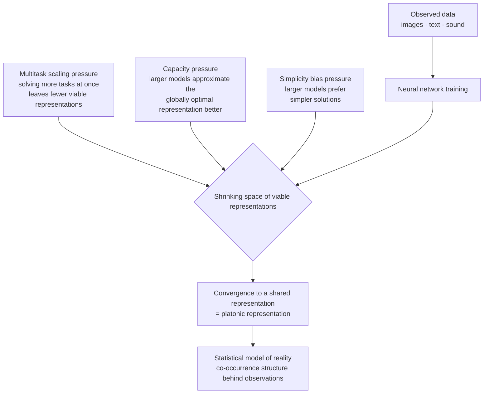

## Who Should Read This

This post is for engineers and data scientists who serve many kinds of foundation models on one platform, or who design embedding-based search, recommendation, and multimodal pipelines. It covers the theory underneath practical questions like "why does forcing two models' embeddings into alignment work better than expected?" and "why doesn't downstream performance collapse when we swap models?" We read the Platonic Representation Hypothesis, presented by MIT researchers at ICML 2024, alongside its evidence and follow it through to what it means for real platform design.

## Overview

Why do neural networks trained by different teams, on different data, under different objectives, grow more alike over time? The question starts from an old observation. Train two vision models in different ways, and their judgment of which image pairs are near and which are far grows more similar as they scale. More striking still, this similarity crosses modalities. A language model that has never seen an image and a vision model that has never seen text begin to reproduce the distance structure between data points in the same way.

"The Platonic Representation Hypothesis" by Minyoung Huh, Brian Cheung, Tongzhou Wang, and Phillip Isola (arXiv:2405.07987, ICML 2024 Oral) ties this observation into a single claim: neural network representations are converging, across architectures and objectives, toward one shared statistical model of reality. Borrowing Plato's ideal forms, the authors call the idealized endpoint of this convergence the *platonic representation*. This post lays out what the evidence is, how it was measured, and why the hypothesis carries practical weight for anyone actually operating many models.

## What the Platonic Representation Hypothesis Says

The core sentence is simple. Whether image, text, or sound, the data we observe are different projections of a common underlying reality. A sufficiently large and competent model reverses those projections, reconstructing the statistical structure of the underlying reality ever more accurately. As a result, models trained in isolation converge on the same destination.

Here, "the representations are the same" does not mean the weights are identical or the neurons map one to one. It means the distance kernel a representation induces over data, which samples are neighbors and which are far, becomes the same. Even if two representations use different coordinate systems, if the relative relations among data points match, the two representations carry essentially the same geometry.

This inverts an old intuition about representation learning. We often expect that with more data and larger models, representations become more diverse and specialized. The hypothesis says the opposite: as scale grows, the space of viable representations shrinks, and everything is pressed toward a single optimal representation.

## The Evidence: What Was Measured, and How

A claim being interesting is not the same as a claim being true. The authors define a metric that quantifies convergence and check whether it actually rises across model families.

The central tool is mutual nearest-neighbor alignment. Pass the same dataset through two models, obtain each embedding, and count how much the nearest-neighbor set of a sample overlaps across the two representation spaces. Higher overlap means the two models see the neighbor structure of the data the same way, so the alignment score is high. Beyond this metric, complementary methods such as centered kernel alignment (CKA) and model stitching point to the same conclusion.

The first piece of evidence is convergence within vision. The authors compare 78 vision models on the Places-365 dataset. The result is clear: models that are more competent on downstream benchmarks (VTAB, the Visual Task Adaptation Benchmark) align more strongly with one another. High-capability models form one tight cluster; low-capability models scatter. As performance rises, representations pull together.

The second piece is more provocative: alignment across modalities. Using image-text pairs to compare a vision model's image representation with a language model's text representation, the more capable the language model, the better its text representation aligns with a strong vision model's image representation. A text-only model and an image-only model move toward the same distance structure as they improve. This is where the hypothesis earns its name. Convergence is not a within-modality accident but a cross-modality trend.

## The Three Pressures Driving Convergence

Beyond observation, the authors explain why convergence happens through three sub-hypotheses. The diagram below summarizes how the three pressures funnel into one shared representation.

First is the Multitask Scaling Hypothesis. The more tasks a model must solve at once, the fewer representations satisfy all of them. Representations that solve a single task are countless, but those that solve hundreds simultaneously are a tiny few. As data and tasks grow, the surviving intersection narrows, and different models crowd into that narrow intersection.

Second is the Capacity Hypothesis. Larger models, with better optimization and a wider function space, approximate the globally optimal representation more closely regardless of differences in architecture or training method. Small models settle into different local optima, but as capacity grows, all of them are drawn toward the same global optimum.

Third is the Simplicity Bias Hypothesis. Neural networks, whether through explicit regularization or the implicit character of optimization, tend to prefer simpler solutions among the many that explain the data. And as models grow, this bias only strengthens. Even as more complex representable solutions appear, the force pressing toward the simplest, most general one intensifies. As a result, larger models gather at the most concise common structure that explains the data.

## The Idealized Endpoint: A Statistical Model of Reality

What is the endpoint these three pressures aim at? The authors model it theoretically. Treat the world as a sequence of discrete events, and the images and text we observe as different projections of those events; then the optimal representation ends up with a kernel that converges to the pointwise mutual information (PMI) over co-occurring events. In plain terms, the ideal representation captures the co-occurrence statistics of "what tends to appear together in reality."

This is also why the convergence crosses modalities. If image and text are the same reality seen through different windows, then the co-occurrence structure beyond the window is one. A sufficiently competent model arrives at the same structure regardless of which window it enters through. The name platonic representation points to this shared statistical reality behind the observations.

## Implications for ThakiCloud

Abstract as it sounds, the hypothesis carries very concrete implications for a platform that serves many models. ThakiCloud's ai-platform serves many kinds of models to diverse customer environments on top of Kubernetes and Kueue-based GPU scheduling. Different vision encoders, different embedding models, and different generations of LLM coexist on one platform.

The first implication is model interoperability. If the representations of competent models converge on a common geometry, the need to isolate each embedding space entirely per model shrinks. When replacing a vector store indexed with one embedding model with a newer generation, if the two representations fundamentally share a neighbor structure, the re-indexing cost and downstream degradation can be managed within a predictable range. The assumption that swapping a model means rebuilding the entire embedding pipeline is relaxed where convergence is strong.

The second implication is the economics of multimodal alignment. If strong vision and strong language models already move toward alignment, a thin adapter between the two modalities can capture substantial alignment. A design that independently updates each modality's latest model and layers a lightweight alignment stage on top becomes a realistic choice that captures both resource efficiency and update speed in a multi-tenant environment.

The third implication concerns benchmarking. The claim that representations converge as competence rises suggests that, when evaluating several candidate models in on-prem or sovereign environments, representation alignment can serve as one diagnostic signal. If the mutual nearest-neighbor alignment of two models is low, that may signal that one of them is still less competent or that the domains are mismatched. Alignment becomes a low-cost signal that complements accuracy benchmarks.

## Limitations and Counterarguments

The more attractive a hypothesis, the more honestly we must build the opposing case. The first counterargument is that convergence may stem from sociological homogenization rather than a platonic reality. Today's models largely share the same web-scale data, the same transformer-family architectures, and the same optimization practices. It is hard to rule out that representations grow alike simply because everyone cooks with the same ingredients, not because of convergence toward an underlying reality.

The second counterargument is irreducible differences between modalities. There is information that exists only in vision and is never captured in language, and vice versa. The strong claim that all representations converge into one risks underrating what each modality uniquely carries. Indeed, models trained for specialized objectives, or representations designed to preserve different information, do not converge.

The third counterargument is the interpretation-dependence of the measurement. Metrics like mutual nearest-neighbor and CKA presuppose a particular notion of distance, and the picture of alignment can shift depending on which metric is chosen. The conclusion that "representations converge" depends to some degree on metric choice and data distribution, an open problem that replication studies continue to test.

Even so, the practical value of this hypothesis lies not in the metaphysics of the endpoint but in the direction. The trend that representations move toward a common structure as competence grows is observed repeatedly across metrics, and for anyone designing multi-model infrastructure, that direction alone is a practical compass.

## Sources

- Minyoung Huh, Brian Cheung, Tongzhou Wang, Phillip Isola, "The Platonic Representation Hypothesis", ICML 2024 (arXiv:2405.07987): [arxiv.org/abs/2405.07987](https://arxiv.org/abs/2405.07987)
- Code and project: [github.com/minyoungg/platonic-rep](https://github.com/minyoungg/platonic-rep)
