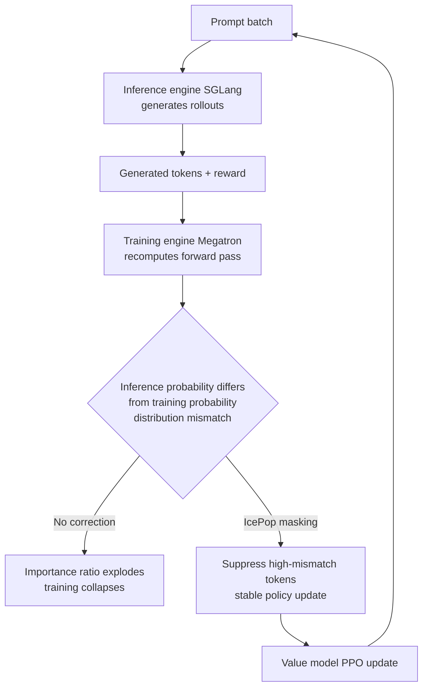

Any team that has actually run reinforcement learning (RL) post-training on large language models knows that the trend of the past year or two has leaned heavily in one direction. Since DeepSeek released GRPO, the practice of dropping the separate value model (critic) and estimating advantage purely from relative reward within a group has become close to standard. Without a critic to train, memory and compute costs drop and the implementation gets simpler. The claim that "critics are no longer necessary" has become something close to conventional wisdom.

Zhipu's GLM-5.2, however, runs directly against this trend. The model abandons the group-relative approach and goes back to PPO with a trained value model, while addressing RL's chronic instability problem, the train-inference distribution mismatch, with a technique called IcePop. What makes this interesting is that the choice is not a simple regression. It amounts to an empirical rebuttal of the recent conventional wisdom that "GRPO is universally superior."

*Depicting the directional shift in RL post-training: dropping the critic, then bringing it back.*

## Overview

GLM-5.2 is an open-weight model with a one-million-token context window that shows strong performance on long-horizon coding and agentic benchmarks. This post is not about the model's raw performance numbers, but about the RL post-training design decisions behind that performance. There are two key points. First, the model went back to PPO with a trained value model instead of the group-relative approach (GRPO). Second, it mitigated the resulting train-inference mismatch with IcePop, while removing the KL regularization term that was part of the original IcePop formulation, in order to speed up RL improvement.

This topic matters from ThakiCloud's perspective for a concrete reason. The LLM training pipeline we operate supports several post-training methods, including SFT, CPT, DPO, GRPO, and GKD. The choice of RL methodology is not merely a matter of algorithmic taste. It is an infrastructure decision that directly affects GPU budget, training stability, and reproducibility. GLM-5.2's case pushes us to ask not just "what should we use" but "why should we use it."

## The Wall GRPO Hit: The Cost of Dropping the Critic

Let's first look at why so many teams moved to GRPO. Traditional PPO uses an actor-critic structure. A policy (the actor) generates tokens, while a separate value model (the critic) estimates the expected reward of each state. This value estimate is used to compute advantage (typically via GAE), and the policy is updated with a clipped surrogate objective. The problem is the cost of training this critic. You need to run an additional model that is roughly the same size as the policy, and if the critic converges poorly, the entire training run can become unstable.

GRPO removes the critic entirely. It samples multiple responses for the same prompt, normalizes the reward within that group, and derives advantage purely from relative standing. With no critic, memory usage drops, and the instability that comes from training a value model disappears along with it. The approach is also mathematically clean, which helped it spread quickly.

But there is no free lunch. The group-relative approach loses signal when the variance within a group is small, that is, when the responses are all similarly good or similarly bad. It also struggles with fine-grained, token-level credit assignment over long sequences. A value model can estimate, state by state, "how much did this token contribute to the final reward." Group normalization alone cannot deliver that resolution. This limitation is most pronounced in problems with long trajectories and sparse rewards, such as long-horizon coding and agentic tasks. That is precisely the territory GLM-5.2 was targeting.

## GLM-5.2's Choice: PPO with a Revived Value Model

The GLM-5.2 team brought the trained value model back. In other words, they restored the critic that GRPO had discarded, in order to regain token-level advantage estimation resolution. Contrary to the prevailing sentiment that "the PPO hype is overblown," they bet instead that a well-trained value model gives a more stable signal over long trajectories.

The problem is that the moment you revive the critic, the training instability mentioned earlier comes back with it. And on top of that, a newer headache specific to modern RL stacks compounds the issue: train-inference distribution mismatch.

## IcePop: Fixing the Train-Inference Mismatch

Modern RL post-training moves back and forth between two different engines. Rollouts, that is response generation, are handled by a high-throughput inference engine such as SGLang, while the forward computation for the actual policy update is handled by a training engine such as Megatron. The problem is that even when these two engines use the same model weights, differences in kernel implementation, numerical precision, and computation order cause them to produce subtly different probabilities for the same token.

RL typically corrects for this gap using importance sampling, which multiplies by the ratio between the inference-time policy probability and the training-time policy probability. But for tokens where the two distributions diverge, this ratio can explode or collapse. When a handful of tokens with runaway ratios come to dominate the gradient, the entire training run becomes unstable, and in severe cases it collapses. The longer the trajectory, that is, the more tokens involved, the higher the probability that these spikes accumulate. For GLM-5.2, which targets long-horizon tasks, this was an especially critical problem.

IcePop tackles this mismatch head on. It identifies tokens where the inference distribution and the training distribution diverge significantly, and suppresses or masks that token's contribution, so the gradient is not dragged around by a small number of unstable tokens. The result is that only the signal from stable tokens is retained and used in the policy update. This lets the training keep the benefits of PPO with a revived value model while avoiding the collapse caused by train-inference mismatch.

Where GLM-5.2 diverges from the original IcePop is that it removes the KL regularization term. Many RL recipes apply a KL penalty to keep the policy from drifting too far from the reference policy. This term improves stability, but it also caps how much the policy is allowed to improve. The GLM-5.2 team judged that IcePop's distribution-mismatch masking already handled most of the instability, so they dropped the KL term and allowed the policy to improve more aggressively. In effect, they removed one stability mechanism and handed that role over to IcePop's token selection.

## Infrastructure: slime, Megatron, SGLang

For this algorithm to work in practice rather than remain an idea on paper, it needs infrastructure that can withstand RL at scale. GLM-5.2's post-training was carried out on top of an RL scaling framework called slime, using Megatron-LM for distributed training and SGLang for high-throughput rollout generation. The train-inference mismatch described above arises directly from this configuration. Because Megatron (training) and SGLang (inference) each use their own optimized kernels, probabilities diverge between the two, and IcePop is designed precisely to target this structural gap.

In other words, IcePop is less a pure algorithmic improvement and more a joint system-and-algorithm design response to a system-level problem that inevitably arises in modern RL stacks that separate the training engine from the inference engine. The lesson for practitioners is clear. When choosing an RL methodology, you cannot look at the algorithm alone. You have to consider the combination of training and inference engines that algorithm runs on.

## Implications for ThakiCloud's Product

ThakiCloud's ai-platform is a K8s-based AI/ML infrastructure that operates a training pipeline supporting GPU scheduling through Kueue and multiple post-training methods (SFT, CPT, DPO, GRPO, GKD). GLM-5.2's case has direct implications for how this pipeline should be designed.

First, RL methodology is not something to fix in place. It is a choice to be made based on the problem at hand. For short-trajectory preference alignment, critic-free GRPO remains economical, but for problems where token-level credit assignment matters, such as long coding or agentic trajectories, PPO with a value model can provide a more stable signal. In a platform like ours that supports multiple methods, exposing this choice so users can switch based on the characteristics of their problem creates real, practical value.

Second, train-inference mismatch is not someone else's problem for us either. If you run a decoupled RL setup, drawing rollouts from an inference engine (the vLLM/SGLang family) while running the update on a training engine, in a multitenant environment, the same kind of probability mismatch can occur. Preparing a token-selection correction like IcePop as an option in the training runtime can significantly improve training stability for customers who want to fine-tune their own models with RL in an on-premises or sovereign environment. Low serving cost combined with a stable training pipeline is a decisive advantage for teams considering self-hosting.

From an agent perspective, this connects to Paxis as well. Paxis is the Agent-Native Cloud that runs on top of ai-platform, treating skills, tools, and policies as first-class resources. GLM-5.2's emphasis on long-horizon agent trajectory training is, at its core, about strengthening an agent's ability to complete tasks by calling tools across multiple steps. The lesson from this case, that a well-trained value model provides finer-grained signal over long trajectories, is worth keeping in mind when thinking through training strategies to improve the quality of the multi-step agent workflows Paxis handles.

## Limitations and Counterarguments

This case should be generalized with caution. First, it should not be read as a simple conclusion that "PPO is better than GRPO." GLM-5.2's choice is a judgment made within a specific problem setting characterized by long horizons and sparse rewards. For problems with short, dense reward signals, the cost of maintaining a critic can outweigh the benefit, in which case GRPO remains a reasonable choice. The practical constraint that reviving the value model increases the GPU memory budget again also still applies.

Removing IcePop's KL term is not a universal solution either. KL regularization is a safeguard against the policy running away from the reference policy. Removing it and relying entirely on distribution-mismatch masking for stability only holds up under the assumption that the masking works well. That assumption could break down under a different data distribution or a different combination of inference engines, so rather than porting this decision over directly, teams need a process to verify stability in their own environment.

Finally, the technical explanation in this post is a synthesis of publicly available analyses and papers (arXiv's "GLM-5: from Vibe Coding to Agentic Engineering") as well as secondary commentary. Specific hyperparameters and exact benchmark numbers should be confirmed directly against the original source, and implementation details not covered here may prove decisive for actual reproduction. RL post-training is a particularly difficult area to reproduce, so it is safer to treat this as "a direction worth considering" rather than "a recipe that just works."

## Sources

- [arXiv, "GLM-5: from Vibe Coding to Agentic Engineering" (arXiv:2602.15763)](https://arxiv.org/abs/2602.15763)
- ["Why is GLM-5.2 So Good: The GRPO to PPO Switch", Medium (Coding Nexus)](https://medium.com/coding-nexus/why-is-glm-5-2-so-gooood-the-grpo-to-ppo-switch-5b3b7d613ace)
- ["Zhipu's GLM-5.2: A Usability Breakthrough for Chinese Open-Source Models?", Weijin Research](https://weijinresearch.substack.com/p/zhipus-glm-52-a-usability-breakthrough)
