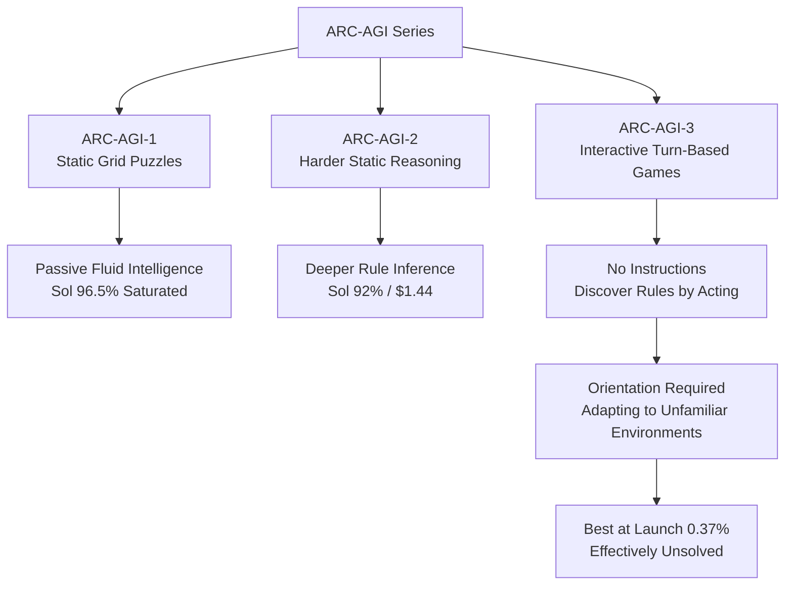

Teams that have actually run agents in production do not get excited over a single benchmark score. We have seen too many cases of a model that clears 90% on static problem sets still losing its footing in front of an unfamiliar tool, a UI it has never seen, or an environment with no instructions. So when ARC Prize announced that it had verified GPT-5.6 Sol's ARC-AGI-3 results, what caught our attention was not the number itself but how that number came about.

Here is the core fact. GPT-5.6 Sol scored 7.78% on the ARC-AGI-3 semi-private set, setting a new SOTA, and became the first verified frontier model to actually finish an ARC-AGI-3 game from start to end. What stands out is ARC Prize's explanation for why. Sol did not succeed because it executed each action more precisely. It succeeded because it was better at orientation, the ability to figure out its own direction in a situation it had never seen before.

*It depicts the moment of orientation, where scattered chaos in an unfamiliar, instructionless environment converges into a single direction.*

## Overview

This post is not about where GPT-5.6 Sol ranks overall among models. It is about why this model made meaningful progress specifically on ARC-AGI-3 rather than on some other benchmark, and what that progress means for those of us who build and serve agents in practice.

The ARC-AGI series splits into two distinct kinds of problems. ARC-AGI-1 and ARC-AGI-2 are static grid puzzles that measure passive fluid intelligence, the ability to infer a rule and produce the correct output grid. ARC-AGI-3 is an entirely different kind of problem. In an interactive, turn-based game environment with no instructions given, the agent has to act on its own to discover the rules and reach the goal. In other words, the axis has shifted from getting the right answer to adapting to an unfamiliar world.

This distinction matters from ThakiCloud's point of view. Most of the agent workloads we deal with fall closer to the second category. How quickly an agent can grasp a situation and move safely in front of an MCP connector it has just connected to, an internal API it has never seen, or a data source whose schema just changed. That is what actually determines whether a production agent succeeds or fails. ARC-AGI-3 measures exactly that capability under lab conditions.

## What ARC-AGI-3 Is and Why It Is So Hard

ARC-AGI-3 was designed to "resist the kind of progress that saturated the previous generation." ARC-AGI-1 is now effectively saturated. Sol and Terra are nearly tied at around 96.5%, and even the low-cost model Luna reaches 88%. Static reasoning is close to a solved problem for frontier models at this point.

Moving up to ARC-AGI-2, the gap widens. Sol scores 92% (about $1.44 per task), Terra scores 83.9% ($1.09), and Luna scores 59.5% ($0.67). Even at this level, we are still in the territory of how well a model solves a problem it has been given.

The problem is ARC-AGI-3. When this benchmark launched in March 2026, even the best model at the time could barely clear 0.37%. That is because in an interactive game, the agent has to work out on its own, with no prior information at all, what action triggers what effect, what the goal is, and what failure even means. This is easy for a human, but for a model it is completely unknown territory, outside its training distribution.

Looking at this structure, it becomes clear that ARC-AGI-3 measures a fundamentally different axis from other benchmarks. If the first two generations were about raising the resolution of intelligence, the third generation demands the adaptability of intelligence. And adaptability is not built from execution accuracy alone.

## GPT-5.6 Sol's Results: The Numbers

At its max reasoning effort setting, GPT-5.6 Sol averaged 13.33% on the ARC-AGI-3 public set and 7.78% on the semi-private set. The 7.8% figure quoted in headlines is this semi-private number. Given that the previous SOTA was Claude Opus 4.8's 1.5%, this is more than a fivefold jump.

The more symbolic event is that Sol became the first verified frontier model to actually clear one of the ARC-AGI-3 public games, ft09. Sol's success rate on this game was 87%. No model had ever fully finished a single game since the benchmark went live, so this is not just a new high score. It is the first case of crossing a qualitative threshold.

That said, we need to be honest about the cost. Running the full ARC-AGI-3 evaluation at max reasoning effort costs close to $20,000 in total. This capability is still one that only barely opens up at the most expensive setting. The 7.78% figure is a signal of a breakthrough, not a declaration that the problem is solved. Placed next to the 92% on ARC-AGI-2, it shows that interactive adaptation is still a generation behind static reasoning.

## The Breakthrough Came From Orientation, Not Execution

The most important part is ARC Prize's interpretation. The reason Sol performed well on ARC-AGI-3, in their reading, was not that it executed each action more precisely, but that it first oriented itself correctly in an unfamiliar environment.

Orientation and execution are different capabilities. Execution is performing an action accurately once you know what needs to be done in a given situation. Orientation is figuring out the structure of a situation through observation and trial when it is not even clear what needs to be done. Most benchmarks measure execution, because the problem and the goal are given clearly. ARC-AGI-3 hides even the goal and measures orientation instead.

This distinction connects directly to how we design agents in practice. In production, the moment an agent fails is usually the orientation stage, not the execution stage. It rarely falls apart because it called the wrong function. It falls apart because it judged wrong, from the start, which function to call and why in this situation. Sol's result suggests that orientation is an axis that can scale on its own, and that a benchmark measuring it may correlate more closely with real agent quality.

## Implications for ThakiCloud's Products

This topic touches both of ThakiCloud's products.

**The Paxis lens (agent orientation).** Paxis is ThakiCloud's Agent-Native Cloud, where Skills, Tools, Policies, and Audit Logs are treated as first-class resources. Here, orientation is not an abstract concept but a design problem. Every time an agent connects to a new MCP connector for the first time or selects among roughly 960 skills through BM25, it is solving, once again, the problem of finding its bearings in an unfamiliar space of capabilities. The lesson from ARC-AGI-3 is that this orientation step should not be left to the model alone. The harness needs to help. Paxis structuring the action space through skill descriptions, policy gates, and audit logs works as an orientation aid, letting the agent find its direction inside a verified skeleton instead of wandering through an unknown environment. Without relying on expensive max reasoning like Sol, a harness that reduces the orientation burden can make stable adaptation possible even with cheaper models.

**The ai-platform lens (inference economics).** At the same time, that $20,000 evaluation cost is also an infrastructure problem. Orientation-heavy reasoning generally requires long thought trajectories and a lot of trial and error, which translates directly into token consumption. ThakiCloud's ai-platform focuses on running these expensive inference workloads cost-efficiently in a multi-tenant environment through K8s, Kueue GPU scheduling, and vLLM serving. To put an agent that adapts to unfamiliar environments into production, you need a serving layer that can push the cost of max reasoning effort down to an affordable level. This confirms once again that cheap serving is what makes agent economics work.

In short, an adaptive agent becomes something you can actually operate, rather than an expensive frontier demo, only when Paxis distributes the orientation burden into the harness and ai-platform pushes down the inference cost.

## Limitations and Counterarguments

To avoid overreading this result, here are a few counterarguments worth keeping in view.

First, 7.78% is still a very low absolute number. A human would clear most ARC-AGI-3 games without much trouble, while the best model barely finished a single one. Calling this a breakthrough is fair, but it is far from calling it solved. How robustly this orientation capability generalizes has not been proven yet.

Second, the cost problem offsets a good part of the capability claim. A capability that only opens up at max reasoning effort is a separate question from whether it can actually be deployed. Whether the same orientation ability reproduces at a tenth of the cost is what actual value hinges on, and the current data does not tell us.

Third, this is a result verified on a single benchmark. Fable 5 has not yet been benchmarked on ARC-AGI-3, and whether this orientation ability transfers to real agent tasks outside the ARC-AGI-3 game set still needs separate verification. There is not yet enough evidence to rule out the possibility that the model has simply overfit to the benchmark.

Even so, the direction is clear. In an era where execution accuracy is saturating, the next bottleneck is orientation, and the approach of measuring it and assisting it with a harness will become the next competitive edge for practical agents. Sol's 7.78% is the first coordinate of that turning point.

## Sources

- [GPT-5.6 Sol ARC-AGI Results (ARC Prize)](https://arcprize.org/results/openai-gpt-5-6-sol)
- [ARC Prize Announcement (X/Twitter)](https://x.com/arcprize/status/2075270869992264003)
- [ARC Prize Leaderboard](https://arcprize.org/leaderboard)
- [GPT 5.6 Sol Tops ARC-AGI-3 With 7.8% (OfficeChai)](https://officechai.com/ai/gpt-5-6-sol-tops-arc-agi-3-with-7-8-becomes-first-model-to-make-meaningful-progress-on-benchmark/)
