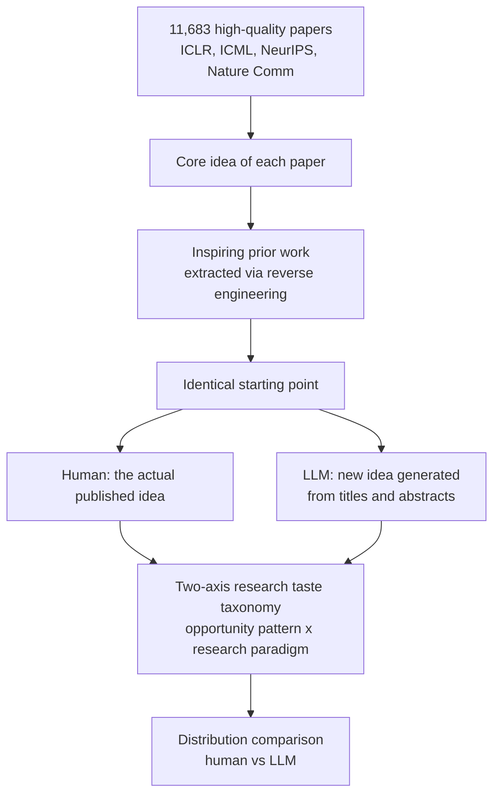

Say "research agent" and most people picture the same loop: read papers, spot a gap, propose an idea, run experiments, write it up. Researchers at Yale and the University of Chicago pushed one level deeper. How different are the research ideas an LLM generates from the ideas human researchers actually turned into published papers, and how big is that difference?

The paper, "Measuring the Gap Between Human and LLM Research Ideas" (arXiv 2607.01233), reaches a conclusion that cuts against intuition. The weakness in LLM ideas was not the thing people usually call "quality." The real gap was in range. LLMs thought inside a much narrower space than human researchers, and that narrowness was concentrated almost entirely in one pattern: the notion of "connecting existing research."

*A visual contrast between the wide spread of human ideas and the LLM's ideas clustered narrowly around a single pattern.*

## Overview

This research matters because autonomous research agents are no longer a distant prospect. Many teams already run loops where an LLM generates hypotheses, a subset gets selected, and experiments run automatically. ThakiCloud operates its own research loop that pulls experiment hypotheses at night from submodule activity and trends, queues them, and runs them automatically. The quality of a loop like this ultimately comes down to how diverse and how good the seeds are that the idea generator produces.

This paper dissects the character of exactly those seeds, empirically. It goes beyond a simple verdict of "LLM ideas are good" or "bad" and instead plots where humans and LLMs each sit within the space of possible ideas. What that map tells us is what we stand to miss if we keep trusting a single LLM hypothesis generator as it stands today.

## What Was Measured: A Controlled Idea Experiment

The most striking part of this paper is its methodological rigor. "Good" and "bad" ideas are subjective and hard to measure directly. The researchers sidestepped that problem with a controlled experiment.

They first curated 11,683 high-quality papers from ICLR, ICML, NeurIPS, and Nature Communications. For each paper, they reverse-engineered a small set of closely related prior works likely to have inspired its core idea. They then gave an LLM only the titles and abstracts of those prior papers and asked it to generate a new idea from that starting point. In other words, human researchers and the LLM were given exactly the same starting point, the same set of prior work, and the comparison asks where each one goes from there.

The yardstick for comparison was a taxonomy that splits "research taste" into two axes. One is the opportunity pattern, meaning what kind of gap motivates the work. The other is the research paradigm, meaning what kind of methodology attacks that gap. The researchers plotted human and LLM ideas on this coordinate system and quantified how much the two distributions overlap and where they diverge. The models evaluated spanned major LLM families including Claude, Gemini, GPT, DeepSeek, and Qwen.

## The Core Finding: A Gap in Range, Not Quality

The result boils down to one sentence. LLM-generated ideas occupied a substantially narrower region of the research taste coordinate system than human ideas did.

This narrowness shows up most sharply in the "connection" pattern. A connection pattern frames its motivation as "disparate existing literature, methods, or evidence need to be tied together," and develops its method by integrating, reconciling, or unifying existing approaches. Put plainly, it is the "what if we combined A and B" kind of idea.

The numbers make the gap unmistakable. Only 12.1 percent of human ideas were motivated by a connection pattern, and only 5.1 percent used integration or unification as their core method paradigm. Across nine major LLMs, those same figures ranged from 47.1 percent to 64.2 percent and from 22.5 percent to 38.7 percent respectively, roughly 4 to 5 times more reliant on this move.

Human researchers' ideas were scattered far more widely. Ideas trying to explain a mechanism, ideas digging into failure cases, ideas trying to measure evidence, ideas building systems, ideas improving efficiency, all appeared in roughly even proportion. LLMs, instead of spreading across that spectrum, kept landing in the same narrow valley of safe, plausible "connection" ideas.

## Why LLMs Gravitate Toward "Connection"

This clustering is not an accident. It is structural. "Combine existing A and B" is the safest next move that can be derived from a given set of prior papers, even at the level of next-token prediction. It carries low risk, always sounds plausible, and looks novel on the surface. An idea like "what is the hidden mechanism behind this phenomenon," by contrast, demands a leap beyond the given text. LLMs are statistically prone to converge on the former.

The problem is that real scientific breakthroughs often come from the latter. Ideas that stitch existing things together tend to yield incremental improvement, while discoveries that change the game usually start from a different kind of question. If we trust a single LLM hypothesis generator as is, we quietly get trapped in one valley of the idea space.

## Implications for ThakiCloud's Products

This finding gives us a direct design directive for the autonomous agents we operate.

**The Paxis lens: enforce diversity through the harness.** Paxis is ThakiCloud's Agent-Native Cloud, treating DAG-based multi-agent orchestration and self-evolving skills as first-class resources. This paper's lesson is clear. Leaving idea generation to a single model traps it in the "connection" valley, so diversity should not be left to chance, it needs to be enforced by the harness. Concretely, that means three things. First, a mixture-of-agents approach that gathers candidates from different model families (Claude, Gemini, GPT, DeepSeek, Qwen) to reduce single-model bias. Second, explicitly assigning different lenses to the same problem, such as mechanistic explanation, failure analysis, and efficiency improvement, so ideas do not converge on the connection pattern alone. Third, not trusting generated ideas at face value but filtering them through an adversarial verify stage, closing the pipeline off to plausible but narrow ideas.

When ThakiCloud pulls hypotheses from its nightly research loop, this principle becomes an operational discipline. Instead of taking one hypothesis from a single prompt, fanning out across multiple lenses and converging through a verification stage directly blocks the "narrow range" failure mode this paper measured.

**The ai-platform lens: the infrastructure cost of model diversity.** Running several model families at once to secure idea diversity requires a layer that can efficiently serve heterogeneous open-weight models across multiple tenants. ThakiCloud's ai-platform runs a heterogeneous model pool cost-effectively through Kubernetes, Kueue GPU scheduling, and vLLM serving. What this reveals is that idea diversity, a quality goal, only holds up on top of serving infrastructure that can run diverse models cheaply and in parallel.

## Limitations and Counterarguments

We accept this result, but with a few reservations attached.

First, the taxonomy itself is one particular lens. Splitting "research taste" into opportunity pattern and research paradigm is useful, but it is not the only possible decomposition. A different taxonomy might make the shape of the gap look different. The conclusion that "the range is narrow" is relative to this coordinate system.

Second, a wider range of ideas is not automatically a better one. Much of the diversity in human ideas may end in directions that ultimately fail, and the LLM's tilt toward "connection" ideas could actually be a safer choice with a higher execution success rate. This paper measured the distribution of ideas, not the relative merit of their outcomes. The relationship between range and results remains a separate question.

Third, there is sensitivity to prompt design. If the LLM had been explicitly instructed to "produce a kind of idea entirely different from what already exists," the distribution might have widened. In other words, part of this gap may be an artifact of the default prompt rather than an inherent limitation of the model, and the fact that it can likely be corrected substantially through the harness is, practically speaking, the encouraging part of this story.

Even so, the practical guidance is clear. Build an autonomous research or idea-generation pipeline on a single model and a single prompt, and it gets trapped in a narrow valley. Enforcing diversity through the harness and closing the loop with verification is the straightforward way to avoid the failure mode this paper measured.

## Sources

- [Measuring the Gap Between Human and LLM Research Ideas (arXiv 2607.01233)](https://arxiv.org/abs/2607.01233)
- [Full paper (HTML)](https://arxiv.org/html/2607.01233v1)
- [Literature Review (The Moonlight)](https://www.themoonlight.io/en/review/measuring-the-gap-between-human-and-llm-research-ideas)
