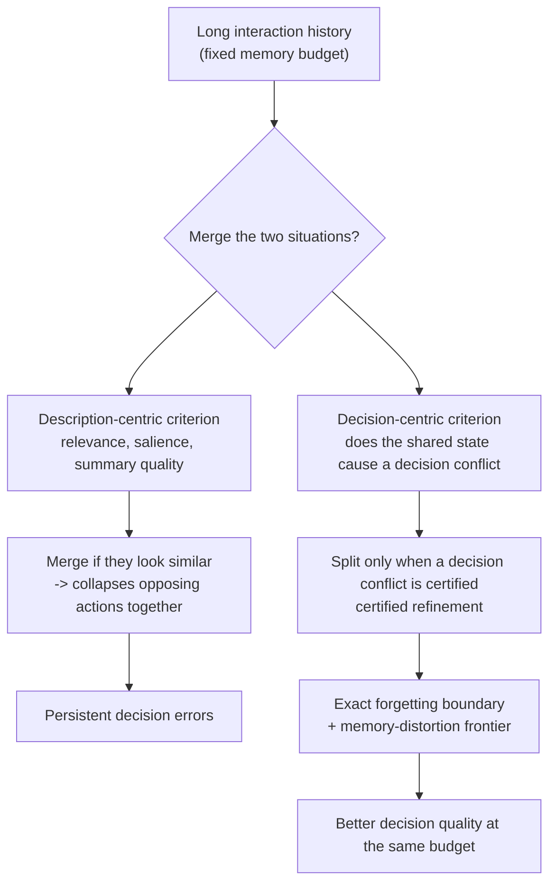

> 📄 **Full deep review (DOCX)**: [Download the detailed peer review on Google Drive](https://drive.google.com/file/d/1oxsADQALTfdn7I_mmZbaZfMnmqoCMF9o/view).

## Overview

Anyone who has run a conversational agent for a long stretch has seen this failure before. A preference or decision a user clearly stated days ago gets forgotten at some point, and the agent acts against it. Context windows are finite, and once a conversation grows long enough, some part of the past must be compressed or discarded. The real question is what to discard.

Agent memory to date has largely answered this question with **descriptive criteria**: how relevant is it, how salient is it, how well can it be summarized. This paper, "Remember the Decision, Not the Description" (arXiv 2605.10870), co-authored by a researcher at Meta AI, argues that this criterion itself is the wrong one. This piece is written for engineers and researchers designing AI agents, and for teams who need to put long-term memory into production. We summarize the paper's core reframing and the empirical results that back it up, and look at how this principle applies to Paxis, ThakiCloud's agent platform.

## What Is the Problem

The authors start from a simple insight. Memory is valuable to an agent not because it faithfully describes the past, but because it **keeps two histories that call for different actions separated, even under a fixed budget**.

Consider a simple example. Yesterday the user said, "This deployment must only proceed after manual approval." Today, in a similar context, the user said, "This script can be run automatically." The two statements look very similar on the surface. They share words like deployment, execution, approval, and if summarized they come out almost identical. A relevance-based memory is likely to merge the two into a single lump labeled "deployment-related instruction." The moment that happens, the agent loses track of which instruction applies to which situation, and it commits the error of pushing through an automatic deployment that actually required manual approval. The summary is descriptively correct, but the merge is decisively fatal.

The concrete failure mode looks like this. Two situations look textually similar but actually demand opposite actions. When the memory budget is tight, compression is required, and compression inevitably invites merging. If you only look at descriptive similarity, the two get combined into one. As a result, the agent consistently makes the wrong decision every time it returns to that state. Relevance or summary quality cannot answer the real question, which is whether these two can be merged at all. The criterion should not be what looks similar, but what requires different actions.

## Core Idea: Decision-Centric Rate-Distortion

The authors move this problem into the information-theoretic framework of rate-distortion. Rate-distortion theory originally deals with how much distortion arises for a given amount of compression (rate), and the key move here is redefining distortion itself. Instead of a reconstruction error of the signal, distortion is defined as the **loss in achievable decision quality caused by compression (decision loss)**.

Here is an analogy. When compressing audio, we first discard frequencies the human ear cannot hear, because the criterion for distortion is "what a person can hear." Agent memory should work the same way, the authors argue. What should be discarded is not "the memory that looks less relevant," but "the memory that, if discarded, would not change future decisions." Here, rate is the memory budget, and distortion is the decision loss that compression causes. If merging two situations into the same slot does not lead to any future decision going wrong, that merge is free. Conversely, if the merge collapses opposing actions into one, it is an expensive distortion.

Two things follow from this definition. First, the **exact forgetting boundary**, which precisely defines the boundary of what can safely be forgotten without harming decision quality. Second, the **memory-distortion frontier**, which characterizes the optimal trade-off curve between memory budget and decision quality. In other words, it theoretically pins down a lower bound of the form: "if you shrink the budget by this much, decision quality is guaranteed to drop by at least this much."

## DeMem: Turning Theory into an Algorithm

DeMem is what carries this theory into a real, slot-based agent memory. DeMem is an online memory learner that operates on one principle: **it refines a memory partition only when the data certifies that a shared state causes a decision conflict.**

The word "certifies" matters here. Two situations are not split apart the instant they merely look different; they are split only once evidence has actually accumulated that the same memory state requires different decisions. Conversely, if no such evidence exists, the merge is kept, saving budget. This conservatism is the heart of the method. Splitting too eagerly wastes budget, leaving no room for the distinctions that actually matter, while merging too eagerly collapses opposing actions. Certified refinement is the discipline of waiting, between these two failure modes, until the data speaks. The authors prove that this procedure satisfies a near-minimax regret guarantee, meaning that even in the worst case, regret relative to the optimum is bounded close to the theoretical limit.

The authors validate this mechanism at two levels. First, in a synthetic diagnostic environment, they design tasks where descriptive similarity and decisional similarity are deliberately made to diverge. There, description-only baselines keep merging situations that look alike, accumulating regret, while DeMem avoids this trap by refining only when a decision conflict is certified. Next, they check whether this advantage transfers to real long-horizon conversation benchmarks, across both proprietary and open-weight models. This structure, moving from theory through controlled mechanism validation down to real-world benchmarks, turns the results into an explanation of "why it wins," not just a performance table.

## Experimental Results

In the synthetic diagnostic, DeMem had the lowest cumulative regret among all budget-matched methods, and its advantage widened as the gap between descriptive and decisional similarity grew larger. While description-only baselines merged conflicting situations and produced persistent errors, DeMem avoided this by refining only when a decision conflict was certified.

The results carried over to real benchmarks as well. Below are the measured overall scores on LoCoMo (GPT-4.1-mini backbone).

| Method | Overall | Temporal |
|---|---|---|
| **DeMem** | **0.921** | **0.908** |
| Mnemis | 0.891 | 0.858 |
| EMem-G | 0.757 | 0.660 |
| Nemori | 0.731 | 0.454 |
| RAG | 0.710 | 0.634 |
| FullContext | 0.692 | 0.511 |
| Zep | 0.554 | 0.383 |
| Mem0 | 0.514 | 0.428 |

DeMem posted the best overall score, and was particularly strong in the Temporal, Open-Domain, and Multi-Hop categories, where preserving distinctions across distant interactions matters most. In Single-Hop, which involves retrieving a single fact, Mnemis (0.940) narrowly edged out DeMem (0.935), which fits the interpretation that the benefit of decision-centric separation is smaller for one-shot retrieval. On LongMemEval as well, DeMem achieved the best average score on both backbones, with the largest gains in categories requiring cross-session integration. Notably, the advantage held even on the open-weight Llama-3.1-70B backbone, showing that this benefit is not tied to any particular proprietary model.

## Implications for ThakiCloud's Products

The insight of this paper connects directly with the memory design of Paxis, ThakiCloud's Agent-Native Cloud control plane. Paxis is a control plane that runs on top of ai-platform and treats skills, tools, policies, and audit logs as first-class resources, and its knowledge engine and memory layer decide every day exactly what to merge and what to keep separate.

First, the merge criterion of the HKE wiki knowledge engine can be shifted toward being decision-centric. If similar items are merged purely by text similarity, there is a risk that two cases requiring opposite actions get combined into one. Gating the merge with the question "do these two cause different actions" is a direct translation of the paper's certified refinement.

Second, this gives a theoretical basis for budget management in session-resident hot memory. Hot memory already enforces its budget through a character cap; aligning the criterion for what to keep and what to discard with "preserve the distinctions that affect decisions" raises the quality of pruning. It means prioritizing items that split decisions, not items that summarize smoothly.

Third, the policy gates and audit logs that Paxis leaves behind are a natural data source for proving after the fact that "the same state led to a different decision." If it is impractical to run DeMem's online certified refinement in real time, a practical path is to analyze these audit logs in offline batches and periodically update the merge and split policy. This is where the decision-centric memory principle and audit-based orchestration, which makes that principle safely repeatable, come together.

## Limitations and Counterarguments

A few things should be made clear.

First, certification is not free. Certifying a decision conflict from data requires accumulated observations, and in cold-start or sparse-interaction settings, refinement is delayed, so it is hard to tell from the paper alone what happens to early-stage decision quality.

Second, estimating "decision quality loss" online in production requires a reward signal or a judge. Benchmarks have ground truth answers that make this signal easy to obtain, but how to secure this signal in real conversations without ground truth remains an open question. The audit-log approach suggested above could be one answer, but that is outside the scope of the paper.

Third, the appendix includes a proof of computational hardness, meaning that finding the optimal partition is generally a hard problem. DeMem is a practical approximation of that, and more bounds are needed on the conditions under which this approximation breaks down.

Even so, the principle itself, moving agent memory from description to decision, is simple and powerful, and worth considering for adoption right now. If an agent keeps forgetting its own past decisions, the problem may not be that its memory is too small, but that its memory is preserving the wrong thing.

> 📄 **Full deep review (DOCX)**: [Download the detailed peer review on Google Drive](https://drive.google.com/file/d/1oxsADQALTfdn7I_mmZbaZfMnmqoCMF9o/view).

## Sources

- Paper: [Remember the Decision, Not the Description: A Rate-Distortion Framework for Agent Memory (arXiv 2605.10870)](https://arxiv.org/abs/2605.10870)
- Benchmarks: LoCoMo, LongMemEval / Backbones: GPT-4o-mini, GPT-4.1-mini, Qwen2.5-14B-Instruct, Llama-3.1-70B
- Figures in the table are cited from Table 1 (LoCoMo, GPT-4.1-mini) of the paper.
