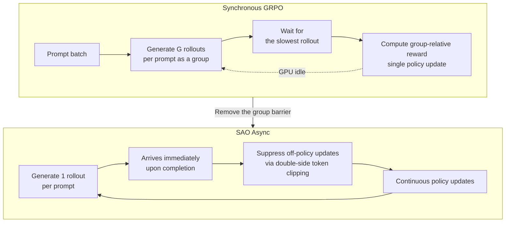

Training agents with reinforcement learning is no longer a lab-only phrase. Models that excel at tasks like fixing a codebase over dozens of turns on SWE-Bench, or working through a multi-step math proof, are mostly not the product of pretraining alone. The post-training stage, where the model actually calls tools, interacts with an environment through rollouts, and gets rewarded for it, is what makes the difference. But as those rollouts grow longer, the training method that has stood as the standard begins to break down.

A paper released on July 8, 2026 by researchers at Tsinghua University and Z AI, "Single-Rollout Asynchronous Optimization for Agentic Reinforcement Learning" (arXiv 2607.07508), confronts exactly this problem. The short version: the authors dropped "group sampling," the core mechanism behind the widely used GRPO. And they did not leave this idea confined to a paper's experiments section. They put it into the actual pipeline used to train GLM-5.2, a 750B-scale open model.

## Overview

This paper matters right now because the cost bottleneck in training has shifted from algorithms to infrastructure utilization. Plenty of loss functions already exist to make models smarter. The real problem is that even with hundreds of GPUs wired together, most of the time it takes to produce a single training step is spent waiting.

ThakiCloud also runs five post-training techniques (SFT, CPT, DPO, GRPO, GKD) on our kubeflow-based LLM training system. So the price GRPO's group sampling pays on long rollouts, and the new risks that arise from the alternative that removes that price, are not someone else's problem. This post lays out what SAO changed, and what that change means for organizations like ours trying to train agents on multi-tenant GPU clusters.

*A visualization contrasting single rollouts arriving continuously, one after another, against rollouts frozen in a queue while waiting for the rest of a group to arrive.*

## What Is This Technology

As the name suggests, SAO combines two ideas: "single-rollout" and "asynchronous optimization."

The standard RL pipeline used to be synchronous. You fix a batch of prompts, generate multiple rollouts per prompt, wait until every rollout in the batch finishes, compute the rewards, and perform a single policy update. This worked fine for tasks that generate short answers, because rollout lengths were roughly uniform.

The problem is agentic tasks. One coding task finishes in 3 turns; the task next to it runs 40 turns, calling tools the whole way. A synchronous pipeline idles the rest of the GPUs until the slowest rollout in the batch finishes. Asynchronous RL emerged to eliminate this waste: the moment a rollout completes, the model is updated immediately, and the generator never stops, moving straight on to the next rollout.

Here a fundamental conflict emerges. GRPO (Group Relative Policy Optimization) is "group-relative" by name. It bundles multiple rollouts for a single prompt into a group, and computes advantage by comparing the relatively better and worse rollouts within that group. Making learning signal from nothing but intra-group comparison, with no separate value function (critic), is both GRPO's strength and its shackle. Without a full group, you cannot compute an advantage. An asynchronous structure that learns from rollouts as they arrive, and GRPO's requirement to wait until the group fills, are fundamentally at odds.

## Why GRPO Doesn't Fit Asynchronous Training

Let's look at this conflict more concretely. To preserve groups in an asynchronous pipeline, you are forced into one of two bad choices.

First, you could wait group by group. But then the benefit of asynchrony disappears. You end up back at synchronous training, waiting for the slowest rollout.

Second, you could let the rollouts within a group be generated by policies from different points in time. If one rollout in a group was produced by an old policy and another by a policy updated several steps later, grouping them together for relative comparison is statistically contaminated from the start. The degree of off-policy drift differs rollout by rollout, and treating them as a single shared baseline while ignoring that difference destabilizes training.

SAO's answer is simple. Remove the group entirely. Generate exactly one rollout per prompt, and the moment that single rollout arrives, use it for training right away. With the group barrier gone, the generator never waits, and GPU idle time drops sharply.

## SAO's Two Pillars: Single Rollout and Double-Side Token Clipping

But removing the group also removes something GRPO got for free. The intra-group comparison itself served as a variance-reducing baseline. With only one rollout, there is no longer a "did this rollout beat the group average" comparison to lean on. On top of that, in an asynchronous structure, a time lag opens up between the policy that produced the rollout and the policy currently being updated. This lag, the off-policy problem, is the second risk that can destabilize training.

SAO blocks this stability problem with what it calls "strict double-side token-level clipping." The clipping used in the PPO family originally cuts the gradient when the importance ratio strays outside a certain range. SAO applies this at the token level, and strictly on both the upper and lower sides. Where a rollout produced by an old policy has drifted too far from the current policy at a given token, the update is strongly suppressed there, preventing a high-staleness signal from corrupting training.

The paper reports that this combination let SAO train stably for 1,000 steps. Given that asynchronous RL runs commonly diverge or collapse after a few hundred steps, 1,000 stable steps is solid evidence backing the method's central claim.

## Results and Verification

The paper compares SAO against GRPO and its variants, and reports consistent gains on agentic coding and reasoning benchmarks. The benchmarks named are SWE-Bench Verified (resolving real GitHub issues), BeyondAIME (hard math), and IMOAnswerBench (olympiad-level math). All three share a common trait: they are long-horizon, multi-step tasks rather than short one-shot answers, exactly the territory SAO targets.

The most convincing validation is not a benchmark table, but the deployment itself. SAO was put into the actual agentic RL pipeline used to train GLM-5.2, a 750B-A40B MoE open model with 40B active parameters. A research method that does not stay confined to a paper, but gets used in production training at hundreds-of-billions-of-parameters scale, is a strong signal that it holds up beyond toy settings.

That said, this post does not cite specific benchmark numbers. If we cannot reproduce the exact figures verified in the original paper here, the honest choice is to convey the method's structure and the named benchmarks without inventing numbers. If you need the precise scores, please check the source paper directly.

## Implications for ThakiCloud's Product Lineup

SAO's lesson reaches beyond a single algorithms paper, touching directly on how we operate our GPU clusters.

**ai-platform lens (GPU training infrastructure).** ThakiCloud's ai-platform schedules multi-tenant GPU training on top of Kubernetes and Kueue. Our kubeflow-based LLM training system already supports GRPO as one of its post-training techniques. SAO raises a clear question: how much is our training jobs' GPU utilization being eroded by variance in rollout length? For workloads with jagged lengths, like agentic rollouts, synchronous group waiting is a direct cost. Decoupling asynchronous rollout generation from training lets us extract more effective steps from the same GPUs, a direct lever for lowering the per-tenant cost of training in a multi-tenant environment. It is also worth checking whether Kueue's gang scheduling and queue management inadvertently enforce the "wait until the group fills" pattern.

**Paxis lens (the output of agentic training).** ThakiCloud's Agent-Native Cloud, Paxis, is a control plane that runs skills inside isolated sandboxes and routes every action through policy gates and audit logs. The target SAO is trying to train well, an agent that calls tools across many turns to fix a codebase, is exactly the kind of workload Paxis runs. Going further, the real agent traces Paxis generates inside its isolated sandboxes can themselves become a rollout source for asynchronous RL like SAO. In other words, a loop forms: ai-platform generates and trains on rollouts cheaply, and Paxis operates the resulting agents safely while producing more training data in the process. Low-cost training infrastructure (ai-platform) underpins agent economics (Paxis).

## Limitations and Counterarguments

Before accepting this method uncritically, a few things need to be flagged.

First, single-rollout training gives up the variance reduction that groups used to provide. SAO compensates with clipping, but clipping is fundamentally a mechanism that cuts learning signal. Overly strict clipping can throw away valid gradients along with the noise, slowing training down. Where the balance point between "stability" and "training speed" lands likely varies by task and scale.

Second, validation on a 750B model is impressive, but that it works at that scale does not mean it is optimal for smaller organizations' setups. An asynchronous pipeline requires separate infrastructure complexity to decouple the generator from the trainer. For a team doing short tuning runs with a handful of rollouts, synchronous GRPO may simply be simpler and sufficient.

Third, the opposite direction is also being actively explored. Around the same time, other work has treated the relationship between async RLHF staleness and learning rate as a scaling law (arXiv 2607.01083), and other approaches stabilize asynchronous training through gradient alignment. It is more accurate to view SAO's "remove the group, hold the line with clipping" not as the one correct answer, but as one strong answer among several to the open problem of asynchronous agentic RL.

Even so, SAO's contribution is clear. It identified the problem precisely (the inefficiency of group sampling on long rollouts), and validated its solution (single rollout plus double-side clipping) through actual hundreds-of-billions-scale production training. For any organization where GPU utilization is training cost, this is reason enough to calculate how much your own pipeline is burning by "waiting for the group."

## Sources

- Zhenyu Hou, Yujiang Li, Jie Tang, Yuxiao Dong. "Single-Rollout Asynchronous Optimization for Agentic Reinforcement Learning." arXiv 2607.07508 (2026-07-08). <https://arxiv.org/abs/2607.07508>
- Related: "Staleness-Learning Rate Scaling Laws for Asynchronous RLHF." arXiv 2607.01083. <https://arxiv.org/abs/2607.01083>
