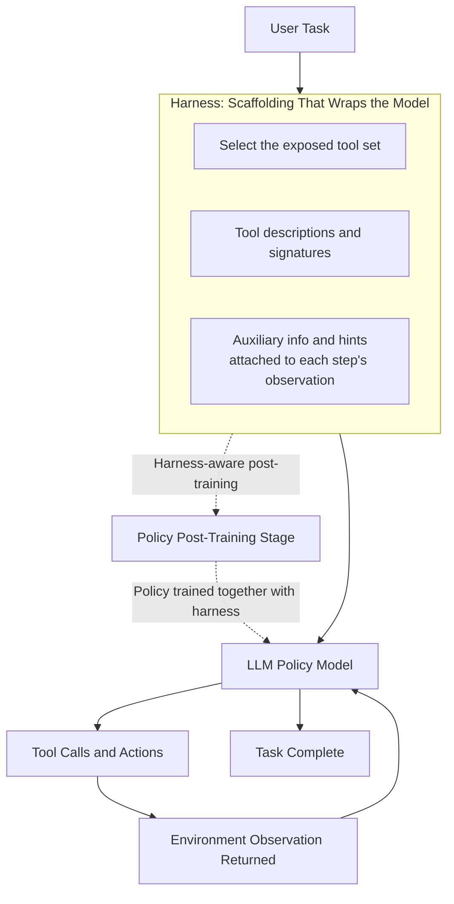

Any engineer who has operated an agent directly, or wired up a workflow heavy on tool calls, has shared one experience: even with the same base model, the agent behaves noticeably differently depending on the scaffolding it sits on (the tool list, tool descriptions, hints attached to observations). This scaffolding has recently come to be called the harness. This post is based on the paper [The Interplay of Harness Design and Post-Training in LLM Agents](https://arxiv.org/abs/2606.25447) (arXiv:2606.25447), published in June 2026. We summarize why designing a good harness and training the model well are not separate concerns, and what this result means for a cloud that actually serves agents in production. To state the conclusion up front: the harness is not a component you swap out after training finishes. It is something you must design together with the model, starting at the training stage.

## Overview: Why the Harness Matters Now

Over the past few months, the claim that "the code around the model matters more than the model itself" has come up more and more often. For tool-using agents, final performance depends as much on how tools are exposed and described, and on what gets returned as the observation at every step, as it does on the model weights. The survey [From Question Answering to Task Completion](https://arxiv.org/abs/2606.20683), which covers similar ground, also treats harness design as an independent research axis within agent systems.

The problem is that, up to now, these two things (harness design and post-training) have been handled as if they belonged to different teams. Research teams refine the policy through reinforcement learning, while platform teams tune the tools and prompts. This paper's contribution is showing that this division of labor is wrong. Harness informativeness and post-training are entangled multiplicatively: optimizing only one side leaves most of the other side's gains on the table. For a platform like ThakiCloud that already treats the harness as a first-class resource, this finding translates directly into an operating principle.

## What a Harness Is, and Where Performance Diverges

The paper defines the harness as "the scaffolding that wraps the model." Concretely, it is the layer that decides which tools to expose, how to describe those tools, and what auxiliary information rides along with the observation at every step. One cycle of a tool-calling agent looks like this:

The key variable here is the harness's informativeness. A highly informative harness describes tools richly and attaches useful hints to observations, so the model can pick the right tool while relying less on its own prior knowledge. A low-informativeness harness, by contrast, throws out only the bare minimum signature and leaves the rest to the model's own reasoning. This gap is what splits the results once it meets training.

## The Assumption This Paper Overturns

Anyone who has worked with agents tends to carry an implicit assumption: a good harness can just be bolted on right before deployment. Train the model well on its own, then later polish the tool descriptions and performance goes up: that is the expectation. The paper directly refutes this assumption.

First, even in the zero-shot setting (prompting alone, with no further training), performance improves monotonically as harness informativeness increases, and this effect is more pronounced in higher-capacity models. In other words, the prior knowledge baked into an information-rich harness is itself performance.

Second, and more importantly, comes the finding about the interaction with post-training. Compare a model trained with the harness folded in from the start against a model that gets the same harness bolted on only after training finishes: the latter recovers only a small fraction of the gains the former enjoyed. In other words, harness-aware post-training is not an add-on that boosts performance on top; it is a precondition for obtaining robust performance. Swapping in the harness after training is a half-measure.

## The Real Difference Shows Up When the Tool Environment Changes

The most practically relevant result comes from the out-of-distribution (OOD) experiments. Here, OOD refers to a tool environment not seen during training: tools added or swapped, or API signatures that have changed. In real-world operation, this kind of change is a constant. Tools keep growing in number, versions keep bumping, and the set of tools exposed differs from tenant to tenant.

The paper compares two branches. An agent that underwent harness-aware post-training with a highly informative harness holds up robustly even when the tool environment changes significantly, and generalizes across task groups. An agent trained with a low-effort, poorly designed harness, on the other hand, sees its performance collapse as the tool environment shift grows stronger, and fails to transfer to the new environment. In other words, the prior knowledge embedded in the harness acts as an anchor for generalization. A policy trained together with a well-designed harness retains a sense of what to call and how, even when facing unfamiliar tools, while a policy trained with a thin harness loses that sense entirely.

This point stings particularly for cloud operators. The classic reason an agent that scores well on benchmarks collapses in production is precisely tool environment drift. And this paper says that vulnerability is, to a significant degree, already determined at the harness design stage.

## Implications for ThakiCloud's Products

This finding touches both of ThakiCloud's product axes, so viewing it through only one lens would miss half the picture.

The first is the **Paxis lens**. Paxis is the control plane for the Agent-Native Cloud running on top of ai-platform, and it treats Skills, Tools, Policies, and Audit Logs as first-class resources. Translated into this paper's language, Paxis's Skill Harness is exactly the harness described here. Selecting the exposed tool set from roughly 960 skills via BM25, curating each skill's description and signature, and returning isolated sandbox execution results as the observation: the entire process determines harness informativeness. The paper's conclusion backs the design principle behind Paxis. Rather than exposing skills indiscriminately, selecting them for the task at hand to build a high-informativeness harness, and evolving that harness alongside the training and evaluation loop, is what leads to robustness under unfamiliar tool environments. The structure of routing every action through policy gates and audit logs is an extension of the same underlying concern: keeping the harness as something to experiment on and version, not something fixed.

The second is the **ai-platform lens**. The conclusion that harness-aware post-training is a precondition raises the value of keeping training and serving attached within a single piece of infrastructure. ai-platform runs post-training workloads such as fine-tuning and RLVR together with vLLM inference serving, on top of K8s and Kueue-based GPU scheduling. To reflect the harness at training time, the training pipeline needs to be able to reference the exact same tool schema and observation format used in serving. If training and serving are split across different organizations and different stacks, the harness drifts out of alignment, and you get trapped in the half-measure gains the paper warns about ("swap the harness in after training"). A setup that exposes different tool sets per tenant in a multi-tenant environment, while still meeting on-premise and sovereignty requirements by keeping training and serving self-hosted within one boundary, is well positioned to preserve this harness-training alignment.

The two lenses complement each other. Paxis manages the harness as a first-class resource, controlling its informativeness and versioning, while ai-platform feeds that harness into the training loop, turning harness-aware post-training into reality.

## Limitations and Counterarguments

To avoid over-interpreting this paper's results, a few caveats deserve attention.

First, the claim that "higher harness informativeness is better" comes with a cost attached. The more hints packed into observations, the longer the context grows, and the richer the tool descriptions, the more prompt tokens and latency increase. From a serving standpoint, informativeness is not free, and it needs to be weighed against throughput trade-offs. It is probably safer to read the paper's notion of informativeness not as "more is always better" but as "does it carry prior knowledge useful for the task."

Also, harness-aware post-training demands an entry cost: reworking the training pipeline. For the many practical settings that simply use an already-trained open-weight model as-is, zero-shot improvement through harness refinement alone remains a realistic first move. The paper itself shows that informativeness lifts zero-shot performance, so for teams without the capacity to train, this is a reasonable starting point.

Finally, it is hard to claim with certainty that the tool environment shifts covered by the paper's OOD experiments represent the full range of change seen in actual production. There is a gap between tool swaps on a benchmark and an operating environment where dozens of tenants are each updating their own APIs. Even so, the directional conclusion (that agents whose harness is designed together with training hold up better against change) is likely to matter even more in a real cloud where tools are constantly changing.

To sum up, this paper argues that the harness should be treated as a structure designed together with the model from the very first training stage, not as finishing trim applied right before deployment. The direction of managing the harness as a first-class resource and keeping training and serving inside one piece of infrastructure points exactly toward that recommendation.

## Sources

- The Interplay of Harness Design and Post-Training in LLM Agents, arXiv:2606.25447: <https://arxiv.org/abs/2606.25447>
- From Question Answering to Task Completion: A Survey on Agent System and Harness Design, arXiv:2606.20683: <https://arxiv.org/abs/2606.20683>
</content>
