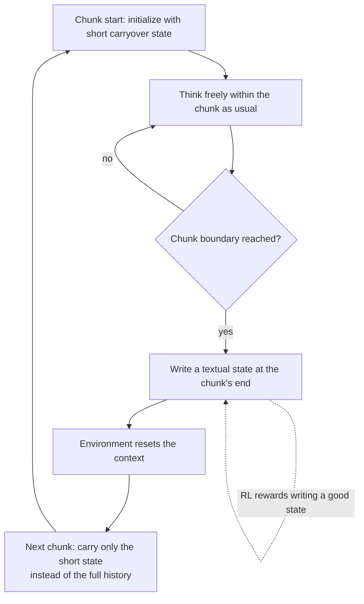

If you have hit the point where making a reasoning model think ever longer becomes unaffordable, this post is for you. Here is the conclusion first. The real cost of a long chain of thought is that the state grows without bound while the model thinks, so cost scales with the square of the thinking length, and Markovian Thinking lowers that cost to linear by making the policy advance reasoning while conditioning only on a fixed-size state. In Delethink, the environment that instantiates this idea, a 1.5B model trained with 8K-token chunks thinks up to 24K tokens and matches or surpasses the same-budget baseline, and at a 96K thinking length the training cost drops from 27 H100-months to 7.

*An abstract rendering of Markovian Thinking: breaking long reasoning into fixed-size chunks and passing only a short state forward.*

## Why This Is Worth Reading

This post is written for the engineer who serves or trains long-reasoning models with reinforcement learning, and for the platform owner accountable for that inference cost. The decision you face is this: you want the model to think longer, but how do you absorb the compute and memory that jump quadratically with that length? Markovian Thinking (arXiv:2510.06557, McGill-NLP) answers by decoupling thinking length from context size. In short, if you break reasoning into fixed-size chunks and keep only a short textual state to carry across each chunk boundary, then no matter how long the thinking gets, cost grows only linearly and memory stays constant.

## Overview

Over the last few years, reasoning-model performance has climbed by lengthening the chain of thought. The premise is that thinking longer lets you solve harder problems. But this lengthening thinking carries a hidden price. In the standard RL thinking environment, the state is defined as the prompt plus every reasoning token generated so far. As the model keeps thinking, the state keeps swelling, and an attention-based policy has to re-read that growing state each time, so compute scales with the square of thinking length. Memory grows alongside it. Double the thinking, and cost quadruples.

Markovian Thinking revisits that premise itself. Instead of letting the state grow without bound, it makes the policy advance reasoning while conditioning only on a fixed-size state. It cuts the link that tied thinking length to context size, so that as thinking lengthens, compute stays linear and memory stays constant. Just as in a Markov process the next state depends only on the immediately preceding fixed state, the next piece of thinking depends only on the fixed state just handed over, not on all prior tokens.

## What the Technique Is

The concrete instantiation of Markovian Thinking is a reinforcement-learning environment called Delethink. Delethink structures reasoning into fixed-size chunks. Within each chunk the model thinks freely as usual. When it reaches a chunk boundary, the environment resets the context and reinitializes the prompt with a short carryover. The key is what the policy learns through RL. Near the end of each chunk, the policy learns to write for itself a textual state sufficient to continue reasoning seamlessly after the reset. The next chunk inherits only this short state, not the entire preceding chunk.

The diagram below shows the flow.

The difference from the standard long chain-of-thought approach (LongCoT) is exactly here. LongCoT keeps piling every generated token into the context, so the state grows without bound. Delethink empties the context at each chunk and passes only a short state, so the state size stays fixed. You lengthen the thinking by stitching more chunks together, but the amount loaded into the context at any one time is capped at a single chunk.

## What the Paper Reports

The numbers the paper reports show that the idea actually works. An R1-Distill 1.5B model trained in Delethink with 8K-token chunks thinks up to 24K tokens and matches or surpasses a LongCoT-RL model trained with a 24K budget. It managed reasoning three times longer than the 8K window it ever sees at once.

The cost difference widens with scale. The paper reports that at an average thinking length of 96K, LongCoT-RL costs 27 H100-months of training versus 7 for Delethink. That is the gap linear-versus-quadratic makes.

| Item | LongCoT-RL | Delethink (Markovian Thinking) |
|---|---|---|
| State size | grows without bound with thinking length | fixed at chunk size |
| Compute scaling | quadratic in thinking length | linear in thinking length |
| Training cost at 96K thinking | 27 H100-months | 7 H100-months |
| Test-time scaling | tends to plateau | keeps improving |

Test-time scaling shows a difference too. When you push thinking longer at inference, Delethink keeps improving where LongCoT plateaus. Another intriguing observation comes from analysis at RL initialization: off-the-shelf reasoning models from 1.5B to 120B often sample Markovian traces zero-shot across diverse benchmarks. These naturally occurring positive samples are what make RL effective at scale.

An honest note here as well. All the figures above are values the paper reports, not something we reproduced and measured ourselves. We encourage you to check the specific experimental conditions directly in the source and the public code repository.

## What It Means for ThakiCloud

The practical implication of Markovian Thinking reaches both of ThakiCloud's products.

The ai-platform angle is especially direct. What actually drives up the cost of serving long reasoning is the KV cache and attention compute that grow as thinking lengthens. If the context grows without bound, the number of concurrent requests you can fit on a single H200 drops, and GPU memory pressure worsens in a multi-tenant setting. Capping the amount loaded into the context at chunk size, as in Markovian Thinking, keeps the KV cache footprint constant regardless of thinking length. That means absorbing more concurrent inference on the same hardware under Kueue-based GPU scheduling, even for workloads that demand longer thinking. The tighter the GPU budget, as in on-premises and sovereign deployments, the larger the payoff of linear cost.

There is a Paxis angle too. Paxis is ThakiCloud's Agent-Native Cloud, running workflows in isolated sandboxes where agents reason at length across many steps and call tools. As an agent's reasoning lengthens, the context swells and cost and latency rise together; the fixed-state carryover of Markovian Thinking offers a way to keep long agent loops at constant memory. When the skill harness chains several skills together for a long task, a design in which each step inherits only a compressed state rather than the full history improves agent economics directly.

## Limits and Counterarguments

The biggest question is information loss. Resetting the context at a chunk boundary and passing only a short state means that any detail of the preceding chunk not captured in that short state is gone for good. The policy must genuinely learn to compress what matters into the state, and getting the state size and chunk size wrong can hurt performance on problems that demand long-range dependencies. Not every kind of reasoning chunks cleanly into a Markovian form.

The approach also only works once RL has trained the state-writing habit. Apply it as-is to a model that has not yet learned to write states and the chunks break apart. That said, the paper's observation that off-the-shelf models already sample Markovian traces to some degree eases this bootstrap burden. Finally, the reported gains are for the paper's experimental setup and benchmarks, and whether they transfer intact to real production inference in very different domains needs separate verification.

## Wrapping Up

Before trying to solve the cost of long reasoning by scaling the model, Markovian Thinking says to change the definition of the problem itself: do not let the state grow without bound, fix it. If you serve or train long reasoning, the one thing to take away today is clear. Lengthening the thinking and growing the context without bound are not the same thing, and separating the two opens room to get the same performance for far less cost. Letting the policy learn for itself what to keep and what to discard at a chunk boundary is a cheap lever worth examining first, in a serving reality where inference cost is business cost.

Source: [The Markovian Thinker: Architecture-Agnostic Linear Scaling of Reasoning (arXiv:2510.06557)](https://arxiv.org/abs/2510.06557) · [Code repository (McGill-NLP/the-markovian-thinker)](https://github.com/McGill-NLP/the-markovian-thinker)
