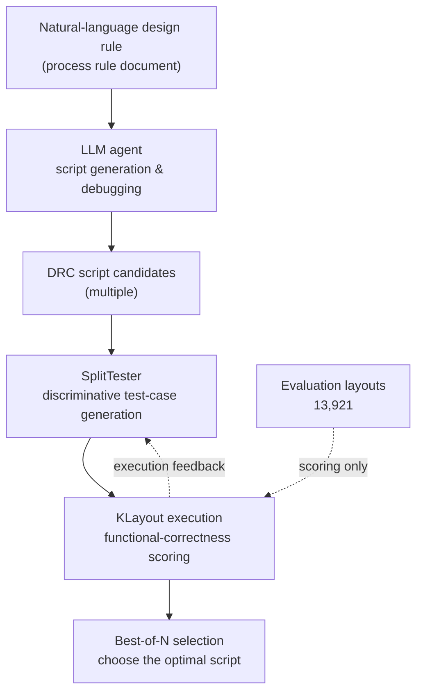

If you are an engineer who wants to automate the verification of the thousands of design rules a chip must satisfy before mass production, this post is for you. Here is the conclusion first. Rule2DRC (arXiv:2605.15669, from Prof. Hyun Oh Song's group at Seoul National University and Samsung AI Center, ICML 2026) is a large-scale benchmark that scores LLM agents translating natural-language design rules into executable DRC verification scripts by whether the scripts actually run and pass in a verification engine, not by how closely the code resembles a reference. On top of that, the team built a layout-native agent GUI app that can be deployed inside Samsung's secure intranet. It is worth watching as a signal that domain-specific agents are entering industrial settings where regulation and security are strict.

*A visualization of layout grid patterns flowing into structured verification logic.*

## Why Read This

This post is for engineers deploying domain-specific LLM agents into regulated, secure environments, and for platform owners looking to automate specialized work such as EDA and semiconductor verification with agents. The question you face is this: when you hand verification work that used to require an expert to an agent, how can you trust that it truly does the job correctly? Rule2DRC's answer is clear. You run the scripts the agent produces in an actual verification engine and score them by functional correctness. Plausible-looking code and code that actually works are different things, and the industry needs the latter.

## Overview

Before a semiconductor chip goes into mass production, it must be verified against thousands of geometry-based design rules. This verification is called DRC, or Design Rule Check. The catch is that the rules themselves are written as natural-language documents. A sentence like "the minimum spacing between metal wires must be at least X" has to be turned into a script in a dedicated verification language such as KLayout or SVRF before an engine can actually inspect the layout.

That translation is far from trivial. Every time a process node changes or a foundry changes, experts have hand-translated thousands of rules into scripts. Because the work is repetitive yet requires deep expertise, attempts to automate it with LLM agents followed naturally. The idea is to build an agent that reads a rule document, generates a verification script, and even debugs it when it is wrong.

The real bottleneck turned out to be evaluating the agent properly, more than building it. Prior benchmarks carried two limitations. One was that the evaluation sets were small. The other was that they scored generated scripts by similarity to reference code rather than by actually running them. On top of that, prior methods that did use execution feedback often required the answer test layouts as the agent's input in order to score. In practice, no such answer layouts are handed to you.

## What the Benchmark Is

Rule2DRC takes these two limitations head-on. It is a large-scale benchmark made of 1,000 rule-to-script tasks and 13,921 chip layouts for scoring those scripts. The scoring method is the crux. It runs the AI-generated scripts in the KLayout verification engine and measures functional correctness by how well they inspect the layouts. It does not look at whether the code resembles a reference.

What stands out is that the answer layouts are not given to the agent as input. The scoring side holds a vast pool of evaluation layouts, but the agent has to write scripts from the rule document alone. This reproduces the real situation exactly. It parts ways here with earlier approaches that showed the agent the answer key beforehand and then scored it.

The diagram below shows the Rule2DRC evaluation flow.

This is where the second contribution, SplitTester, comes in. When the agent produces several candidate scripts, choosing the best one is harder than it sounds, because the candidates often behave similarly and are indistinguishable on the surface. SplitTester is a tester agent that uses execution feedback to generate discriminative test cases on its own. It creates tests that make previously indistinguishable candidates produce different results, so it becomes clear which candidate is actually correct. Separating candidates this way noticeably improves Best-of-N selection, the task of picking one script out of many.

In the paper's quantitative results, the gap between frontier models and open-source models was pronounced, and attaching SplitTester improved candidate-selection performance. For exact per-model pass rates, we recommend checking the paper's tables directly. The benchmark was accepted at ICML 2026, and it was reported to have received an Outstanding Research Award and a Best Poster Award at Samsung AI Center's NPRC workshop.

## Why Execution-Based Scoring Matters

The shift from code-similarity scoring to execution-based scoring is the real center of gravity of this work. Similarity scoring measures "how much does it resemble the answer," while execution scoring measures "does it actually pass." The two questions are entirely different. Code that looks identical to the answer can fail when run, and code that looks completely different can work perfectly. As long as the essence of verification lies in "does it actually catch the rule violations," scoring should be done by execution too.

This direction is not a story confined to semiconductor verification. The evaluation paradigm across coding agents as a whole is heading to the same place. It is the trend of scoring by deterministically checkable outcomes: code that passes tests, code whose endpoints return the expected responses, code that leaves the correct rows in a database. Rather than trusting the model's self-report that "I think it worked," you let the execution result render the verdict.

And what makes this work especially meaningful is that it did not stop there. Integrated with an in-house LLM in Samsung's secure environment, a GUI app that handles layouts and verification code on a single screen was built. It went beyond a benchmark and a paper into a tool that can be deployed in the field. Here you can read the signal that domain-specific agents are genuinely entering industries where regulation and security are strict.

## Implications for ThakiCloud Products

The picture Rule2DRC paints overlaps precisely with where ThakiCloud aims with its two products. Because the topic is operating domain-specific agents in a security-isolated environment, the Paxis lens is central and the ai-platform lens supports it.

From the agent perspective, Paxis takes this demand directly. Paxis is ThakiCloud's Agent-Native Cloud control plane running on top of the ai-platform, treating Skills, Tools, Policies, and Audit Logs as first-class resources. The Samsung case of a layout-native GUI app plus an in-house LLM integration is exactly Paxis's Agent Builder and on-premises deployment model. In particular, Rule2DRC's execution-based scoring shares the same philosophy as Paxis's verification design. When Paxis evaluates a skill, it already leans toward scoring by deterministic execution results, that is, assertions, DB rows, and endpoint outputs, rather than by resemblance to a reference. The way SplitTester separates candidates with execution feedback to lift Best-of-N is worth borrowing as the logic by which the Evaluator in Paxis's multi-agent orchestrator discriminates candidate outputs by their execution results.

From the infrastructure perspective, the ai-platform holds up this picture. Serving an in-house LLM as the backend of a verification agent requires an inference stack that runs stably on-premises. The ai-platform provides vLLM serving and scale-to-zero on top of K8s and Kueue-based GPU scheduling, and operates models in multi-tenant isolated environments. A token-metered cloud API cannot meet air-gapped requirements like Samsung's intranet. On-prem inference that competes on low serving cost is what makes the economics of such domain agents work. Low-cost serving opens the possibility of running agents continuously, and on top of that Paxis's policy gates and audit logs take responsibility for regulatory compliance.

In short, this case is evidence that industry needs not general-purpose chatbots but domain-specific agents running in security-isolated environments. Paxis's Sandbox Runtime, autonomy levels, Policy Engine, and on-premises audit logs point exactly at this demand.

## Limitations and Counterarguments

To avoid overrating this work, let me note the other side. First, Rule2DRC's core contribution is the benchmark and the scoring methodology, not a claim that verification automation is now complete. Even frontier models did not translate every rule into a script perfectly, and the existence of a gap also means we are not yet at the stage of replacing human experts.

Second, execution-based scoring is only possible when the verification engine and evaluation layouts are in place. Rule2DRC prepared 13,921 layouts, but building an execution-ready evaluation set of the same scale for a new process or a different domain is itself a large cost. That execution scoring is more correct than similarity scoring, and that you can cheaply set up that execution environment everywhere, are two separate things.

Third, that an on-prem GUI app appeared and how much it actually reduced experts' manual work in practice are different questions. There is still distance between a paper-stage demonstration and field-operation reliability, and what bridges that distance is not a benchmark but long-accumulated operational data.

## Wrapping Up

If we compress the message of Rule2DRC into one sentence, it is this: domain-specific agents should be scored by code that actually passes, not by plausible-looking code, and only when you can score them that way can you deploy them in regulated, secure settings. A single thread runs from a benchmark that evaluates the specialized work of turning natural-language rules into execution scripts by execution results even without answer layouts, to SplitTester that discriminates candidates on top of it, to an on-prem GUI app.

If you are designing a domain-specific agent, the next action is clear. First set up a gate that scores outputs by execution results rather than by similarity, and when there are multiple candidates, attach discriminative tests that separate them. ThakiCloud already folds these two into practice through Paxis's Evaluator and the ai-platform's on-prem serving. If you want to automate verification, let execution render the verdict.

## Sources

- Paper: [Rule2DRC (arXiv:2605.15669)](https://arxiv.org/abs/2605.15669)
- SNU Engineering News: [SNU Engineering News](https://eng.snu.ac.kr/en/communication/promotion/news?md=v&bbsidx=8189&sc=y)
