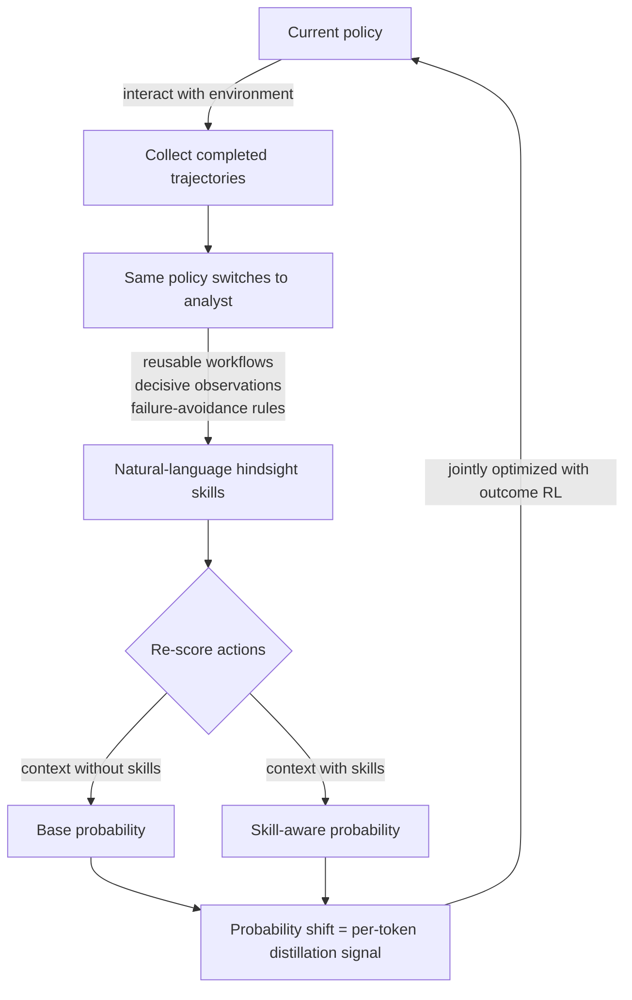

If you train LLM agents that act through multi-turn tool use and environment feedback with reinforcement learning, this post is for you. Here is the conclusion first. The most common reason agentic RL underperforms is not that the model is weak, but that the reward arrives only once at the end of a trajectory, and SEED converts that single sparse signal into dense per-token supervision by having the agent analyze its own trajectories, extract natural-language skills, and distill them back into itself. The method lifted both performance and sample efficiency across text-based and vision-based agentic tasks.

*An abstract rendering of SEED's self-evolving loop: mining skills from completed trajectories and feeding them back into the same policy.*

## Why This Is Worth Reading

This post is written for the engineer who post-trains agents with reinforcement learning and for the platform owner who designs the training infrastructure underneath. You face a single decision: how do you push additional supervision into an RL pipeline that currently rewards only the outcome? SEED (Self-Evolving On-Policy Distillation, arXiv:2607.14777) answers with a path that uses neither a separate strong teacher model nor a human-built reward model, but the policy itself as its own teacher. In short, the loop of analyzing a trajectory, extracting reusable skills, and using how much those skills shift the policy's action probabilities as the training signal manufactures supervision over intermediate decisions without any extra labels.

## Overview

The last few years of reasoning-model training have been led by outcome-based reinforcement learning, the RLVR family that uses verifiable rewards. You hand out a trajectory-level reward such as 1 for correct and 0 for wrong and push the policy upward. For single-response math or coding problems this works well. Agents are the problem. In a long trajectory that calls tools repeatedly, receives observations, and acts again, whether the final answer succeeded tells you almost nothing about whether each of the dozens of intermediate decisions in between was good or bad. A supervision gap opens up between the episode-level outcome and token-level learning. That gap is the fundamental bottleneck eating into the sample efficiency of agentic RL.

SEED proposes a way to close it. The core idea is that a completed trajectory already contains what there is to learn. A successful trajectory holds a reusable workflow; a failed one holds a trap to avoid. SEED makes this hindsight explicit as natural-language skills, then distills those skills back into the policy. And the analyst that extracts these skills is not an external model but the current policy itself. It is a self-evolving structure in which the policy both collects trajectories and mines skills from them.

## What SEED Is

In one sentence, SEED is a self-evolving framework that converts completed on-policy trajectories into training-time hindsight skills and distills their behavioral effect back into the policy model. Break it into three steps and the structure becomes clear.

First, the policy is fine-tuned to analyze completed trajectories and generate natural-language skills. These skills capture reusable workflows, decisive observations, or failure-avoidance rules. Rather than a human injecting rules through a prompt, the model extracts rules from its own experience and states them in language.

Second, during RL the current policy plays two roles at once. One is to interact with the environment and collect trajectories as usual; the other is to serve as the analyst that extracts hindsight skills from those trajectories. Because there is no separate teacher, no teacher-student distribution mismatch arises, and the skills stay aligned with the trajectory distribution the policy is actually walking right now.

Third, and this is SEED's core device, it re-scores the sampled actions under two contexts. One is an ordinary context without skills, the other is a context augmented with the extracted skills. How much the probability of a given action rises or falls when the skill is attached, that probability shift, becomes a dense per-token on-policy distillation signal. This signal is then optimized jointly with outcome-based RL. It nudges the policy toward the actions it would have chosen with higher probability had the skill been present, and crucially this auxiliary supervision stays aligned with the current trajectory distribution.

The diagram below shows the loop.

The contrast with prior approaches is clear. Distilling from a strong external teacher requires finding that teacher, and if the teacher and student distributions drift apart the signal is contaminated. Building a human reward model is label-expensive. SEED avoids both. The teacher is the policy itself, the labels are extracted automatically from trajectories, and the signal is aligned with the current policy at every step.

## What the Paper Reports

The paper reports extensive experiments on both text-based and vision-based agentic tasks. The direction of the results is consistent. SEED improved both performance and sample efficiency, and its generalization to scenarios not seen during training was robust. Compared with powerful baseline methods, it achieved the strongest average performance across three representative agentic benchmarks, which is the paper's central claim.

An honest note belongs here. This post is written on the basis of the paper's abstract and public summary, and we encourage you to check the per-benchmark numbers directly in the source. These are not values we measured through a separate reproduction, so rather than quote absolute figures we focused on conveying the structure and direction of the results. Even the direction alone carries a clear implication. Higher sample efficiency means reaching the same performance with fewer trajectories, which is to say fewer GPU-hours, and that maps directly onto saving the most expensive resource for anyone actually running agentic RL.

## What It Means for ThakiCloud

The idea SEED puts forward touches both products ThakiCloud operates.

The Paxis angle is especially direct. Paxis is ThakiCloud's Agent-Native Cloud, treating skills, tools, policies, and audit logs as first-class resources. Within it lives a self-evolving skill layer where agents mine skills from experience and improve on their own. What SEED demonstrated academically is exactly this idea, that a loop which makes completed trajectories explicit as natural-language skills and feeds them back into behavior genuinely improves the policy. If the Paxis skill harness selects from more than 960 skills via BM25, executes them in isolated sandboxes, and passes every action through policy gates and audit logs, SEED offers the training-time theoretical backing for how those skills are born from experience and refined. Skills expressed in natural language can be read and audited by humans, which fits well with the Paxis design philosophy that prizes policy gates and audit logs.

There is an ai-platform angle too. Actually running a method like SEED requires a post-training pipeline that jointly optimizes outcome-based RL and a distillation signal, and that consumes substantial GPU resources. ThakiCloud's ai-platform operates post-training such as SFT, DPO, and GRPO on top of Kueue-based GPU scheduling and multi-tenant serving. The sample-efficiency improvement SEED emphasizes translates straight into cost on this infrastructure. Reaching the same agent quality with fewer trajectories means absorbing more training jobs on a shared GPU pool, or training more deeply on the same budget.

## Limits and Counterarguments

SEED's self-evolving structure is powerful, but the fact that the policy doubles as the analyst is a double-edged sword. In the early stage when the policy is still weak, the quality of the skills it extracts is necessarily low too, and a distillation signal built from low-quality skills risks pushing learning in the wrong direction. The price of not using a strong external teacher is that securing signal quality during the early bootstrap phase becomes the practical crux.

Extracting skills and re-scoring actions under two contexts also adds computation over pure outcome-based RL. The trade-off between the gain of fewer trajectories from better sample efficiency and the cost of adding analysis and re-scoring per trajectory will depend on the task and scale. Finally, the results this post rests on are for the three benchmarks the paper selected, and whether the gain transfers intact to other domains, especially real production agents with very different tool ecosystems, needs separate verification.

## Wrapping Up

Diagnosing the bottleneck of agentic reinforcement learning as a supervision gap rather than a lack of model capability points to a direction: before scaling the model, make the signal denser. SEED shows a path to that denser signal that does not buy it from outside but mines it, in the form of natural-language skills, from trajectories the agent has already produced and feeds back into itself. If you operate an agentic RL pipeline, the one thing to take away today is clear. If you are rewarding only the outcome, do not throw the trajectory away; check first whether there is room to extract hindsight skills and recycle them as per-token supervision. That may be the cheaper lever to try before a bigger model or a stronger teacher.

Source: [SEED: Self-Evolving On-Policy Distillation for Agentic Reinforcement Learning (arXiv:2607.14777)](https://arxiv.org/abs/2607.14777)
