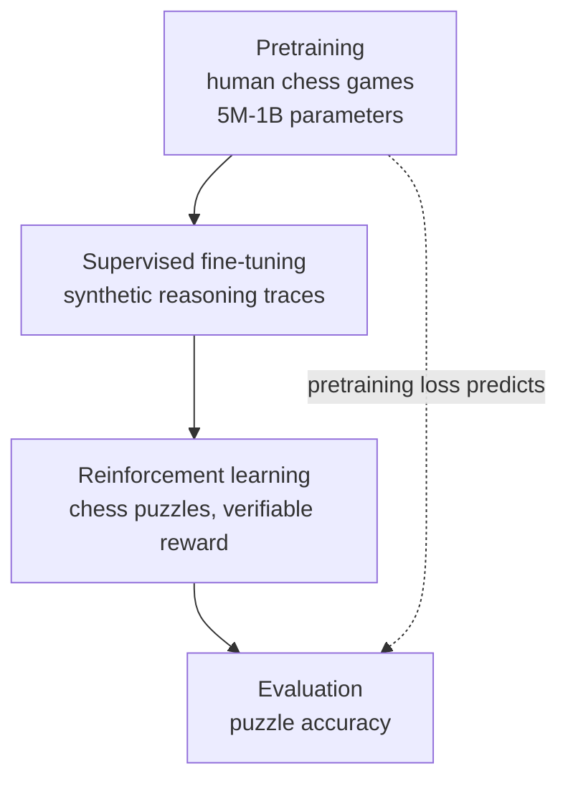

If you are an engineer trying to improve a reasoning model with RL post-training and wondering how to split a GPU budget between pretraining and RL, this paper offers a clear answer. The headline finding is this: the ceiling on the reasoning performance RL can reach is already set by pretraining, and the relationship is regular enough to be predicted from a single number, the pretraining loss. Researchers from NYU, Modal Labs, and UCLA used chess as a controlled testbed and uncovered a joint scaling law that spans the whole pipeline, from pretraining through RL post-training.

*Pretraining forms the foundation that sets the ceiling for later RL performance.*

## Why This Matters

This section is written for engineers who run LLM training pipelines directly, and for platform teams who have to split a limited GPU budget across pretraining, SFT, and RL. The core takeaway is this: RL is not magic that makes a model smart out of nothing. It is a stage that pushes performance up within a ceiling already drawn by pretraining, and that ceiling can be estimated in advance from the pretraining loss. Knowing this lets you avoid wasted effort like "let's just run RL on a small model for a long time and see," and instead decide where to spend compute with actual evidence.

## Overview

Over the past two years, RL post-training has become a central tool for improving LLMs on complex reasoning tasks, refining models with verifiable rewards through methods such as GRPO and DPO. Most research, however, has treated RL as separate from the pretraining that precedes it, optimizing each stage in isolation.

This paper ties the two together into a single pipeline and asks two fundamental questions. First, how do pretraining choices, model size and data volume, govern the returns on RL compute? Second, what does RL actually do to the model? Answering these questions requires repeating the full pipeline, from pretraining to RL, under controlled conditions, which is far too costly with real large language models. That is why the team turned to chess.

## What the Study Did

Chess is a good testbed for studying reasoning. The rules are clear, the quality of a move can be verified by an engine, and difficulty can be tuned puzzle by puzzle. The team mapped a standard LLM training pipeline directly onto chess.

They first pretrained language models ranging from 5 million to 1 billion parameters on human chess games. Next came supervised fine-tuning on synthetic reasoning traces, data meant to mimic the thought process a person goes through when choosing a move. Finally, they ran RL on chess puzzles, where correctness is verifiable and rewards can be assigned unambiguously.

The advantage of this setup is that the team could freely vary parameter count and pretraining data volume and repeat the entire pipeline. In effect, they ran, on the scaled-down world of chess, a controlled experiment of a scope that would be unthinkable with actual LLMs.

## Key Findings

The results split into two main strands.

First, a joint scaling law. At a given level of RL compute, post-RL performance is well predicted by pretraining loss. In other words, how well pretraining went, before any RL touches the model, tells you fairly precisely how far RL will eventually take it. Furthermore, the slope of the RL reward curve improves almost linearly as pretraining token count increases. A model that has been pretrained more thoroughly improves faster per unit of RL compute.

The practical implication is compute allocation. Running RL longer does not make performance climb without bound. If pretraining is weak, the RL curve itself has a shallow slope, so pouring in the same RL compute yields less improvement. The paper quantifies this relationship and gives a basis for deciding how to split a fixed total budget between pretraining and RL.

Second, what RL actually does to the policy. It turns out RL is not simply sharpening the SFT policy. On easy puzzles, RL amplifies correct moves the SFT policy already favored, making what it was already good at more reliable. On hard puzzles, however, RL surfaces correct moves the SFT policy did not favor, uncovering moves it did not previously tend to play. This observation, that RL behaves qualitatively differently depending on difficulty, challenges the common view of RL as merely a process that sharpens a probability distribution.

## Implications for ThakiCloud Products

This research speaks directly to the problems ThakiCloud's ai-platform deals with day to day. ai-platform runs a training pipeline on top of K8s and Kueue GPU scheduling that supports multiple training methods, including SFT, CPT, DPO, GRPO, and GKD. When a customer wants to refine a reasoning model with their own GPU budget, the first question they run into is exactly this one: where should the compute go?

The joint scaling law in this paper gives that question a principle. Increasing the RL budget while pretraining or continued pretraining (CPT) remains weak means forcing your way up a curve with a shallow slope. Conversely, lowering the pretraining loss first means the same GPU hours spent in the following RL stage buy a larger improvement. From a platform standpoint, this means we can advise data-driven stage-by-stage budget allocation when scheduling training jobs, using pretraining loss as an observable to estimate the expected return of an RL job in advance, and adjusting Kueue queue priorities accordingly.

The finding that RL behaves differently depending on difficulty is also practically useful. Running RL on data weighted toward easy tasks may only amplify existing strengths without surfacing new capabilities. Mixing in enough hard tasks is what leads the model to discover correct behaviors it did not previously favor. For our customers running GRPO with verifiable rewards, this is a practical lesson: puzzle difficulty distribution should be designed deliberately, not left to chance.

Chess is, of course, a scaled-down world, and it differs from natural-language reasoning in many ways. Even so, the shape of the scaling law found in this controlled experiment is useful as a compass for setting the direction of compute allocation in real pipelines.

## Limitations and Counterarguments

Before accepting this paper's conclusions at face value, a few points are worth flagging.

First, chess is a closed domain with near-perfect verification. An engine judges the quality of a move exactly, so the reward signal is clean. In real natural-language reasoning, however, the reward itself can be noisy and biased. Whether the clean scaling law that holds in chess retains the same shape under messy real-world rewards is a separate question.

Second, model scale here ranges from 5 million to 1 billion parameters, small compared to frontier models. Scaling laws are risky to extrapolate. There is no guarantee that the linear relationship observed at this scale continues to hold at the scale of tens of billions of parameters. The paper itself presents this as a finding from a controlled testbed, not as a claim confirmed at frontier scale.

Third, predicting post-RL performance from the single metric of pretraining loss is powerful, but it may fail to distinguish what actually drove the loss down. When data quality and data quantity produce the same loss through different means, whether the subsequent RL behavior is truly identical needs further verification.

## Summary

This paper overturns the practice of treating RL post-training as separate from pretraining, tying the two together into a single joint scaling law. Post-RL reasoning performance is predicted by pretraining loss, and the slope of the RL curve improves almost linearly with pretraining token count. This result backs up the claim laid out at the start: the ceiling on the performance RL can reach is already set by pretraining.

The practical takeaway is clear. Before increasing the RL budget to refine a reasoning model, check first whether pretraining or continued pretraining has gone far enough. Pretraining loss is an observable that lets you estimate the expected return on RL ahead of time. And make sure the RL data mixes in enough hard tasks so the model discovers correct behaviors it did not originally favor. ThakiCloud's ai-platform builds this principle into training job scheduling, helping customers allocate their GPU budget wisely at each stage.

## Sources

- [Understanding Reasoning from Pretraining to Post-Training (arXiv:2607.16097)](https://arxiv.org/abs/2607.16097)
- [Full paper HTML (arXiv)](https://arxiv.org/html/2607.16097)
- [Author Pavel Izmailov's introduction thread (X)](https://x.com/Pavel_Izmailov/status/2079268684317508020)
</content>
