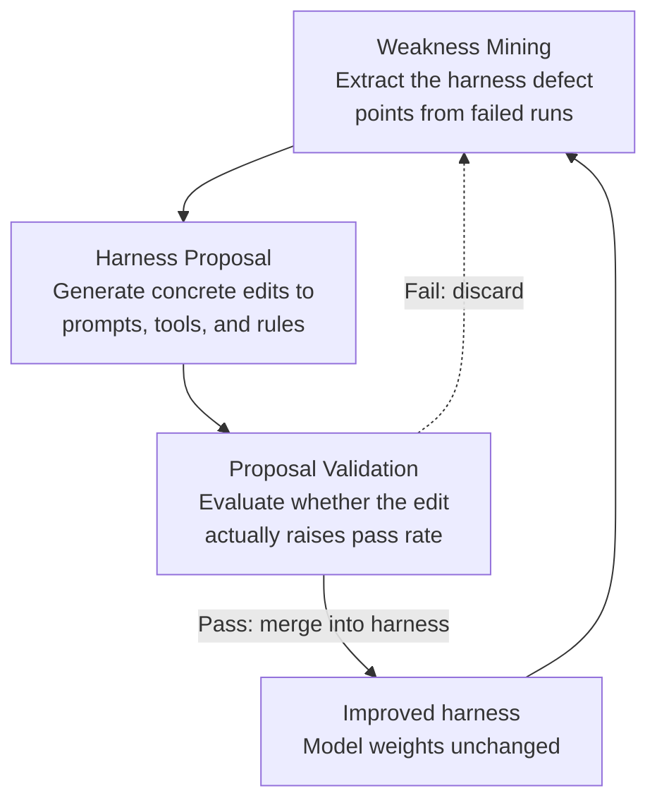

If you run an agent harness in production, you are probably always wondering where the headroom for higher pass rates hides once you stop swapping in a bigger model. The conclusion of Self-Harness (arXiv 2606.09498) is this: that headroom lives not in the model but in the harness, and, remarkably, an agent can recover much of it by fixing its own harness with no human in the loop. How far this self-improvement loop climbs, however, depends not on the generator but on how demanding the evaluator becomes. This post lays out the mechanism and its limits.

## Why Read This

This post is written for engineers who operate an agent harness directly, and for platform owners who want to design a self-improvement loop. By harness we mean the entire scaffolding around the model: the system prompt, tool definitions, routing rules, and output-validation gates. The core conclusion is that the lever for raising agent performance is not only model replacement but harness improvement, and that an agent can repeat that improvement on its own. The ceiling, though, is set by the quality of the evaluator. Knowing this lets you defer the reflex decision of "performance is weak, so let us move to a bigger model" and instead fix the harness and the evaluator first.

## Overview

Over the past two years, the center of gravity in agent research has shifted from the model itself to the scaffolding around it. It has been confirmed again and again that with the same model, results change greatly depending on how you write the system prompt, which tools you provide, and how you feed failures back in. Yet improving this harness remained a human engineer's job: the tedious manual work of collecting and reading failure cases, revising prompts, and refining tools continued.

Self-Harness hands that manual work to the agent. Without bringing in a human engineer or a stronger external agent, it makes the agent fix its own harness. The question the paper poses is simple: how much does performance rise if you leave model weights untouched and repeatedly fix only the harness, and where does that improvement stop?

## What the Research Is

The backbone of Self-Harness is a loop of three interlocking stages: Weakness Mining, Harness Proposal, and Proposal Validation.

The first stage, Weakness Mining, digs through failed runs to find which part of the harness caused the problem. The point is not simply "it was wrong" but pinpointing which file or which procedure led the agent astray. The second stage, Harness Proposal, targets that weakness and produces concrete edits for how to change the system prompt, tool definitions, and routing rules. The third stage, Proposal Validation, checks whether that edit actually raises the pass rate. Only edits that pass here are merged into the harness; those that do not are discarded.

The crucial point in this structure is that model weights are never trained. The only thing that improves is the scaffolding outside the model. That leaves room for teams with no budget to retrain weights, and for teams that use closed models through an API only, to apply this method directly.

## Actual Experimental Results

The paper ran Self-Harness on a benchmark called Terminal-Bench-2.0 with three base models. The results are summarized below.

| Base model | Pass rate before | Pass rate after | Relative gain |
|---|---|---|---|
| MiniMax M2.5 | 40.5% | 61.9% | about +53% |
| Qwen3.5-35B-A3B | 23.8% | 38.1% | about +60% |
| GLM-5 | 42.9% | 57.1% | about +33% |

All three models showed clear gains in pass rate on held-out problems (problems not used for improvement), even though the weights were never touched. For Qwen3.5-35B-A3B the relative gain reached about 60%. It is also notable that in absolute terms the weakest starting model improved by the largest margin, which invites the reading that the flimsier the harness, the more room it has to fix itself.

One caveat here: these numbers are values we confirmed from the paper's abstract and introduction, not figures we reproduced ourselves. Terminal-Bench-2.0 measures the ability to carry out real tasks in a terminal environment, so whether the same harness-improvement technique transfers with the same margin to other domains (say, document generation or data analysis) must be verified separately.

## The Real Bottleneck of a Self-Improvement Loop: The Evaluator

The passage most worth dwelling on in this paper is not the performance numbers but where those numbers stop. The third stage, Proposal Validation, is the evaluator of this loop. And a self-improvement loop tends to stall the moment the evaluator stops getting harder. If the bar for passing a proposal is loose, the agent keeps admitting changes that do not actually make it better, and the loop merely spins in place.

This overlaps exactly with a discipline we have stressed repeatedly as an internal rule: before merging fanned-out results, you must close them with a verification stage; that verification must be adversarial and take a different view from the generator; and when quality is poor, the most common cause is not "the model is weak" but "there is no verification stage, or it is weak." Self-Harness backs this principle with benchmark numbers. In other words, if you want to raise the ceiling of self-improvement, make the evaluator more demanding before you make the generator bigger.

## Implications for ThakiCloud Products

This paper is especially direct from our Paxis viewpoint. Paxis is ThakiCloud's Agent-Native Cloud, a control plane that treats Skills, Tools, Policies, and Audit Logs as first-class resources. It selects from more than 960 skills via BM25, runs them in isolated sandboxes, and passes every action through policy gates and audit logs. The harness that Self-Harness talks about, that set of prompts, tools, and routing rules, is exactly the Paxis skill harness.

The three-stage loop of Self-Harness maps naturally onto the self-evolving skill layer of Paxis. Weakness mining, which pulls weaknesses from failed-run records, is handled by our skill retrospection and mining routines; harness proposal corresponds to the evolution stage that revises skills and rules; and proposal validation corresponds to deterministic gates and adversarial voting. The paper's conclusion that "the evaluator is the bottleneck" touches directly on our discipline of owning gates in code, separating the verification stage from the generator, and treating an evaluator that never rejects anything as broken.

From an infrastructure angle, the ai-platform lens works alongside this. Improving performance by fixing only the harness means improving by changing only the inference-time scaffolding, without expensive retraining. In a K8s-based multi-tenant serving environment, this opens a path to iteratively improve per-customer harnesses without paying GPU retraining costs. Low-cost serving creates agent economics, and on top of it harness self-improvement lifts quality.

## Limitations and Counterarguments

Self-Harness has clear limits too. First, the ceiling of this method is ultimately tied to the quality of the evaluator. If the validation stage cannot properly separate real performance, the loop stalls or, worse, overfits to benchmark-specific patterns. Second, these are numbers from one specific benchmark, Terminal-Bench-2.0, so whether the same margin of improvement reproduces under a different task distribution is unconfirmed. Third, there is a risk that as the harness grows and gets more complex on its own, it grows in directions that are hard to control. Left to fix itself indefinitely without human review, the harness may reach a state where no one can explain why it behaves as it does.

So when putting this technique into a real system, it is more realistic to add safeguards, having humans periodically review samples and continually strengthen the evaluator itself, rather than letting self-improvement run fully autonomous. The principle that automation is a tool to assist thinking, not to replace it, applies here as well.

## Wrap-Up

Boiled down to one sentence, the practical lesson of Self-Harness is this: when agent performance hits a wall, the first place to touch is not a bigger model but the harness and the evaluator that scores it. The result of raising pass rates by more than 60% in relative terms without touching model weights shows that a substantial amount of unrecovered performance still sits inside the scaffolding. But the ceiling of that recovery is set by the evaluator. If you run a self-improvement loop, we suggest that in your next sprint you make the evaluator more demanding before the generator. That is the surest lever this paper proved with numbers.

## Sources

- Self-Harness: Harnesses That Improve Themselves, arXiv 2606.09498 (<https://arxiv.org/abs/2606.09498>)
