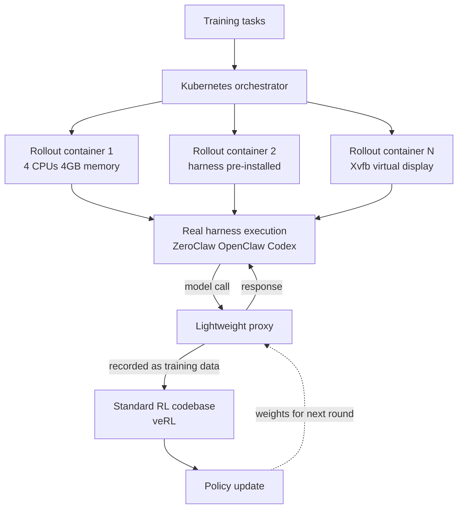

If you have ever fine-tuned an agent, you have probably lived this: you train against a plain ReACT loop, then deploy on top of an elaborate harness such as Claude Code or Codex. The conclusion of OpenForgeRL (arXiv 2607.21557) is that this mismatch can be closed with one proxy and one Kubernetes orchestrator, without rewriting your RL stack at all. And an 8B model trained that way competes with far larger models using only 2,500 tasks.

## Why read this

This post is for ML engineers who post-train agent models directly, and for anyone designing the training infrastructure of an internal agent platform. The core conclusion is this: the bottleneck in agent performance is not the learning algorithm but the fact that the execution environment at training time differs from the one at deployment, and that gap only closes when you pull the harness itself into the training loop. Accept this and your data strategy changes. Instead of collecting more tasks, you win by running fewer tasks inside the harness you will actually deploy. The paper shows 2,500 tasks beating a model trained on 200,000.

## Overview

The paper comes from Columbia University, Dartmouth College, and Microsoft Research. It landed on arXiv on 23 July 2026 with a revision the next day. The authors are ten, including Xiao Yu and Baolin Peng, and the paper header targets ICLR 2027.

The problem statement is grounded in practice. Every capable agent today runs on a sophisticated inference harness. Claude Code, Codex, and OpenClaw manage multi-turn reasoning, tool use, and access to external systems. The trouble is that these harnesses are as complex as they are powerful. A harness holds state, spans multiple processes, and internally calls tools, touches files, and spawns shells. Open SFT and RL stacks cannot express that kind of inference in their data model, because most open RL codebases assume single-process generation where a prompt goes in and a response comes out.

So the compromises so far have been two. One is to abandon the harness, train on a simple loop, and only bolt the complex harness on at deploy time. Training and deployment become different environments, and performance leaks. The other is to reimplement the harness inside the RL framework. That costs implementation effort, and the reimplementation ends up subtly different from the real harness.

OpenForgeRL takes a third path. It leaves the harness alone, leaves the RL stack alone, and puts a translator between them.

## What the work is

There are two key devices.

The first is a lightweight proxy. The harness runs believing it is calling a model API as usual. The proxy receives those calls, returns responses, and simultaneously records the exchange in training data format. Nothing changes from the harness's point of view, and from the RL codebase's point of view samples accumulate in the format it already understands. A standard framework such as veRL serves as the training backend. This is the point where the RL stack no longer needs to understand harness complexity.

The second is a Kubernetes orchestrator. Every rollout gets its own remote container. For computer-use training, images are built from task-specific Dockerfiles with the target harness pre-installed, and each pod is capped at 4 CPUs and 4GB of memory. GUI environments render a virtual display with Xvfb so the model can drive the machine through simulated mouse clicks and keyboard input. For browser environments they attached a stealth browser service, and that alone dropped the IP and CAPTCHA block ratio from 40 percent to nearly zero. Anyone who has run these experiments knows how large that single line is in practice.

The benefit of this structure is that training and inference are fully decoupled. Researchers can train, study, and improve agents directly in the harness and environment they will be deployed with. To change the harness you change the container image; to change the RL algorithm you touch only the veRL side.

One more detail stands out. OpenClaw and Codex are rich in built-in tools but do not readily accept custom ones. To expose benchmark-specific tools to those harnesses, the researchers used SKILL.md files. The skill document itself functioned as the tool exposure interface. For anyone operating a skill harness, that is not someone else's story.

## Experimental results

Two model lines come out of this.

OpenForge-Claw is a 30B-scale MoE model built on the Qwen3-30B-A3B-Thinking backbone, with roughly 3B active parameters. It trained on ZeroClaw, OpenClaw, and Codex in addition to the standard ReACT loop. Results are 31.7 (pass^3) and 55.9 (pass@3) on ClawEval, 33.7 on QwenClawBench, and 28.1 on MCPAtlas.

OpenForge-GUI is an 8B model on the Qwen3-VL-8B-Thinking backbone, trained on modified Kimi-Agent and Molmo-Web harnesses. It records 37.7 on OSWorld-Verified, 63.0 on Online-Mind2Web, and 72.3 on WebVoyager. The paper reports that these results beat open baselines of similar size on nearly all benchmarks, and in the GUI setting match or surpass models several times larger.

Scores reported in the paper and the task budget used for GUI training. Blue marks the tool-use line, green the GUI line.

The most striking part is data efficiency. MolmoWeb, the comparison point, trained on more than 200,000 tasks, while OpenForge-GUI used 2,500 and still beat it on Online-Mind2Web while staying competitive on WebVoyager. In the SFT stage they ran three rollouts per task with a stronger teacher model and kept only successful trajectories, then deduplicated by embedding similarity to form a 2,500-task candidate pool, ending with 1,496 trajectories for distillation. It reads as the result of raising the fidelity of the environment that produces data rather than raising the volume of data.

The task construction process is worth noting too. Environment errors and ambiguous instructions rarely surface before you actually run a task. So the researchers attached a verification script that calls a separate open model to attempt the task inside the constructed environment. Whether a task is solvable at all, and whether the environment came up correctly, is judged by execution rather than by a person. Closing a data quality gate with execution rather than assertion is the same instinct as the verification discipline we insist on.

The paper also carries analysis beyond benchmarks. It separately examines how harness choice affects learning, and observes that some harnesses are markedly harder to learn than others. The researchers evaluated the same model across four harnesses of increasing sophistication: a ReACT variant, ZeroClaw, OpenClaw, and Codex. They went further and compared two models built from identical tasks and an identical training recipe, differing only in which harness generated the rollouts. One trained on ZeroClaw alone, the other on ZeroClaw, OpenClaw, and Codex together. The design probes how a model behaves on a harness it never trained on. Since it asks whether mixing harnesses acts like a form of domain randomization, it speaks directly to organizations running several harnesses internally.

There is behavior-level analysis as well. Comparing 100 trajectories each from the SFT-only checkpoint and the SFT-plus-RL checkpoint, the RL model shifted calls that had been hammering the generic shell tool toward dedicated service tools, and increased higher-level behaviors such as self-verification. The habit of grabbing any tool and routing around the problem receded in favor of the official path the harness provides. Conversely, the paper states plainly that error recovery remains weak even after RL. That candor raises the paper's credibility.

## What this means for ThakiCloud

This paper touches both of our products.

Start with Paxis. Paxis is ThakiCloud's Agent-Native Cloud, a control plane that treats Skills, Tools, Policies, and Audit Logs as first-class resources. It selects from more than 960 skills with BM25, executes them in isolated sandboxes, and passes every action through policy gates and audit logs. The harness the paper describes is exactly this skill harness. So the message translates as follows: if we train a model to improve our agents, that training belongs inside the Paxis harness rather than a simplified experimental loop. In particular, the fact that the researchers exposed custom tools through SKILL.md means our skill format is already shaped to serve as a training interface.

From the ai-platform angle, the infrastructure fit is good. Spawning an isolated container per rollout and capping CPU and memory per pod is exactly how we orchestrate training workloads on Kubernetes. The fact that the paper's implementation used a particular public cloud for rollout containers is, inverted, an opportunity. Customers with on-premises or sovereignty requirements cannot put rollout containers on an external cloud at all, and what they need then is a platform like ours that provides isolated rollouts and GPU queues from its own cluster. Parallelizing rollouts across CPU pods while only the training backend sits on the GPU queue is also sensible for resource efficiency.

Two practical items fall out. First, recording harness traffic through a proxy overlaps substantially with our audit log layer. Since we already pass actions through policy gates and audit logs, it is worth checking how short the path can be from those records to training data format. Second, the isolation level of rollouts. The paper ran with a modest cap of 4 CPUs and 4GB per pod. How far we can push concurrent rollouts on our cluster is a number we have to measure.

## Limits and counterarguments

First, this framework does not solve everything. The paper itself states that error recovery remains weak after RL. Self-verification, tool coverage, and multi-step plan completion improve, but the ability to climb out of a failed state remains open. That is precisely the sorest spot when you attach agents to real work, so reading benchmark scores as production readiness would be premature.

Second, the infrastructure cost is not trivial. A container per rollout means scheduling thousands of containers per training run. That is natural for an organization that can operate a Kubernetes cluster, but it raises a new barrier for teams that were fine-tuning on a single GPU box. The real beneficiaries of this methodology are those who already have a cluster.

Third, harness dependence remains. Training inside a harness also means optimizing for that harness. The paper does evaluate on harnesses not used in training, but how well a learned policy holds up as a harness version-bumps and changes its tool set and control flow is a question only time answers. The more often an organization evolves its harness, the more it must budget a retraining cadence alongside.

Fourth, every figure we cite here is a number the paper reports. It is not a result we reproduced by running the framework ourselves. Individual baseline scores appear in the paper's tables, but this post carries only values we could confirm.

## Wrapping up

Compressed into one sentence, the practical lesson of OpenForgeRL is this: if you want better agents, matching the training environment to the deployment environment comes before changing the algorithm. With just two devices, a proxy that intercepts and records the harness's model calls and Kubernetes that isolates rollouts, a path opened to train inside the real harness while keeping your existing RL stack. The result is the data efficiency of 2,500 tasks beating 200,000.

If you are considering agent post-training, try bringing the deployment harness into the training loop before you simplify the loop. And when you read improvement metrics, separate out the error recovery rate rather than looking only at average success. That blank the paper honestly left open is the most valuable problem in this field right now.

## Sources

- OpenForgeRL: Train Harness-native Agents in Any Environment, arXiv 2607.21557 (<https://arxiv.org/abs/2607.21557>)
- Paper HTML version v2, experimental setup and appendix (<https://arxiv.org/html/2607.21557v2>)
