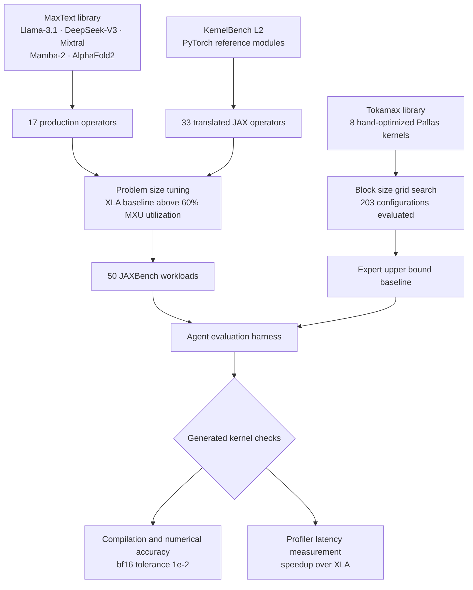

Anyone who has pointed an agent at an internal API or an unfamiliar DSL knows the scene. The model writes confident code against an API that does not exist. You hand back the compiler error and the next attempt hallucinates something similar. The usual prescription is to switch to a better model. JAXBench (arXiv 2607.20466) shows, with numbers, that the prescription is mostly wrong, using TPU kernel generation as an extreme case.

> 📄 **Full deep review (DOCX)**: [Download the detailed peer review on Google Drive](https://drive.google.com/file/d/1EU6jLRJLbmXHZvz5wvO8BTq7zcLMU6Z4/view).

## Why This Matters

We wrote this for platform engineers running coding agents on in-house tooling or proprietary DSLs, and for ML systems people trying to cut inference cost through kernel-level optimization. The conclusion is this: when the target is sparse in training data, the bottleneck on correctness is information rather than reasoning ability, and putting curated documentation in the context lifts performance more than moving up a model tier. In the paper's measurements, documentation injection raised per-sample correctness from 5.8 percent to 37.3 percent, a larger gain than going from Flash to Pro under otherwise identical conditions. Accept that and your investment order changes. Cleaning up the documentation corpus wins before raising the model budget.

## Overview

Research on generating and optimizing GPU kernels with language models has moved quickly, largely because KernelBench gave everyone the same hill to climb. TPUs had no such benchmark.

JAXBench fills that gap. Ten researchers from Google, Harvard, and Berkeley assembled 50 JAX workloads that run on TPU v6e. The paper does not stop at releasing a benchmark: it runs four kernel generation methods under the same budget and compares them. That comparison is the subject of this post.

Start with why TPUs need a separate benchmark. Where GPUs use a massively parallel SIMT model, TPUs are sequential machines with wide SIMD vector registers. On v6e that means 8 by 128 registers for 32-bit values and dedicated 256 by 256 systolic Matrix Multiply Units. The software stack differs too. JAX programs compile through XLA, and low-level kernel authoring goes through Pallas down to the Mosaic backend. Not Triton.

That is where the trouble starts. Writing a Pallas kernel means reasoning about the VMEM, SMEM, and HBM memory hierarchy, software pipelining including prefetch scheduling, block shape constraints, and the lexicographic grid traversal order that Mosaic enforces. Yet Pallas appears in training data orders of magnitude less often than CUDA or even Triton. So models that write GPU kernels fluently invent Pallas APIs that do not exist, emit memory-space annotations that fail type checking, and violate systolic tiling constraints. These are failures that generic compile feedback cannot resolve.

## How the Benchmark Was Built

The 50 workloads come from two sources.

The first source is 17 production operators pulled from the MaxText library, drawn from real architectures including Llama-3.1, DeepSeek-V3, Mixtral, Mamba-2, and AlphaFold2. The second is 33 fused operators translated from KernelBench. Gemini was given each PyTorch reference module and asked for an idiomatic JAX equivalent, after which both were executed on matched bf16 inputs and required to agree within `jnp.allclose` tolerance of 1e-2. Workloads that failed were regenerated or repaired by hand.

Problem sizing matters a great deal here. The original KernelBench sizes are too small to saturate a TPU MXU, because a 256 by 256 systolic array needs large matrix dimensions to reach high utilization. Instead of applying a uniform scaling factor, the authors swept each workload's free dimensions independently and froze the smallest configuration whose XLA baseline reached at least 60 percent MXU utilization on v6e. For matmul-fused operators that produced shapes like batch size 4096 with 8192 by 8192 feature dimensions in bf16. Skip that step and measured speedups reflect bookkeeping rather than genuine scheduling improvement. The paper levels exactly this criticism at prior work: MultiKernelBench evaluated on TPU v2-8 at problem sizes too small, and there the best model reached only 8.4 to 10.5 percent Pass@1 on Pallas.

An upper bound was established as well. Eight of the 17 production operators had hand-optimized Pallas implementations in the Tokamax library. The authors tuned their block sizes by exhaustive grid search on TPU v6e, evaluating 203 configurations in total and gaining up to 2.79 times over the Pallas default parameters. Those tuned kernels reached up to 16.3 times over XLA, on Ragged Paged Attention.

## Four Methods and the Results

Four approaches were compared. The first is best-of-N: independent one-shot completions conditioned only on a TPU v6e preamble and the JAX source, keeping the best correct sample. The second is iterative refinement, feeding compile errors, correctness results, and profiler summaries back between turns, running 18 chains of 8 turns for 144 samples total. The third is that same iterative loop with Autocomp's agent context prepended to every prompt: a hardware architecture summary, a per-benchmark selection of Pallas API reference, curated code examples, and a rules block. It is a control that changes documentation while holding the search algorithm fixed. The fourth is Autocomp itself, running beam search with beam size 3 and 6 candidates per beam element, split into 4 translation iterations and 4 optimization iterations.

The main evaluation used Gemini 3 Flash across all 50 benchmarks.

| Method | Geomean speedup over XLA | Fraction beating XLA | Correct kernels |
|---|---|---|---|
| Best-of-N | no meaningful gain | 1 of 50 | 13/50 |
| Iterative refinement | 1.18x | 18% | not reported |
| Iterative + documentation | 1.28x | 32% | 48/50 |
| Autocomp | 1.36x | 76% | 45/50 |

The most important number in that table is not the speedup but the correctness. Leaving the search algorithm completely untouched and injecting only Autocomp's documentation context raised per-sample correctness from 5.8 percent to 37.3 percent. That is more than a sixfold difference.

The failure breakdown explains why. Without context, 99.7 percent of best-of-N samples and 93.8 percent of iterative samples died at compile time or first execution, from invented Pallas APIs or misused `pallas_call` arguments and BlockSpec types. With documentation, API misuse still accounted for 59.8 percent of iterative samples and 55.8 percent of Autocomp samples, but the absolute count of successful samples changed.

What about scaling the model? The authors reran everything on a 5-kernel subset with Gemini 3.1 Pro. Iterative refinement without documentation went from 1.07 times on Flash to 2.43 times on Pro, so model scale clearly matters. On the same five kernels, however, iterative refinement with documentation already reached 1.59 times on Flash and 3.82 times on Pro, while Autocomp reached 2.35 times and 3.79 times. Iterative refinement without documentation stayed at 16.9 percent per-sample correctness even with Pro, and 1.2 percent with Flash.

To use the paper's own framing: for languages underrepresented in training data the correctness bottleneck is information rather than reasoning, and written documentation supplies most of what is missing. Constraints like lexicographic grid traversal, VMEM and SMEM and HBM placement, 8 by 128 block divisibility, and prefetch scheduling never appear in error messages. The feedback loop has nothing to iterate against.

Once correctness is secured, a different factor dominates. Documentation-only iterative refinement solved 48 of 50 against Autocomp's 45, but rarely pushed past its first correct kernel and finished at 1.28 times. Autocomp spends its early budget on translation and shifts the beam into optimization as soon as a correct seed exists, reaching 1.36 times. Search structure is what converts correctness into performance. That gap narrows when the model is strong enough, though: on Pro the two methods landed at 3.82 and 3.79 times, effectively tied.

There is a comparison against expert kernels too. The eight hand-tuned Tokamax kernels averaged 2.08 times geomean over XLA. Autocomp reached 1.60 times on the same eight, roughly 77 percent of expert performance, and beat Tokamax on two of them. It failed to produce correct kernels for paged and ragged attention, precisely where hand-written scheduling counts for most.

## What This Means for ThakiCloud

We read this paper in two directions.

Take the ai-platform view first. ThakiCloud's ai-platform serves models into customer environments on Kubernetes and queues GPUs through Kueue. What stands out in the JAXBench roofline analysis is that matmul-fused kernels and linear and MoE kernels already reach 60 to 95 percent MXU utilization under plain XLA compilation. Where the compiler is strong, hand-written kernels leave little headroom. The remaining headroom concentrates in attention operators, especially those bound by memory bandwidth. The paper derives an operational intensity ceiling of 16 FLOP per byte for ragged paged attention using the GQA grouping factor of 16 in Llama-3.1-405B, far below the v6e ridge point of roughly 560. In other words, that operator stays bandwidth-bound at any context length. When deciding where to spend serving optimization budget, that distinction transfers directly. Look at where KV cache reuse sets the ceiling, not at what the compiler already saturates.

Then the Paxis view. Paxis is ThakiCloud's Agent-Native Cloud control plane running on ai-platform, treating Skills, Tools, Policies, and Audit Logs as first-class resources. The paper's central finding is the same sentence that justifies our skill harness design. Paxis selects from more than 960 skills using BM25 and executes them in isolated sandboxes, and a skill is ultimately a curated document holding the procedures, constraints, and failure cases a task needs. This paper supplies a controlled experiment behind our practice of refining skills rather than upgrading model tiers when agents struggle with internal APIs. The detail that Autocomp splits its documentation into four artifacts and selects per-benchmark pieces with caching is especially instructive: it does not shove a whole manual into the prompt. That is the same idea as retrieving a skill and lifting only the relevant portion into context. The paper also leaves us homework. Documentation alone still left 55 to 60 percent API misuse, and search structure is what converted the rest into performance. Skill quality is one half; loop structure and exit gates are the other.

## Limitations and Counterarguments

The paper is candid about its boundaries. All 50 workloads run on a single TPU v6e chip, and multi-chip sharding and collective communication are out of scope. Real production training and inference almost always span many chips, where performance depends on sharding strategy, collective scheduling, and communication-compute overlap. Whether the documentation-versus-search separation generalizes to collective primitives like `shard_map` or `all_to_all` is unknown, and those are even sparser in pretraining data than Pallas.

The model scale experiment is narrow. The Gemini 3.1 Pro evaluation covers five kernels, and the authors present it as a controlled ablation rather than a headline result. The observation that two methods converged there is explicitly preliminary.

The strongest counterargument concerns scope. Pallas is an extreme case of training data sparsity. There is no reason the conclusion that context beats scale should hold for Python or TypeScript, where data is plentiful. Indeed, documentation-free iterative refinement jumping from 1.07 to 2.43 times between Flash and Pro is itself evidence that model scale remains a powerful lever. The honest reading is conditional: the sparser the target, the more the information gap dominates.

One more caveat. These results come from kernel generation, a peculiar task where correctness is judged automatically by compilation and numerical comparison and performance is measured by a profiler. Feedback is deterministic. Whether the same methodology carries into tasks with ambiguous judgment is a separate question.

## Wrapping Up

The numbers JAXBench leaves behind are simple. Holding the search algorithm fixed and adding only curated TPU documentation moved per-sample correctness from 5.8 percent to 37.3 percent, a bigger effect than upgrading the model under the same conditions. And once correctness existed, search structure carried it from 1.28 times to 1.36 times, reaching 77 percent of expert kernel performance.

For anyone operating in-house agents, the action is clear. When your agent flounders on your API, do two things before raising the model budget. Write down that API's constraints and failure cases and attach them to the context, and build a loop that pushes past the first correct answer into improvement. By this paper's measurements the first buys correctness and the second buys performance. Both cost less than changing models, and in these experiments both did more.

## Sources

- [JAXBench: Benchmarking Autonomous TPU Kernel Optimization (arXiv 2607.20466)](https://arxiv.org/abs/2607.20466)
- [Tokamax: A GPU and TPU kernel library (openxla/tokamax)](https://github.com/openxla/tokamax)
- [Autocomp: Optimize any AI kernel, anywhere (ucb-bar/autocomp)](https://github.com/ucb-bar/autocomp)

> 📄 **Full deep review (DOCX)**: [Download the detailed peer review on Google Drive](https://drive.google.com/file/d/1EU6jLRJLbmXHZvz5wvO8BTq7zcLMU6Z4/view).
