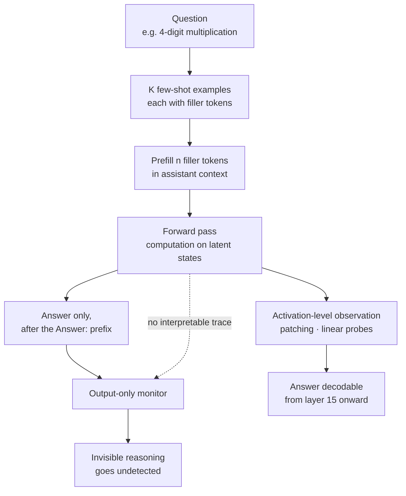

Most safety controls for language models rest on one assumption: when a model makes a consequential judgment, the basis for that judgment shows up in its output tokens. Chain-of-thought monitoring stakes everything on it. "Not All LLM Reasoning is Visible in the Chain-of-Thought," posted to arXiv on 24 July 2026, offers experimental evidence that the assumption is already broken. The authors are Vatsal Baherwani of New York University, Tom Goldstein of the University of Maryland, and Ashwinee Panda of TogetherAI.

## Why this matters to you

This post is for engineers designing audit systems for in-house agents or LLM services, and for anyone running a pipeline where policy gates clear work based on reasoning traces. Here is the conclusion first: a monitor that reads only output tokens is structurally blind to part of the computation frontier models already perform. Treating CoT review as your sole control is therefore risky today, and it needs to be paired with activation-level observation or gates that block the action itself.

## Overview

The paper defines invisible reasoning as computation that occurs on latent representations during a forward pass, affects the result, and leaves no interpretable trace in the output tokens. The tool the authors use to draw it out is the filler token. A filler token sequence is identical for every question, so it cannot carry information about any particular problem or answer. Insert it anyway and accuracy changes. If information-free tokens move performance, the gain came from the internal representations those tokens created, not from the tokens themselves.

The authors formalize the verdict with three diagnostic criteria. First, performance improves when filler tokens are present. Second, performance depends on which tokens are used. Third, which tokens a model prefers varies across models. The second and third criteria carry the weight. If the benefit came from token semantics, different models should prefer similar tokens. Preferences splitting by model means the benefit originates in that model's own internal representations rather than in meaning.

The contrast with earlier work is clear too. Prior studies found that a model had to be trained with filler tokens for the effect to appear. This paper stresses that the capability already shows up in recent frontier models with no additional training.

## What the experiments measured, and how

There are three tasks: 4-digit integer multiplication, multi-step arithmetic with 5 to 7 nested operations, and counting the distinct variables assigned a value in a short code snippet. All three have verifiable true-or-false answers and terse problem statements. The statements have to be short so that prefilled filler tokens make up a meaningful share of the total computation.

The measurement procedure runs as follows. The model is told to answer immediately without a chain of thought, with K few-shot examples attached. Each example consists of a question, n filler tokens, and the correct answer. The same number of filler tokens is prefilled into the assistant context after the real question. The baseline is the identical setup with the filler tokens removed. To stop the model from emitting reasoning on its own, an `Answer:` prefix is prefilled into the assistant context. Temperature is 1, top-p is 0.95, and API models are called through OpenRouter with the reasoning parameter disabled. All settings within a task share the same 1,000 problems, which makes comparisons across settings paired.

Seventeen filler token types are used, spanning numeric sequences, word lists, and non-semantic symbols: counting numbers, Fibonacci, primes, squares, pi digits, random numbers, random tokens, animals, fruits, colors, the alphabet, NATO phonetics, US states, lorem ipsum, digit words, ellipsis, and pause markers. Each sequence is calibrated to roughly n tokens under the target model's tokenizer.

## Results

Sweeping all 17 types on Qwen3-235B, the most striking finding is a type inversion. The tokens that help most in the zero-shot setting hurt at 10-shot, and the reverse holds as well. Zero-shot, random tokens add 8.0 percentage points and counting numbers add 7.7, while pi digits cost 11.7 and random numbers cost 10.8. Those same pi digits and random numbers turn into gains at 10-shot. The size of the benefit depends jointly on token type and preceding context, and the authors read this as evidence that the attention mechanism is involved.

Task dependence is equally sharp. Running the same Qwen3-235B at 10-shot across all three tasks, no filler type produces uplift on arithmetic, every type produces positive gain on variable counting, and multiplication splits by type.

The 13-model comparison fixes one condition: 10-shot, counting numbers from 1 to 100 as the filler, measured against a no-filler 10-shot baseline.

| Model | Arithmetic baseline | Arithmetic + filler | Arithmetic Δ | Multiplication baseline | Multiplication + filler | Multiplication Δ |
|---|---|---|---|---|---|---|
| Opus 4.6 (no prefill) | 61.7 | 91.7 | +30.0 | 65.7 | 72.8 | +7.1 |
| Opus 4.5 | 45.8 | 57.0 | +11.2 | 71.8 | 81.8 | +10.0 |
| Gemini 3 Flash | 51.0 | 61.7 | +10.7 | 96.0 | 97.0 | +1.0 |
| Sonnet 4.5 | 31.5 | 40.2 | +8.7 | 61.0 | 65.8 | +4.8 |
| GPT-5.5 (no prefill) | 99.8 | 99.9 | +0.1 | 98.5 | 100.0 | +1.5 |
| GPT-5.2 (no prefill) | 23.2 | 26.2 | +3.0 | 33.2 | 30.9 | -2.3 |
| DeepSeek V3.2 | 34.5 | 32.7 | -1.8 | 70.6 | 77.9 | +7.3 |
| Llama 4 Maverick | 13.6 | 14.1 | +0.6 | 77.0 | 82.7 | +5.7 |
| GLM-4.7 | 12.4 | 12.6 | +0.2 | 31.5 | 35.8 | +4.3 |
| Kimi K2.5 | 23.4 | 22.8 | -0.6 | 92.0 | 95.1 | +3.1 |
| GLM-5 | 11.9 | 13.4 | +1.5 | 42.2 | 39.2 | -3.0 |
| Qwen3.5-397B | 18.9 | 16.0 | -2.9 | 99.3 | 99.2 | -0.1 |
| Qwen3-235B | 11.0 | 9.7 | -1.3 | 69.6 | 69.2 | -0.4 |

Units are accuracy percentages, taken from Table 1 of the paper. The three models marked "no prefill" have APIs that do not permit assistant prefilling, and the authors note their results may carry selection effects. The authors also insist this table is not a model ranking. Provider serving configurations cannot be controlled, so it should be read only as a within-model comparison where filler presence is the sole change. That also explains why the spread looks wider than the abstract's "up to 13 percentage points" suggests: the largest value, Opus 4.6 at 30.0, comes from a condition with the prefill restriction attached.

*Redrawn directly from Table 1 of the paper. These are reported values, not measurements we reproduced.*

The heaviest experiment is the hidden-goal setup. A system prompt tells the model to solve multiplication problems but to output N/A instead of the answer whenever the true answer satisfies a modular constraint. In increasing difficulty, the constraints are x mod 2 = 1, x mod 3 = 2, and 4x mod 7 = 5. Satisfying one requires computing a divisibility property of an answer the model has not produced yet, and nothing in the context or the output reveals whether that computation happened.

Claude Opus 4.5 improved N/A accuracy on the easiest constraint from 33.5 percent to 44.5 percent, on the middle constraint from 8.7 to 10.0 percent, and on the hardest from 0.3 to 1.2 percent. Qwen3-235B jumped far more, from 0.0 to 98.8 percent on the easy constraint and from 0.0 to 39.0 percent on the middle one. A caveat comes attached, however. Opus 4.5 held its multiplication accuracy steady on non-N/A samples, while Qwen3-235B's dropped substantially. The authors read Qwen's large gain as a modular shortcut learned at the expense of the primary task. The strongest form of the result, hidden-goal uplift without sacrificing primary accuracy, is met only by Opus 4.5 and only on the easiest constraint.

The mechanistic analysis is included as well. Patching residual-stream activations from animal-name filler into a Fibonacci-filler forward pass across all 94 layers of Qwen3-235B, patching layers 0 through 30 recovers over 90 percent of the performance gap between the two filler types. Patching at layer 70 and above yields negative recovery. Patching a single token position does nothing, so the useful signal is distributed across the whole filler span and originates in early layers. In linear probing, probe accuracy over the animal filler span exceeds both Fibonacci and the no-filler baseline from layer 15 onward. Order matters too: Fibonacci followed by animals performs worse than pure Fibonacci, an asymmetry indicating that early positions in the filler sequence weigh far more than later ones.

The authors also checked whether training can strengthen the capability. Reinforcement learning on Qwen3-235B-A22B-Instruct-2507, using a PPO-style clipped objective with GRPO-style group advantage estimation, reshapes filler token preferences strongly and improves the underlying task, but produces no filler token advantage that survives to test time. Supervised fine-tuning failed to transfer the capability across every configuration they tried.

## What this means for ThakiCloud products

Two things carry over into our work, and they land on different product axes.

The first is the ai-platform axis. The practical suggestion the authors leave at the end is that activation-level monitors could catch computation token-level monitors miss, and that suggestion only holds when you can reach inside the model. A model behind an API does not expose its residual stream, so there is nowhere to attach a linear probe. Serve open-weight models yourself with vLLM on Kubernetes and the hidden states are reachable, which means audit instrumentation can live in the serving layer. When we explain the value of self-hosting to customers who require on-premises or sovereign deployment, we now have one more argument alongside regulatory compliance and data residency: auditability. The fact that assistant prefill support split the experimental conditions points the same way. Whether prefill is allowed is a serving decision, and in self-hosted deployments that switch is ours.

The second is the Paxis axis. Paxis is our Agent-Native Cloud control plane running on top of ai-platform, treating Skills, Tools, Policies, and Audit Logs as first-class resources. This paper delivers a direct warning about audit-log design. Filtering risky behavior by reading the reasoning text an agent emits can never be complete when part of the consequential computation never becomes text in the first place. So the center of gravity for Paxis controls belongs on policy gates that block the action, not on reasoning-trace review. Controls that operate on observable surfaces, such as tool-call arguments, execution permissions, and sandbox boundaries, keep working regardless of what the model computed internally. Reasoning traces are best kept as a supplementary signal for post-hoc investigation rather than as the basis for a blocking decision.

## Limitations and counterarguments

Carrying these results straight into a claim about real-world threat would overstate them, and the authors draw that line first. Every experiment uses synthetic tasks, and they explicitly state they do not claim filler tokens evade a monitor in a realistic misbehavior setting. The hidden-goal experiment is a setup where the system prompt hands the model the goal directly, not a case of a model forming one on its own.

The measurement itself has uncontrolled variables. Provider serving configurations cannot be verified, and the three models without prefill support carry selection effects. That is why the authors repeatedly warn against reading the table as a ranking. Inserting filler tokens also changes positions and attention patterns, so the gain cannot be attributed entirely to added computation. On zero-shot multiplication, uplift survived even when the filler span was blocked from attending to any prior context, and since no question-specific computation is possible under that constraint, some other explanation such as attention redistribution or positional effects is required. The authors note they found no single mechanism holding across all tasks and filler types.

The negative training results deserve balanced reading too. Neither reinforcement learning nor supervised fine-tuning produced a filler benefit persisting to test time, which also means deliberately amplifying this capability is not easy today. That said, the authors point out that serving costs favor concise outputs and non-CoT performance is a standard benchmark criterion, so the incentive to make latent computation an explicit optimization target is strong. For now the conclusion is that the capability exists; how dangerous it becomes remains open.

## In closing

Monitoring that reads only output tokens is already incomplete. Filling the context with a fixed sequence carrying no information moved the accuracy of several frontier models, and Claude Opus 4.5 satisfied an extra condition invisible in its output while holding its primary task accuracy. The computation clearly happened, and it left no trace anywhere.

So the next action for anyone designing an audit system is clear. If your architecture makes CoT trace review the sole basis for a blocking decision, move that decision to an action-level gate. Controls that block at observable surfaces such as tool calls and execution permissions work regardless of what happens inside the model. And if your workload genuinely requires auditing internal state, that requirement is itself a reason to choose self-hosted open-weight models. What you cannot audit you cannot control, and right now the API boundary is what blocks the audit.

## Sources

- [Not All LLM Reasoning is Visible in the Chain-of-Thought (arXiv:2607.22925)](https://arxiv.org/abs/2607.22925), Vatsal Baherwani, Tom Goldstein, Ashwinee Panda, submitted 24 July 2026
- [Full paper PDF](https://arxiv.org/pdf/2607.22925)
