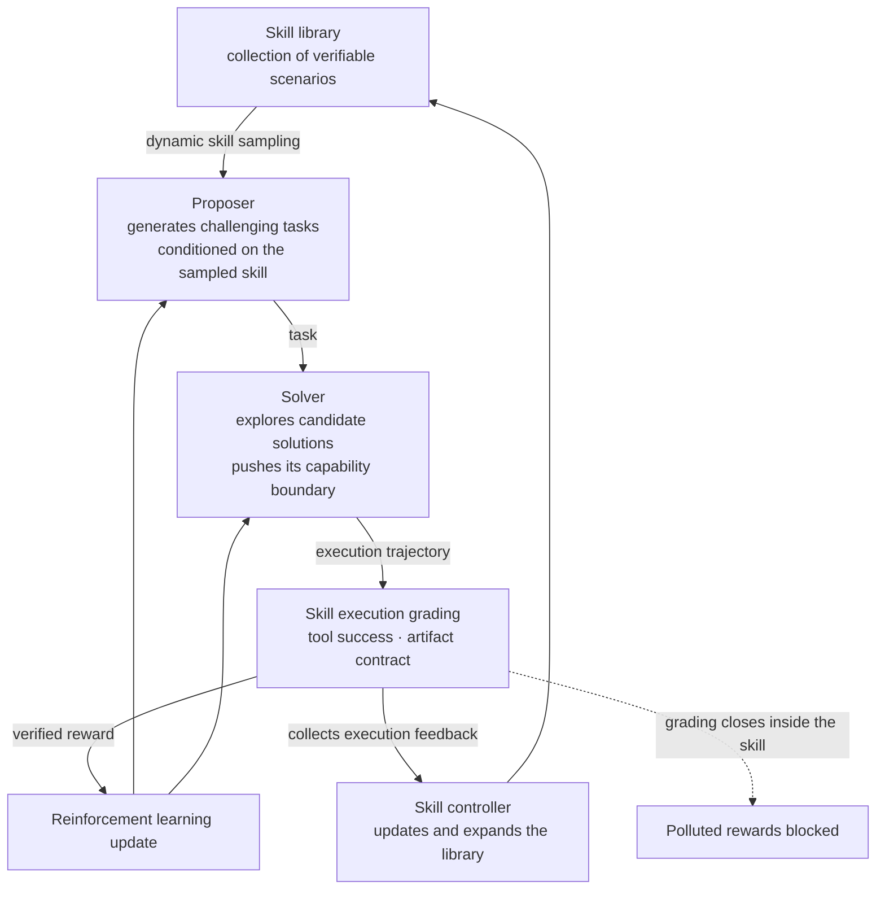

Letting a model invent its own problems and improve by solving them is appealing, but it carries an old weakness: you cannot trust the grading. A paper from Alibaba's Qwen team, posted to arXiv on 24 July 2026, confronts that weakness directly, and finds its remedy somewhere slightly unexpected. Agent skills.

## Why this is worth reading

This post is for ML engineers designing agent training pipelines and for platform owners wondering how to make an internal skill estate earn its keep. The short version is that this paper's contribution is not a new self-play algorithm but a redefinition of the skill as the unit of the learning signal. Because a single skill defines a narrow executable scenario, grading inside it is trustworthy, while moving between skills keeps tasks fresh. The trade-off that self-evolutionary training has long endured, diversity against verification, loosens as a result. If you already treat skills as a first-class asset, read this paper as a signal that the asset can serve as a training-time curriculum generator and not only as a runtime tool.

## Overview

The paper is titled `Skill Self-Play: Pushing the Frontier of LLM Capability with Co-Evolving Skills`, with the arXiv identifier 2607.22529. The proposed framework is Skill Self-Play, abbreviated Skill-SP.

It has three components: a proposer that generates tasks, a solver that answers them, and a dynamic skill controller that manages the skill library. These are not separate stages but co-evolve inside a single reinforcement learning self-play loop. The paper's own word for this is co-evolution.

The central claim runs as follows. Existing self-evolutionary methods face a fundamental dilemma between task diversity and verification reliability, and agent skills form a powerful middle ground that reconciles the two.

## The problem being solved

Self-evolutionary training has mostly split into two branches, each surrendering something.

The first binds learning to an environment. Code executors, mathematical verifiers, game simulators: places where correctness can be adjudicated mechanically. The feedback is precise. Either it compiles, the test passes, the proof holds, or it does not. The cost is that learning stays inside that environment's walls. Improvement is confined to a narrow domain.

The second opens up to self-generation. The model invents tasks freely and the task space widens. But then who adjudicates the answers to freely invented tasks? When a model grades its own output it will certify wrong answers as right, and that mistaken reward flows into the training loop. The paper describes this as misleading rewards polluting the training loop. The pollution is especially hard to manage because it accumulates quietly.

Put plainly: obtain precise grading and you narrow; obtain broad tasks and you cannot trust the grading. Neither branch had decisively won this trade.

## Why skills are a middle ground

Skill-SP's insight is to see the dilemma as a problem not of tasks but of the container holding them.

Consider a single agent skill. A skill is usually a procedure that handles a particular scenario. What it takes as input, which tools it calls in what order, what it produces: all defined. A skill is therefore already a narrow executable environment. A task created inside a skill can be graded by that skill's execution result. Whether the tools succeeded, whether the artifact satisfies its contract, is decidable. The first branch's virtue, verification reliability, is secured here.

At the same time there is never only one skill. A library holds tens or hundreds, covering different domains. If the training loop draws a different skill each time and conditions task generation on it, the task space widens to the breadth of the library. The second branch's virtue, diversity, is secured here.

In the paper's phrasing: each skill guarantees deep, verifiable execution within a specific scenario, while dynamic routing across skills maintains open-ended task variety. Verification comes from inside a skill, diversity from between skills. Placing the two properties on different axes rather than trading them along one is this paper's design.

## How Skill-SP runs

The roles and the flow of the loop are as follows.

The proposer generates challenging tasks conditioned on a dynamically sampled skill. That the condition is a skill matters. It is not inventing arbitrary tasks but hard tasks inside a gradable scenario.

The solver explores candidate solutions, testing the edge of its own capability. In a self-play arrangement the proposer and solver are each other's opponent, so as the solver strengthens the proposer must produce harder tasks, and the reverse holds as well. What emerges is a curriculum whose difficulty tracks the opponent rather than one fixed in advance.

The skill controller gathers execution feedback and updates and expands the skill library. This is what separates the framework from a static benchmark. A fixed library fixes the ceiling of the task space. A controller that grows the library raises that ceiling with it. Hence the paper makes skills a co-evolving participant rather than a byproduct of learning.

## Reported results and what we verified

The paper states that it evaluated on tool-use and reasoning benchmarks, and reports results of two kinds. One is that it consistently pushed the performance ceiling of already competent backbones. The other is that it produced striking turnarounds in models initially misaligned with the target behaviour. The paper describes Skill-SP as a robust evolution engine.

Here we should state our boundary honestly. At the time of writing we did not open the paper's results tables directly. We have therefore not carried any concrete figures into this post, no per-benchmark scores and no reported deltas. The two sentences above are the qualitative results as the paper's summary describes them, and anyone needing numerical verification should read the experimental section at the source. Leaving the numbers blank seemed better than filling them in plausibly.

The difference between the two kinds of result is still worth noting. Raising the ceiling of a competent backbone and rescuing a misaligned model are different effects. If the latter holds, Skill-SP is less a device that adds capability and more one that pulls a model toward a desired behaviour distribution. Since a skill is itself a specification of the desired behaviour, repeated grading inside skills plausibly functions as alignment work.

## What this means for ThakiCloud

This paper concerns agent skills and orchestration, so the Paxis lens applies. Paxis is ThakiCloud's Agent-Native Cloud control plane, treating Skills, Tools, Policies, and Audit Logs as first-class resources. The paper matters to us because it reprices that first-class treatment from the training side.

Our reasons for treating skills as first-class have so far been runtime reasons. A defined skill can be selected by a router, executed in an isolated sandbox, and passed through policy gates and audit logs. This paper adds one more entry. If a skill is a verifiable unit of execution, the same skill library can also serve as a curriculum generator at training time. Runtime assets and training assets come to share one store.

Three structural points of contact are visible. First, skill routing. The paper's dynamic skill sampling addresses the same problem as the Paxis skill selection layer, for a different purpose. At runtime you pick the skill that fits the current task; in training you pick the skill that will generate the next task. Whether one selector can serve both purposes becomes the practical question.

Second, execution grading. The paper's basis for trustworthy reward is that skill execution results can be adjudicated mechanically. That maps directly onto the fact that our skill contracts are already designed to carry deterministic gates. If a gate decides in code whether an artifact passes, that gate is a candidate reward function. There is room to widen a view that has treated gates purely as quality devices for human readers.

Third, skill evolution. The paper's skill controller updates and expands the library from execution feedback. We also operate a path that self-evolves skills, so the direction matches. The difference is the source of the signal. Our path draws mainly on failure retrospectives and usage history; the paper draws on the reward of a self-play loop. Adopting the latter requires an automatically gradable task generator per skill, and it simply does not apply to skills that lack one.

The caution is equally clear. The paper's loop is a reinforcement learning training loop, so it costs GPU budget. Most of our work with skills is selection and execution at inference time, which carries no training cost. So this paper is better read not as an adoption candidate but as grounds for the preparatory work of cataloguing which skill families are automatically gradable. If that catalogue is empty, the framework has nowhere to run.

## Limits and counterarguments

The largest question is how dependent the results are on the quality of the skill library. The premise that skills supply verifiable scenarios holds up the entire framework. If so, one has to ask where the cost of building a good skill library went. If the verification problem has been relocated into a skill design problem, the requirement that humans define skills well remains. Even granting that the controller expands the library, an initial seed is still needed.

The diversity claim should also be read conditionally. Moving between skills does refresh tasks, but the ceiling on that diversity is the union of the domains the library covers. A domain absent from the library stays unreachable even where open-ended self-generation could have reached it. This method buys verification at the price of tethering the diversity ceiling to the library. It has not obtained unbounded diversity and reliable verification simultaneously; it has moved the trade to more favourable terms. Reading the paper's phrase middle ground in that sense is the accurate reading.

The failure modes common to self-play arrangements also persist. Proposer and solver can optimise against each other alone and collapse into circling a narrow region. Skill sampling appears to function as a brake on that collapse, but if the controller grows the library toward skills with high success rates, the bias could instead be reinforced. Judging this requires checking the experimental design at the source.

Finally, the limits of this post again. We assembled this account from summary-level descriptions without opening the tables or the code for comparison. The counterarguments above are derived from the framework's structure, and the paper may already answer some of them experimentally.

## Wrapping up

The message of Skill Self-Play is that the bottleneck in self-evolutionary training was not the algorithm but the unit carrying the learning signal. Bound to an environment, grading was precise but narrow; opened up, it was broad but untrustworthy. The Qwen team placed agent skills in between. Inside a skill you grade by execution; between skills you obtain diversity by routing. Proposer, solver, and skill controller evolve together in one loop, and the curriculum climbs alongside the opponent's ability.

If you already manage skills as an asset, the practical question this paper leaves narrows to one: how many of our skills can have their execution results graded in code? That number is the size of the surface on which this framework could be applied, and simultaneously the size of the surface where trustworthy automatic verification could be attached right now, with no training at all. Our next move is not to stand up a training loop but to build that list. Nothing here is yet a reason to power on a GPU, but there is now a reason to sharpen skill contracts into a gradable shape.

## Sources

- [Skill Self-Play: Pushing the Frontier of LLM Capability with Co-Evolving Skills, arXiv 2607.22529](https://arxiv.org/abs/2607.22529)
- [The same paper's Hugging Face paper page](https://huggingface.co/papers/2607.22529)
- [Skill Self-Play explainer, CCTest](https://cctest.ai/en/articles/skill-self-play-co-evolving-skills-for-stronger-llms)
