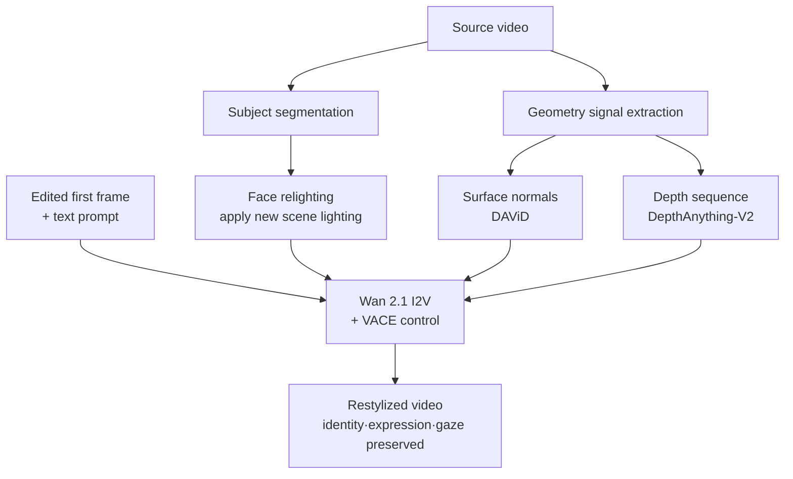

There is a recurring situation where you want to swap out a video's background and lighting wholesale while leaving the person's face untouched. Rebuilding ad creative for each season, rebranding the backdrop of a training video, or redesigning the lighting after the shoot has wrapped. Until now that meant reshooting or frame-by-frame compositing. ID-V2V, from Eyeline Labs and accepted to SIGGRAPH Asia 2026, proposes solving it with a single edited first frame.

*The geometry stays locked while the light and the scene change. That is this paper's decomposition in one image.*

## Why This Matters to You

This piece is for ML engineers who have to put video generation models into a real pipeline, and for platform owners deciding whether media workloads belong on their own GPUs. The conclusion first: **the real contribution here is not a new generative model but a reframing of the problem. Facial identity preservation is demoted from a generation problem to a lighting-change problem, and only the remaining edits are left to generation.** We will look at why that split matters in practice, and at the burden this kind of multi-signal control structure places on serving cost and pipeline design.

## Overview

ID-V2V is Eyeline Labs' work on identity-preserving video restylization. The arXiv identifier is [2607.22830](https://arxiv.org/abs/2607.22830), the official implementation lives at [github.com/Eyeline-Labs/ID-V2V](https://github.com/Eyeline-Labs/ID-V2V), and the weights are on [Hugging Face](https://huggingface.co/Eyeline-Labs/ID-V2V). The repository description states that this is the official implementation of a paper accepted to SIGGRAPH Asia 2026.

Inputs and outputs work like this. You supply a source video plus one image, the video's first frame after editing. You can add extra keyframes and a text prompt if needed. The scene, lighting and style specified by that edited keyframe then propagate across the whole video, while the original subject's identity, expression, gaze and motion are preserved. The paper stresses that fine facial performance such as lip sync falls inside the preservation target.

Placing the edit at a single first frame is a meaningful design choice in practice. An artist builds one image with the tools they already know well, and nobody has to paint a consistent style across an entire clip by hand.

## What the Method Actually Is

The core is a decomposition. The paper separates source-grounded identity preservation from edit-driven video synthesis on principle.

The starting observation is simple. Changing scene and style should not change a person's facial structure or expression. What may change is the light falling on that face. Turn the background to night and the face should be lit for night to look right. So the paper casts identity preservation as a **video relighting problem**. Rather than generating a face, it re-illuminates the original face for the new scene.

The other half, meaning background, props and style changes, is handled as conditional video synthesis driven by the edited keyframe.

### What Each of the Four Control Signals Does

Pull the structure apart and the control signals divide by role.

Relit facial regions and facial normal maps tightly constrain facial likeness and performance. That is the axis holding expression, gaze and mouth shape steady. Edited keyframes and depth sequences, by contrast, enable flexible and temporally coherent generation. That is the axis keeping the scene from jittering frame to frame.

One side tightens while the other loosens. Rather than balancing two conflicting goals, identity preservation and editing freedom, on a single dial, the signals are split so each gets the strength it needs.

### Backbone and the Two Checkpoints

The two released checkpoints share an architecture: Wan 2.1 image-to-video with VACE control. Rather than training a new video generation model from scratch, the control structure was designed on top of an already validated open backbone.

The default single-condition model preserves the segmented subject, relit to match the new scene, and regenerates the rest of the frame from the prompt. The additional model also conditions on the source video's surface normals and depth, extracted with DAViD and DepthAnything-V2 respectively. Geometric constraints are tighter, which favors scenes with large camera motion or complex body movement.

The point practitioners must not miss is that this pipeline is not a single model call. Segmentation, relighting, normal estimation and depth estimation all sit in front of it. This is not a structure where serving one generative model suffices.

## How It Differs From Prior Identity-Preservation Work

Identity preservation has meant several different things over the past few years. Much of the work took a single reference image and generated new video featuring that person. Text-to-video systems that pin the face to a specific individual belong to that family. Their evaluation criterion is generally how closely the generated face resembles the reference.

ID-V2V starts elsewhere. Footage already exists, and the performance inside it has to survive. Not just likeness but the expression, gaze and mouth shape that person produced in that moment. The goal is to retain rather than to create, which shifts the problem from generation to editing.

That difference propagates into method selection. Reference-image generation often compresses identity into an embedding and injects it. Fine expression tends to be lost in that compression. ID-V2V instead keeps the original pixels as far as possible and changes only the lighting, so expression never passes through a compression step. In practice this is decisive for reusing advertising and broadcast footage, where the performance has to be carried over rather than re-synthesized.

There is a cost, of course. Preserving the original faithfully means you cannot produce angles or motions the original never contained. The freedom that reference-image generation enjoys is not available here. The two families are not substitutes but tools for different jobs.

## About Reproduction

We did not run inference and capture numbers for this article. Network access and GPU resources were constrained in the environment this work ran in, so the weights could not be fetched and executed. This post therefore contains no latency or quality figures measured by us. It covers only structural facts stated by the paper and the repository. A quantitative comparison of inference cost and output quality will follow in a separate post after an actual run.

## Implications for ThakiCloud Products

The subject sits close to model inference and infrastructure, so the ai-platform lens leads, with a Paxis note on the orchestration piece.

**Through the ai-platform lens.** A workload like ID-V2V illustrates why on-premises serving is needed, because the input is source footage containing human faces. Sending material governed by likeness rights and contracts to an external API is a genuine blocker in advertising, broadcast and educational content. The requirement that code and data must not cross the customer boundary applies here too. ThakiCloud's ai-platform is designed to serve models inside the customer environment on K8s and Kueue-based GPU scheduling, which lines up with what this class of media workload demands.

Second, the structure sets a concrete scheduling problem. The upstream segmentation, normal estimation and depth estimation are relatively light and short, while the video diffusion body is heavy and holds resources for a long time. Push both kinds of work into the same queue and the short jobs get stuck behind the long ones. Separating preprocessing from generation using Kueue queues and priority classes is better for utilization. Because this is batch-natured video rendering, it also suits scheduling into idle windows.

Third, the paper's approach of layering control onto an open backbone is itself consistent with an on-premises strategy. Keeping Wan 2.1 family weights in your own cluster avoids lock-in to a closed API, lets the customer pin model versions, and makes cost predictable as an hourly GPU rate. The competitiveness that comes from low serving cost widens especially on repetitive generation workloads like this one.

**Through the Paxis lens.** As noted, this pipeline is a DAG binding four or more models in order with dependencies. Paxis is ThakiCloud's Agent-Native Cloud, treating Skills and Tools as first-class resources with DAG-shaped multi-agent execution. Registering each preprocessing stage as an independent skill running in an isolated sandbox means swapping the depth estimator or replacing the relighting stage does not require rewriting the whole pipeline. The fact that execution history lands in audit logs carries particular weight when the material features real people, because which source received which edit and when is preserved as a record.

## Limits and Counterarguments

First, the scope is narrow. The method presumes video centered on human faces, because the control signals themselves are facial normals and relit facial regions. Whether the same quality holds when subjects are small in frame, overlapping, or frequently occluded requires separate verification.

Second, reducing identity preservation to relighting has boundaries as an assumption. Once an edit moves past lighting and starts affecting material or facial shape, the premise that only light may change breaks. A large shift from live action to animation style is one such case.

Third, pipeline complexity is operating cost. Four upstream stages means four more failure points. When upstream estimation wobbles, generation quality degrades quietly. Without observability into which stage broke, operating this is hard.

Fourth, this article contains no measurements of our own, as stated above. If you are evaluating adoption, measure VRAM usage and per-frame generation time yourself at your target resolution and clip length.

Fifth, there is an ethics and regulation axis. Technology that preserves a real person's face and expression while changing the scene sits at the center of synthetic media regulation and likeness rights debates. Consent management and disclosure policy for generated output deserve the same tier of attention as the technical review.

## Wrapping Up

What ID-V2V leaves behind is a current instance of an old principle: cutting the problem well beats scaling the model. A single decomposition, that the face only needs its lighting changed and the rest can be generated, allows identity preservation and editing freedom to be assigned to different control signals. Building on Wan 2.1 and VACE rather than training a new backbone is also a welcome choice for reproducibility.

If you are evaluating media workloads, this order is worth following. Measure VRAM and generation time at your target resolution and length, split GPU queues between preprocessing and generation, then confirm with legal whether the source material may leave your network at all. If the third item blocks, on-premises serving stops being an option and becomes a premise.

## Sources

- [ID-V2V: Identity-Preserving Video Restylization (arXiv 2607.22830)](https://arxiv.org/abs/2607.22830)
- [Eyeline-Labs/ID-V2V official implementation](https://github.com/Eyeline-Labs/ID-V2V)
- [Eyeline-Labs/ID-V2V model card](https://huggingface.co/Eyeline-Labs/ID-V2V)
