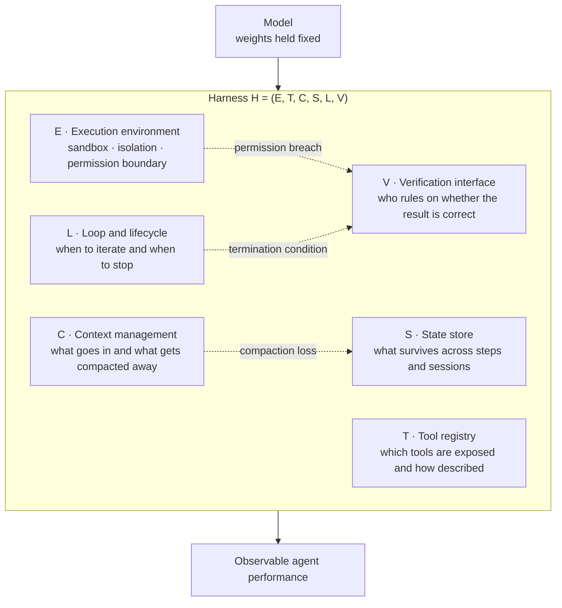

When an agent underperforms, most teams suspect the model first. Bump the tier, rewrite the prompt, and if that fails, wait for the next release. Yet the reports piling up through 2026 point somewhere else. Put the same model inside different shells and the scores separate by multiples. That shell has a name: the harness. A newly consolidated survey is the first work to give it a formal shape and a parts list.


*The center can be empty and the frame still decides the shape. That is the harness argument in one picture.*

## Why this is worth reading

This piece is written for platform engineers who have to put agents into production rather than demos, and for team leads who must decide whether to upgrade the model or fix the harness when results fall short. The conclusion first: **the real contribution of this survey is not the claim that harnesses matter, but the completeness matrix that splits a harness into six parts so you can count what is missing.** The claim was already close to common knowledge. What was missing was a measuring tool. Below we walk through the six axes, then apply the same ruler to the agent harness ThakiCloud actually runs, publishing the numbers and the two holes it exposed.

## Overview

The paper in question is [Agent Harness for Large Language Model Agents: A Survey](https://github.com/Gloriaameng/Awesome-Agent-Harness), authored by Qianyu Meng and ten co-authors. Alongside the paper itself, the team published an annotated paper dataset and a system comparison table as a GitHub repository. The preprint is registered under [preprints.org DOI 10.20944/preprints202604.0428](https://sciety.org/articles/activity/10.20944/preprints202604.0428.v3).

The scale tells you what kind of work it is. More than 110 sources spanning papers, blog posts, and technical reports were collected, and 23 agent systems that actually run in the wild were placed on a single table. Nine open technical challenges were left on the record. This is not a paper proposing one new technique; it is an attempt to impose a coordinate system on scattered engineering practice.

Why such a coordinate system became necessary now is explained by the surrounding literature. The [SemaClaw paper (arXiv:2604.11548)](https://arxiv.org/abs/2604.11548) frames AI engineering as having shifted from prompt engineering through context engineering to harness engineering, and argues that as model capabilities converge, the site of architectural differentiation moves to the harness layer. When the models look alike, what is left is everything around them.

The numbers back this up. The [paper on the interplay between harness design and post-training (arXiv:2606.25447)](https://arxiv.org/abs/2606.25447) defines the harness as the combination of which tools are exposed, how they are described, and what auxiliary information rides along with each per-step observation. It shows that under a harness built with minimal design effort, the gains from post-training collapse sharply once the tool environment shifts even slightly. Related work cites cases where swapping only the harness moved accuracy by close to six-fold, a gap comparable to or larger than skipping a model generation.

An uncomfortable corollary follows: agent benchmark comparisons that do not disclose the harness are hard to trust. [Stop Comparing LLM Agents Without Disclosing the Harness (arXiv:2605.23950)](https://arxiv.org/abs/2605.23950) puts exactly that problem in its title. The habit of reading a leaderboard by model name alone starts to wobble.

## What it means to split a harness into six parts

The survey's central device is formalizing the harness as a six-element tuple. A harness H is written as the combination of execution environment E, tool registry T, context management C, state store S, loop and lifecycle L, and verification interface V.



Naming the parts alone would not make a paper. The survey goes a step further by layering labeled-transition-system semantics onto the structure, separating safety from liveness. Safety says a bad thing must never happen. Liveness says a good thing must eventually happen.

Why that distinction matters becomes obvious with an example. The requirement that an agent must never deploy without approval is a safety property. One violation ends it, and later good behavior does not compensate. The requirement that an agent must eventually reach a termination condition is a liveness property. An infinite loop is not a safety violation but a liveness violation, and if you defend both the same way, one of them will be breached. An approval gate cannot stop an infinite loop, and an iteration cap cannot stop a permission escape. Harness design discussions often go in circles precisely because both get lumped together as "stability."

Among the six parts, the axis most often left empty is V. Most systems manage to attach tools and spin a loop, but far fewer maintain a separate deterministic interface that rules on whether the output is correct. The survey listing compositional verification among its nine open challenges points the same way: verifying each part individually does not verify the assembled harness.

## What the completeness matrix actually does

The table holding those 23 systems is called the harness completeness matrix. Systems on the rows, six parts on the columns, each cell marked filled or not. A simple device with clear effects.

First, the blanks become visible. A vague question about why an agent collapses only in certain situations turns into a question about which of six cells is empty. Diagnosis drops from narrative to enumeration.

Second, comparability appears. When discussing a performance gap between two systems, you can point at which part differs instead of at model names. That is a practical answer to the undisclosed-harness comparison problem noted above.

Third, the matrix applies to your own system unchanged. You can stop at reading the paper, or you can put your own harness on the same table. So we did.

## We measured our own harness on all six axes

The survey is conceptual work, not a tool you install and run. So the experiment here is a self-audit rather than a library benchmark. We ran the six axes over the agent harness repository ThakiCloud operates in production. Every number below was captured with a real command; none is an estimate.

```bash
# T · tool and skill registry
ls .claude/skills | wc -l          # 1914
ls .claude/agents/*.md | wc -l     # 80

# C · rules injected into context on every turn
ls .claude/rules/*.md | wc -l      # 60

# E · hooks on the execution boundary
ls .claude/hooks/*.py | wc -l      # 14

# L · unattended loop registry
python3 scripts/loops/build_loop_registry.py --check
# loops=51 edges=12 missing_run_script=2 warnings=2
```


*Five of the six axes are thick. Only the verification axis is thin.*

Mapped to the axes:

**T, the tool registry**, is the thickest, with 1,914 skills and 80 specialist agents registered. This is not a place to jump straight to bragging. In the survey's terms, T is judged by exposure and description rather than count, and the chronic failure mode of this axis is that selection accuracy degrades as the count grows. Our meaningful metric is therefore not the number 1,914 but the recall of the retrieval router.

**C, context management**, is carried by 60 always-on rules, split between a layer injected every turn and a layer loaded only on demand. On this axis, what you leave out matters more than what you put in.

**E, the execution environment**, takes the form of 14 hooks watching tool-call boundaries, gating risky operations and demanding separate confirmation for destructive batch work. This is the axis that carries safety properties.

**L, loop and lifecycle**, has 51 loops registered with 12 signal edges connecting them. And this is where a real hole surfaced. The check command returned `missing_run_script=2`: two loops declared in the registry with no execution script wired up. Two warnings came with it. Without measuring on six axes, those entries would have gone unnoticed.

**V, the verification interface**, splits in two. Code artifacts are ruled on by an exit-code gate; content and judgment artifacts by a majority-refutation gate. The principle that a model reporting "done" is never a termination condition lives on this axis.

**S, the state store**, divides into a session-resident brief, a long-term knowledge layer, and loop state files.

The result in one sentence: all six parts exist, T and L are especially thick, and the defect this audit surfaced was on L, the thickest axis of all. More parts does not raise completeness; it widens the surface you have to maintain.

## What this means for ThakiCloud

The survey's six axes map closely onto how ThakiCloud has divided its products.

Through the **Paxis** lens the overlap is sharper. Paxis is the Agent-Native Cloud control plane running on top of ai-platform, treating Skills, Tools, Policies, and Audit Logs as first-class resources. Translated into the survey's vocabulary, Skills and Tools are the T axis, Policies are the safety properties of the E axis, and Audit Logs are the post-hoc evidence for the V axis. It amounts to promoting harness parts out of scattered code and into platform-managed resources. Selecting skills by BM25, executing them in an isolated sandbox, and passing every action through a policy gate and an audit log is close to implementing the completeness matrix as product features.

Through the **ai-platform** lens the E axis is the crux. Actually isolating agent execution eventually requires containers and a scheduler, and holding permission boundaries in a multi-tenant environment requires isolation at the Kubernetes level. However much harness discussion looks like software architecture, the layer that genuinely enforces safety properties is infrastructure. For customers with on-premise or sovereign requirements, this stops being negotiable and becomes a precondition.

The two lenses complement each other. ai-platform supplies the physical boundary of the E axis, and Paxis manages T and V as resources on top of it. The compositional verification problem the survey flags, verifying the assembly rather than the parts, is exactly the kind of problem that only closes when both layers are present.

## Limitations and counterarguments

It is better not to overrate this paper. Several limits are clear.

First, the survey is a taxonomy, not a prescription. It tells you what the six parts are but not how to design each one well. Filling all six cells in the completeness matrix does not make a good harness. It is a tool for finding blanks, not for measuring quality.

Second, the six axes are not orthogonal. Context compaction looks like a C-axis problem, but what you can afford to drop depends on what S retains, and loop termination sits on L while the ruling happens on V. In real systems, fixing one axis shakes another. The table is cleaner than the reality.

Third, count-based self-audits carry a trap. We counted 1,914 skills above, but as that number grows so does the probability the router picks the wrong one. Mistaking part count for completeness pushes optimization in the wrong direction. The honest metric on that axis is selection accuracy, not registration count.

Fourth, the harness-primacy claim is itself contestable. The observation that performance swings widely with the harness also means benchmarks are hypersensitive to harness details. We cannot rule out that what is being measured is the fragility of the instrument rather than real-world productivity. Whether a six-fold gap is a productivity gap or a measurement artifact remains unresolved.

## Wrapping up

Upgrading the model tier when an agent underperforms is the most expensive prescription and one of the most frequently wrong. This survey hands you a tool that interrupts the reflex: split the harness into execution, tools, context, state, loop, and verification, then count which cell is empty.

Returning to the conclusion stated at the top, the value of this paper lies in the measuring tool rather than the claim. We only found two loop-registry entries missing execution scripts, plus two warnings, after holding up the same ruler. Until then those holes had produced no symptoms at all.

Next time an agent pipeline falls short of expectations, write out the six axes one line each before opening the model catalog. Counting which cell is empty takes five minutes, and those five minutes make a bigger difference than one model tier more often than you would expect.

## Sources

- [Agent Harness for Large Language Model Agents: A Survey (GitHub repository)](https://github.com/Gloriaameng/Awesome-Agent-Harness)
- [Preprint record for the survey (DOI 10.20944/preprints202604.0428.v3)](https://sciety.org/articles/activity/10.20944/preprints202604.0428.v3)
- [SemaClaw: A Step Towards General-Purpose Personal AI Agents through Harness Engineering (arXiv:2604.11548)](https://arxiv.org/abs/2604.11548)
- [The Interplay of Harness Design and Post-Training in LLM Agents (arXiv:2606.25447)](https://arxiv.org/abs/2606.25447)
- [Stop Comparing LLM Agents Without Disclosing the Harness (arXiv:2605.23950)](https://arxiv.org/abs/2605.23950)
- [Architectural Design Decisions in AI Agent Harnesses (arXiv:2604.18071)](https://arxiv.org/abs/2604.18071)
- [Agentic Harness Engineering: Observability-Driven Automatic Evolution of Coding-Agent Harnesses (arXiv:2604.25850)](https://arxiv.org/abs/2604.25850)
- [Code as Agent Harness (arXiv:2605.18747)](https://arxiv.org/abs/2605.18747)
- [Co-Harness: Co-Evolving Harnesses and Model Weights for LLM Agents (arXiv:2607.22688)](https://arxiv.org/abs/2607.22688)
