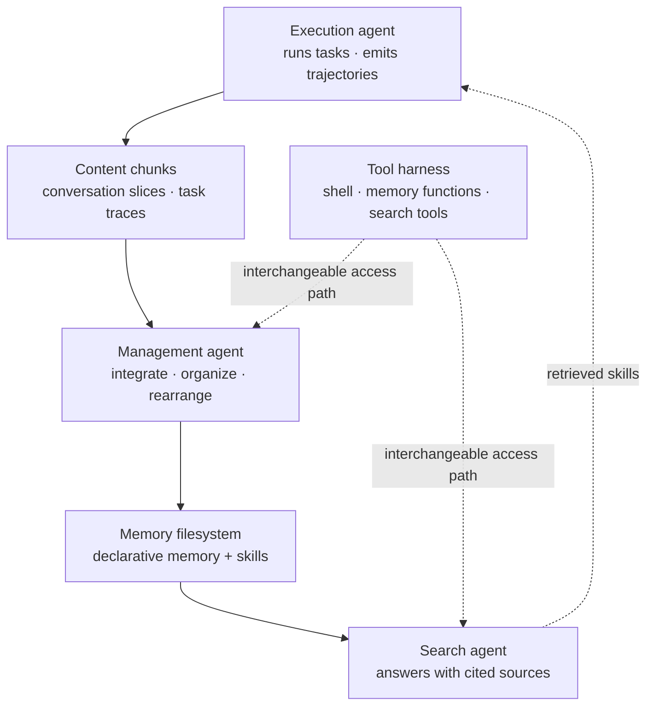

Open the long-term memory of an LLM agent running in production today and you will usually find nothing exotic. It is a folder tree of markdown files. The agent reads it, writes to it, and occasionally rearranges it using ordinary file tools. No vector database, no dedicated memory engine. Yet almost nobody has measured what this default actually buys.


*The side that grows and the side that stays organized are not the same side. That gap is where this study starts.*

## Why this is worth reading

This post is written for platform engineers who run agents with long-term memory attached, and for team leads deciding how much money and time the memory layer deserves. Here is the conclusion first: **organization reliably buys you search cost, and it never buys you accuracy.** A well-organized store cuts retrieval cost substantially once the material gets large, but not a single agent in this study converted organization itself into better answers. Below we walk through the five questions behind that result, then hold the same yardstick against the memory store ThakiCloud actually runs and publish the numbers and the structural skew they revealed.


## Overview

The framing is simple. Keeping memory in a filesystem is already the industry default, and that default quietly assumes two things. First, that an agent can keep a growing store tidy. Second, that keeping it tidy pays for itself. Prior work mostly designed bespoke memory representations and measured retrieval over them, so the two assumptions underneath the thing everyone actually ships were left untested.

A joint paper from researchers at UIUC, UC San Diego, UC Merced and Adobe, [Filesystem-Based Memory for LLM Agents: Organization, Evolution, and Sustainability](https://arxiv.org/abs/2607.26637), goes after that gap. It was posted on 29 July 2026 and runs to 59 pages with 12 figures and 18 tables. The authors describe it as the first systematic exploration of filesystem-based memory for LLM agents.

Memory does not simply pile up over time. Duplicates appear, records start contradicting each other, stale facts look like live ones, and material on a single subject scatters across many files. So the store has to be evolved: updated, reconciled, reorganized. Getting that wrong is expensive. The paper cites a prior observation that continuously rewriting a memory bank with an LLM can degrade it below the no-memory baseline.

Industry has mostly handled this outside the agent. OpenAI's dreaming synthesizes a flat summary in the background, and Anthropic's Dreams rebuilds the store wholesale from past sessions. The detail the paper picks up is why Dreams was introduced at all: because the working agent's own writes stay local and incremental, and the store degrades between rebuilds. External cleanup treats the symptom. Whether the agent can hold the line itself, and whether that tidying recovers its cost, remained assumed rather than tested.

## What the study formalizes

The authors reduce the setting to three roles around a single memory filesystem. A management agent integrates incoming content and keeps the store organized. A search agent answers queries and cites the sources it used. An execution agent does the actual work, and its task trajectories are distilled into skills that land in the same store. Unifying declarative memory and skills into one store is the distinguishing move in this formalization.



The definition of the store is kept minimal too. A memory store is a finite set of files organized in a rooted path hierarchy, and each file is a triple of a path, a one-line description, and text content. Folders are just the shared prefixes of paths and carry no content of their own. The folder structure, the filenames, and the markdown headings inside files together form the store's taxonomy. That taxonomy is a single labeled tree that continues below the file level into nested sections, and the names and one-line descriptions are its only signage.

Reading that definition does not feel abstract if you have ever maintained a skill directory. The observation that YAML frontmatter, specifically name and description, is what listings and search expose first reads like a description of your own repository.

The experiments vary four things: how the store is built (an organizing agent, a verbatim dump, or the raw stream chunked and indexed for retrieval), the scale of the stream, the tool harness the agents touch the store through, and the strength of the models that build and search. What gets measured is answer quality alongside cost in rounds, tokens and content read, plus store health over time. Do early memories survive later evolution, and do updates land correctly? Tracking growth curves rather than endpoints is the methodological core of this work.

## The answers to five questions

The paper organizes its results as five questions and answers each in both a conversational memory setting and an embodied task setting.

**The shape of the organization reflects the model, not the scale.** Left to organize on their own, management agents grow subject-based trees. But the shape looks more like a fingerprint of the model than a response to the amount of material. Given more material the store consolidates rather than shards, with hierarchy relocating between folders, files and in-file headings. The clearest degenerate behavior is a reorganizing pass that silently condenses content, and adding a single preservation rule stops it.

**No shape wins on accuracy everywhere.** What organization unambiguously buys is search cost, and that gain grows with the material. In the paper's own terms, organized stores roughly halve retrieval cost where material is large. In the skills setting the winner flips outright: a verbatim episode log serves a strong execution agent best, while distilled guidance serves a weak one better. What you should store depends on who consumes it.

**Model strength gets paid on the search side.** In the conversational setting, the management agent's strength buys organizational style but not answer quality, while the search agent's strength pays directly. Capability does couple with answers in one case, which is when writing itself fails. On one benchmark the management agent inconsistently recorded changed preferences as dated updates, leaving stale facts standing as live traits. Running the same instruction on a stronger backbone recovered about half of that loss. Where the store already served its search agent well, the same upgrade moved nothing.

**Stores get more useful as they grow, but the tidying discipline breaks down.** Within the measured horizons, stores only became more useful as they grew, and accumulated experience substituted for execution-agent capability. Health held up as well. Conversational stores created a few files early and afterwards only edited them, never deleting. The weak half is organization. Adherence to the taxonomy contract eroded as most stores grew, and only the strongest management agent tracked in this study held it. What scales up is effort and volume: curation never gets cheaper per episode, and the one liability that grows with the store is the serve-everything retrieval of the verbatim episode log.

**Change the tools and the store changes shape.** Adding one tool changed agent behavior but not outcomes. Replacing the tool set outright reshaped the store itself, sharding and tying on long dialogue, consolidating and winning on skills. The paper's summary is that the tool harness is a control knob over memory organization rather than a neutral wrapper. Swapping tools moves the store about as much as swapping the model.

## Holding the same yardstick to our own store

This paper is conceptual and measurement work, not a tool you install and run. So instead of a library benchmark we ran a self-measurement, which fits because the agent memory ThakiCloud operates is exactly the form this paper studies: a markdown file tree the agent reads and writes directly. Every number below was captured with a real command and none of it is an estimate.

```bash
# total files in the memory store
find memory -type f -name '*.md' | wc -l     # 1878

# breakdown by layer
ls memory/sessions | wc -l                    # 1789  (raw session logs)
ls memory/topics | wc -l                      # 10    (curated subject layer)
ls memory/skill-evolution | wc -l             # 30
ls memory/preferences | wc -l                 # 5
ls memory/archive/hot | wc -l                 # 8

# size of the hot brief that is resident every session
wc -c memory/HOT_MEMORY.md                    # 4256
```


*The log scale makes it plainer. Two orders of magnitude separate the curated layers from the raw log.*

Translate the numbers into the paper's vocabulary and the picture sharpens. Of 1878 files, 1789 are raw session logs, which is 95 percent. That corresponds to the verbatim dump among the three storage strategies the paper compares. The layer the agent has genuinely curated amounts to 10 topic files, 5 preference files and 30 skill-evolution records, about forty-five in total, with one hot brief reassembled on top of it each session. As a share of the store, the organized part is under 5 percent.

That skew points in exactly the direction the paper's conclusion does. The one liability that grows with the store was named as the serve-everything retrieval of the raw log, and the raw log is precisely what is growing on our side. Session logs keep accumulating while the subject layer has barely moved off ten. It is the same observation about taxonomy adherence eroding with growth, seen from a different angle.

The measurement also shows where our design was already pointed correctly. Capping the hot brief at 4256 bytes and reassembling it every session targets search economy head on, because it keeps four organized kilobytes resident instead of sweeping 1789 raw files each time. And that reassembly is owned by deterministic code, not by a model. Given the paper's finding that management-agent strength buys organizational style but not answer quality, taking the tidying work out of model judgment looks justified after the fact.

One caveat deserves to be stated plainly. These numbers measure the shape of the store, not answer quality. We counted a cross-section at one point in time rather than plotting growth curves over a benchmark the way the paper did. How much this skew is actually costing us in answer quality is not something this measurement can say.

## What this means for ThakiCloud products

These results land directly on **Paxis** design. Paxis is the Agent-Native Cloud control plane running on top of ai-platform, treating Skills, Tools, Policies and Audit Logs as first-class resources. Map that onto the paper's formalization and Skills are half of the memory store. The authors' decision to unify declarative memory and skills into one filesystem matches the view that skills are a form the store takes rather than a separate resource.

Two findings convert straight into practice. First, the result that the tool set reshapes the store means the tool surface of a skill harness is not something to expand or trim casually. Adding one tool changes only behavior, but replacing the set rebuilds the store. Second, the result that search-agent strength pays directly answers where the model budget should go: put the better model on finding rather than on tidying. That lines up with our existing diagnosis that selection accuracy is the bottleneck in the Paxis flow, where skills are picked by BM25 and executed in an isolated sandbox.

From the **ai-platform** side the cost axis is what binds. If an organized store roughly halves retrieval cost, that difference shows up on the inference bill once agents run at scale. In a multi-tenant setting where every tenant's memory store grows, the saving multiplies. For customers with on-premise and sovereign requirements the token budget is fixed, which turns search economy into part of capacity planning rather than an optimization.

The two lenses complement each other. ai-platform provides the layer that physically holds and isolates the store, and Paxis manages the policy deciding what gets curated and what stays raw as a resource on top of it.

## Limits and counterarguments

It is worth not overrating this paper.

First, the measured horizon is short. The authors themselves list horizons beyond a single conversation as an open problem. The finding that stores only get more useful as they grow carries the qualifier "within our horizons." Whether a store like our 1789 session logs falls inside that range needs separate verification.

Second, the paper itself points out that quality benchmarks are largely blind to shape. The finding that organization did not improve accuracy could mean organization is useless, or it could mean current benchmarks cannot detect its benefit. This study alone does not separate the two readings.

Third, the conclusion is explicitly conditional. Whether organizing pays is stated to depend on the material, on the agent consuming the memory, and on the tools in hand. The skills setting flipping its winner based on execution-agent strength is the clearest example. Porting this result to your own environment means first deciding whether your consumer is the strong one or the weak one.

Fourth, the result that only the single strongest management agent held its taxonomy can be read in reverse. If better models solve this on their own, investing in a curation pipeline now is investing in a problem about to disappear. If store size grows faster than models improve, it never gets caught. There is no data yet on which of those is true.

## Wrapping up

Tidying agent memory into folders has been treated as self-evidently good. This paper is the first to attach an invoice to the habit. What organization buys is search cost, the saving grows with the material, and accuracy is not for sale. And when the store grows, the tidying discipline itself is the first thing to go.

To restate the conclusion from the top: organization is a cost investment, not a quality investment. Measuring our own store produced the same picture. Of 1878 files, 1789 were raw logs, and the organized layer came in under 5 percent. The side that was growing was the liability and the side standing still was the asset.

Next time you touch an agent memory layer, settle two questions before you touch the tidying algorithm. Is the thing reading this store a strong agent or a weak one, and is what hurts right now accuracy or search cost? According to this paper, only the second one gets fixed by tidying.


## Sources

- [Filesystem-Based Memory for LLM Agents: Organization, Evolution, and Sustainability (arXiv:2607.26637)](https://arxiv.org/abs/2607.26637)
- [Full HTML version of the paper](https://arxiv.org/html/2607.26637v1)
- [Remember Decisions, Not Descriptions: Reframing Agent Memory as a Rate-Distortion Problem](https://thakicloud.com/tech-blog/en/research/demem-agent-memory/)
- [The Shell Decides Performance, Not the Model: A Survey That Splits Agent Harnesses Into Six Components](https://thakicloud.com/tech-blog/en/research/agent-harness-survey-six-components/)
